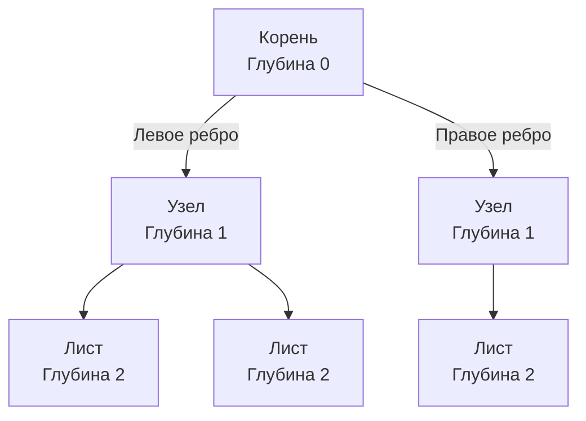
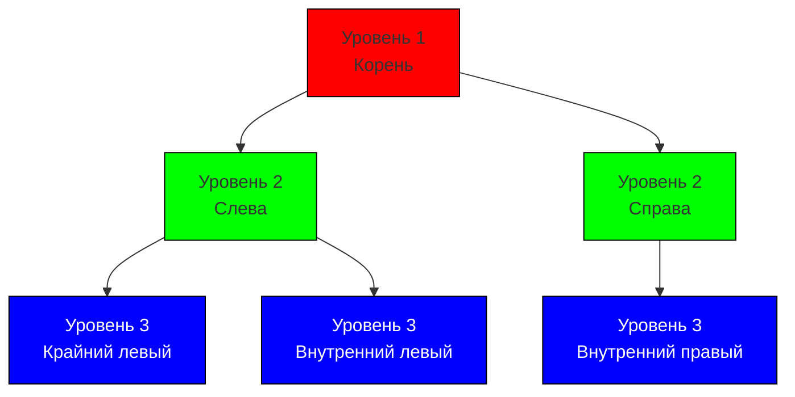

До сих пор мы рассматривали линейные структуры данных: [[1. Массивы и динамические массивы]] и [[3. Связные списки]]. В них каждый элемент имеет максимум одного предшественника и одного последователя. Это отлично подходит для хранения плоских последовательностей, но реальный мир и большинство бизнес-задач иерархичны. 

Файловые системы, DOM-дерево в HTML, маршрутизация в веб-фреймворках (например, Radix tree в `echo` или `gin`), индексы баз данных — всё это опирается на фундаментальную нелинейную структуру данных: **Дерево (Tree)**.

## Анатомия и терминология

Дерево — это связный ациклический граф (граф без циклов). В отличие от реальных деревьев, в информатике деревья растут "вниз" — от корня к листьям.

* **Корень (Root):** Самый верхний узел, у которого нет родителя.
* **Узел (Node):** Базовая единица дерева, хранящая значение и указатели на потомков.
* **Ребро (Edge):** Связь между двумя узлами.
* **Родитель / Ребенок (Parent / Child):** Отношение между узлами. Узел, из которого исходит ребро, — родитель. Куда входит — ребенок.
* **Лист (Leaf):** Узел, у которого нет детей (самый нижний уровень).
* **Высота (Height) дерева:** Максимальная длина пути от корня до самого глубокого листа.
* **Глубина (Depth) узла:** Длина пути от корня до этого конкретного узла.



## Mechanical Sympathy: Деревья и железо

С точки зрения железа, базовое дерево на указателях — это **худший кошмар для кэша процессора**. 

В массивах мы наслаждались идеальной пространственной локальностью (Spatial Locality) и работой аппаратного Prefetcher-а. В дереве же каждый узел выделяется в куче (Heap) отдельно. Узлы разбросаны по оперативной памяти хаотично. 

Каждый переход от родителя к ребенку (`node.Left` или `node.Right`) — это **Pointer Chasing (погоня за указателями)**. Процессор вынужден ждать сотни тактов, пока данные подтянутся из RAM, так как предсказать адрес следующего узла невозможно.

> [!info] Под капотом: Нагрузка на GC
> Дерево из 1 миллиона узлов в Go — это 1 миллион отдельных аллокаций. Во время фазы Mark (Разметка) сборщик мусора должен обойти *все* эти указатели, чтобы понять, какие узлы живы. Это создает гигантскую нагрузку (GC Pressure). 
> Именно поэтому создатели СУБД (PostgreSQL, MySQL) не используют бинарные деревья для индексов. Они используют B-деревья, где каждый узел — это непрерывный массив (страница диска на 4-8 КБ), вмещающий сотни ключей. Это минимизирует количество указателей и максимизирует попадание в кэш-линии. Подробнее об этом мы поговорим в статье [[3. B дерево и B+ дерево]].

## Представление дерева в Go

В Go деревья реализуются через структуры с указателями на самих себя. Чаще всего на практике и алгоритмических собеседованиях мы имеем дело с **Бинарным деревом** (каждый узел имеет не более двух детей).

```go
package main

// Node представляет узел бинарного дерева
type Node[T any] struct {
	Value T
	Left  *Node[T]
	Right *Node[T]
}
```

## Алгоритмы обхода (Traversals)

Поскольку дерево нелинейно, мы не можем просто пройти по нему циклом `for i := 0; i < len; i++`. Нам нужны специальные алгоритмы. Они делятся на две глобальные категории: **Поиск в глубину (DFS)** и **Поиск в ширину (BFS)**.

### 1. Поиск в глубину (DFS - Depth-First Search)

DFS стремится уйти от корня как можно глубже, прежде чем вернуться и исследовать соседние ветви. В основе DFS лежит **Стек** (явно или через рекурсию — Call Stack). 

Существует три классических порядка обхода бинарного дерева:

#### A. Прямой обход (Pre-order: Root -> Left -> Right)
Сначала обрабатываем сам узел, затем идем в левое поддерево, затем в правое.
*Применение:* Копирование (клонирование) дерева, сериализация.

#### B. Симметричный обход (In-order: Left -> Root -> Right)
Сначала полностью обходим левое поддерево, затем обрабатываем корень, затем правое.
*Применение:* В бинарном дереве поиска (BST) этот обход выдает элементы строго в **отсортированном порядке**.

#### C. Обратный обход (Post-order: Left -> Right -> Root)
Сначала дети, родитель — в самом конце. 
*Применение:* Удаление дерева (в языках без GC нужно освобождать детей перед родителем), вычисление размера директории на диске (нужно знать размер вложенных папок, чтобы сложить их в размер текущей).

> [!tip] Собеседование
> Вопросы на LeetCode по деревьям в 90% случаев сводятся к правильному выбору типа обхода DFS и пониманию того, как передать состояние (state) "сверху вниз" или "снизу вверх" по стеку вызовов.

#### Реализация DFS (Рекурсивно)

Рекурсия — самый естественный способ написать обход дерева.

```go
// Прямой обход (Pre-order)
func PreOrder[T any](node *Node[T], action func(T)) {
	if node == nil {
		return
	}
	action(node.Value)        // 1. Корень
	PreOrder(node.Left, action)  // 2. Лево
	PreOrder(node.Right, action) // 3. Право
}
```

> [!warning] Ловушка / Gotcha: Stack Overflow и Go
> В языках типа C++ или Java глубокая рекурсия (например, вырожденное дерево-список из 100 000 узлов) вызовет фатальную ошибку `StackOverflowError`. 
> В Go, как мы помним из статьи [[4. Стек]], горутины имеют динамически расширяемый стек (от 2 КБ до ~1 ГБ). Рантайм просто вызовет `runtime.morestack` и скопирует стек в бóльшую область памяти. Поэтому рекурсивный DFS в Go падает редко. Однако постоянное копирование стека сильно бьет по CPU. Для экстремальных высоконагруженных задач DFS пишут **итеративно**, используя свою структуру `Stack` на базе слайса.

### 2. Поиск в ширину (BFS - Breadth-First Search)

BFS исследует дерево "по уровням" (Level-order). Сначала корень, затем все дети корня, затем все внуки и так далее. 

Для реализации BFS рекурсия не подходит. Нам нужна структура данных **Очередь** (FIFO). См. [[5. Очередь]].

#### Механика BFS:
1. Кладем корень в очередь.
2. Пока очередь не пуста:
    * Достаем узел из головы очереди.
    * Обрабатываем его.
    * Если есть левый ребенок — кладем его в хвост очереди.
    * Если есть правый ребенок — кладем его в хвост очереди.



#### Реализация BFS на Go

Так как в стандартной библиотеке Go нет готовой очереди на слайсах, мы используем паттерн с простым слайсом (учитывая оговорки из статьи про очереди, для обхода дерева небольшого размера это допустимо, но для production-grade кода лучше использовать кольцевой буфер или очередь на двух стеках).

```go
func BFS[T any](root *Node[T], action func(T)) {
	if root == nil {
		return
	}

	// Инициализируем очередь
	queue := []*Node[T]{root}

	for len(queue) > 0 {
		// Извлекаем из начала (Dequeue)
		current := queue[0]
		queue = queue[1:] // Внимание: в highload используйте нормальную очередь!

		// Выполняем действие
		action(current.Value)

		// Добавляем детей в конец (Enqueue)
		if current.Left != nil {
			queue = append(queue, current.Left)
		}
		if current.Right != nil {
			queue = append(queue, current.Right)
		}
	}
}
```

*Применение BFS:* Поиск кратчайшего пути в невзвешенных графах, поуровневая печать дерева, сериализация структур, где важна "ширина" связей (например, организационные иерархии).

## Итог

1. **Деревья** решают проблему представления иерархических данных. Базовый элемент — узел (Node) с указателями на детей.
2. С точки зрения **Mechanical Sympathy**, классические деревья в куче создают нагрузку на GC и вызывают промахи кэша (Cache Misses) из-за погони за указателями (Pointer Chasing). 
3. **DFS (Поиск в глубину)** реализуется через рекурсию или явный Стек. Бывает прямым (Pre-order), симметричным (In-order) и обратным (Post-order).
4. **BFS (Поиск в ширину)** обходит узлы по уровням и строго требует использования Очереди.
5. Рантайм Go прощает глубокую рекурсию благодаря расширяемым стекам (`runtime.morestack`), но это имеет цену в виде CPU overhead-а.

Теперь, понимая базовую анатомию деревьев и алгоритмы навигации по ним, мы переходим к самой популярной реализации в информатике — структуре, лежащей в основе множества алгоритмов поиска и сортировки. В следующей статье: [[2. Бинарное дерево]].