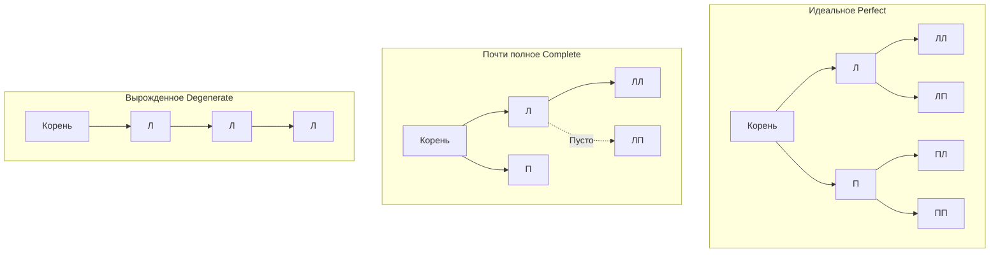

В прошлой статье [[1. Деревья и обходы]] мы разобрали общую концепцию деревьев и способы навигации по ним (DFS и BFS). Теперь мы сужаем фокус до самой распространенной в программировании спецификации этой структуры — **Бинарного дерева (Binary Tree)**.

Бинарное дерево — это дерево, в котором каждый узел имеет **не более двух потомков** (левого и правого). Это искусственное ограничение алгоритмически упрощает навигацию и открывает двери для математических оптимизаций, которые невозможны в деревьях с произвольным количеством детей.

## Виды бинарных деревьев

Для прохождения интервью на Senior/Lead и понимания архитектуры БД и очередей с приоритетом вы обязаны знать строгую классификацию бинарных деревьев. В литературе часто возникает путаница с переводами, поэтому разберем их детально:

1. **Строгое / Полное (Full Binary Tree):**
   Каждый узел имеет ровно 0 или 2 потомка. Узлов с одним потомком быть не может.
   
2. **Идеальное / Совершенное (Perfect Binary Tree):**
   Все внутренние узлы имеют 2 потомка, а **все листья лежат строго на одном уровне**. Это эталонное симметричное дерево. Количество узлов в нем всегда равно $2^h - 1$, где $h$ — высота дерева.

3. **Почти полное (Complete Binary Tree):**
   Дерево заполняется строго сверху вниз и слева направо. Последний уровень может быть заполнен не до конца, но все узлы на нем максимально "прижаты" влево. Это важнейшая структура, на которой строятся бинарные кучи.

4. **Вырожденное (Degenerate / Pathological Tree):**
   Каждый внутренний узел имеет только одного ребенка. По сути, дерево вырождается в классический связный список.



## Mechanical Sympathy: Два способа хранения

В Go бинарное дерево можно представить двумя совершенно разными способами, и выбор зависит от того, к какому из 4 типов выше относится ваше дерево.

### Способ 1. Указатели (Pointer-based)

Классическое представление, которое используется в 99% бизнес-логики и задачах на LeetCode.

```go
type TreeNode[T any] struct {
	Val   T
	Left  *TreeNode[T]
	Right *TreeNode[T]
}
```

**Плюсы:** Дерево может расти динамически и иметь любую форму (включая вырожденную) без расхода лишней памяти.
**Минусы (Железо):** Как мы разбирали ранее, указатели убивают производительность кэша CPU. Прыжки по `Left` и `Right` — это случайный доступ к оперативной памяти (Pointer Chasing). Плюс аллокация каждого узла нагружает Garbage Collector.

### Способ 2. Плоский массив (Array-based)

Если мы гарантируем, что наше дерево является **Почти полным (Complete)** или **Идеальным (Perfect)**, мы можем полностью отказаться от указателей и уложить дерево в обычный статический массив (или слайс в Go).

Это чистая математика:
* Корень лежит в `array[0]`.
* Левый потомок узла `i` всегда находится по индексу `2i + 1`.
* Правый потомок узла `i` всегда находится по индексу `2i + 2`.
* Родитель узла `i` находится по индексу `(i - 1) / 2`.

> [!info] Под капотом: Массивные деревья
> Представление дерева в виде плоского массива — это шедевр оптимизации. 
> 1. Нет указателей = размер узла в 3 раза меньше (экономия памяти).
> 2. Нет погони за указателями = идеальное попадание в кэш-линии (Spatial Locality) при обходе в ширину. 
> 3. Одна аллокация на миллион узлов = нулевая нагрузка на GC.
> Именно этот подход используется для реализации очередей с приоритетом, что мы детально разберем в статье [[1. Куча как структура данных]].

> [!warning] Ловушка / Gotcha: Массив для вырожденного дерева
> Почему мы не храним все деревья в массивах? Если дерево Вырожденное (вытянуто в одну линию вправо), то для хранения 10 элементов нам потребуется массив размером $2^{10} - 1 = 1023$ ячейки. Большинство ячеек будут пустыми (перерасход памяти в 100 раз). Плоский массив подходит **только** для сбалансированных и плотных деревьев.

## Классические задачи с собеседований

Бинарное дерево на указателях — любимая тема на технических интервью. Любой бэкенд-разработчик должен уметь писать эти алгоритмы с закрытыми глазами. Почти все они решаются через рекурсивный DFS (Depth-First Search).

### 1. Переворот бинарного дерева (Invert Binary Tree)
*Легендарная задача (LeetCode 226), из-за которой создателя Homebrew (Макса Хауэлла) не взяли в Google.*
Суть: нужно отзеркалить дерево. Все левые потомки должны стать правыми, а правые — левыми.

```go
package main

type TreeNode struct {
	Val   int
	Left  *TreeNode
	Right *TreeNode
}

// InvertTree меняет местами левое и правое поддеревья рекурсивно
func InvertTree(root *TreeNode) *TreeNode {
	// Базовый случай рекурсии (Base Case)
	if root == nil {
		return nil
	}

	// 1. Сохраняем ссылки (In-order/Pre-order подход)
	left := root.Left
	right := root.Right

	// 2. Инвертируем детей и переназначаем указатели
	root.Left = InvertTree(right)
	root.Right = InvertTree(left)

	return root
}
```
**Сложность:** Время $O(N)$ (нужно посетить каждый узел). Память $O(H)$, где $H$ — высота дерева (глубина Call Stack-а).

### 2. Максимальная глубина дерева (Maximum Depth)
Задача (LeetCode 104): найти максимальную глубину от корня до самого дальнего листа.

```go
// MaxDepth использует Post-order DFS обход.
// Мы спрашиваем у детей их глубину, выбираем максимум и добавляем 1 (текущий узел).
func MaxDepth(root *TreeNode) int {
	if root == nil {
		return 0
	}

	leftDepth := MaxDepth(root.Left)
	rightDepth := MaxDepth(root.Right)

	if leftDepth > rightDepth {
		return leftDepth + 1
	}
	return rightDepth + 1
}
```

> [!tip] Собеседование: Хвостовая рекурсия в Go
> **Вопрос:** Если глубина дерева 1 миллион (вырожденное дерево), функция `MaxDepth` упадет с ошибкой переполнения стека?
> **Ответ:** В Go нет встроенной оптимизации хвостовой рекурсии (Tail Call Optimization - TCO) на уровне компилятора, как это есть в функциональных языках или C++ (с флагом `-O2`). Но, как мы знаем, горутины в Go динамически увеличивают свой стек вызовов. Вызов `MaxDepth` на 1 миллион узлов потребует около 30-40 МБ стека. Горутина спокойно выделит эту память и выполнится без паники, хотя это будет медленнее из-за работы `runtime.morestack`. На собеседовании упомяните, что для Production-надежности в таких корнер-кейсах лучше переписать алгоритм на итеративный BFS с использованием явной структуры [[5. Очередь]].

### 3. Одинаковые ли деревья (Same Tree)
Задача (LeetCode 100): проверить, идентичны ли два дерева по структуре и значениям.

```go
func IsSameTree(p *TreeNode, q *TreeNode) bool {
	// Оба узла nil - совпадение
	if p == nil && q == nil {
		return true
	}
	// Только один узел nil - деревья разные
	if p == nil || q == nil {
		return false
	}
	// Значения не равны
	if p.Val != q.Val {
		return false
	}
	
	// Рекурсивно проверяем левые и правые поддеревья
	return IsSameTree(p.Left, q.Left) && IsSameTree(p.Right, q.Right)
}
```

## Итог

1. **Бинарное дерево** накладывает лимит "максимум 2 потомка" на каждый узел, что упрощает рекурсивные алгоритмы.
2. Понимание разницы между **Полным**, **Совершенным** и **Вырожденным** деревьями необходимо для оценки асимптотической сложности $O(H)$. В лучшем случае высота $H = \log(N)$, в худшем $H = N$.
3. Деревья можно хранить на указателях (гибко, но плохо для кэша) и в плоских массивах (идеально для кэша, но требует почти полного заполнения дерева).
4. Рекурсия — мощный инструмент для деревьев, но в Go нужно помнить об отсутствии TCO и накладных расходах на увеличение стека горутины при работе с вырожденными структурами.

Само по себе абстрактное бинарное дерево редко используется в бизнес-логике напрямую, так как поиск в нем все равно занимает $O(N)$ (нужно обойти все узлы, чтобы найти нужное значение). 

Чтобы превратить эту структуру в сверхбыструю систему поиска с логарифмической $O(\log N)$ сложностью, мы должны добавить **правила упорядочивания**. И в следующей статье мы познакомимся с главным фундаментом баз данных: [[3. Двоичное дерево поиска]].