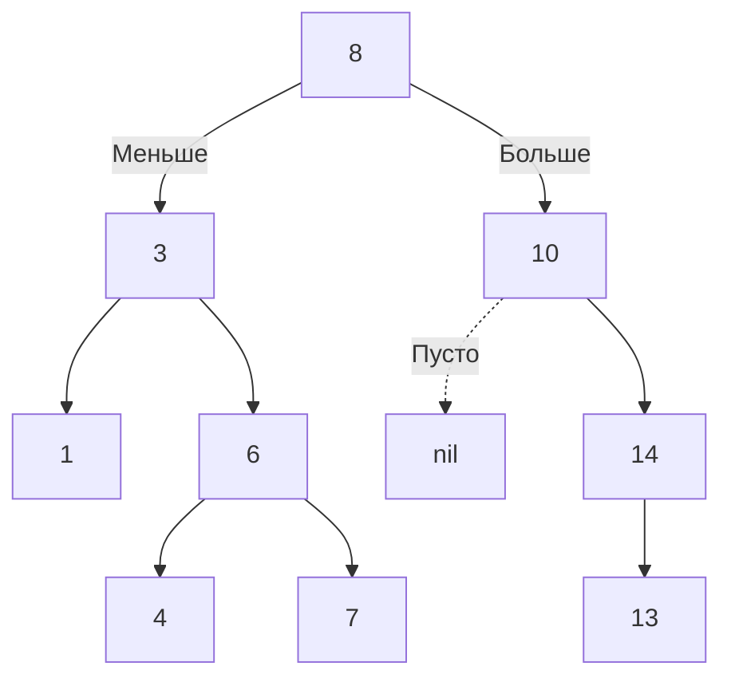
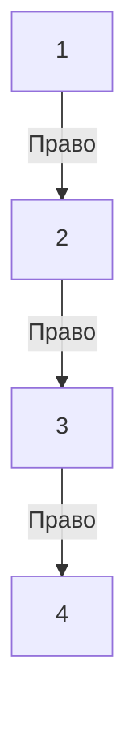

В статье [[2. Бинарное дерево]] мы рассмотрели структуру, где каждый узел имеет не более двух потомков. Однако само по себе бинарное дерево не дает выигрыша в скорости поиска — чтобы найти элемент, нам всё равно придется обойти все $N$ узлов (сложность $O(N)$). 

Чтобы превратить дерево в инструмент, способный конкурировать с хеш-таблицами и отсортированными массивами, мы должны наложить на него строгий **инвариант порядка**. Так рождается **Двоичное дерево поиска (Binary Search Tree, BST)**.

## Инвариант BST

BST — это бинарное дерево, для **каждого** узла которого выполняется строгое правило:
1. Все значения в **левом поддереве** строго *меньше* значения самого узла.
2. Все значения в **правом поддереве** строго *больше* значения самого узла.
3. Дубликаты обычно не допускаются (либо складываются в счетчик внутри узла).

Это правило должно рекурсивно выполняться для любого узла в дереве, а не только для корня.



## Mechanical Sympathy: BST против Отсортированного Слайса

Главный конкурент BST — это обычный отсортированный слайс, в котором мы ищем элементы алгоритмом [[2. Бинарный поиск]]. Давайте сравним их с точки зрения системной инженерии.

| Операция | Отсортированный Слайс | BST (Сбалансированное) |
| :--- | :--- | :--- |
| **Поиск** | $O(\log N)$ — идеальный кэш (Spatial Locality) | $O(\log N)$ — промахи кэша (Pointer Chasing) |
| **Вставка** | $O(N)$ — нужно сдвигать элементы в памяти | $O(\log N)$ — аллокация одного узла в куче |
| **Удаление**| $O(N)$ — нужно сдвигать элементы | $O(\log N)$ — переброска указателей |

**Вердикт Архитектора:** Слайс читается в десятки раз быстрее благодаря аппаратному Prefetcher-у процессора (попадание в кэш-линии L1). Но если ваша бизнес-логика требует **постоянных вставок и удалений** в середину коллекции "на лету", слайс умрет от постоянного копирования памяти `memmove`. BST дает нам дешевую мутацию за счет деградации скорости чтения (из-за разбросанных по куче узлов).

## Реализация на Go (Idiomatic & Production-Ready)

Начиная с Go 1.21, мы можем использовать пакет `cmp` для создания универсального и типобезопасного дерева поиска.

```go
package main

import (
	"cmp"
)

// Node представляет узел BST. 
// Ограничение cmp.Ordered позволяет использовать операторы < и > для типа T.
type Node[T cmp.Ordered] struct {
	Value T
	Left  *Node[T]
	Right *Node[T]
}

// BST — обертка над корнем дерева
type BST[T cmp.Ordered] struct {
	root *Node[T]
}
```

### Поиск (Итеративный подход)

В учебниках поиск часто пишут через рекурсию. В Go для простых операций спуска по дереву предпочтительнее писать **итеративный код** (через цикл `for`). Это экономит память на фреймах стека и работает быстрее, так как в Go нет TCO (оптимизации хвостовой рекурсии).

```go
// Search возвращает true, если элемент найден
func (tree *BST[T]) Search(val T) bool {
	current := tree.root
	
	for current != nil {
		if val == current.Value {
			return true // Нашли
		} else if val < current.Value {
			current = current.Left // Идем влево
		} else {
			current = current.Right // Идем вправо
		}
	}
	
	return false // Дошли до листа, не нашли
}
```

### Вставка элемента

Вставка работает по тому же принципу: мы спускаемся вниз, пока не найдем `nil`-указатель, куда и "привязываем" новый узел.

```go
func (tree *BST[T]) Insert(val T) {
	newNode := &Node[T]{Value: val}

	if tree.root == nil {
		tree.root = newNode
		return
	}

	current := tree.root
	for {
		if val == current.Value {
			return // Дубликаты игнорируем
		}
		
		if val < current.Value {
			if current.Left == nil {
				current.Left = newNode
				return
			}
			current = current.Left
		} else {
			if current.Right == nil {
				current.Right = newNode
				return
			}
			current = current.Right
		}
	}
}
```

### Удаление элемента (Главная сложность)

Операция удаления (Deletion) — самая сложная в алгоритмическом плане. Возможны три сценария:
1. **Узел — лист (нет детей):** Просто удаляем ссылку на него у родителя.
2. **У узла один ребенок:** Заменяем удаляемый узел его единственным ребенком (как бы "подтягиваем" ветку вверх).
3. **У узла два ребенка:** Это самая частая задача на интервью. Мы не можем просто удалить узел — дерево распадется. Нам нужно найти ему замену. Заменой является **In-order Successor** (наименьший элемент в *правом* поддереве) или **In-order Predecessor** (наибольший в *левом*). Мы копируем значение Successor-а в удаляемый узел, а затем рекурсивно удаляем самого Successor-а (который гарантированно имеет не более одного ребенка).

> [!info] Под капотом: Garbage Collection
> При удалении узла в Go вам не нужно вручную вызывать `free()` как в C. Как только вы перезаписали указатель в родителе (`parent.Left = nil`), удаленный узел становится недостижимым. Сборщик мусора (GC) во время фазы Sweep очистит память. Главное — убедиться, что вы не сохранили ссылку на удаленный узел где-то в глобальной мапе или слайсе кэша.

## Паттерны с собеседований (LeetCode)

### 1. Валидация BST (Validate Binary Search Tree)
**Задача (LeetCode 98):** Проверить, является ли данное дерево корректным BST.

> [!warning] Ловушка / Gotcha: Наивная проверка
> Частая ошибка джуниоров — проверять только локальное условие: `if node.Left.Val < node.Val && node.Right.Val > node.Val`. Это не сработает! Правый ребенок левого поддерева может оказаться больше корня всего дерева, что нарушит инвариант.

**Правильное решение:** Использовать рекурсивный спуск (DFS), передавая жесткие границы `[min, max]` сверху вниз.

```go
import "math"

// Обертка для запуска первой итерации с бесконечными границами
func IsValidBST(root *Node[int]) bool {
	return validate(root, math.MinInt64, math.MaxInt64)
}

func validate(node *Node[int], min, max int) bool {
	if node == nil {
		return true // Пустое дерево валидно
	}
	
	// Нарушение инварианта
	if node.Value <= min || node.Value >= max {
		return false
	}
	
	// Для левого поддерева текущее значение становится верхней границей (max)
	// Для правого поддерева текущее значение становится нижней границей (min)
	return validate(node.Left, min, node.Value) && 
	       validate(node.Right, node.Value, max)
}
```

### 2. Сортировка деревом (Tree Sort)
**Вопрос:** Как получить отсортированный массив из BST?
**Ответ:** Выполнить **Симметричный обход (In-order Traversal)**, о котором мы говорили в [[1. Деревья и обходы]]. Посещение `Лево -> Корень -> Право` гарантированно выдаст элементы строго по возрастанию за $O(N)$.

## Ахиллесова пята BST

Мы восхваляли BST за скорость поиска $O(\log N)$. Но что произойдет, если мы будем вставлять элементы в уже отсортированном порядке: `Insert(1), Insert(2), Insert(3), Insert(4)`?

Корень будет равен 1. `2` уйдет вправо. `3` уйдет вправо от `2`. В итоге наше дерево **выродится** в классический односвязный список (Degenerate Tree).



В таком дереве поиск числа `4` займет $O(N)$ операций. Вся математическая магия логарифмов исчезает. Именно поэтому наивные "сырые" BST **никогда не используются в продакшен-базах данных**. 

Чтобы дерево было эффективным, оно должно сохранять баланс (глубина левого и правого поддеревьев не должна сильно отличаться). В следующей статье мы разберем фатальные последствия деградации структур данных и то, как с этим бороться: [[4. Проблемы несбалансированных деревьев]].