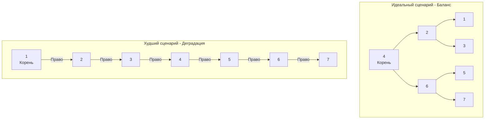

В статье [[3. Двоичное дерево поиска]] мы построили структуру, которая в теории обещает нам логарифмическую $O(\log N)$ сложность для поиска, вставки и удаления. Это магия бинарного поиска, перенесенная на ссылочную структуру. 

Однако у наивного Двоичного дерева поиска (BST) есть один фатальный архитектурный изъян, который делает его абсолютно непригодным для использования в реальных Production-системах и базах данных. Этот изъян — **зависимость формы дерева от порядка вставки элементов**.

## Анатомия деградации

Инвариант BST гласит: элементы меньше корня идут влево, элементы больше — вправо. 
Представьте, что в нашу систему поступают данные от датчика температуры, либо автоинкрементные ID из базы данных. То есть данные поступают **уже отсортированными**: 1, 2, 3, 4, 5.

Что произойдет с наивным BST при такой последовательности вставок?
1. Вставляем `1`. Это корень.
2. Вставляем `2`. Больше `1` — идет в правого ребенка.
3. Вставляем `3`. Больше `1`, больше `2` — идет в правого ребенка узла `2`.



Наше дерево **выродилось (Degenerated)**. Оно превратилось в обычный односвязный список (см. [[3. Связные списки]]). 

## Mechanical Sympathy: Двойной удар по производительности

Деградация дерева до списка — это не просто математическая проблема перехода асимптотики от $O(\log N)$ к $O(N)$. С точки зрения системного инженера и работы железа, вырожденное дерево — это самая неэффективная структура данных из возможных.

### 1. Pointer Chasing (Погоня за указателями)
Если вы ищете элемент в отсортированном массиве (слайсе) за $O(N)$ (линейным поиском), процессор работает на максимальных скоростях. Аппаратный Prefetcher видит линейный доступ и подтягивает кэш-линии (Cache Lines) из RAM в сверхбыстрый L1 кэш до того, как они понадобятся.
Если вы ищете элемент в вырожденном дереве за $O(N)$, каждый переход `node = node.Right` — это промах кэша (Cache Miss). Адреса узлов разбросаны по всей куче (Heap). Процессор простаивает сотни тактов, ожидая ответа от оперативной памяти.

**Следствие:** Вырожденное дерево на практике работает в десятки раз медленнее, чем слайс того же размера, при одинаковой асимптотике $O(N)$.

### 2. Угроза Stack Overflow (Истощение стека)
Рекурсивные алгоритмы обхода (DFS), которые мы разбирали в [[1. Деревья и обходы]], зависят от высоты дерева $H$.
Для сбалансированного дерева из 1 миллиона узлов высота $H \approx 20$. Двадцать фреймов в стеке вызовов — это ничто.
Для вырожденного дерева высота $H = 1 000 000$. 

В языках вроде Java или C++ это мгновенно вызовет `StackOverflowError` (крэш приложения). 
В Go горутина начнет динамически расширять свой стек (функция `runtime.morestack`), копируя мегабайты памяти на каждую новую тысячу вложенных вызовов. Это не убьет программу сразу, но вызовет чудовищный перерасход CPU и памяти (Memory Spike), что в условиях Highload приведет к отказу в обслуживании (OOM Killed).

> [!tip] Собеседование: Algorithmic Complexity Attack
> **Вопрос:** Почему в публичных API нельзя использовать наивные деревья или хеш-таблицы без защиты от коллизий?
> **Ответ:** Это открывает вектор для "Атаки на алгоритмическую сложность" (Algorithmic Complexity DoS / Hash-flooding). Злоумышленник может специально прислать 100 000 отсортированных ключей. Сервер, ожидающий, что обработка займет $O(N \log N)$ времени, столкнется с квадратичной сложностью $O(N^2)$ при вставке каждого следующего элемента в вырожденное дерево. CPU упрется в 100%, и бэкенд перестанет отвечать на легитимные запросы. 
> *Именно поэтому Java 8 стала конвертировать цепочки коллизий в HashMap из связных списков в Красно-черные деревья при превышении порога в 8 элементов. А в Go `map` использует рандомизированный seed для хешей при каждом запуске, чтобы сделать атаку непредсказуемой.*

## Как измерить глубину проблемы? Фактор баланса

Чтобы бороться с деградацией, дерево должно уметь оценивать свою "кривизну". Для этого вводится математическое понятие **Фактор баланса (Balance Factor)**.

Фактор баланса для любого узла рассчитывается по формуле:
$$BF = Height(LeftSubtree) - Height(RightSubtree)$$

где $Height$ — это высота поддерева (максимальная длина пути до листа). Если поддерева нет, его высота считается равной $0$.

* $BF = 0$: Идеальный баланс (оба поддерева равны).
* $BF = 1$ или $-1$: Допустимый дисбаланс.
* $BF > 1$ или $BF < -1$: **Критический дисбаланс**. Дерево начало вырождаться.

```go
package main

type Node struct {
	Value int
	Left  *Node
	Right *Node
}

// GetHeight вычисляет высоту узла (O(N) операция для наивного дерева)
func GetHeight(node *Node) int {
	if node == nil {
		return 0
	}
	leftH := GetHeight(node.Left)
	rightH := GetHeight(node.Right)
	
	if leftH > rightH {
		return leftH + 1
	}
	return rightH + 1
}

// GetBalanceFactor показывает, насколько "перекошен" узел
func GetBalanceFactor(node *Node) int {
	if node == nil {
		return 0
	}
	return GetHeight(node.Left) - GetHeight(node.Right)
}
```

> [!warning] Ловушка / Gotcha: Вычисление высоты на лету
> В коде выше мы вычисляем высоту рекурсивно $O(N)$. Если мы будем делать это при каждой вставке элемента, общая сложность вставки станет $O(N^2)$. В реальных продакшен-структурах высота (или цвет/вес) узла **кешируется** прямо в структуре самого узла (`type Node struct { ... height int }`) и обновляется за $O(1)$ при проходе дерева.

## Итог

1. Наивное Двоичное дерево поиска (BST) уязвимо к порядку вставки данных. Отсортированные или обратно-отсортированные данные превращают его в связный список.
2. Деградация дерева уничтожает преимущества алгоритма, снижая скорость операций до $O(N)$, умноженного на накладные расходы от Pointer Chasing (промахи кэша CPU).
3. Злоумышленники могут использовать эту уязвимость для проведения DoS-атак на бэкенд, истощая CPU и стек горутин.
4. Метрикой "перекоса" служит **Фактор баланса**.

Для решения этих фундаментальных проблем инженеры придумали механизмы **самобалансировки**. Это алгоритмы, которые на лету, прямо во время вставки или удаления узла, выявляют критический дисбаланс ($|BF| > 1$) и перестраивают связи с помощью "поворотов" (rotations), возвращая дереву идеальную форму.

О том, какие классы таких деревьев существуют, чем они отличаются и почему в базах данных используется один тип, а в планировщиках ОС — другой, мы поговорим в следующей статье: [[5. Обзор сбалансированных деревьев]].