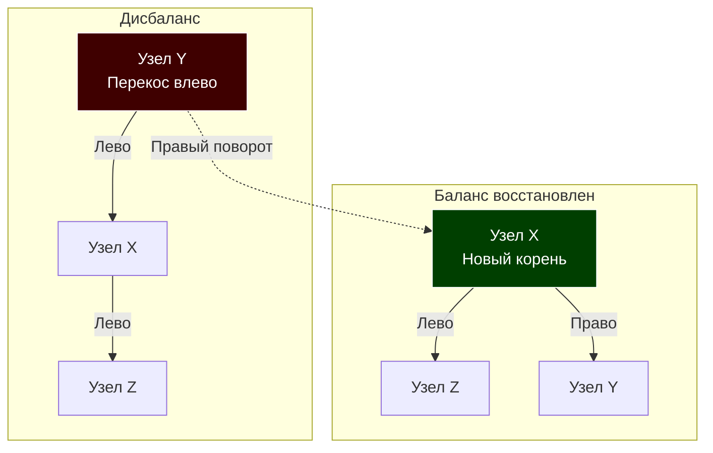

В статье [[4. Проблемы несбалансированных деревьев]] мы увидели, как наивное Двоичное дерево поиска (BST) превращается в тыкву (односвязный список), если кормить его отсортированными данными. Деградация структуры до $O(N)$ открывает векторы для DDoS-атак и убивает производительность процессора из-за кэш-промахов (Cache Misses).

Чтобы дерево гарантированно обеспечивало логарифмическую сложность $O(\log N)$ в любых условиях, оно должно уметь сопротивляться "перекосам". Этот класс структур называется **Самобалансирующимися деревьями (Self-Balancing Trees)**. 

В этой статье мы разберем механику балансировки и сделаем обзорный тур по главным деревьям в Computer Science, чтобы вы понимали, почему в ядре Linux работает одно дерево, а в PostgreSQL — совершенно другое.

## Механика спасения: Повороты дерева (Tree Rotations)

Как дерево может само себя сбалансировать "на лету"? Ответ кроется в операции, которая называется **Поворот (Rotation)**.

Поворот — это локальная $O(1)$ операция, которая меняет структуру дерева, перебрасывая указатели между родителями и детьми, но при этом **строго сохраняя инвариант бинарного поиска** (всё, что меньше — слева, всё, что больше — справа).



> [!info] Под капотом: Атомарность поворотов
> С точки зрения Go, правый поворот — это всего лишь три операции переприсваивания указателей в памяти.
> ```go
> func rightRotate(y *Node) *Node {
>     x := y.Left
>     T2 := x.Right
>     
>     // Выполняем поворот
>     x.Right = y
>     y.Left = T2
>     
>     return x // Возвращаем новый корень поддерева
> }
> ```
> Никаких аллокаций, никакого выделения памяти. GC отдыхает. Процессор выполняет этот код за считанные такты. Вся алгоритмическая магия сбалансированных деревьев сводится к тому, чтобы понять, **когда** и **в какую сторону** нужно вызвать эту функцию.

---

## Зоопарк сбалансированных деревьев: Что выбрать?

В информатике нет идеального дерева. Любой алгоритм балансировки — это компромисс между скоростью чтения и скоростью записи. Как системный архитектор, вы обязаны понимать эту разницу.

### 1. AVL дерево (Строгий баланс)
Первое исторически придуманное сбалансированное дерево. Оно требует, чтобы разница высот (Фактор баланса) между левым и правым поддеревом любого узла не превышала $1$.
* **Чтение:** Максимально быстрое для бинарных деревьев, так как дерево идеально "плотное".
* **Запись/Удаление:** Медленнее. Из-за строгих правил при вставке одного элемента может потребоваться множество каскадных поворотов вплоть до самого корня.
* **Где применяется:** В системах (чаще in-memory), где количество операций чтения (Search) многократно превышает количество записей (Insert/Delete).
* **Подробно в:** [[1. AVL дерево]].

### 2. Красно-черное дерево (Гибкий баланс)
Red-Black Tree (RBT) использует "раскраску" узлов для поддержания баланса. Правила менее строгие, чем у AVL: гарантируется лишь то, что самый длинный путь от корня до листа не более чем в 2 раза длиннее самого короткого.
* **Чтение:** Чуть медленнее, чем в AVL (из-за большей теоретической высоты).
* **Запись/Удаление:** Быстрее, чем в AVL. Вставка требует не более двух поворотов, удаление — не более трех.
* **Где применяется:** Это абсолютный индустриальный стандарт для коллекций в оперативной памяти. `std::map` в C++, `TreeMap` в Java, а также планировщик задач Linux (Completely Fair Scheduler - CFS) используют RBT. 
* **Подробно в:** [[2. Красно черное дерево]].

### 3. B-дерево и B+ дерево (Убийцы кэш-промахов)
Бинарные деревья (AVL и RBT) отличны алгоритмически, но плохи для "железа" (Mechanical Sympathy), так как каждый узел — это отдельная аллокация и промах кэша. 
B-деревья нарушают правило "не более двух потомков". Каждый узел B-дерева — это массив, вмещающий сотни элементов. Размер узла подгоняется строго под размер страницы на диске (обычно 4 КБ или 8 КБ) или под кэш-линию CPU.
* **Где применяется:** Базы данных (PostgreSQL, MySQL / InnoDB) и файловые системы (NTFS, ext4). Если вы создаете индекс `CREATE INDEX` в SQL, под капотом строится именно B+ Tree.
* **Подробно в:** [[3. B дерево и B+ дерево]].

### 4. LSM-дерево (Повелитель SSD)
Log-Structured Merge-Tree — это даже не дерево в классическом понимании указателей. Это архитектурный подход к хранению данных, оптимизированный под экстремально быструю запись (Append-only).
* **Где применяется:** NoSQL базы данных, ориентированные на огромный поток входящих данных (Cassandra, ClickHouse, RocksDB, LevelDB).
* **Подробно в:** [[4. LSM дерево]].

### 5. Trie (Префиксное дерево)
Специализированное дерево не для чисел, а для строк. Путь от корня к узлу определяет префикс строки.
* **Где применяется:** Автодополнение (Autocomplete) в поисковиках, а также сверхбыстрые HTTP-роутеры в Go-фреймворках (например, пакет `httprouter`, на котором базируется `Gin`, использует под капотом Radix Tree — оптимизированную версию Trie).
* **Подробно в:** [[5. Trie - префиксное дерево]].

---

## Сбалансированные деревья в экосистеме Go

Вы могли заметить, что в стандартной библиотеке Go нет ни Красно-черного дерева, ни AVL дерева. Почему так?

Философия Go — прагматизм. Для подавляющего большинства задач по поиску по ключу (exact match) используется встроенная хеш-таблица (`map`). Хеш-таблица в Go невероятно оптимизирована рантаймом и дает $O(1)$ в среднем случае, в то время как любое дерево даст минимум $O(\log N)$. Подробности внутреннего устройства встроенных мап мы рассмотрим позже в статье [[5. Внутреннее устройство map в Go]].

> [!tip] Собеседование
> **Вопрос:** Если в Go есть сверхбыстрая хеш-таблица (`map`), зачем вообще нам нужны сбалансированные деревья в бэкенде?
> **Ответ:** Хеш-таблицы (map) в Go **не упорядочены**. При итерации `for k, v := range m` порядок выдачи ключей рандомизирован специально. Деревья жизненно необходимы, когда бизнес-логика требует:
> 1. **Range queries (запросы по диапазону):** "Выдай всех пользователей с рейтингом от 1000 до 1500". Дерево делает это за $O(\log N + K)$. Хеш-таблица заставит вас сканировать все ключи за $O(N)$.
> 2. **Ordered iteration (гарантированный порядок):** Вывод топа игроков, сортировка логов по таймстемпу.

Если вам нужно дерево в Production на Go, инженеры не пишут его с нуля. Обычно используется пакет `github.com/google/btree` (реализация B-дерева in-memory от Google, которая работает гораздо быстрее RBT за счет кэш-локальности массивов) или пакеты-коллекции вроде `github.com/emirpasic/gods`.

## Итог

Мы завершили базовый блок работы с деревьями. Вы знаете их слабые места, понимаете причину их деградации и механизм самоспасения через локальные повороты (Rotations). 

Теперь мы готовы погрузиться в алгоритмические внутренности каждого из этих промышленных гигантов. Начнем с классики и разберем математически строгий подход к балансировке в следующей статье: [[1. AVL дерево]].