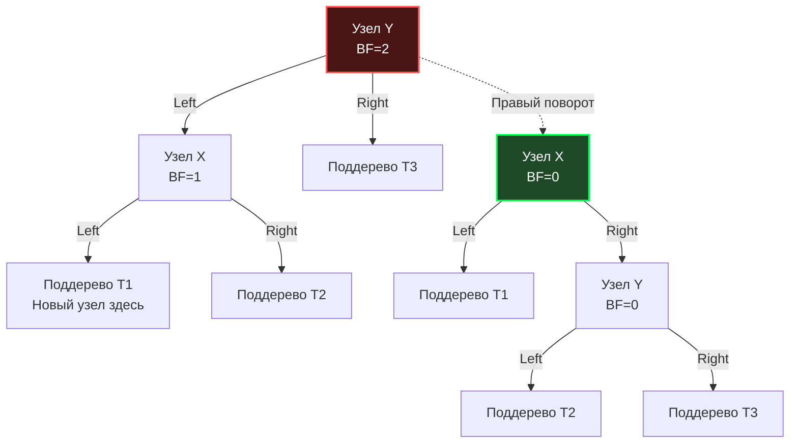

Если мы возьмем обычное Двоичное дерево поиска (BST) и начнем последовательно вставлять в него отсортированные данные (например, ключи `1, 2, 3, 4, 5`), оно выродится в обычный связный список. Вся магия логарифмической сложности испарится, и поиск деградирует до $O(N)$. 

Чтобы этого избежать, деревья должны уметь **балансировать** сами себя. Первым в истории (в 1962 году) алгоритмом, решившим эту задачу, стало **AVL-дерево** (названное по инициалам советских математиков Адельсона-Вельского и Ландиса).

## Концепция: Идеальный баланс

В отличие от хеш-таблиц, которые разбрасывают данные хаотично, деревья сохраняют **порядок** (Order). Это позволяет нам делать запросы диапазонов (Range Queries, например `SELECT * WHERE id BETWEEN 10 AND 50`). Но за порядок нужно платить дисциплиной.

**Главный инвариант (правило) AVL-дерева:**
> Для любого узла в дереве высота его левого поддерева и высота его правого поддерева могут отличаться **не более чем на 1**.

Разница высот называется **Фактором баланса (Balance Factor)**. 
`BF = Height(Left) - Height(Right)`
В валидном AVL-дереве `BF` может принимать только три значения: `-1`, `0` или `+1`. Если после вставки или удаления `BF` становится равен `+2` или `-2`, дерево теряет баланс, и алгоритм должен немедленно его восстановить.

## Структура узла в Go: Mechanical Sympathy

Давайте спроектируем структуру узла для AVL-дерева в Go. В учебниках обычно хранят сам `BalanceFactor` или высоту как `int`. Но мы инженеры, давайте посмотрим на это через призму использования памяти.

```go
package avl

// Node представляет узел AVL-дерева
type Node struct {
	Key    int     // 8 байт (на 64-битной архитектуре)
	Value  string  // 16 байт (указатель + длина)
	Left   *Node   // 8 байт
	Right  *Node   // 8 байт
	Height int8    // 1 байт
	// padding: 7 байт (выравнивание структуры до кратного 8)
}
```

> [!info] Под капотом
> Почему мы используем `int8` для поля `Height`? 
> Максимальная высота AVL-дерева математически ограничена формулой $h < 1.44 \log_2(N+2)$. 
> Если вы вставите в дерево **10 миллиардов элементов**, его максимальная высота составит всего около **48**. Тип `int8` вмещает значения до 127, чего хватит для дерева с количеством узлов, превышающим количество атомов во Вселенной. Мы экономим 7 байт полезной нагрузки на каждый узел (хотя из-за memory alignment в Go пустые байты уйдут в padding, при оптимизации порядка полей или упаковке данных это сыграет нам на руку).

## Магия восстановления баланса: Повороты (Rotations)

Когда дерево обнаруживает нарушение баланса (BF = 2 или -2), оно выполняет **Поворот (Rotation)**. Это операция изменения указателей за $O(1)$, которая восстанавливает инвариант, не нарушая порядка сортировки (левое меньше, правое больше).

Существует 4 типа нарушений и 4 типа поворотов для их исправления:

### 1. Правый поворот (LL Case - Левое-Левое)
Дерево перевешивает влево (вставили в левое поддерево левого ребенка). Мы "тянем" дерево вправо. Узел X становится корнем, Y уходит вправо.



### 2. Левый поворот (RR Case - Правое-Правое)
Зеркальная ситуация. Дерево перевешивает вправо. Мы "тянем" корень влево.

### 3. Лево-Правый поворот (LR Case - Левое-Правое)
Дерево перевешивает влево, но дисбаланс вызван вставкой в **правое** поддерево левого ребенка. 
Один правый поворот здесь не поможет (дерево просто искривится в другую сторону). 
**Решение:** Сначала делаем Левый поворот на узле X, сводя проблему к классическому LL-кейсу, а затем делаем Правый поворот на корне Y.

### 4. Право-Левый поворот (RL Case)
Зеркальная ситуация для LR. Сначала Правый поворот на ребенке, затем Левый поворот на корне.

## Идиоматичная реализация на Go

Давайте напишем production-ready ядро AVL-дерева. Мы будем использовать вспомогательную функцию `height()`, чтобы избежать паники при `nil` указателях (Idiomatic Go).

```go
package avl

// height безопасно возвращает высоту узла
func height(n *Node) int8 {
	if n == nil {
		return 0
	}
	return n.Height
}

// max возвращает большее из двух int8
func max(a, b int8) int8 {
	if a > b {
		return a
	}
	return b
}

// getBalance вычисляет фактор баланса
func getBalance(n *Node) int8 {
	if n == nil {
		return 0
	}
	return height(n.Left) - height(n.Right)
}

// rightRotate выполняет правый поворот вокруг узла y
func rightRotate(y *Node) *Node {
	x := y.Left
	T2 := x.Right

	// Выполняем поворот: меняем указатели
	x.Right = y
	y.Left = T2

	// Обновляем высоты (сначала y, так как он теперь ниже, затем x)
	y.Height = max(height(y.Left), height(y.Right)) + 1
	x.Height = max(height(x.Left), height(x.Right)) + 1

	// Возвращаем новый корень поддерева
	return x
}

// leftRotate выполняет левый поворот вокруг узла x
func leftRotate(x *Node) *Node {
	y := x.Right
	T2 := y.Left

	y.Left = x
	x.Right = T2

	x.Height = max(height(x.Left), height(x.Right)) + 1
	y.Height = max(height(y.Left), height(y.Right)) + 1

	return y
}
```

> [!warning] Ловушка / Gotcha (Рекурсия vs Стек)
> В большинстве реализаций вставка в AVL (`Insert`) пишется через рекурсию. После вставки алгоритм "поднимается" вверх по стеку вызовов (Call Stack), обновляя высоты узлов и выполняя повороты. 
> В Go горутины имеют начальный размер стека всего **2 КБ**. Рекурсия в деревьях $O(\log N)$ безопасна, так как глубина стека не превысит 50 фреймов. Однако для сверхнагруженных систем вызовы функций не бесплатны. В хардкорных библиотеках `Insert` пишут **итеративно** (через цикл `for`), вручную поддерживая массив указателей на путь до корня, чтобы не тратить время на аллокации стековых фреймов.

## Вставка с балансировкой

Посмотрим, как выглядит рекурсивный `Insert`, использующий наши примитивы:

```go
// Insert вставляет новый ключ и возвращает обновленный корень
func Insert(node *Node, key int, value string) *Node {
	// 1. Обычная вставка для BST
	if node == nil {
		return &Node{Key: key, Value: value, Height: 1}
	}

	if key < node.Key {
		node.Left = Insert(node.Left, key, value)
	} else if key > node.Key {
		node.Right = Insert(node.Right, key, value)
	} else {
		// Ключ уже существует, обновляем значение
		node.Value = value
		return node
	}

	// 2. Обновляем высоту текущего узла
	node.Height = max(height(node.Left), height(node.Right)) + 1

	// 3. Получаем фактор баланса
	balance := getBalance(node)

	// 4. Если узел потерял баланс, есть 4 случая:

	// LL Case
	if balance > 1 && key < node.Left.Key {
		return rightRotate(node)
	}

	// RR Case
	if balance < -1 && key > node.Right.Key {
		return leftRotate(node)
	}

	// LR Case
	if balance > 1 && key > node.Left.Key {
		node.Left = leftRotate(node.Left)
		return rightRotate(node)
	}

	// RL Case
	if balance < -1 && key < node.Right.Key {
		node.Right = rightRotate(node.Right)
		return leftRotate(node)
	}

	// Возвращаем неизмененный узел, если баланс в норме
	return node
}
```

## AVL-дерево на собеседованиях: Битва деревьев

На собеседованиях уровня Middle+/Senior вас редко попросят написать код поворота наизусть. Вас проверят на системное мышление.

> [!tip] Собеседование
> **Вопрос:** Если AVL-дерево такое быстрое ($O(\log N)$), почему в стандартной библиотеке C++ (`std::map`), в планировщике Linux (CFS) и во многих других местах используется **Красно-черное дерево (Red-Black Tree)**, а не AVL?
> **Ответ:** Все дело в компромиссах стоимости балансировки. 
> AVL-дерево **строго сбалансировано**. Это значит, что поиск в нем работает быстрее всего. Но за эту строгость мы платим частыми поворотами при добавлении или удалении элементов. Если мы удаляем узел, ребалансировка может каскадно дойти до самого корня, потребовав $O(\log N)$ поворотов.
> Красно-черное дерево **слабо сбалансировано** (одна ветка может быть длиннее другой максимум в 2 раза). За счет этого RBT гарантирует, что при любой вставке потребуется **не более двух поворотов**, а при удалении — не более трех. 
> **Итог:** AVL лучше для систем с частым чтением и редкой записью (Read-Heavy). RBT — это идеальный универсал для систем с интенсивной записью/удалением (Write-Heavy).

### Почему деревья не используются в БД? (Проблема Cache Locality)

Мы разобрали, как AVL-дерево работает в оперативной памяти. Но если вы спроектируете базу данных на основе AVL или RBT, она будет работать чудовищно медленно.

Каждый узел в Go выделяется через `malloc` и разбрасывается по куче (Heap). При обходе дерева процессор постоянно скачет по случайным адресам оперативной памяти. **Pointer Chasing (Погоня за указателями)** генерирует непрерывный поток Cache Miss (промахов L1/L2 кэша). Кроме того, чтение одного узла (32 байта) с диска абсолютно неэффективно, так как диски читают данные блоками по 4-8 КБ.

Для решения этой проблемы архитектура структур данных была переосмыслена: узлы стали "толстыми", чтобы идеально ложиться в кэш-линию CPU или страницу диска. 

Но прежде чем мы перейдем к деревьям баз данных, мы должны закрыть гештальт с классикой in-memory структур. В следующей статье мы разберем главного конкурента AVL: [[2. Красно черное дерево]].