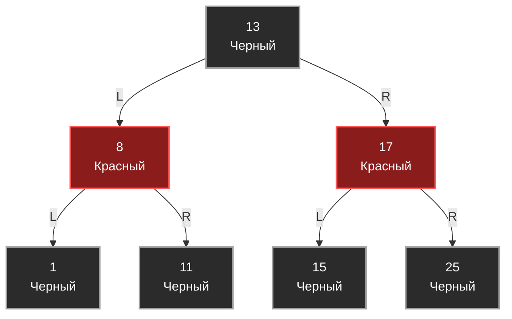

В прошлой статье [[1. AVL дерево]] мы разобрали концепцию строгой балансировки. AVL-дерево идеально для поиска: оно держит высоту минимально возможной. Но эта строгость имеет цену. При интенсивной записи (Insert) или удалении (Delete) элементов AVL-дерево вынуждено постоянно выполнять каскадные повороты (Rotations), поднимаясь от листьев к корню, что сжигает такты процессора.

Инженерам нужна была структура данных, которая дает логарифмическую сложность $O(\log N)$, но при этом требует меньше перестроений при изменении данных. Так появилось **Красно-черное дерево (Red-Black Tree, RBT)**.

## Концепция: Ослабленный баланс

Вместо того чтобы жестко следить за разницей высот (как AVL, где разница не может превышать 1), Красно-черное дерево использует систему «раскраски» узлов и набор математических правил (инвариантов). 

Главное архитектурное отличие RBT: **Оно допускает, чтобы одна ветвь была длиннее другой, но не более чем в 2 раза.** Это "слабый" баланс. Благодаря ему дереву нужно гораздо реже делать повороты при вставке элементов.

### 5 святых инвариантов RBT
Чтобы дерево оставалось красно-черным и гарантировало $O(\log N)$, оно обязано соблюдать 5 правил:
1. Каждый узел окрашен либо в **Красный**, либо в **Черный** цвет.
2. **Корень** дерева всегда **Черный**.
3. Все пустые листья (`NIL` / `null`) считаются **Черными**.
4. **Красное правило:** Если узел Красный, то оба его ребенка обязательно **Черные** (не может быть двух красных узлов подряд на одном пути).
5. **Черная высота:** Любой путь от заданного узла до любого из его листьев (`NIL`) содержит **одинаковое количество Черных узлов**.

Именно комбинация правила 4 и 5 гарантирует, что самый длинный путь (чередование Черный-Красный-Черный-Красный) будет максимум в два раза длиннее самого короткого пути (только Черные узлы).



## Mechanical Sympathy: Память и Pointer Tagging

Давайте посмотрим на структуру узла на Go. Нам нужно хранить цвет. 

```go
package rbt

type Color bool

const (
	Black Color = true
	Red   Color = false
)

type Node struct {
	Key    int     // 8 байт
	Value  string  // 16 байт
	Left   *Node   // 8 байт
	Right  *Node   // 8 байт
	Parent *Node   // 8 байт (часто нужен для итерации и балансировки)
	Color  Color   // 1 байт
	// 7 байт Padding для выравнивания
}
```

> [!info] Под капотом
> В языках без сборщика мусора (C/C++) используется экстремальная оптимизация — **Pointer Tagging (Тегирование указателей)**.
> Указатели на 64-битных системах всегда выровнены по 8 байтам, а значит, 3 младших бита адреса всегда равны `000`. C++ разработчики "крадут" один младший бит в указателе `Parent` и записывают туда цвет узла (`0` - красный, `1` - черный). Это экономит 8 байт (вместе с padding) на каждый узел!
> 
> В Go мы **не можем** так делать. Garbage Collector (GC) в Go сканирует кучу в поисках указателей, чтобы понять, какие объекты живы. Если мы запишем единицу в младший бит указателя, GC сочтет этот адрес невалидным, потеряет ссылку и удалит наш `Parent` из памяти, а при попытке обращения мы получим `panic: invalid memory address`. Поэтому в Go мы честно платим памятью за `bool` и padding.

## Балансировка: Перекраска vs Повороты

Когда мы вставляем новый узел, он **всегда изначально Красный** (чтобы не нарушить правило 5 о черной высоте). Если мы вставили Красный узел, а его родитель тоже Красный — мы нарушили правило 4. Нужно балансировать.

В RBT у нас есть два инструмента:
1. **Перекраска (Recoloring):** Дешевая операция $O(1)$. Мы просто меняем флаги `Color`. Процессор обожает эту операцию, так как узлы уже в L1-кэше.
2. **Поворот (Rotation):** Изменение ссылок (как в AVL).

Логика балансировки зависит от цвета **Дяди** (брата родителя).
* **Случай 1: Дядя Красный.** Мы просто перекрашиваем родителя и дядю в Черный, а дедушку в Красный. Никаких поворотов! Проблема поднимается выше к дедушке.
* **Случай 2: Дядя Черный.** Здесь перекраской не обойтись, мы делаем Поворот (как в AVL) и перекрашиваем узлы.

В худшем случае при вставке потребуется **не более двух поворотов**. При удалении — **не более трех**. Это математически доказанный лимит, который делает RBT королем по скорости изменения структуры.

## Идиоматичная реализация на Go: Каркас

Полный код RBT занимает более 300 строк из-за обилия corner-cases. Напишем основу и покажем, как в Go обрабатывают "пустые" узлы (NIL).

> [!warning] Ловушка / Gotcha
> Обработка листьев-NIL в RBT вызывает много багов. Если использовать классический `nil` из Go, то обращение к `nil.Color` вызовет панику. 
> Архитектурный паттерн: создается один глобальный **Sentinel Node (Узел-страж)**, который олицетворяет `NIL`. Он черный по умолчанию. Все пустые ссылки указывают на него, а не на `nil`. Это избавляет от проверок `if node != nil` в каждом `if`.

```go
package rbt

var sentinel = &Node{Color: Black} // Узел-страж

type RedBlackTree struct {
	Root *Node
}

func New() *RedBlackTree {
	return &RedBlackTree{Root: sentinel}
}

// leftRotate выполняет левый поворот вокруг x
func (tree *RedBlackTree) leftRotate(x *Node) {
	y := x.Right
	x.Right = y.Left

	if y.Left != sentinel {
		y.Left.Parent = x
	}
	y.Parent = x.Parent

	if x.Parent == sentinel {
		tree.Root = y
	} else if x == x.Parent.Left {
		x.Parent.Left = y
	} else {
		x.Parent.Right = y
	}
	y.Left = x
	x.Parent = y
}

// Вставка и fixup (восстановление свойств RBT)
func (tree *RedBlackTree) Insert(key int, value string) {
	z := &Node{Key: key, Value: value, Color: Red, Left: sentinel, Right: sentinel, Parent: sentinel}
	
	// ... Код обычного бинарного поиска для вставки (опущен) ...
	// z становится ребенком нужного узла
	
	tree.insertFixup(z)
}

func (tree *RedBlackTree) insertFixup(z *Node) {
	// Пока родитель красный - у нас нарушение (два красных подряд)
	for z.Parent.Color == Red {
		if z.Parent == z.Parent.Parent.Left {
			y := z.Parent.Parent.Right // Дядя
			if y.Color == Red {
				// Случай 1: Дядя красный. Только перекраска!
				z.Parent.Color = Black
				y.Color = Black
				z.Parent.Parent.Color = Red
				z = z.Parent.Parent // Проблема поднялась на уровень деда
			} else {
				// Случай 2: Дядя черный. Нужны повороты
				if z == z.Parent.Right {
					z = z.Parent
					tree.leftRotate(z) // LR случай
				}
				z.Parent.Color = Black
				z.Parent.Parent.Color = Red
				tree.rightRotate(z.Parent.Parent) // LL случай
			}
		} else {
			// Зеркальный случай для правого поддерева...
		}
	}
	tree.Root.Color = Black // Корень всегда черный
}
```

## Где применяется Красно-Черное дерево?

RBT — это "рабочая лошадка" системного программирования. Если вы видите в документации слова "сбалансированное дерево" или `map` с сохранением порядка (Ordered Map), в 99% случаев под капотом лежит RBT.

1. **Планировщик Linux (CFS - Completely Fair Scheduler):** Ядро ОС должно постоянно вставлять и удалять процессы (tasks) на выполнение, выбирая процесс с минимальным временем выполнения (vruntime). RBT идеально подходит, так как вставка/удаление невероятно быстры, а нужный процесс всегда находится слева внизу.
2. **C++ `std::map` и `std::set`**: Стандартная библиотека плюсов.
3. **Java `TreeMap` и внутренности `HashMap`**: Когда в хеш-таблице Java возникает много коллизий (более 8 в одном бакете), связный список (Метод цепочек) динамически превращается в Красно-Черное дерево для защиты от Hash DoS.

> [!tip] Собеседование
> **Вопрос:** Почему в Go нет встроенного `std::map` на основе дерева? Почему только хеш-таблица?
> **Ответ:** Философия Go — прагматичность и производительность. Хеш-таблица дает амортизированный $O(1)$, что в разы быстрее $O(\log N)$ при доступе к случайной памяти. Для 95% задач бэкенда порядок ключей не важен (JSON, кеширование, словари). Если порядок критичен, Go-разработчики используют комбинированный подход: слайс для порядка + мапа для доступа, либо берут стороннюю библиотеку с RBT. Это позволяет не раздувать рантайм языка сложными структурами, которые нужны редко.

## Переход к базам данных

И AVL, и RBT прекрасны... пока они находятся в оперативной памяти (RAM). 

Но как только количество данных превышает размер оперативки и мы вынуждены сохранять дерево на SSD или HDD (как это делают PostgreSQL или MySQL), RBT терпит сокрушительное фиаско. 
Один узел RBT хранит всего один ключ и весит 30-40 байт. Диск же читает данные блоками (Страницами) по 4096 байт. Чтобы найти ключ на глубине 20, RBT заставит базу сделать 20 случайных чтений с диска (20 * 4KB = 80KB мусорного I/O ради одного int). Это убьет базу данных.

Чтобы адаптировать деревья для дисковых систем, инженеры сделали узлы "толстыми", засунув в один узел сразу тысячи ключей, тем самым "сплюснув" дерево. Так появились структуры, управляющие всеми реляционными БД в мире. Их мы разберем в следующей статье: [[3. B дерево и B+ дерево]].