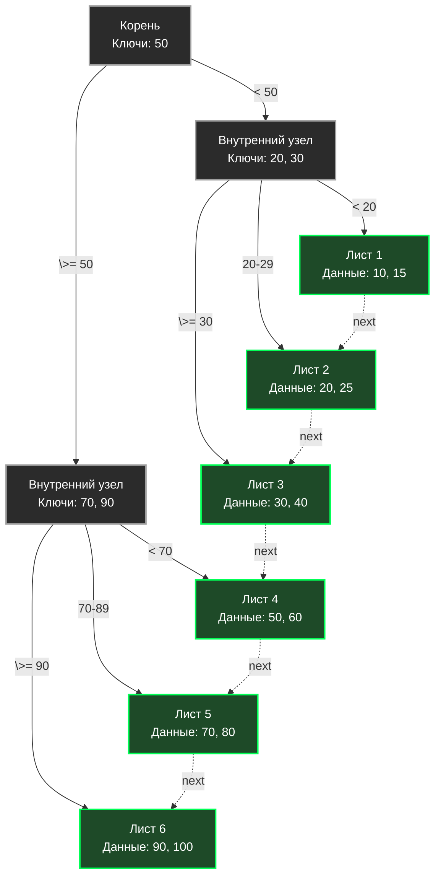

В прошлой статье [[2. Красно черное дерево]] мы обсуждали in-memory деревья. Они прекрасно работают, пока данные помещаются в оперативную память. Но когда объем данных вырастает до терабайтов, мы вынуждены сохранять их на энергонезависимые носители (SSD, HDD). 

Именно здесь бинарные деревья (AVL, RBT) терпят сокрушительное архитектурное фиаско. Чтобы понять, почему реляционные базы данных (PostgreSQL, MySQL, Oracle) не используют бинарные деревья, мы должны посмотреть на то, как работает подсистема дискового IO на физическом уровне.

## Mechanical Sympathy: Проблема дискового IO

Оперативная память позволяет читать данные случайными адресами с задержкой в ~100 наносекунд.
Диск работает иначе. Во-первых, он медленный (микросекунды для SSD, миллисекунды для HDD). Во-вторых, ОС и контроллер диска никогда не читают 1 байт. Чтение происходит **страницами (Pages)** или **блоками (Blocks)**. Стандартный размер страницы в Linux и большинстве БД — **4 КБ (4096 байт)** или **8 КБ**.

> [!warning] Ловушка / Gotcha
> Представьте, что мы сохранили Красно-черное дерево на диск. Один узел RBT весит около 32 байт. 
> Чтобы найти ключ на глубине 20 (дерево из миллиона элементов), база данных должна сделать 20 переходов по указателям. Каждый указатель — это случайное место на диске. 
> Базе придется сделать 20 дисковых IO-операций. Каждый раз она будет читать **4096 байт** с диска, чтобы достать из них **32 байта** полезной нагрузки, а остальные 4064 байта выкинуть в мусор! Это уничтожит пропускную способность любого хранилища.

Нам нужна структура данных, которая будет "толстой" и "низкой", чтобы каждый узел дерева идеально совпадал с размером страницы диска (4 КБ). Так родилось **B-дерево (B-Tree)**.

## B-дерево: Широкое и плоское

Буква "B" не означает "Binary" (бинарное). Она означает "Balanced" (сбалансированное) или "Broad" (широкое).

В отличие от бинарного дерева, где у каждого узла максимум 2 ребенка, узел B-дерева может иметь $M$ детей (где $M$ — это порядок дерева). 
Один узел B-дерева — это массив ключей. Если размер страницы 4096 байт, а один ключ с указателем весит 16 байт, мы можем упаковать в **один узел около 255 ключей и 256 указателей на детей**.

* **Высота дерева:** Если каждый узел имеет 250 детей, то на 3-м уровне дерева мы можем хранить $250^3 \approx 15.6$ миллионов записей! 
* **Количество IO:** Поиск среди 15 миллионов записей потребует всего **3 чтений с диска** (вместо 24 чтений в бинарном дереве). Более того, корень и первый уровень обычно закэшированы в RAM, так что реальное обращение к диску будет всего одно.

## B+ дерево: Стандарт реляционных баз данных

Обычное B-дерево хранит полезную нагрузку (значения строк) прямо в узлах вместе с ключами. Это имеет недостаток: "толстые" значения занимают много места, поэтому в страницу 4 КБ влезает меньше ключей. Дерево становится выше, количество IO растет.

Инженеры пошли дальше и создали **B+ дерево (B+ Tree)**. Это абсолютный стандарт де-факто для индексов в InnoDB (MySQL) и PostgreSQL.

### Отличия B+ дерева:
1. **Разделение ролей:** Внутренние узлы (Internal Nodes) хранят **только ключи** (роутеры). Они работают как дорожные указатели. Вся полезная нагрузка (строки базы данных) хранится **исключительно в Листьях (Leaf Nodes)** на самом нижнем уровне.
2. **Связанные листья:** Все листовые узлы связаны между собой в двусвязный список.



### Зачем связывать листья? (Range Queries)

Это главная фича B+ дерева. В бэкенде мы часто делаем запросы диапазонов (Range Queries): `SELECT * FROM orders WHERE created_at BETWEEN '2023-01-01' AND '2023-01-31'`.

В обычном дереве нам пришлось бы постоянно подниматься и опускаться по веткам (Tree Traversal), чтобы собрать все значения, делая случайные IO-операции.
В B+ дереве мы:
1. За $O(\log_M N)$ спускаемся от корня к листу, где лежит `2023-01-01`. (Всего 3-4 чтения с диска).
2. Начиная с этого листа, мы просто идем вправо по указателю `next` как по обычному списку, собирая данные, пока не встретим `2023-01-31`. 

Листья на диске часто стараются располагать физически последовательно, поэтому обход по списку листьев превращается в **Sequential IO (Последовательное чтение)**, которое работает на порядки быстрее случайного.

## Проектирование узла B+ дерева в Go

Если мы пишем свой движок БД на Go (или in-memory индекс, который должен быть максимально Cache-Friendly), мы должны структурировать узел так, чтобы он не делал лишних аллокаций.

> [!info] Под капотом
> Использование слайсов (`[]Key`) внутри узла может привести к фрагментации памяти кучи, так как данные слайса хранятся отдельно от структуры узла (pointer chasing). В высокопроизводительном коде (например, в CockroachDB или etcd/bbolt) узлы часто аллоцируются целиком единым блоком памяти (`[N]Key`), чтобы весь узел мгновенно загружался в кэш процессора.

```go
package btree

import "sort"

// Degree определяет порядок дерева (максимальное число детей).
// В реальной БД подбирается так, чтобы sizeof(Node) == PageSize (напр. 4096 байт)
const Degree = 256 

type Key int
type Value []byte // Для листьев

// Node представляет узел B+ дерева.
type Node struct {
	IsLeaf   bool
	NumKeys  int            // Текущее количество ключей
	Keys     [Degree]Key    // Массив ключей (отсортированный)
	
	// В Go мы вынуждены использовать указатели, но в реальном дисковом 
	// хранилище здесь будут uint64 - смещения (offsets) в файле БД.
	Children [Degree + 1]*Node 
	
	// Данные для листа и указатель на следующий лист
	Values   [Degree]Value 
	Next     *Node
}

// Search выполняет поиск значения по ключу внутри узла.
// Использует бинарный поиск, так как ключи в узле отсортированы.
func (n *Node) Search(target Key) (Value, bool) {
	// Ищем индекс первого ключа, который >= target
	idx := sort.Search(n.NumKeys, func(i int) bool {
		return n.Keys[i] >= target
	})

	if n.IsLeaf {
		// Если мы в листе и ключ совпал - отдаем значение
		if idx < n.NumKeys && n.Keys[idx] == target {
			return n.Values[idx], true
		}
		return nil, false
	}

	// Если мы во внутреннем узле, мы используем idx для спуска к нужному ребенку
	// (Если target равен ключу, мы идем в правого ребенка)
	if idx < n.NumKeys && n.Keys[idx] == target {
		idx++ 
	}
	
	// Рекурсивный спуск (на диске это означало бы чтение страницы по адресу Children[idx])
	return n.Children[idx].Search(target)
}
```

Внутри узла, когда страница (Node) загружена в RAM, мы делаем обычный `sort.Search` (бинарный поиск). Поскольку массив `Keys` лежит плотно, бинарный поиск пробегает по L1-кэшу процессора за наносекунды.

## Сплит и балансировка (Split and Merge)

Вставка в B+ дерево идет всегда в лист. Что делать, если лист заполнился (достиг `Degree`)? 
Вместо сложных вращений (как в RBT), B+ дерево делает **Расщепление (Split)**:
1. Переполненный лист делится пополам (создается новый лист).
2. Половина данных уходит в новый лист.
3. "Средний" ключ (медиана) поднимается наверх к родителю, чтобы служить разделителем (роутером).
4. Если родитель тоже переполнен, он тоже сплитится. Сплит может дойти до корня. В этом случае корень сплитится, и над ним создается новый корень — дерево вырастает на 1 уровень вверх.

> [!tip] Собеседование
> **Вопрос:** Если мы добавляем индексы на таблицу в PostgreSQL, почему вставка данных (`INSERT`) начинает работать медленнее?
> **Ответ:** Без индексов строка просто дописывается в конец файла (Append-only). При наличии индекса (B+ дерева), БД должна обновить структуру дерева. Это требует поиска нужного листа, вставки ключа, и если происходит переполнение — тяжелой операции сплита страницы (Page Split), изменения указателей в родителе и сброса нескольких грязных страниц (Dirty Pages) на диск. Чем больше индексов, тем больше деревьев нужно перестроить синхронно при каждом `INSERT`.

## Итог и ограничения B+ деревьев

B+ дерево — это шедевр оптимизации под блочные устройства (HDD/SSD). Оно минимизирует количество дискового IO и обеспечивает логарифмический поиск с огромным основанием (порядком). 

Но у него есть фундаментальный изъян, который начал проявляться в эпоху огромных потоков данных (Big Data, логирование, метрики, IoT).
При вставке (особенно случайных ключей, например UUID) B+ дерево постоянно делает **Random Writes (Случайную запись)**. Оно обновляет разные страницы на диске. SSD-диски крайне плохо переносят мелкую случайную запись — возникает явление Write Amplification (усиление записи), контроллер диска деградирует в скорости и изнашивается.

Для систем, где нагрузка на **запись** преобладает над чтением в соотношении 10:1 или 100:1 (Time-Series базы, логи, Cassandra, ClickHouse), архитектура B+ деревьев не подходит. На смену им пришла совершенно иная парадигма — структура, которая превращает все случайные записи в последовательные (Sequential). И эту революцию мы разберем в следующей статье: [[4. LSM дерево]].