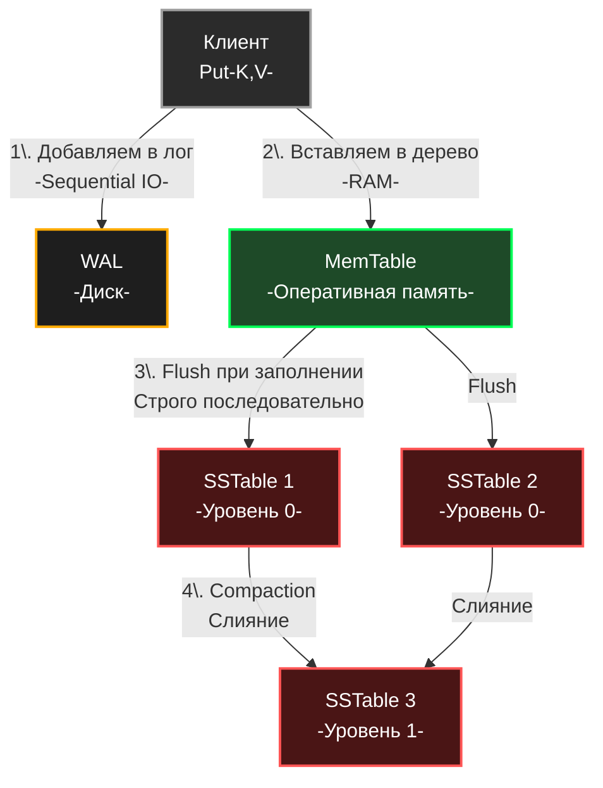

В прошлой статье [[3. B дерево и B+ дерево]] мы выяснили, что миром реляционных баз данных правят B+ деревья. Они идеальны для нагрузок, где преобладает чтение (Read-Heavy). Но мы также выявили их фатальный недостаток: при интенсивной вставке B+ дерево постоянно обновляет разные страницы диска, порождая **Random Writes (Случайную запись)**. 

В эпоху Big Data, аналитики, IoT-сенсоров и высоконагруженных логеров нам потребовались базы данных, способные проглатывать миллионы записей в секунду (Write-Heavy). Классические БД на это не способны физически. 

Чтобы решить эту проблему, инженеры перевернули подход к работе с диском с ног на голову и создали **LSM-дерево (Log-Structured Merge-tree)** — архитектуру, которая лежит в основе Apache Cassandra, ClickHouse, RocksDB, LevelDB и InfluxDB.

## Mechanical Sympathy: Почему диски ненавидят Random Write?

Чтобы понять гениальность LSM-дерева, нужно спуститься на уровень физики твердотельных накопителей (SSD). 

В отличие от оперативной памяти, вы не можете просто перезаписать один байт на SSD. Память SSD разбита на **Страницы (Pages)** по 4-16 КБ, которые сгруппированы в **Блоки (Blocks)** по 2-8 МБ. 
Читать и писать можно страницами. Но **стирать старые данные можно только целыми блоками**.

Если B+ дерево хочет обновить 100 байт в существующей странице, контроллер SSD вынужден:
1. Прочитать весь блок (2 МБ) в свой внутренний кэш.
2. Изменить 100 байт в кэше.
3. Стереть весь физический блок на флэш-памяти.
4. Записать обновленный блок (2 МБ) обратно.

Это явление называется **Write Amplification (Усиление записи)**. База данных думает, что записала 100 байт, а физический диск перезаписал 2 Мегабайта! Это убивает пропускную способность (Bandwidth) и стремительно изнашивает ячейки памяти диска.

### Решение: Append-Only (Только добавление)
Единственный способ писать на диск с максимальной скоростью (гигабайты в секунду) — это **Sequential Write (Последовательная запись)**. Писать данные друг за другом, как в обычный текстовый лог, никогда не возвращаясь назад для перезаписи. 

Именно это делает LSM-дерево. **Оно превращает все случайные записи в последовательные.**

---

## Анатомия LSM-дерева

LSM-дерево — это не одна монолитная структура (как B-дерево), это конвейер из нескольких компонентов, часть из которых живет в RAM, а часть — на диске.

### 1. WAL (Write-Ahead Log) - Диск
Первое, куда попадают данные при записи (операция `Put` или `Insert`). Это обычный файл на диске, куда данные дописываются строго в конец (Append-only). WAL нужен исключительно для отказоустойчивости (Durability). Если сервер обесточат, мы восстановим данные из WAL при перезапуске.

### 2. MemTable (Таблица в памяти) - RAM
Сразу после записи в WAL, данные помещаются в **MemTable**. Это in-memory сбалансированное дерево. Обычно это Красно-черное дерево (см. [[2. Красно черное дерево]]) или, что чаще встречается в Go-экосистеме, **Skip List** (о котором мы детально поговорим в [[5. Skip list]]).
MemTable хранит данные в отсортированном по ключу виде. Так как это оперативная память, случайная запись сюда стоит копейки.

### 3. SSTable (Sorted String Table) - Диск
Когда MemTable заполняется (достигает лимита, например 64 МБ), он "замораживается" (становится Immutable) и целиком сбрасывается (Flush) на диск в виде нового файла. Этот файл называется **SSTable**. 
Поскольку MemTable уже был отсортирован, запись на диск происходит **идеально последовательно**. Никакого Write Amplification! 
Важнейшее свойство: **SSTable никогда не изменяются (Immutable)**.



---

## Архитектурные компромиссы (Read Path и Tombstones)

Если вставка в LSM-дерево работает со скоростью света, то за это приходится расплачиваться при чтении (Read) и удалении (Delete).

### Как работает удаление? (Tombstones)
Так как SSTables иммутабельны, мы не можем пойти на диск и удалить ключ `user_123`. 
Вместо этого мы записываем **маркер удаления — Tombstone (Надгробие)**: `user_123 = <TOMBSTONE>`. 
При чтении, если алгоритм натыкается на Tombstone, он понимает, что ключ удален, даже если в старых файлах на диске еще лежат его старые значения.

### Как работает чтение? (Read Amplification)
Чтобы найти ключ `user_123`, алгоритм должен проверить уровни от самых свежих к самым старым:
1. Ищем в активном **MemTable** (самые новые данные).
2. Ищем в замороженных MemTable (в очереди на сброс).
3. Ищем в самом свежем **SSTable Уровня 0**.
4. Идем все глубже по файлам SSTable, пока не найдем ключ (или не обойдем всё).

Это вызывает **Read Amplification (Усиление чтения)**. Чтобы найти один ключ, БД может прочитать 10 файлов с диска!

> [!tip] Собеседование
> **Вопрос:** Как разработчики БД на основе LSM (например, Cassandra) борются с чудовищно медленным чтением из-за проверки множества SSTable?
> **Ответ:** С помощью **Bloom Filters (Фильтров Блума)**, которые мы разбирали в статье [[6. Bloom filter - вероятностная структура данных]].
> Каждый файл SSTable имеет свой крошечный Bloom-фильтр, загруженный в оперативную память. Перед тем как читать файл с диска, база спрашивает фильтр: "Есть ли ключ X в этом файле?". В 99% случаев фильтр говорит "Точно нет", и база пропускает этот файл, экономя дорогое обращение к диску (I/O). 

---

## Слияние и сборка мусора (Compaction)

Со временем на диске копятся тысячи мелких файлов SSTable. В них много дубликатов (если ключ обновляли 5 раз, на диске будет 5 версий) и много мертвых душ (Tombstones). Диск переполняется, а чтение замедляется.

В фоновом режиме запускается процесс **Compaction (Уплотнение)**.
Алгоритм берет несколько файлов SSTable с одного уровня (Level 0), объединяет их в памяти (аналог стадии Merge из Merge Sort), выкидывает устаревшие версии ключей и Tombstone-ы, и записывает один большой чистый файл SSTable на следующий уровень (Level 1).

> [!warning] Ловушка / Gotcha
> Compaction — это ахиллесова пята LSM-деревьев. Это фоновый процесс, который сильно нагружает CPU и дисковый IO. В плохо настроенных базах данных (например, когда идет лавина записей) процесс уплотнения может не успевать за притоком данных, диск забьется, и база "встанет колом" (Write Stalls), искусственно замедляя новые записи, пока Compaction не освободит место.

---

## Проектирование LSM в контексте Go

В Go есть несколько известных реализаций LSM-движков, например `goleveldb` и `pebble` (написан Cockroach Labs).
В Go-реализациях есть интересная особенность: выбор структуры для MemTable.

Хотя в учебниках часто пишут про Красно-черные деревья, в Go (да и в C++) для MemTable чаще используют **Skip List (Список с пропусками)**.

Почему не RBT? В высококонкурентной среде (сотни горутин одновременно пишут в MemTable) балансировка Красно-черного дерева (повороты) требует изменения связей сразу у нескольких узлов. Сделать это без глобальной блокировки (`sync.RWMutex`) невероятно сложно. 
Skip List же позволяет реализовать **Lock-Free вставку** на базе атомарных операций (`sync/atomic`), что дает феноменальную производительность при множестве пишущих горутин.

Вот как концептуально выглядит движок LSM на Go:

```go
package lsm

import (
	"sync"
	"os"
)

// LSMEngine представляет собой упрощенный движок БД
type LSMEngine struct {
	mu          sync.RWMutex
	activeMem   *MemTable       // Активная таблица в памяти (часто SkipList)
	frozenMems  []*MemTable     // Замороженные таблицы, ждущие сброса
	walFile     *os.File        // Write-Ahead Log файл
	sstManager  *SSTManager     // Менеджер файлов на диске (Compaction, Bloom Filters)
}

// Put - операция записи (сверхбыстрая)
func (e *LSMEngine) Put(key []byte, value []byte) error {
	// 1. Добавляем в лог для надежности (Sequential Write)
	e.walFile.Write(formatLogEntry(key, value))
	// На практике здесь нужен fsync (или батчинг fsync)

	e.mu.Lock()
	defer e.mu.Unlock()

	// 2. Пишем в память
	e.activeMem.Insert(key, value)

	// 3. Если MemTable переполнен - замораживаем и запускаем Flush
	if e.activeMem.Size() >= MaxMemTableSize {
		e.frozenMems = append(e.frozenMems, e.activeMem)
		e.activeMem = NewMemTable()
		// Запускаем асинхронный сброс на диск
		go e.flushFrozen()
	}

	return nil
}

// Get - операция чтения (потенциально медленная из-за поиска по уровням)
func (e *LSMEngine) Get(key []byte) ([]byte, bool) {
	e.mu.RLock()
	// Ищем в активной таблице
	if val, ok, isTombstone := e.activeMem.Search(key); ok {
		e.mu.RUnlock()
		return val, !isTombstone
	}
	
	// Ищем в замороженных
	for i := len(e.frozenMems) - 1; i >= 0; i-- {
		if val, ok, isTombstone := e.frozenMems[i].Search(key); ok {
			e.mu.RUnlock()
			return val, !isTombstone
		}
	}
	e.mu.RUnlock()

	// 4. Идем на диск (SSTManager использует Bloom Filters, чтобы не читать лишнее)
	return e.sstManager.SearchOnDisk(key)
}
```

## Резюме: B+ Tree против LSM Tree

Это классический архитектурный вопрос на проектировании систем (System Design).

| Характеристика | B+ Tree (PostgreSQL, MySQL) | LSM Tree (Cassandra, ClickHouse) |
| :--- | :--- | :--- |
| **Главная сила** | Быстрое и предсказуемое чтение. | Огромная скорость записи. |
| **Паттерн записи на диск** | Случайный (Random Write). | Строго последовательный (Sequential). |
| **Проблема с диском** | Изнашивает SSD из-за Write Amplification. | Делает Read Amplification (читает много файлов). |
| **Обновление данных** | In-place (перезаписывает страницу). | Append-only (пишет новую версию рядом). |
| **Работа в фоне** | Page Splits, Vacuum. | Compaction (сборка мусора и слияние). |

Мы завершили обзор тяжеловесных деревьев, на которых держатся базы данных. Но деревья могут управлять не только диапазонами чисел, но и префиксами строк. Для задач автокомплита, маршрутизации (HTTP роутеры в Go) и поиска по IP-подсетям нам нужна совершенно иная топология. В следующей статье мы разберем основу текстового поиска: [[5. Trie - префиксное дерево]].