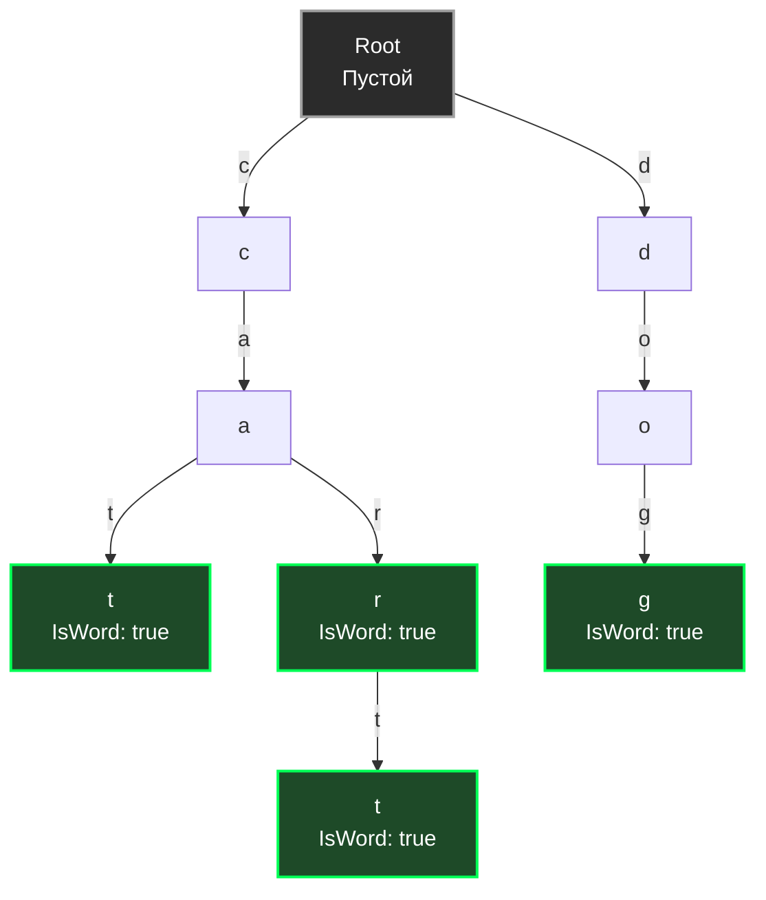
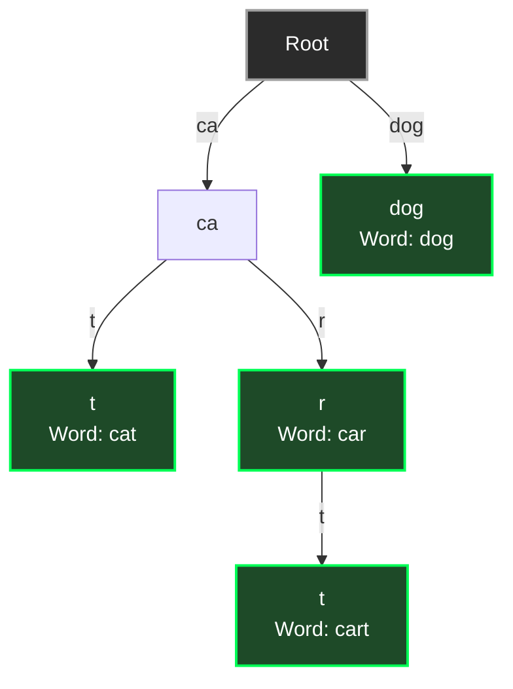

До сих пор мы рассматривали структуры данных, которые работают с целыми ключами: хеш-таблицы сравнивают ключи на точное совпадение, а B-деревья сравнивают ключи на больше/меньше. 

Но в бэкенд-разработке мы постоянно сталкиваемся с задачами поиска по **префиксу** или частичному совпадению:
* Автокомплит в поисковой строке («показать все товары, начинающиеся на "iph..."»).
* Маршрутизация HTTP-запросов (`/api/v1/users/profile`).
* Поиск по подсетям IP-адресов (CIDR routing).
* Словари и проверка орфографии (Spell Checkers).

Хеш-таблица здесь абсолютно бесполезна (хеш от `"iph"` никак не связан с хешем от `"iphone"`). B-дерево может помочь, но поиск по строкам в нем требует дорогого лексикографического сравнения целых строк на каждом узле.

Для таких задач была создана специальная геометрическая абстракция — **Trie (Префиксное дерево / Бор)**. Название происходит от слова re**trie**val (поиск информации), но произносится как "трай" (try), чтобы не путать с "три" (tree).

## Концепция: Путь — это и есть ключ

Главное архитектурное отличие префиксного дерева от других деревьев заключается в том, что **узлы не хранят сам ключ**. 
Ключ определяется **путем** от корня до конкретного узла. Каждый переход по ребру (или сам узел) символизирует один символ (букву, байт или часть пути).

Посмотрим, как выглядит Trie, в который вставили слова: `cat`, `car`, `cart` и `dog`.



Обратите внимание: префикс `ca` хранится в памяти **только один раз**, хотя он является общим для трех слов. Это называется **сжатием префиксов**. Флаг `IsWord` (зеленые узлы) показывает, где заканчивается валидное слово, так как слово `car` является префиксом для слова `cart`.

## Mechanical Sympathy: Массивы vs Мапы

При реализации узла Trie перед инженером встает жесткий выбор: как хранить ссылки на дочерние узлы? От этого выбора зависит, убьет ли ваша структура кэш процессора и оперативную память.

### Подход 1: Массив (Array)
Если мы работаем только с ASCII (английский алфавит), мы можем выделить массив указателей.

```go
type TrieNodeASCII struct {
	children [26]*TrieNodeASCII // Или [256] для любых байт
	isWord   bool
}
```
* **Плюсы для CPU:** Идеальный случай для кэша. Чтобы найти букву `'c'`, мы делаем `children['c' - 'a']`. Смещение вычисляется за 1 такт, чтение происходит мгновенно. 
* **Минусы для RAM:** Катастрофический расход памяти. Каждый узел на 64-битной системе весит $26 \times 8 + 1 = 209$ байт. Если слово `hippopotamus` уникально, мы создадим 12 узлов. Они займут $12 \times 209 \approx 2.5$ КБ памяти, при этом 96% указателей в массивах будут `nil` (пустота).

### Подход 2: Хеш-таблица (Map)
Идиоматичный подход в Go для поддержки UTF-8 (`rune`).

```go
type TrieNode struct {
	children map[rune]*TrieNode
	isWord   bool
}
```
* **Плюсы для RAM:** Память выделяется только под реально существующие ветви.
* **Минусы для CPU:** Для перехода на каждую следующую букву мы делаем лукап в хеш-таблицу. Это вычисление хеша, проверка маски, возможные промахи L1-кэша. В десятки раз медленнее массива.

> [!tip] Собеседование
> **Вопрос:** Что быстрее: найти строку длины $L$ в обычной хеш-таблице (с разрешением коллизий) или в Trie?
> **Ответ:** В теории (Big O) они равны. В хеш-таблице вычисление хеша от строки длины $L$ занимает $O(L)$. В Trie мы делаем $L$ переходов, что тоже $O(L)$. 
> Но на практике (Mechanical Sympathy), хеш-таблица выиграет с разгромным счетом из-за Cache Locality. Вычисление хеша `murmurhash` или `aeshash` от целой строки в непрерывном куске памяти работает на скоростях L1-кэша. В Trie каждый переход по букве — это прыжок по случайному адресу в куче (Pointer Chasing), что генерирует непрерывные Cache Miss.

## Базовая реализация на Go

Давайте реализуем Trie с использованием `map`, оптимизировав аллокации через ленивую инициализацию (Idiomatic Go).

```go
package trie

// Node представляет узел префиксного дерева
type Node struct {
	children map[rune]*Node // Поддержка любых юникод-символов
	isWord   bool
}

// Trie представляет само дерево
type Trie struct {
	root *Node
}

// New создает новое пустое дерево
func New() *Trie {
	return &Trie{
		root: &Node{}, // map не инициализируем до первой вставки (экономия памяти)
	}
}

// Insert добавляет слово в дерево (O(L), где L - длина слова)
func (t *Trie) Insert(word string) {
	curr := t.root
	for _, char := range word {
		// Ленивая инициализация мапы только когда она реально нужна
		if curr.children == nil {
			curr.children = make(map[rune]*Node)
		}
		
		if _, exists := curr.children[char]; !exists {
			curr.children[char] = &Node{}
		}
		curr = curr.children[char]
	}
	curr.isWord = true
}

// Search проверяет, есть ли точное слово в дереве
func (t *Trie) Search(word string) bool {
	node := t.findNode(word)
	return node != nil && node.isWord
}

// StartsWith проверяет, есть ли слова с заданным префиксом
func (t *Trie) StartsWith(prefix string) bool {
	return t.findNode(prefix) != nil
}

// findNode - внутренняя функция для прохода по пути
func (t *Trie) findNode(path string) *Node {
	curr := t.root
	for _, char := range path {
		if curr.children == nil {
			return nil
		}
		if next, exists := curr.children[char]; exists {
			curr = next
		} else {
			return nil
		}
	}
	return curr
}
```

## Эволюция для Бэкенда: Radix Tree (Patricia Trie)

Классический Trie, который мы написали выше, имеет фатальный недостаток: **проблема длинных хвостов**.
Если мы вставим слово `orchestration`, у нас создастся цепочка из 13 узлов, у каждого из которых только один ребенок. Это чудовищная трата памяти и лишние переходы по указателям.

Чтобы это исправить, инженеры придумали **Сжатое префиксное дерево (Radix Tree / Patricia Trie)**. 
Суть оптимизации: **Если у узла только один ребенок, мы объединяем их.** Ребро больше не представляет один символ — оно представляет строку (подстроку).


Слово `dog` теперь хранится в одном узле, а не в трех.

### Radix Tree в Go: Основа веб-фреймворков

Radix Tree — это не академическая игрушка, это самый важный алгоритм в повседневной работе Go-бэкендера. 

> [!info] Под капотом
> Если вы используете фреймворки **Gin**, **Echo**, **Fiber** или стандартный пакет `net/http` (начиная с Go 1.22), под капотом вашего роутера работает **Radix Tree**. 
> Самый известный роутер в Go — `httprouter` (на котором базируется Gin) — представляет собой сверхбыстрое Radix Tree. 

Когда вы регистрируете маршруты:
`GET /api/v1/users`
`GET /api/v1/posts/:id`

Роутер строит Radix Tree, где узлами являются сегменты пути (`/api/v1/`, `users`, `posts/`). При поступлении входящего HTTP-запроса роутер за наносекунды пробегает по дереву, сравнивая сегменты URL, и мгновенно извлекает параметры пути (path parameters, например `:id`). Это позволяет фреймворкам обрабатывать миллионы запросов в секунду без аллокаций в памяти (Zero Allocation Routing).

## Итог раздела

Мы завершили огромный и важнейший раздел Сбалансированных деревьев. Давайте подведем итог:
1. **AVL дерево**: Строгий баланс, идеален для поиска $O(\log N)$, но слишком много вращений при записи.
2. **Красно-черное дерево**: Ослабленный баланс, король in-memory словарей с сохранением порядка (Linux CFS, `std::map`).
3. **B/B+ деревья**: "Толстые" деревья, оптимизированные под размер страницы (4KB), абсолютный стандарт индексов в реляционных БД (PostgreSQL).
4. **LSM деревья**: Конвейер из In-Memory деревьев и неизменяемых файлов на диске. Спасение для колоссальных потоков записи (Cassandra, ClickHouse).
5. **Trie / Radix Tree**: Геометрия строк. Основа автокомплита и сверхбыстрых HTTP-роутеров в Go.

Деревья позволяют нам искать данные. Но часто бэкенду нужно не просто "найти", а постоянно "отдавать самое важное". Нам нужны структуры, которые мгновенно извлекают задачу с наивысшим приоритетом, таймер, который истекает первым, или самую дорогую транзакцию. Для этого деревья мутируют в совершенно иную форму. 

Мы переходим к разделу приоритетных структур данных. В следующей статье: [[1. Куча как структура данных]].