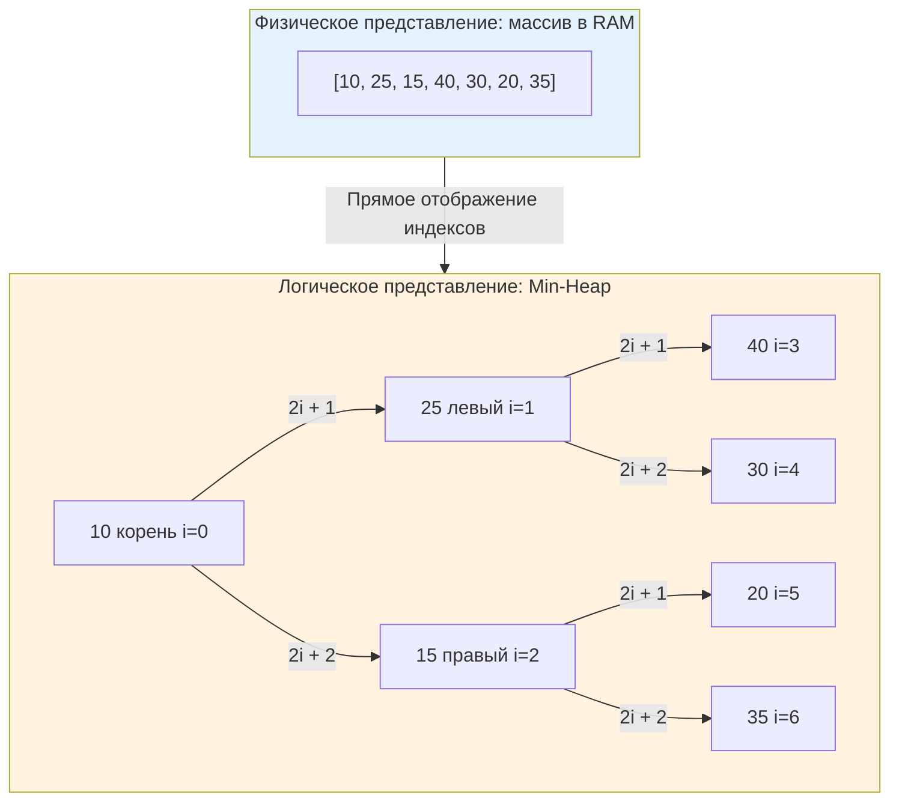

## Введение: Двойственность термина

В компьютерных науках слово «куча» обозначает две принципиально разные сущности, и их путаница — классический маркер отсутствия системного понимания.
1. **Memory Heap** — область управляемой динамической памяти, где размещаются объекты, пережившие стек. В Go это домен [[7. Глубокий Go (Внутреннее устройство)|сборщика мусора]].
2. **Heap Data Structure** — абстрактная структура данных для эффективного управления приоритетами, поддерживающая свойство частичной упорядоченности.

В данном разделе мы говорим исключительно о второй сущности. Понимание того, как приоритетные очереди работают под капотом, критически важно для проектирования систем реального времени, планировщиков задач, агрегации метрик и алгоритмов маршрутизации, где латентность доступа к «самому важному» элементу определяет SLA всего сервиса.

## 1. Математические основы: Complete Binary Tree и свойство кучи

Куча — это **полное бинарное дерево** (Complete Binary Tree), удовлетворяющее **свойству кучи** (Heap Property):
* **Min-Heap**: ключ любого узла меньше или равен ключам его потомков. Корень всегда содержит минимальный элемент.
* **Max-Heap**: ключ любого узла больше или равен ключам его потомков. Корень всегда содержит максимальный элемент.

Почему «полное» дерево? Потому что все уровни заполнены слева направо без разрывов. Это не математическая прихоть, а инженерное требование, позволяющее упаковать дерево в непрерывный массив и избавиться от указателей на детей.

Связь индексации массива и структуры дерева задаётся формулами:
* Родитель узла `i`: `(i - 1) / 2` (целочисленное деление)
* Левый потомок: `2*i + 1`
* Правый потомок: `2*i + 2`



## 2. Представление в памяти: почему массив, а не узлы

Новички часто представляют кучу как дерево с узлами `Node{Left, Right, Value}`. В продакшене на Go такой подход считается антипаттерном для куч.

> [!info] Под капотом
> **Проблема указательных деревьев:**
> * Каждый узел — отдельная аллокация в куче Go.
> * Связи через указатели `*Node` разбрасывают данные по случайным адресам RAM.
> * При спуске по дереву (например, `siftDown`) происходит 1-2 случайных доступа на уровень. Для кучи высотой 20 это до 40 cache miss.
> * Давление на GC растёт пропорционально числу узлов.
>
> **Решение: массив (implicit heap)**
> * Данные лежат в одном непрерывном блоке памяти.
> * Операции `siftUp` и `siftDown` работают с индексами и выполняют простые перестановки значений в массиве.
> * CPU аппаратно предзагружает соседние элементы в L1-кэш.
> * Нулевые аллокации после инициализации. Сборщик мусора сканирует один компактный регион вместо тысяч разрозненных указателей.

В Go стандартная библиотека `container/heap` реализована именно поверх `[]any`. Это сознательный инженерный выбор, основанный на mechanical sympathy.

## 3. Основные операции и амортизированная сложность

Куча не предназначена для произвольного поиска или удаления из середины. Её сила — в эффективном доступе к экстремуму и поддержании инварианта при модификациях.

| Операция | Сложность | Механика |
|----------|-----------|----------|
| **Peek** | O(1) | Чтение `arr[0]`. Доступ к минимуму/максимуму мгновенный. |
| **Insert (Push)** | O(log n) | Элемент добавляется в конец массива, затем выполняется `siftUp` (всплытие) до восстановления свойства кучи. |
| **Extract-Min/Max (Pop)** | O(log n) | Корень меняется местами с последним элементом, последний удаляется, новый корень `siftDown` (погружается) до правильного положения. |
| **Build-Heap** | O(n) | Линейное построение из неупорядоченного массива снизу вверх. Быстрее, чем n вставок O(n log n). |
| **DecreaseKey / Remove** | O(log n) | Требует знания индекса элемента. После изменения ключа вызывается `siftUp` или `siftDown`. |

> [!tip] Собеседование
> **Вопрос:** «Почему `Build-Heap` работает за O(n), а не O(n log n)?»
> **Ответ:** Высота дерева влияет на количество обменов. Листовая половина узлов (уровень h=0) уже являются корректными подкучами и не требуют работы. Узлы на уровне h=1 могут опуститься максимум на 1 шаг, и так далее. Сумма работы: `n/4 * 1 + n/8 * 2 + n/16 * 3 + ...` Эта геометрическая прогрессия сходится к `O(n)`. Математически доказано Флойлом в 1964 году.

## 4. Реализация в Go: `container/heap` и контракт `heap.Interface`

В Go нет встроенного generic-типа `Heap[T]`. Вместо этого используется паттерн интерфейса, который оборачивает любой слайс. Это позволяет рантайму работать с данными любого типа без генерации кода, сохраняя type-safety через проверки на этапе компиляции.

Интерфейс `heap.Interface` расширяет `sort.Interface`:
```go
type Interface interface {
	sort.Interface
	Push(x any) // Добавляет элемент в конец коллекции
	Pop() any   // Удаляет и возвращает последний элемент
}
```

Обратите внимание: методы `Push` и `Pop` в интерфейсе **не реализуют алгоритм всплытия/погружения**. Они лишь модифицируют underlying slice. Алгоритмику берут на себя функции пакета `heap`: `heap.Push(h, x)`, `heap.Pop(h)`, `heap.Fix(h, i)`, `heap.Remove(h, i)`.

```go
package main

import (
	"container/heap"
	"fmt"
	"log"
)

// IntMinHeap реализует heap.Interface
type IntMinHeap []int

func (h IntMinHeap) Len() int           { return len(h) }
func (h IntMinHeap) Less(i, j int) bool { return h[i] < h[j] } // Min-Heap
func (h IntMinHeap) Swap(i, j int)      { h[i], h[j] = h[j], h[i] }

func (h *IntMinHeap) Push(x any) {
	*h = append(*h, x.(int))
}

func (h *IntMinHeap) Pop() any {
	old := *h
	n := len(old)
	x := old[n-1]
	*h = old[0 : n-1]
	return x
}

func main() {
	h := &IntMinHeap{20, 15, 30, 5, 10}
	
	// heap.Init восстанавливает свойство кучи за O(n)
	heap.Init(h)
	
	// Извлечение элементов по приоритету
	for h.Len() > 0 {
		min := heap.Pop(h).(int)
		fmt.Printf("%d ", min)
	}
	// Вывод: 5 10 15 20 30
}
```

> [!warning] Ловушка / Gotcha
> **Никогда не изменяйте элементы внутри слайса кучи в обход функций `heap`!**
> Если вы выполните `(*h)[i] = newValue` вручную, инвариант кучи будет нарушен. Алгоритмы `siftUp`/`siftDown` больше не гарантируют корректность. Для обновления элементов используйте `heap.Fix(h, index)` после изменения, либо `heap.Remove` + `heap.Push`. В высоконагруженных системах прямая модификация массива без последующего `Fix` ведёт к трудноотлавливаемым багам в планировщиках и балансировщиках.

## 5. Механическая симпатия: кэш, аллокации и GC

Сравним поведение кучи на массиве и на указателях в контексте Go-рантайма.

**Аллокации и Escape Analysis**
```go
//go:build ignore

package main

import (
	"testing"
	"container/heap"
)

type Task struct {
	Priority int
	Payload  [64]byte // Имитация полезной нагрузки
}

type TaskHeap []*Task

func (h TaskHeap) Len() int            { return len(h) }
func (h TaskHeap) Less(i, j int) bool  { return h[i].Priority < h[j].Priority }
func (h TaskHeap) Swap(i, j int)       { h[i], h[j] = h[j], h[i] }
func (h *TaskHeap) Push(x any)         { *h = append(*h, x.(*Task)) }
func (h *TaskHeap) Pop() any {
	n := len(*h)
	item := (*h)[n-1]
	(*h)[n-1] = nil // Очищаем ссылку для GC!
	*h = (*h)[:n-1]
	return item
}

func BenchmarkHeapOps(b *testing.B) {
	const n = 10000
	b.ReportAllocs()
	for i := 0; i < b.N; i++ {
		h := &TaskHeap{}
		heap.Init(h)
		for j := 0; j < n; j++ {
			heap.Push(h, &Task{Priority: j})
		}
		for h.Len() > 0 {
			heap.Pop(h)
		}
	}
}
```

В этом бенчмарке основная нагрузка на GC создаётся аллокацией `&Task{...}` вне кучи. Сама структура кучи (`[]*Task`) растёт через `append`, что даёт амортизированно O(1) аллокаций. Но обратите внимание на строку `(*h)[n-1] = nil` в `Pop`. Без неё слайс продолжает удерживать указатели на уже извлечённые объекты. Go-сборщик увидит их как живые и не очистит память, пока слайс не будет ресайзнут или переаллоцирован. Это классическая причина **memory leaks** в долгоживущих процессах.

**Cache Locality при `siftDown`**
При погружении корня в кучу из 1 млн элементов (высота ~20) алгоритм выполняет ~20 сравнений и обменов. Поскольку данные лежат в массиве, соседние узлы часто попадают в одну кэш-линию. В отличие от `map` или BST, где каждый шаг — это переход по указателю в случайную область RAM, массивная куча минимизирует latency за счёт spatial locality.

## 6. Ловушки production-разработки и вопросы с собеседований

### Когда куча проигрывает сортировке?
Если вам нужен полный упорядоченный список, а не только экстремумы, `sort.Slice` (TimSort/PdqSort в Go) будет быстрее. Сортировка работает за O(n log n), но с очень маленькими константами благодаря векторизации и оптимизации под кэш. Куча выигрывает только когда:
* Данные поступают потоком (streaming), и вы не знаете общего объёма заранее.
* Вам нужно постоянно извлекать топ-1, топ-K, или медиану из изменяющегося набора.
* Приоритеты элементов меняются динамически.

### Проблема `DecreaseKey` в Dijkstra
Алгоритм Дейкстры требует уменьшения приоритета уже находящихся в куче вершин. Стандартный `container/heap` не предоставляет метода поиска элемента по значению за O(1). 
**Решение:** Хранить параллельную `map[VertexID]Index`. При обновлении приоритета вы меняете значение в массиве и вызываете `heap.Fix(h, map[id])`. Сложность остаётся O(log n), но добавляется оверхед на поддержание индексов.

> [!tip] Собеседование
> **Вопрос:** «В C++ есть `std::priority_queue`, в Java `PriorityQueue`. В Go `container/heap` требует реализации интерфейса. Почему язык не предоставляет готовый generic-тип `PriorityQueue[T]`?»
> **Ответ:** Философия Go — композиция и явность. `container/heap` работает с любым слайсом, реализующим контракт. Это позволяет:
> 1. Использовать кучу поверх существующих структур данных без копирования.
> 2. Кастомизировать `Less` и `Swap` для сложных типов (например, приоритет по времени + fallback по ID).
> 3. Избегать дублирования кода аллокаторов и обёрток. До Go 1.21 дженерики не поддерживались, но даже сейчас паттерн интерфейса остаётся идиоматичным для низкоуровневых контейнеров.

**Сравнение с другими языками:**
* **C++**: `std::vector` + `std::push_heap` / `std::pop_heap`. Разделение аллокации и алгоритма, аналогично Go, но на уровне шаблонов.
* **Java**: `PriorityQueue<E>` — готовый класс на базе массива. Требует boxing/unboxing для примитивов, что создаёт скрытые аллокации и нагрузку на GC, в отличие от Go, где `[]int` хранит значения напрямую.
* **Python**: `heapq` — модуль с функциями, работающими над обычным списком. Синтаксически ближе всего к подходу Go, но динамическая типизация Python добавляет runtime-оверхед.

## Итог

* **Куча как структура данных** — это не область памяти GC, а массив, представляющий полное бинарное дерево с инвариантом приоритета.
* **Представление в массиве** критически важно для Mechanical Sympathy: оно устраняет указатели, обеспечивает O(1) переходы по индексам и максимизирует hit rate CPU-кэша.
* В Go `container/heap` требует реализации `heap.Interface`. Функции пакета (`heap.Push`, `heap.Fix`) управляют алгоритмикой, а методы интерфейса — модификацией слайса.
* **Всегда очищайте ссылки** в `Pop` (`arr[n-1] = zero`), иначе куча будет удерживать память и блокировать работу GC.
* Куча идеальна для **Top-K**, **потоковой агрегации** и **динамического приоритизирования**. Для полной сортировки статических данных используйте `sort`.

В следующей статье мы детально разберём внутреннюю механику `siftUp` и `siftDown`, рассмотрим оптимизации на уровне ассемблера, которые применяет компилятор Go, и реализуем production-ready кастомную кучу с поддержкой быстрого обновления приоритетов.

[[2. Бинарная куча]]