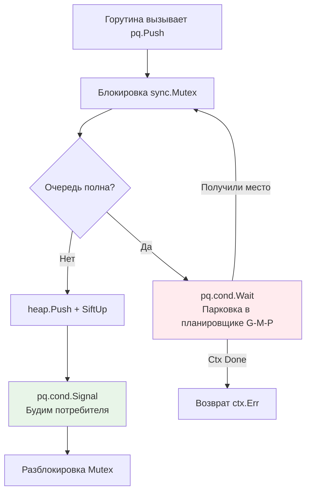

## Очередь с приоритетом как абстрактный тип данных

В предыдущих статьях мы детально разобрали [[2. Бинарная куча]] как структуру данных. Теперь перейдём к более высокому уровню абстракции: **Очереди с приоритетом (Priority Queue, PQ)**. Если куча отвечает за физическое хранение и алгоритмы восстановления инварианта, то очередь с приоритетом — это поведенческий контракт. Она определяет, как система должна реагировать на события разного уровня важности, гарантируя, что критичные задачи всегда обрабатываются первыми, независимо от времени их поступления.

В бэкенде PQ повсюду:
*   **Планировщики задач**: cron, retry-логика, асинхронные воркеры.
*   **Сетевые маршрутизаторы**: QoS (Quality of Service), приоритизация пакетов TCP.
*   **Системы реального времени**: обработка транзакций, алертинг, антифрод.
*   **Rate Limiting**: токен-бакеты с приоритетным доступом для VIP-клиентов.

Главная инженерная проблема PQ в продакшене — не сложность алгоритма O(log n), а **конкурентность, управление жизненным циклом элементов и интеграция с планировщиком Go**. Стандартная куча не знает о горутинах, контекстах или отмене операций. Наша задача — построить слой, который превратит математическую структуру в отказоустойчивый инфраструктурный компонент.

## 1. Архитектура потокобезопасной реализации

В [[5. Учебник по Go (Основы и синтаксис)|конкурентном Go]] доступ к разделяемой памяти требует синхронизации. Пакет `container/heap` не потокобезопасен: параллельные вызовы `Push`/`Pop` вызовут панику из-за гонок данных. Типичные архитектурные решения:

1. **Мьютекс-обёртка**: `sync.Mutex` вокруг кучи. Просто, но создаёт contention. При высокой нагрузке горутины парковкой уходят в ядро ОС (`futex`), что увеличивает латентность p99.
2. **Read-Write Mutex**: `sync.RWMutex` не помогает, так как `Pop` и `Push` всегда модифицируют структуру. Только `Len()` или `Peek()` могут использовать `RLock`.
3. **Sharded Priority Queue**: Разделение на N независимых куч по хешу приоритета или ID задачи. Снижает contention, но ломает глобальный порядок. Подходит для eventually consistent систем.
4. **Single-Consumer + Channels**: Одна горутина владеет кучей и читает из `chan`. Отправители пишут в канал. Полностью устраняет блокировки, но требует аккуратного управления backpressure.

> [!info] Под капотом
> Когда горутина пытается захватить занятый `sync.Mutex`, она не сразу делает системный вызов. Рантайм Go сначала крутится в spinlock (несколько тактов CPU). Если не удалось — горутина переводится в состояние `Gwaiting` и паркуется. Планировщик G-M-P переносит другие горутины на этот тред (M). При освобождении мьютекса разблокируется одна горутина, которая снова становится `Grunnable`. Этот контекст-свитч на уровне рантайма стоит ~100-300 нс, но при частых блокировках накапливается и вызывает starvation.

## 2. Production-ready реализация на Go

Ниже представлена типобезопасная, ограниченная по размеру очередь с поддержкой контекста, отмены и ленивого удаления устаревших элементов.

```go
package pq

import (
	"container/heap"
	"context"
	"errors"
	"sync"
	"time"
)

// Item представляет элемент очереди
type Item struct {
	Priority int
	Value    any
	Deadline time.Time
	Index    int // Индекс в куче (обновляется кучей)
	Cancelled bool
}

// PriorityQueue реализует потокобезопасную очередь с приоритетом
type PriorityQueue struct {
	mu      sync.Mutex
	cond    *sync.Cond
	heap    priorityHeap
	cap     int
	closed  bool
}

// priorityHeap внутренняя куча, реализующая heap.Interface
type priorityHeap []*Item

func (h priorityHeap) Len() int { return len(h) }
func (h priorityHeap) Less(i, j int) bool {
	// Более высокий приоритет идёт первым. При равенстве - раньше дедлайн
	if h[i].Priority != h[j].Priority {
		return h[i].Priority > h[j].Priority
	}
	return h[i].Deadline.Before(h[j].Deadline)
}
func (h priorityHeap) Swap(i, j int) {
	h[i], h[j] = h[j], h[i]
	h[i].Index = i
	h[j].Index = j
}
func (h *priorityHeap) Push(x any) {
	item := x.(*Item)
	item.Index = len(*h)
	*h = append(*h, item)
}
func (h *priorityHeap) Pop() any {
	old := *h
	n := len(old)
	item := old[n-1]
	old[n-1] = nil // Очистка ссылки для GC
	item.Index = -1
	*h = old[:n]
	return item
}

func NewPriorityQueue(capacity int) *PriorityQueue {
	pq := &PriorityQueue{
		heap: make(priorityHeap, 0, capacity),
		cap:  capacity,
	}
	pq.cond = sync.NewCond(&pq.mu)
	return pq
}

// Push добавляет элемент. Блокирует если очередь полна или закрыта.
func (pq *PriorityQueue) Push(ctx context.Context, item *Item) error {
	pq.mu.Lock()
	defer pq.mu.Unlock()

	if pq.closed {
		return errors.New("queue is closed")
	}

	for len(pq.heap) >= pq.cap {
		// Backpressure: ждём пока не появится место или контекст не отменится
		done := make(chan struct{})
		go func() {
			pq.cond.Wait()
			close(done)
		}()
		select {
		case <-ctx.Done():
			return ctx.Err()
		case <-done:
			if pq.closed {
				return errors.New("queue is closed")
			}
		}
	}

	heap.Push(&pq.heap, item)
	pq.cond.Signal() // Уведомляем потребителя
	return nil
}

// Pop извлекает элемент. Игнорирует отменённые (lazy deletion).
func (pq *PriorityQueue) Pop(ctx context.Context) (*Item, error) {
	pq.mu.Lock()
	defer pq.mu.Unlock()

	for {
		if len(pq.heap) > 0 {
			item := heap.Pop(&pq.heap).(*Item)
			if item.Cancelled {
				// Ленивое удаление: пропускаем, но не кладём обратно
				pq.cond.Signal()
				continue
			}
			return item, nil
		}
		if pq.closed {
			return nil, errors.New("queue is closed")
		}
		// Ждём новых элементов
		pq.cond.Wait()
		if ctx.Err() != nil {
			return nil, ctx.Err()
		}
	}
}

// Close закрывает очередь и будит все ожидающие горутины
func (pq *PriorityQueue) Close() {
	pq.mu.Lock()
	defer pq.mu.Unlock()
	pq.closed = true
	pq.cond.Broadcast()
}
```

Ключевые инженерные решения:
* **`sync.Cond` вместо чистого `chan`**: Позволяет реализовать bounded queue с backpressure без аллокации дополнительных буферов. `cond.Wait()` автоматически отпускает мьютекс и паркует горутину, что экономит память по сравнению с буферизованным каналом на тысячи слотов.
* **Lazy Deletion**: Вместо удаления из середины кучи за O(n) или поддержки мапы индексов, мы помечаем элемент `Cancelled = true` и пропускаем его при `Pop`. Это типичный trade-off: O(1) отмена vs потенциальный "мусор" в куче, который очищается при следующем извлечении.
* **Очистка ссылок в `Pop`**: `old[n-1] = nil` критически важен для работы [[7. Глубокий Go (Внутреннее устройство)|сборщика мусора]]. Без этого слайс удерживает память, вызывая memory leaks в долгоживущих процессах.

## 3. Механическая симпатия: память, кэши и планировщик

Поведение PQ под нагрузкой сильно зависит от того, как данные упакованы в памяти и как рантайм управляет горутинами.

### Cache Locality при `heap.Pop`
Операция извлечения корня вызывает `SiftDown`, который прыгает по индексам `0 -> 1 -> 3 -> 7...`. В массиве указателей `[]*Item` каждый прыжок — это разыменование в случайное место кучи. Это 2-3 cache miss на уровень. Для кучи размером 100к элементов это может добавить 500-1000 нс к латентности одного `Pop`.
**Решение**: Хранить `Priority` и `Value` inline, если размер значения мал (≤ 16 байт). Либо использовать `sync.Pool` для переиспользования `Item`, чтобы они чаще попадали в "тёплые" страницы памяти.

### Escape Analysis и аллокации
```go
func process(pq *PriorityQueue) {
    item := &Item{Priority: 10, Value: "task1"} // &item -> escape to heap
    pq.Push(context.Background(), item)
}
```
Каждый `Push` аллоцирует `Item`. При 10к RPS это 10к аллокаций/сек → давление на GC. В Go 1.21+ с [[9. Бэкенд на Go (Практика разработки)|генерацией кода]] можно использовать `any`-боксинг, но для hot path лучше передавать значения по значению или использовать кастомные generic-кучи, как в [[2. Бинарная куча]].



### Влияние на G-M-P
При `cond.Wait()` горутина уходит в системный тред на парковку. Если потребитель медленно обрабатывает элементы, очередь растёт, отправители начинают парковаться. Планировщик создаёт новые M (треды ОС), что может привести к `M` bloat и избыточному потреблению памяти стеков. **Бounded queue** спасает от этого, принудительно ограничивая рост и создавая backpressure на отправителей.

## 4. Каналы vs Мьютексы: когда что выбрать

| Сценарий | Рекомендуемый примитив | Обоснование |
|----------|------------------------|-------------|
| **FIFO обработка, producer-consumer** | `chan` | Встроенная синхронизация, нулевой оверхед на аллокации, поддержка select |
| **Приоритетная обработка, динамические приоритеты** | `sync.Mutex` + Куча | Каналы не поддерживают reordering. Приоритеты требуют перестройки структуры |
| **Высокая частота операций (>50k/sec), несколько потребителей** | `sync.Pool` + Sharded Heaps или Lock-free очереди | Один мьютекс станет bottleneck. Шардинг снижает contention ценой потери глобального порядка |
| **Требования к low-latency (<100 мкс p99)** | Атомарные операции + CAS очереди | Мьютексы и `cond` вызывают парковку. Lock-free структуры избегают syscalls, но сложнее в реализации |

> [!warning] Ловушка / Gotcha
> **Priority Inversion в системах реального времени**
> Если горутина с низким приоритетом захватила общий ресурс (мьютекс БД, логгер), а горутина с высоким приоритетом ждёт этого же ресурса, произойдёт инверсия: высокоприоритетная задача заблокирована низкоприоритетной. В Go это решается на уровне архитектуры: разделяйте критические секции, используйте `sync.TryLock` или проектируйте систему так, чтобы приоритетные задачи не зависели от глобальных локов.

## 5. Ловушки production-разработки

1. **Unbounded Growth**: Бесконечная очередь = Out of Memory. Всегда задавайте `cap` и обрабатывайте `ctx.Done()` при `Push`.
2. **Stale Entries**: Элементы с истёкшим дедлайном продолжают занимать память. Используйте periodic cleanup или lazy deletion, как в примере выше.
3. **Global Order vs Throughput**: Глобальная PQ гарантирует порядок, но сериализует доступ. Для микросервисов часто лучше локальные PQ на шардах + eventual consistency.
4. **GC Spikes**: Если `Item` содержит большие структуры или указатели, их накопление в куче вызовет длительные паузы `STW` при `GOGC`-циклах. Компактируйте данные перед постановкой в очередь.

> [!tip] Собеседование
> **Вопрос 1:** «Как реализовать обновление приоритета уже находящегося в очереди элемента за O(log n)?»
> **Ответ:** Поддерживать внешнюю мапу `map[TaskID]int` для индексации. При изменении приоритета обновляем поле в массиве и вызываем `heap.Fix(h, map[id])`. Важно блокировать мьютекс на всё время `Fix`, иначе гонка сломает инвариант кучи.
> 
> **Вопрос 2:** «Почему в Go не делают generic Priority Queue в стандартной библиотеке?»
> **Ответ:** Философия Go предоставляет примитивы (`container/heap`, `sync.Mutex`, `chan`), а не готовые фреймворки. Разные домены требуют разных контрактов: bounded/unbounded, lazy deletion, TTL, persistent vs in-memory. Готовый generic-тип заморозил бы API, тогда как композиция примитивов позволяет строить кастомные решения под SLA.
> 
> **Вопрос 3:** «Можно ли сделать lock-free Priority Queue на Go?»
> **Ответ:** Теоретически да, используя атомарные указатели и CAS-операции для обхода дерева. Но на практике в Go это крайне сложно из-за отсутствия `unsafe`-гарантий на порядок выполнения и активного GC. Для 99% задач оптимизированная mpsc-очередь или sharded mutex работают быстрее и надёжнее.

## Итог

* **Priority Queue** — это абстракция поверх [[1. Куча как структура данных]], добавляющая семантику обработки, жизненный цикл и потокобезопасность.
* В Go правильная реализация требует комбинации `sync.Mutex` + `sync.Cond` для backpressure и `context` для graceful shutdown.
* **Lazy Deletion** предпочтительнее физического удаления из середины кучи: O(1) отмена vs O(n) сдвиг, ценой временного накопления "мусора".
* **Механическая симпатия**: избегайте указательных массивов, очищайте ссылки при `Pop`, контролируйте размер кучи для предсказуемых пауз GC.
* **Конкурентность**: один мьютекс масштабируется до ~10-20k RPS. Дальше требуется шардинг или lock-free архитектуры.

Понимание бинарной кучи и приоритетных очередей покрывает большинство сценариев планирования. Однако в теоретической информатике существуют структуры, которые оптимизированы под специфические паттерны: огромное число операций `insert` при редких `delete-min`. В следующей статье мы разберём одну из самых интересных и академичных структур, которая теоретически даёт O(1) на вставку, но требует понимания amortized analysis и указательной алхимии.

[[4. Fibonacci heap]]