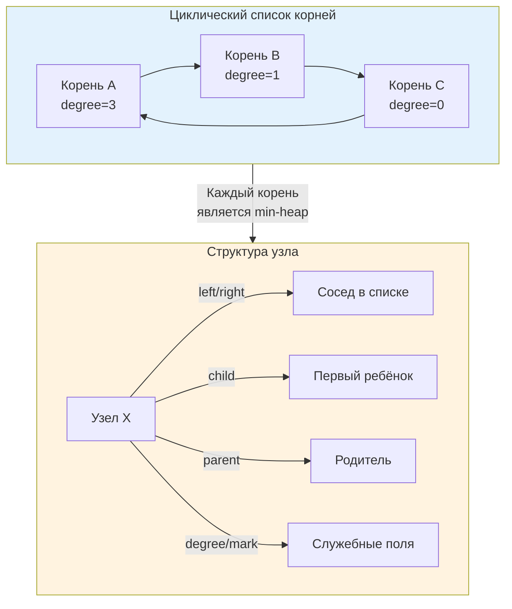

## Теоретический оптимум vs Практическая реальность

Фибоначчиева куча (Fibonacci Heap) — одна из самых красивых и математически изощрённых структур данных в теоретической информатике. Она предлагает амортизированные O(1) для вставки, слияния и уменьшения ключа, а также O(log n) для извлечения минимума. На бумаге она побеждает бинарную кучу практически во всём.

Но в реальном бэкенде на Go вы почти никогда не встретите её в продакшен-коде. Почему? Потому что **амортизированная асимптотика скрывает гигантские константы, ужасную пространственную локальность и тяжелую работу с указателями**. 

Изучение Fibonacci Heap важно не для того, чтобы внедрить её завтра в микросервис, а для понимания границ применимости теоретических гарантий, механики потенциального метода и причин, почему в индустрии часто выбирают "хуже" по Big O, но "лучше" по наносекундам и аллокациям.

> [!tip] Собеседование
> **Вопрос:** «Алгоритм Дейкстры на плотном графе теоретически работает быстрее с Фибоначчиевой кучей: O(V log V + E). Почему на практике его почти всегда реализуют на бинарной куче или Pairing Heap?»
> **Ответ:** Фибоначчиева куча имеет высокий оверхед на узел (6+ указателей, метки, степени), что приводит к частым cache miss и фрагментации кучи. Константный множитель при O(1) операциях настолько велик, что для реальных размеров графов (даже миллионов вершин) бинарная куча с её компактными массивами и аппаратным префетчингом оказывается в 2-10 раз быстрее по wall-clock time. Теория оценивает рост, но практика измеряет такты.

## Математическая основа: почему именно "Fibonacci"

Название структуры происходит от строгой математической связи между степенью узла (количеством детей) и размером поддерева. 

В Fibonacci Heap выполняется инвариант: узел степени `k` имеет как минимум `F_{k+2}` потомков, где `F` — числа Фибоначчи (`F_0=0, F_1=1, F_2=1, F_3=2...`). Числа Фибоначчи растут экспоненциально с основанием `φ ≈ 1.618` (золотое сечение). Отсюда максимальная степень любого узла в куче размера `n` ограничена `O(log_φ n) = O(log n)`.

Это ограничение критически важно для доказательства сложности `extract-min`. Без него ленивая стратегия слияния деревьев привела бы к вырождению в список, и операция извлечения заняла бы O(n).

## Внутреннее устройство: Лес, ленивая консолидация и каскадные вырезания

В отличие от бинарной кучи, которая является **одним** полным деревом, Fibonacci Heap — это **лес** (collection) из min-heap-ordered деревьев. Корни деревьев объединены в двусвязный циклический список. Каждый узел хранит:
* `child` — указатель на одного из детей
* `left`, `right` — указатели на соседей в списке детей или корней
* `parent` — указатель на родителя
* `degree` — количество прямых детей
* `mark` — булев флаг, используемый для каскадных вырезаний



### Ленивая консолидация
При вставке или слиянии куч новые деревья просто добавляются в список корней. Никакой балансировки не происходит. Это даёт O(1). Вся "тяжёлая" работа переносится на `extract-min`:
1.  Извлекается корень с минимальным ключом.
2.  Его дети становятся новыми корнями.
3.  Запускается фаза **consolidation**: деревья с одинаковой степенью многократно сливаются, пока все степени в списке корней не станут уникальными.

### Каскадные вырезания (Cascading Cuts)
При `decrease-key` узел вырезается из своего поддерева и перемещается в список корней. Если родитель уже помечен (`mark=true`), он тоже вырезается, и процесс рекурсивно поднимается вверх. Это гарантирует, что деревья остаются "пушистыми", а не вырожденными. Амортизированная стоимость этой рекурсии компенсируется потенциалом структуры.

## Амортизированная сложность: Магия потенциального метода

Доказательство O(1) для `insert` и `decrease-key` опирается на потенциальный метод. Вводим функцию потенциала:
`Φ = t + 2m`, где `t` — число деревьев в списке корней, `m` — число помеченных узлов.

* **Insert**: добавляет 1 дерево, `ΔΦ = +1`. Фактическая стоимость O(1). Амортизированная: `1 + 1 = O(1)`.
* **Decrease-Key**: вырезает узел, создаёт 1 новое дерево, возможно снимает несколько меток. В худшем случае `ΔΦ` компенсирует реальную работу по подъёму. Амортизированная стоимость остаётся O(1).
* **Extract-Min**: фактическая стоимость O(D + t), где D — макс. степень. После консолидации число деревьев резко падает, `ΔΦ` становится большим отрицательным числом, поглощая реальную работу. Итог: O(log n) амортизированно.

> [!info] Под капотом
> Амортизация означает, что отдельные операции могут быть дорогими, но в среднем по последовательности они дёшевы. В бэкенде с жёсткими SLA по p99/p99.9 латентности **амортизированные гарантии опасны**. Один `extract-min` после миллиона вставок может занять сотни микросекунд из-за консолидации тысяч деревьев. Для low-latency систем это неприемлемо, поэтому выбирают структуры с гарантированным worst-case или меньшими пиками.

## Механическая симпатия: Указатели, кэш и GC в Go

Здесь теория сталкивается с реальностью железа и рантайма Go. Fibonacci Heap — это структура, которая максимизирует косвенное обращение к памяти.

### Проблема указательной паутинки
Каждый узел занимает минимум 6 указателей (48 байт на amd64) + метаданные. При размере полезной нагрузки 8 байт оверхед превышает 500%. В куче Go это означает:
* **Фрагментация**: Аллокатор рантайма не может компактно упаковать узлы. Они разбрасываются по разным span-ам.
* **Cache Thrashing**: При `consolidation` или `cascading cut` процессор прыгает по случайным адресам RAM. Предсказатель ветвлений и аппаратный префетчинг бесполезны.
* **GC Pressure**: Сборщик мусора в Go использует триколорный алгоритм. При обходе Fibonacci Heap он вынужден разыменовывать тысячи указателей, проверяя каждый узел на "цвет". Это удлиняет фазу mark и увеличивает паузы STW.

```go
// Типичная структура узла Fibonacci Heap в Go
type FibNode[T any] struct {
	Value   T
	Parent  *FibNode[T] // Указатель на родителя
	Child   *FibNode[T] // Указатель на первого ребёнка
	Left    *FibNode[T] // Циклический двусвязный список
	Right   *FibNode[T]
	Degree  int
	Mark    bool
}

// Размер структуры: 6 указателей (48 байт) + int (8) + bool (1) + padding (7) = 64 байта
// Только метаданные! Сам Value может добавить ещё.
```

> [!warning] Ловушка / Gotcha
> **Escape Analysis уничтожит ваши оптимизации**
> Если вы создаёте узлы `FibNode` внутри функции и возвращаете ссылку на кучу, каждый узел escape-ит в кучу. Компилятор Go не сможет разместить их на стеке из-за сложных указательных связей. В результате: 100% аллокаций в куче, работа аллокатора `mallocgc` на каждый `Push`, и последующая нагрузка на GC. В бэкенде с 50k RPS это гарантированный путь к деградации p99.

## Сравнение с альтернативами: когда константы побеждают асимптотику

| Характеристика | Binary Heap (массив) | Fibonacci Heap | Pairing Heap |
|----------------|---------------------|----------------|--------------|
| **Insert** | O(log n) | O(1) аморт. | O(1) аморт. |
| **Decrease-Key** | O(log n) | O(1) аморт. | O(1) аморт. |
| **Merge** | O(n) | O(1) | O(1) |
| **Extract-Min** | O(log n) | O(log n) аморт. | O(log n) аморт. |
| **Память на узел** | 0 (упаковано в слайс) | 64+ байт + аллокации | ~32-48 байт + аллокации |
| **Cache Locality** | Отличная (массив) | Ужасная (указатели) | Средняя |
| **Применимость в Go** | Default, production-ready | Теория, редкие графы | Иногда в компиляторах/DB |

В Go-бэкенде выбор почти всегда падает на бинарную кучу (`container/heap` или кастомную generic-реализацию). Если требуется частое слияние очередей, используют **sharding** (разделение на N бинарных куч) или **Skip List** с приоритетами, которые проще поддерживать и которые лучше дружат с GC.

> [!tip] Собеседование
> **Вопрос 1:** «Почему Fibonacci Heap не входит в стандартную библиотеку Go, тогда как `container/heap` есть?»
> **Ответ:** Стандартная библиотека Go консервативна и ориентируется на практическую применимость. Fibonacci Heap слишком сложен в реализации, имеет плохую локальность памяти и высокие константы. `container/heap` работает с слайсами, не требует дополнительных аллокаций и покрывает 99% сценариев. Go предпочитает простоту и предсказуемость теоретическому оптимуму.
> 
> **Вопрос 2:** «Как доказать, что `extract-min` работает за O(log n), если он сливает все деревья?»
> **Ответ:** Через потенциальный метод. Количество деревьев перед слиянием ограничено O(log n + t). Каждый шаг слияния уменьшает число деревьев, резко снижая потенциал `Φ`. Разница потенциалов компенсирует реальную работу цикла консолидации. Суммарная амортизированная стоимость не превышает O(log n).
> 
> **Вопрос 3:** «В каких реальных системах используется Fibonacci Heap?»
> **Ответ:** Практически нигде. Иногда встречается в исследовательских прототипах алгоритмов на графах или в академических задачах. В production-движках (PostgreSQL, Linux scheduler, Go runtime) используются Pairing Heaps, Radix Heaps или оптимизированные массивные кучи из-за предсказуемости latency.

## Практические рекомендации для Go-разработчика

1.  **Не используйте в production без профилирования.** Если вы думаете, что Fibonacci Heap решит проблему с производительностью, сначала замерьте бинарную кучу. В 95% случаев массивная куча выиграет по wall-clock time.
2.  **Если нужно O(1) merge:** Рассмотрите шардирование `[]heap` по хеш-префиксу или используйте `[[7. Продвинутые структуры данных/5. Skip list]]`. Они проще в поддержке и не генерируют такую фрагментацию.
3.  **Избегайте указательных графов для hot-path приоритетов.** Если элементы мелкие, используйте `[N]T` или `[]T` с кастомной индексацией. Если крупные — выносите данные во внешние хранилища или используйте `sync.Pool` для пула узлов.
4.  **Помните про `GOGC` и паузы.** Чем больше указательных связей в долгоживущей структуре, тем дольше GC проходит фазу mark. Fibonacci Heap — один из худших паттернов для concurrent mark-and-sweep.

## Итог

* **Fibonacci Heap** — теоретически оптимальная структура для алгоритмов с доминирующим `decrease-key` и частыми слияниями, но практически неприменима в высоконагруженном бэкенде.
* **Амортизированные O(1)** скрывают тяжёлую работу консолидации, которая происходит пачками и создаёт непредсказуемые пики латентности.
* В Go указательная природа структуры ведёт к **ужасной cache locality**, высокому оверхеду памяти (6+ указателей на узел) и увеличению нагрузки на сборщик мусора.
* **Production-альтернативы**: бинарные кучи на слайсах, шардированные приоритетные очереди, pairing heaps. Они жертвуют асимптотикой ради предсказуемости, плотности памяти и скорости исполнения на современном CPU.
* **Знание структуры** необходимо для системного дизайна и хардовых собеседований, но её внедрение оправдано только в узкоспециализированных исследовательских или оффлайн-вычислениях.

Понимание приоритетных очередей и их вариаций завершает раздел структур для управления порядком. Теперь мы перейдём к одному из самых частых паттернов в бэкенд-разработке: поиску, фильтрации и агрегации топ-элементов в потоковых и пакетных данных. Это прямая проекция теории куч на реальные задачи мониторинга, аналитики и ранжирования.

[[5. Задачи Top K элементов]]