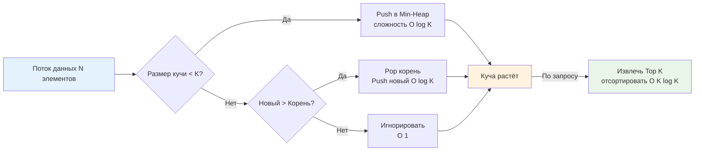
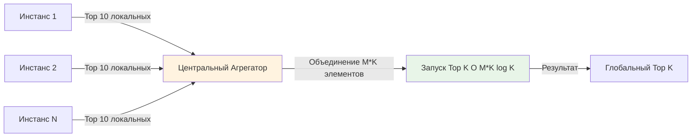

## Введение: Почему Top K — это не просто задача для собеседований

В высоконагруженном бэкенде задача поиска Top K элементов возникает постоянно: мониторинг самых медленных запросов за последний час, лидерборды в игровых сервисах, агрегация самых частых ошибок, определение «тяжелых» пользователей в системах биллинга или ранжирование результатов поиска. 

Ключевая инженерная особенность этих сценариев: **N (общий объём данных) огромно, а K (число целевых элементов) мало**. N может достигать десятков миллионов запросов в сутки, тогда как K обычно лежит в диапазоне 10-100. В такой постановке классическая сортировка за O(N log N) становится неприемлемой по двум причинам: она требует загрузки всех данных в память и тратит CPU на упорядочивание элементов, которые никогда не попадут в результат. Нам нужен алгоритм, который потребляет O(K) памяти, обрабатывает данные потоково (streaming) и гарантирует стабильную латентность.

## 1. Алгоритмические стратегии: когда что применять

| Метод | Сложность | Память | Подходит для streaming | Применимость в Go-бэкенде |
|-------|-----------|--------|------------------------|---------------------------|
| Полная сортировка | O(N log N) | O(N) | Нет | Только для малых N или отладки |
| Quickselect | O(N) среднее, O(N²) худшее | O(N) | Нет | In-memory аналитика, но плохая локальность кэша |
| Min-Heap размера K | O(N log K) | O(K) | Да | **Стандарт де-факто** для production |
| Counting/Bucket Sort | O(N) | O(M), M - диапазон | Да | Только для целочисленных/дискретных метрик |
| Approximate (Space-Saving) | O(N) | O(1/ε) | Да | Когда K велико, а память ограничена |

Минимальная куча фиксированного размера K выигрывает за счёт предсказуемого потребления памяти и возможности обработки данных на лету. Как только размер кучи достигает K, каждый новый элемент сравнивается только с корнем (минимумом среди текущих топ-K). Если новый элемент больше корня, корень извлекается, новый элемент вставляется, и куча восстанавливается за O(log K). Если меньше или равен — элемент игнорируется. Это даёт гарантированную O(N log K) сложность и O(K) памяти.



## 2. Production-ready реализация: Streaming Top K на Go

Реализация должна быть типобезопасной, избегать аллокаций в hot path и корректно работать с [[7. Глубокий Go (Внутреннее устройство)|сборщиком мусора]]. Используем дженерики Go 1.21+ и массивное представление кучи.

```go
package topk

import (
	"sort"
)

// TopK реализует потоковый поиск K наибольших элементов.
// Требует сравнимый тип T. Для структур передавайте LessFunc.
type TopK[T any] struct {
	heap []T
	k    int
	less func(a, b T) bool
}

// New создаёт агрегатор Top K. Функция less определяет порядок (a < b для Min-Heap).
func New[T any](k int, less func(a, b T) bool) *TopK[T] {
	return &TopK[T]{
		heap: make([]T, 0, k),
		k:    k,
		less: less,
	}
}

// Process принимает новый элемент. Выполняется за O(log K).
func (t *TopK[T]) Process(item T) {
	n := len(t.heap)
	
	if n < t.k {
		t.heap = append(t.heap, item)
		// Восстанавливаем свойство кучи снизу вверх
		t.siftUp(n)
		return
	}
	
	// Куча полна. Сравниваем с минимумом (корнем)
	if t.less(t.heap[0], item) {
		t.heap[0] = item
		t.siftDown(0, n)
	}
	// Иначе элемент игнорируется
}

// Result возвращает отсортированный срез Top K элементов.
// Вызов модифицирует внутреннее состояние (сортирует кучу).
func (t *TopK[T]) Result() []T {
	sort.Slice(t.heap, func(i, j int) bool {
		return !t.less(t.heap[i], t.heap[j])
	})
	return t.heap
}

// siftUp и siftDown идентичны [[2. Бинарная куча]], оптимизированы для min-heap
func (t *TopK[T]) siftUp(i int) {
	for i > 0 {
		parent := (i - 1) / 2
		if t.less(t.heap[i], t.heap[parent]) {
			t.heap[i], t.heap[parent] = t.heap[parent], t.heap[i]
			i = parent
		} else {
			break
		}
	}
}

func (t *TopK[T]) siftDown(i, n int) {
	for {
		l, r := 2*i+1, 2*i+2
		smallest := i
		if l < n && t.less(t.heap[l], t.heap[smallest]) {
			smallest = l
		}
		if r < n && t.less(t.heap[r], t.heap[smallest]) {
			smallest = r
		}
		if smallest == i {
			break
		}
		t.heap[i], t.heap[smallest] = t.heap[smallest], t.heap[i]
		i = smallest
	}
}
```

Пример использования для агрегации метрик:
```go
type Metric struct {
	ID      string
	Latency time.Duration
}

agg := topk.New(10, func(a, b Metric) bool {
	return a.Latency < b.Latency // Min-Heap по задержке
})

for _, m := range stream {
	agg.Process(m)
}

slowest := agg.Result() // Top 10 самых медрых
```

## 3. Механическая симпатия: аллокации, кэш и GC в действии

Понимание того, как этот код исполняется на железе и рантайме Go, отличает Senior-инженера от миддла.

### Плотность памяти и Cache Locality
Массив `[]T` хранит элементы последовательно. При K=100 и размере `Metric` в 32 байта, вся куча занимает ~3.2 КБ. Это полностью помещается в L1-кэш процессора (обычно 32-48 КБ). Операции `siftUp`/`siftDown` работают с индексами в пределах этого блока. Аппаратный префетчинг загружает соседние кэш-линии заранее, поэтому доступ к `t.heap[smallest]` происходит за 3-4 такта CPU. В указательной реализации `[]*T` каждый элемент мог бы лежать в разном месте кучи, что увеличило бы latency в 10-50 раз.

### Escape Analysis и аллокации
Передача структур по значению в `Process(item T)` создаёт копию на стеке вызывающей функции. Если структура мала (≤ 16-32 байта), копия выполняется регистрами или быстрой командой `MOVUPS`. Если структура велика и содержит указатели, компилятор может принять решение о `escape to heap`, что создаст аллокацию на каждый вызов `Process`. 
**Оптимизация для hot path:** Если `T` — крупная структура, используйте указатели `*T`, но управляйте жизненным циклом вручную через `[[16. Профилирование, отладка и производительность|sync.Pool]]`, либо передавайте только ключи сравнения (например, `Latency`), а полные объекты извлекайте по ID из внешнего кэша.

```go
// Плохо для больших объектов: каждая итерация аллоцирует Metric в кучу
for _, val := range hugeData {
    agg.Process(Metric{...}) // escape
}

// Хорошо: переиспользование буфера
var pool = sync.Pool{New: func() any { return new(Metric) }}
for _, val := range hugeData {
    m := pool.Get().(*Metric)
    *m = Metric{...} // перезапись без аллокации
    agg.Process(*m)  // копирование значения в кучу
    pool.Put(m)
}
```

### Влияние на G-M-P планировщик
Алгоритм полностью однопоточный и не блокирует системные треды. Горутина, вызывающая `Process`, выполняется на выделенном ей `P` без переключения контекста в ядро ОС (`syscalls`). Это гарантирует детерминированную латентность. Если поток данных поступает из сети (`net.Conn`), используйте неблокирующий IO и `bufio.Scanner`, чтобы избежать парковки горутин в `netpoll`.

> [!info] Под капотом
> **Почему не `sort.Slice` на лету?**
> При каждом новом элементе сортировка всего слайса за O(K log K) создаст O(N * K log K) общую сложность. Heap-подход даёт O(N log K). Разница при N=10⁶, K=100: ~10⁷ операций против ~10⁸. Кроме того, `sort` вызывает виртуальные вызовы интерфейса `sort.Interface`, что мешает инлайну и векторизации. Наша реализация с замыканием `less` компилируется напрямую, а при использовании дженериков с оператором `<` может быть полностью заинлайнена.

## 4. Продвинутые паттерны: распределённый агрегатор и временные окна

В микросервисной архитектуре данные распределены по инстансам. Агрегация Top K на одном сервере даёт лишь локальную картину.

### Стратегия Merge Top K
1.  Каждый инстанс поддерживает локальный `TopK[K]`.
2.  По сигналу (например, каждые 10 секунд) инстансы отправляют свои текущие K элементов в агрегатор.
3.  Агрегатор объединяет (M * K) элементов и запускает `TopK[K]` поверх них.
4.  Сложность слияния: O(M * K log K). При M=100, K=100 это ~10⁵ операций, что выполняется за миллисекунды.

### Временные окна (Sliding Window)
Для задач вида «Top 10 медленных запросов за последние 5 минут» простого агрегатора недостаточно. Элементы должны экспайриться.
**Решение:** Комбинируйте `TopK` с кольцевым буфером или [[3. Очередь с приоритетом]], где приоритетом выступает `timestamp`. Периодически запускайте фоновую горутину, которая выгружает просроченные элементы и перестраивает кучу. Для высокой точности используйте алгоритм [[14. Практические паттерны/2. Rate limiting алгоритмы|скользящего окна с двумя очередями]], но вместо счётчиков держите хип с приоритетами.



## 5. Ловушки и вопросы с собеседований

### Ловушка 1: Нестабильность при равных приоритетах
Если `a == b`, порядок в куче не определён. В мониторинге это может привести к «дрожанию» метрик: элемент с одинаковой задержкой может то попадать в Top 10, то выпадать из-за перестановок внутри бакета.
**Решение:** Добавьте вторичный критерий сравнения. Например, `if a.Latency == b.Latency { return a.Timestamp > b.Timestamp }`. Это детерминирует порядок и делает Top K стабильным.

### Ловушка 2: Переполнение K и память
Если K задаётся динамически из конфигурации и может достичь 10⁶, массив `[]T` потребляет сотни мегабайт. В Go это провоцирует крупные аллокации в куче и долгие паузы GC при росте.
**Решение:** Жёстко ограничивайте K на уровне кода (например, `min(configuredK, 5000)`). Для больших K переходите к approximate-алгоритмам (Count-Min Sketch, Space-Saving), которые дают O(1) память ценой небольшой погрешности.

> [!tip] Собеседование
> **Вопрос 1:** «Как найти медиану в потоке чисел, если память ограничена?»
> **Ответ:** Использовать две кучи: Max-Heap для левой половины данных и Min-Heap для правой. Балансировать размеры так, чтобы разница была ≤ 1. Медиана — это корень большей кучи или среднее арифметическое корней. Сложность вставки O(log N), памяти O(N), но можно аппроксимировать через гистограммы.
> 
> **Вопрос 2:** «Почему Quickselect O(N) на практике часто медленнее Heap O(N log K) для Top K?»
> **Ответ:** Quickselect требует доступа ко всем элементам, производит много случайных обменов в массиве (плохая cache locality) и имеет риск вырождения в O(N²) без медианы медиан. Heap обрабатывает данные последовательно, держит K элементов в L1/L2 кэше, не трогает исходный поток и гарантирует стабильную производительность.
> 
> **Вопрос 3:** «Как обработать Top K в распределённой системе, если один инстанс падает?»
> **Ответ:** Локальные Top K должны периодически пушиться в отказоустойчивое хранилище (Redis, Kafka). Агрегатор читает из хранилища с учёном TTL. При падении инстанса агрегатор использует последнюю сохранённую выборку или interpolates данные из реплик. Consistency trade-off выбирается в зависимости от бизнес-требований.

## Итог

* **Top K** — фундаментальный паттерн бэкенда, требующий баланса между точностью, памятью и латентностью.
* **Min-Heap размера K** даёт O(N log K) времени и O(K) памяти, идеально подходит для streaming-обработки.
* В Go массивное представление кучи обеспечивает отличную **cache locality**, а дженерики устраняют оверхед `any`-боксинга.
* **Механическая симпатия**: контролируйте размер `T`, используйте `sync.Pool` для крупных объектов, избегайте escape-аллокаций в циклах.
* **Распределённая агрегация** и **временные окна** превращают теоретический алгоритм в production-компонент для мониторинга и аналитики.
* **Всегда учитывайте стабильность сортировки** и жёсткие лимиты на K для предотвращения Out-Of-Memory.

Разобравшись с приоритетными очередями и агрегацией топ-элементов, мы переходим к структурам, которые позволяют эффективно работать с диапазонами, выполнять агрегации на отрезках и отвечать на запросы вида «сколько событий произошло между временем A и B». В следующей статье мы детально изучим дерево, где каждый узел хранит агрегированное значение своего поддерева, и узнаем, как оно применяется в системах трекинга изменений и аналитических движках.

[[1. Segment tree - дерево отрезков]]