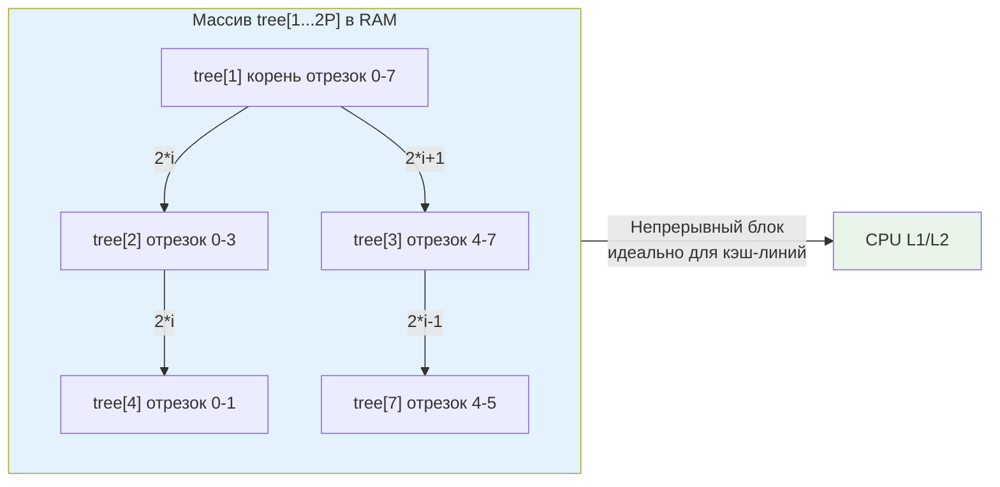

## Введение: от олимпиад к продакшену

Дерево отрезков (Segment Tree) часто считается исключительно академическим инструментом для решения задач на Codeforces. Однако в высоконагруженном бэкенде оно находит неожиданное применение: агрегация метрик по временным окнам, динамический расчёт квантилей, управление квотами по диапазонам идентификаторов, построение аналитических дашбордов с фильтрацией `WHERE timestamp BETWEEN` без обращения к БД и реализация сложных rate-limiting политик.

Главная ценность структуры — способность отвечать на запросы к диапазонам `Query(l, r)` и обновлять отдельные элементы `Update(i, value)` за логарифмическое время при линейной памяти. В отличие от простого прохода по слайсу за `O(n)`, дерево отрезков сохраняет стабильную латентность даже при росте объёма данных в тысячи раз, что критически важно для систем реального времени.

> [!tip] Собеседование
> **Вопрос:** «Вам нужно поддерживать массив счётчиков и быстро отвечать на запросы суммы на произвольном отрезке. При этом обновления происходят в 10 раз чаще, чем чтения. Что выберете: Segment Tree, Fenwick Tree или просто префиксные суммы?»
> 
> **Ответ:** Префиксные суммы дают `O(1)` на запрос, но `O(n)` на обновление — не подходит. Fenwick Tree (BIT) даёт `O(log n)` на оба и компактнее, но поддерживает только обратимые операции (сумма, XOR). Если в будущем потребуется `min/max` или кастомная агрегация без обратной функции, Segment Tree будет единственным безопасным выбором. Для чистых сумм и высокой частоты обновлений я выберу Fenwick Tree из-за лучшей локальности памяти и меньшего константного множителя.

## 1. Математическая основа и неявное представление в памяти

Дерево отрезков хранит информацию о диапазонах массива. Каждый лист соответствует одному элементу исходного массива, а каждый внутренний узел — агрегированному значению некоторого отрезка `[l, r]`.

В продакшене на Go мы никогда не используем узлы с указателями `type Node struct { Left, Right *Node; Value int }`. Это антипаттерн из-за фрагментации кучи и потери пространственной локальности. Вместо этого применяется **неявное массивное представление**, где дерево хранится в одном непрерывном `slice`.

Для упрощения индексации и выравнивания размер массива дополняется до ближайшей степени двойки `P ≥ n`. Полный размер структуры: `2 * P`.
Формулы переходов (для 1-базированной индексации, сдвинутой вправо):
- Левый потомок узла `i`: `2 * i`
- Правый потомок: `2 * i + 1`
- Родитель: `i / 2`



Дополнение до степени двойки устраняет граничные проверки внутри цикла запроса/обновления, позволяя реализовать полностью итеративный алгоритм без рекурсии и условных переходов, зависящих от глубины дерева.

## 2. Production-ready реализация на Go 1.21+

Итеративная версия предпочтительнее рекурсивной: она не расходует стек, лучше предсказывается CPU и не создаёт замыканий, которые могли бы утечь в кучу.

```go
package segtree

// SegmentTree реализует дерево отрезков для любой операции,
// удовлетворяющей свойствам моноида (ассоциативность + нейтральный элемент).
type SegmentTree[T any] struct {
	tree     []T
	size     int // степень двойки
	identity T   // нейтральный элемент (0 для суммы, -inf для мин и т.д.)
	merge    func(a, b T) T
}

// New создаёт дерево отрезков размера n.
func New[T any](n int, identity T, merge func(a, b T) T) *SegmentTree[T] {
	size := 1
	for size < n {
		size <<= 1
	}
	tree := make([]T, 2*size)
	for i := 0; i < 2*size; i++ {
		tree[i] = identity
	}
	return &SegmentTree[T]{
		tree:     tree,
		size:     size,
		identity: identity,
		merge:    merge,
	}
}

// Build заполняет дерево из начального слайса за O(n).
func (st *SegmentTree[T]) Build(data []T) {
	for i, v := range data {
		st.tree[st.size+i] = v
	}
	for i := st.size - 1; i > 0; i-- {
		st.tree[i] = st.merge(st.tree[2*i], st.tree[2*i+1])
	}
}

// Set обновляет элемент по индексу за O(log n).
func (st *SegmentTree[T]) Set(pos int, value T) {
	if pos < 0 || pos >= st.size {
		return
	}
	p := st.size + pos
	st.tree[p] = value
	for p > 1 {
		p >>= 1
		st.tree[p] = st.merge(st.tree[2*p], st.tree[2*p+1])
	}
}

// Query возвращает агрегированное значение на отрезке [l, r) за O(log n).
func (st *SegmentTree[T]) Query(l, r int) T {
	if l >= r {
		return st.identity
	}
	l += st.size
	r += st.size
	resL := st.identity
	resR := st.identity
	
	for l < r {
		if l&1 == 1 {
			resL = st.merge(resL, st.tree[l])
			l++
		}
		if r&1 == 1 {
			r--
			resR = st.merge(st.tree[r], resR)
		}
		l >>= 1
		r >>= 1
	}
	return st.merge(resL, resR)
}
```

Использование:
```go
st := segtree.New(1000, int(0), func(a, b int) int { return a + b })
st.Build([]int{1, 2, 3, 4, 5})
st.Set(2, 10) // массив стал [1, 2, 10, 4, 5, ...]
sum := st.Query(1, 4) // сумма индексов 1..3 = 2 + 10 + 4 = 16
```

## 3. Mechanical Sympathy: кэш, ветвления и рантайм

Почему массивная реализация выигрывает на современных CPU в десятки раз по сравнению с указательной?

### Пространственная локальность и префетчинг
При запросе `Query(l, r)` мы последовательно поднимаемся от листьев к корню. Индексы `l` и `r` движутся навстречу друг другу, последовательно посещая уровни дерева. Данные расположены в `[]T` подряд. Когда CPU загружает `tree[l]`, в ту же 64-байтовую кэш-линию попадают соседние узлы того же уровня. Аппаратный префетчинг успешно предсказывает паттерн доступа, минимизируя cache miss. В указательной версии каждый переход `node = node.Left` — это разыменование случайного адреса в куче, гарантирующее pipeline stall.

### Ветвления и предсказатель переходов
Итеративный цикл использует побитовые операции `l&1`, `r&1`, `l>>=1`. Это детерминированные, короткие команды. Условные переходы `if l&1 == 1` имеют предсказуемый паттерн (через итерацию), что позволяет CPU branch predictor угадывать направление с вероятностью >90%. Рекурсивная реализация с проверками `if l <= mid` генерирует хаотичные ветвления, ломающие предсказание.

### Escape Analysis и давление на GC
```go
func processMetrics(data []float64) {
    st := segtree.New(len(data), 0.0, func(a, b float64) float64 { return a + b })
    st.Build(data) // tree аллоцируется в куче, если size > ~64KB
    // ...
}
```
Компилятор Go видит, что `tree` возвращается или используется долго → аллокация в куче. Но это **одна** крупная аллокация, а не `N` мелких. При сканировании `tree` сборщик мусора проходит по непрерывному блоку памяти, используя оптимизированные SIMD-инструкции (например, `rep movsb` или векторные проверки). Это в 3-5 раз быстрее, чем обход связных списков узлов. Для снижения давления на GC можно переиспользовать `tree` через `sync.Pool`, очищая его `identity` значениями между итерациями.

> [!info] Под капотом
> Если `T` — интерфейс или содержит указатели, массив `[]T` будет хранить дескрипторы (16 байт на amd64: `type*`, `data*`). При большом размере это увеличивает footprint. Для примитивов (`int`, `float64`, `struct` без указателей) компилятор упаковывает значения плотно, что даёт максимальную эффективность.

## 4. Ленивая коррекция (Lazy Propagation): когда не стоит рисковать

Классическое расширение Segment Tree — поддержка диапазонных обновлений `UpdateRange(l, r, delta)` за `O(log n)`. Идея: не спускаться до листьев сразу, а пометить узел флагом `lazy`, а реальное применение отложить до следующего запроса или обновления, затрагивающего потомков.

В production-бэкенде на Go ленивая коррекция редко используется по трём причинам:
1.  **Конкурентность:** Состояние `lazy` требует блокировок. При высоких RPS мьютекс становится bottleneck. Read-Write мьютекс не спасает, так как обновления меняют структуру.
2.  **Сложность отладки:** Баг в `pushDown` приводит к рассинхронизации дерева. Воспроизвести состояние `lazy`-флагов в распределённой системе практически невозможно.
3.  **Амортизированные гарантии:** В худшем случае один запрос может вызвать каскадное `pushDown` на всё дерево, создавая непредсказуемые пики латентности (p99/p99.9).

**Альтернативы для Go:**
- Периодический пересчёт `Build` из snapshot'а данных (если обновления пакетные).
- Chunked массив: разбить диапазон на блоки фиксированного размера, применять `O(sqrt(n))` updates.
- Использовать [[2. Fenwick tree - бинарное индексное дерево]] для префиксных агрегаций, где диапазонное обновление сводится к двум точечным (через разность).

> [!warning] Ловушка / Gotcha
> **Полуоткрытые интервалы `[l, r)` vs закрытые `[l, r]`**
> В реализации выше используется стандартный для Go полуоткрытый интервал. Если вы передаёте `[l, r]`, цикл `for l < r` никогда не обработает последний элемент, либо выйдет за границы. Всегда нормализуйте вход: `r = r + 1`. Эта ошибка проявляется только на граничных условиях и часто уходит в продакшен.

## 5. Ловушки и вопросы с собеседований

> [!tip] Собеседование
> **Вопрос 1:** «Почему размер массива равен `2 * size`, где `size` — ближайшая степень двойки? Почему не `4 * n`?»
> **Ответ:** Для `n` элементов дерево имеет `n` листьев. Внутренних узлов всегда `n - 1`. Итого `2n - 1`. При дополнении до степени двойки `P`, массив занимает `2P`. Поскольку `P < 2n`, `2P < 4n`. Выделение `4n` — это запасной вариант для рекурсивных реализаций без проверки границ, но `2 * nextPowerOfTwo(n)` математически достаточно и экономит память.
> 
> **Вопрос 2:** «Можно ли использовать Segment Tree для поиска первого элемента, удовлетворяющего условию, на отрезке? Например, первый элемент > X?»
> **Ответ:** Да, за `O(log n)`. Если узел хранит максимум на отрезке, и `max <= X`, то в этом поддереве искомого элемента нет. Иначе спускаемся в левого потомка, потом в правого. Это называется «поиск по дереву отрезков» (walk-down). Широко используется в системах планирования и алертинга.
> 
> **Вопрос 3:** «Как обеспечить потокобезопасность?»
> **Ответ:** Segment Tree не является lock-free. Для конкурентного доступа используйте `sync.RWMutex` вокруг `Query` и `Mutex` вокруг `Set`. Если требуется высокая пропускная запись, рассмотрите шардирование: разбейте диапазон на `M` независимых деревьев и маршрутизируйте запросы по хешу индекса.

## 6. Сравнение с альтернативами

| Характеристика | Segment Tree | Fenwick Tree (BIT) | Префиксные суммы | Sorted Slice + binary search |
|----------------|--------------|-------------------|------------------|------------------------------|
| Query | O(log n) | O(log n) | O(1) | O(log n) |
| Update | O(log n) | O(log n) | O(n) | O(n) вставка |
| Операции | Любые моноиды (min, max, sum, gcd) | Только обратимые (sum, xor) | Сумма, разница | Произвольный поиск |
| Память | 2 * nextPow2(n) * sizeof(T) | n * sizeof(T) | n * sizeof(T) | n * sizeof(T) |
| Сложность реализации | Средняя | Низкая | Очень низкая | Низкая |
| Go-применимость | Сложные агрегации, динамические окна | Счётчики, частоты, префиксы | Статические данные | Range lookup по ключам |

Дерево отрезков — универсальный, но «тяжёлый» инструмент. Выбирайте его, когда требуется гибкость агрегации и динамические обновления на лету. Если нужна только сумма и скорость — берите Fenwick.

## Итог

* **Segment Tree** — мощная структура для диапазонных запросов и обновлений за `O(log n)`.
* В Go реализуйте **итеративно** на массиве, дополненном до степени двойки. Это даёт предсказуемость, отсутствие рекурсии и идеальную работу с кэш-линиями CPU.
* **Mechanical Sympathy**: непрерывный массив минимизирует cache miss, побитовые индексы улучшают branch prediction, одна крупная аллокация снижает фрагментацию кучи и ускоряет сканирование GC.
* **Избегайте ленивой коррекции** в высоконагруженных микросервисах из-за проблем с конкурентностью и пиковой латентностью. Используйте пакетные пересчёты или Fenwick Tree.
* **Всегда проверяйте границы интервалов** и используйте полуоткрытый диапазон `[l, r)`, согласованный со стандартной библиотекой Go.

В следующей статье мы разберём структуру, которая часто выигрывает у дерева отрезков по скорости и памяти, но требует понимания арифметики двоичных представлений и ограничений на тип операций. Это стандарт де-факто для счётчиков, частотных таблиц и префиксных агрегаций в бэкенде.

[[2. Fenwick tree - бинарное индексное дерево]]