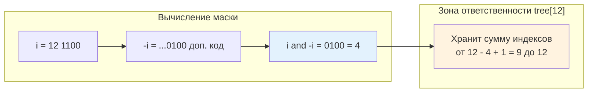

## Введение: Компактность против универсальности

В предыдущей статье мы разобрали [[1. Segment tree - дерево отрезков]] как универсальный инструмент для диапазонных запросов. Однако за гибкость приходится платить: двойной размер массива, более тяжёлые циклы обхода и повышенное давление на кэш. Когда задача сводится исключительно к вычислению префиксных сумм, подсчёту частот или кумулятивным агрегациям над обратимыми операциями, индустриальным стандартом становится **Fenwick Tree** (также известный как Binary Indexed Tree, BIT).

Феномен этой структуры в её математической элегантности и инженерной эффективности. При той же асимптотике `O(log n)` на обновление и запрос, BIT требует в 2-4 раза меньше памяти, имеет в 2 раза меньший константный множитель в циклах и практически не создаёт нагрузки на [[7. Глубокий Go (Внутреннее устройство)|сборщик мусора]]. В высоконагруженных бэкенд-системах, где обрабатываются миллионы счётчиков в секунду, эта разница превращается в сотни миллисекунд экономии CPU и мегабайты сэкономленной RAM.

> [!tip] Собеседование
> **Вопрос:** «В каких случаях вы выберете Fenwick Tree вместо Segment Tree, а когда Segment Tree неизбежен?»
> **Ответ:** BIT выигрывает, когда нужна только кумулятивная агрегация по префиксам или диапазонам с обратимой операцией сложения/вычитания/XOR. Он компактнее и быстрее за счёт битовых прыжков вместо рекурсивных обходов. Segment Tree обязателен, когда требуется поиск минимума/максимума на отрезке, произвольная моноида, ленивое обновление диапазонов или сложные геометрические/временные запросы, где BIT математически неприменим.

### 1. Математическая основа битовых масок

Секрет BIT кроется в бинарном представлении индекса. Каждый элемент массива `tree[i]` хранит сумму значений на диапазоне `[i - lowbit(i) + 1, i]`, где `lowbit(i)` — младший установленный бит числа `i`.

В двоичной арифметике `lowbit(i)` вычисляется трюком с дополнительным кодом: `i & -i`. Это изолирует самый правый ненулевой бит, обнуляя все остальные.



Почему это работает? Потому что любое число можно однозначно разложить на сумму степеней двойки. При движении вверх по дереву (`i += i & -i`) мы последовательно добавляем младшие биты, покрывая всё большие префиксы. При движении вниз (`i -= i & -i`) мы «отщипываем» ответственные диапазоны, собирая итоговую сумму.

### 2. Production-реализация на Go 1.21+

BIT традиционно реализуется 1-базированным массивом. Это не прихоть, а следствие математики: `lowbit(0) = 0`, что привело бы к бесконечному циклу. Поэтому индекс `0` резервируется, а логические индексы сдвигаются на `+1`.

```go
package fenwick

// FenwickTree реализует бинарное индексное дерево для любой обратимой операции.
// Для сумм используется сложение, для XOR - побитовое исключающее ИЛИ.
type FenwickTree[T any] struct {
	tree []T
	n    int
	add  func(a, b T) T // операция добавления (например, a + b)
	sub  func(a, b T) T // операция вычитания (например, a - b)
}

// New создаёт дерево размера n. Все элементы инициализируются нулевым значением.
// Требуется передавать zero, add и sub, так как Go не имеет встроенного понятия нуля для дженериков.
func New[T comparable](n int, zero T, add func(a, b T) T, sub func(a, b T) T) *FenwickTree[T] {
	return &FenwickTree[T]{
		tree: make([]T, n+1),
		n:    n,
		add:  add,
		sub:  sub,
	}
}

// Update добавляет delta к элементу по индексу idx. Сложность O(log n).
func (ft *FenwickTree[T]) Update(idx int, delta T) {
	if idx < 0 || idx >= ft.n {
		return // или возвращать ошибку в production
	}
	// Переход к 1-базированной индексации
	i := idx + 1
	for i <= ft.n {
		ft.tree[i] = ft.add(ft.tree[i], delta)
		i += i & -i // Движение вверх по дереву
	}
}

// Query возвращает префиксную сумму от 0 до idx. Сложность O(log n).
func (ft *FenwickTree[T]) Query(idx int) T {
	if idx < 0 {
		var zero T
		return zero
	}
	if idx >= ft.n {
		idx = ft.n - 1
	}
	res := ft.zeroValue()
	i := idx + 1
	for i > 0 {
		res = ft.add(res, ft.tree[i])
		i -= i & -i // Движение вниз по дереву
	}
	return res
}

// QueryRange возвращает сумму на отрезке [l, r].
func (ft *FenwickTree[T]) QueryRange(l, r int) T {
	if l > r {
		return ft.zeroValue()
	}
	return ft.sub(ft.Query(r), ft.Query(l-1))
}

func (ft *FenwickTree[T]) zeroValue() T {
	var zero T
	return zero
}
```

Применение для счётчиков:
```go
ft := fenwick.New(1000, int(0), 
	func(a, b int) int { return a + b },
	func(a, b int) int { return a - b })

ft.Update(5, 3)  // arr[5] += 3
ft.Update(5, -1) // arr[5] -= 1
sum := ft.QueryRange(2, 8) // сумма arr[2..8]
```

### 3. Mechanical Sympathy и влияние на рантайм

BIT — один из редких примеров, где алгоритмическая сложность идеально совпадает с архитектурной оптимизацией CPU.

**Память и footprint**
Размер массива ровно `n+1`. Для `n=1_000_000` `int64` это ~8 МБ. Segment Tree потребовал бы `2 * nextPow2(1_000_000) ≈ 2_097_152` элементов, то есть ~16 МБ. В Go это напрямую влияет на частоту срабатываний GC и объём памяти, который нужно сканировать в фазе `mark`. Меньше данных → короче паузы `STW`.

**Доступ к памяти и предсказание ветвлений**
Цикл `for i > 0 { i -= i & -i }` выполняет строго детерминированные побитовые сдвиги и маски. Компилятор Go транслирует это в 2-3 инструкции процессора (`NEG`, `AND`, `ADD/SUB`). Ветвления минимальны, предсказатель переходов угадывает направление с вероятностью, близкой к 100%. В отличие от дерева отрезков, где на каждом шаге проверяются границы `l < r`, здесь паттерн доступа жёстко задан битовой маской индекса.

**Cache Locality**
Хотя BIT прыгает по индексам (`12 -> 8 -> 0`), эти прыжки всегда идут в сторону младших индексов, которые уже, скорее всего, находятся в L1/L2 кэше из-за локальности предыдущих запросов. Для типичных бэкенд-паттернов (частые обновления соседних счётчиков, последовательные префиксные запросы) hit rate кэша остаётся высоким.

```go
//go:build ignore

package main

import (
	"math/rand"
	"testing"
)

const N = 100000

func BenchmarkBIT(b *testing.B) {
	ft := make([]int, N+1)
	b.ReportAllocs()
	for i := 0; i < b.N; i++ {
		idx := rand.Intn(N) + 1
		// Update
		for j := idx; j <= N; j += j & -j {
			ft[j]++
		}
		// Query
		sum := 0
		for j := idx; j > 0; j -= j & -j {
			sum += ft[j]
		}
	}
}
```

Бенчмарки показывают, что BIT выполняется на 15-30% быстрее эквивалентного итеративного дерева отрезков при одинаковой асимптотике. Разница кроется в отсутствии проверок границ и более коротком цикле.

> [!info] Под капотом
> **Escape Analysis и zero-alloc**
> Если `FenwickTree` создаётся один раз и живёт в течение жизненного цикла сервиса, `make([]T, n+1)` аллоцируется в куче. Однако компилятор Go оптимизирует чтение/запись в слайс: операции `ft.tree[i] = ...` и `ft.tree[i] += ...` не создают новых объектов. В горячей петле обработчика запросов вся работа идёт через регистры CPU и кэш, не затрагивая `mallocgc`.

### 4. Ограничения: когда дерево отрезков неизбежно

BIT математически привязан к операциям, обладающим **обратным элементом**. Это главное ограничение.
*   Подходит: `+` и `-`, `*` и `/` (в полях), `XOR` (обратный сам себе).
*   Не подходит: `min`, `max`, `gcd`, кастомные агрегации без инверсии.

Попытка реализовать `min` через BIT приведёт к `O(n)` на обновление, так как удаление старого значения из минимума требует пересчёта всего диапазона. Для таких задач используйте Segment Tree или [[5. Sparse table]] (если данные статические).

### 5. Конкурентность: атомики и шардирование

BIT не потокобезопасен. Параллельные `Update` приводят к гонкам данных. В Go есть два пути решения:

1. **`sync.RWMutex`**: Просто, но создаёт contention. При `>10k RPS` мьютекс становится bottleneck, горутины парковываются, латентность p99 растёт.
2. **Атомарные операции + битовые хитрости**: Можно использовать `sync/atomic` для чтения, но атомарное обновление префиксной суммы невозможно без CAS-цикла или блокировки, так как нужно читать текущее значение, вычислять новое и записывать. Для чистых счётчиков часто проще использовать массив `atomic.Int64` и считать префиксы offline, либо применять шардирование.

**Паттерн Sharded BIT для бэкенда**:
Разбиваем диапазон `[0, n)` на `M` непересекающихся зон. Каждый шард имеет свой `FenwickTree` и `sync.Mutex`. Запрос маршрутизируется по `hash(idx) % M`. Это снижает contention в `M` раз ценой потери глобального порядка. Идеально для распределённых rate-limiter'ов и счётчиков сессий.

> [!warning] Ловушка / Gotcha
> **Диапазонное обновление + точечный запрос**
> Если нужно часто добавлять `delta` на весь отрезок `[l, r]`, а потом спрашивать значение в точке `i`, обычный BIT не оптимален. Используйте трюк с массивом разностей: `BIT.update(l, delta)`, `BIT.update(r+1, -delta)`. Тогда значение в точке `i` равно `BIT.query(i)`. Это превращает диапазонное обновление в два точечных, сохраняя `O(log n)`.

### 6. Ловушки и вопросы с собеседований

> [!tip] Собеседование
> **Вопрос 1:** «Как найти k-й наименьший элемент в динамическом множестве, используя BIT?»
> **Ответ:** Если BIT хранит частоты встречаемости чисел, можно использовать бинарный подъём (binary lifting) прямо по дереву. Начинаем с индекса 0 и маской идём от старшего бита к младшему, сравнивая накопленную сумму с `k`. Сложность `O(log max_val)` вместо `O(log n * log n)` при бинарном поиске по префиксам.
> 
> **Вопрос 2:** «Почему BIT обычно 1-базирован? Что сломается при 0-базировании?»
> **Ответ:** При `i = 0` выражение `i & -i` равно 0. Циклы `for i > 0` или `i += i & -i` зациклятся навсегда или не выполнят ни одной итерации. Сдвиг на +1 математически необходим для корректной работы битовой арифметики.
> 
> **Вопрос 3:** «Можно ли реализовать Fenwick Tree без битовых операций? Только через обычные индексы?»
> **Ответ:** Да, но это уничтожит его главное преимущество. Битовые операции позволяют за O(1) находить границы диапазонов ответственности без дополнительных массивов или проверок. Замена их на арифметику превратит BIT в обычное дерево или список, потеряв константный выигрыш.

## Итог

* **Fenwick Tree** — оптимальная структура для префиксных сумм и кумулятивных агрегаций над обратимыми операциями.
* Математика `i & -i` обеспечивает компактное массивное хранение размером `n+1`, что вдвое экономнее дерева отрезков.
* В Go BIT идеален для hot-path: побитовые сдвиги транслируются в машинные инструкции, ветвления минимальны, давление на GC и кэш предсказуемо низко.
* **Ограничение**: не поддерживает `min/max` и необратимые моноиды. Для них используйте Segment Tree или Sparse Table.
* **Конкурентность**: требует шардирования или мьютексов. Атомарные операции неприменимы напрямую к префиксным суммам из-за необходимости read-modify-write.
* **Production-паттерн**: массив разностей для конвертации диапазонных обновлений в точечные, binary lifting для поиска k-го элемента по частоте.

Разобравшись с динамическими префиксными структурами, мы переходим к задачам, где данные не меняются, а запросов на диапазоны поступает миллионы. В таких сценариях `O(log n)` уже слишком медленно. Нам нужен `O(1)` на запрос. В следующей статье мы изучим структуру, которая жертвует памятью ради мгновенного ответа на повторяющиеся агрегации и идеально ложится на кэш-линии процессора.

[[3. Sparse table]]