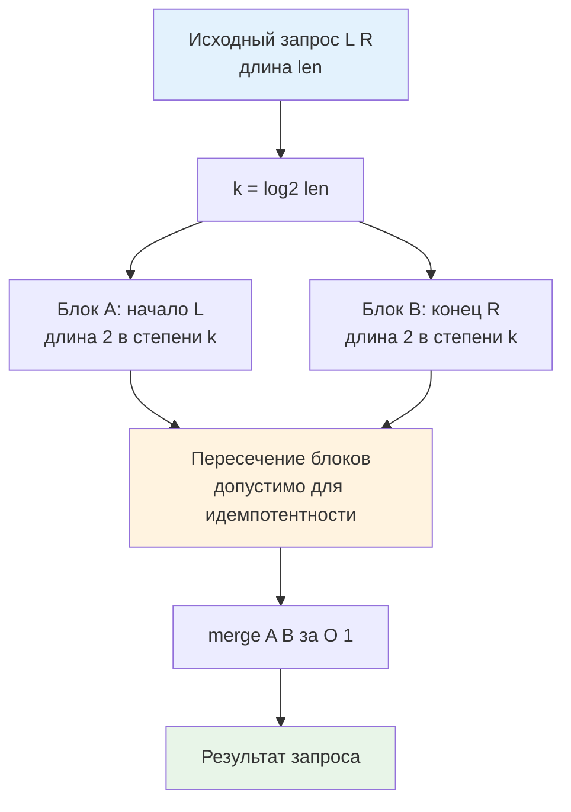

## Введение: O(1) ценой памяти и статичности

В предыдущих статьях мы изучили динамические структуры для диапазонных запросов: [[1. Segment tree - дерево отрезков]] и [[2. Fenwick tree - бинарное индексное дерево]]. Обе гарантируют `O(log n)` на запрос и обновление, что отлично для изменяемых данных. Но в бэкенде часто встречается сценарий, где данные **статичны** или меняются крайне редко, а количество чтений превышает записи на порядки: исторические логи, предрассчитанные метрики, неизменяемые конфигурации маршрутизации, геопространственные индексы или кэшированные отчёты.

В таких условиях `O(log n)` превращается в избыточную трату циклов CPU. Нам нужно `O(1)`. Именно эту нишу закрывает **Sparse Table** (Разреженная таблица). Она жертвует памятью (`O(n log n)`) и временем построения (`O(n log n)`) ради гарантированного константного времени отклика на запрос. В системах с жёсткими SLA по p99 латентности, где каждый лишний такт конвейера или непредсказуемое ветвление может выбить сервис из бюджета, Sparse Table становится архитектурным выбором №1.

> [!tip] Собеседование
> **Вопрос:** «Почему Sparse Table даёт O(1) на запрос, а Segment Tree только O(log n)? В чём математическое ограничение Sparse Table?»
> **Ответ:** Sparse Table использует предвычисленные значения для диапазонов длины `2^k`. Любой отрезок `[L, R]` можно покрыть двумя перекрывающимися блоками этой длины. Объединение результатов двух блоков допустимо только для **идемпотентных** операций, где `f(x, x) = x`. Например, `min(a, b, b, c) = min(a, b, c)`. Для сумм это не работает, так как пересечение удвоит элементы. Segment Tree не требует идемпотентности и поддерживает динамические обновления, но платит логарифмическим обходом дерева.

## 1. Математическая основа идемпотентности

Ключевая идея: вместо хранения ответа для каждого возможного отрезка `O(n²)`, мы храним только отрезки, длина которых является степенью двойки. Для массива длины `n` существует `n * log₂n` таких диапазонов.

Запрос к произвольному отрезку `[L, R]` длины `len = R - L + 1` разбивается на два предвычисленных блока размера `2^k`, где `k = floor(log₂(len))`:
- Первый блок начинается в `L`.
- Второй блок заканчивается в `R`.

Блоки гарантированно перекрываются, но не выходят за границы `[L, R]`. Поскольку операция идемпотентна, дублирование элементов в пересечении не искажает результат.



> [!info] Под капотом
> **Вычисление k за O(1) на уровне CPU**
> В наивных реализациях `log₂` вычисляется циклом или массивом поиска. В современном Go мы используем пакет `math/bits`. Функция `bits.Len64(uint64(len)) - 1` транслируется в одну машинную инструкцию `LZCNT` (Leading Zero Count) на x86-64 или `CLZ` на ARM64. Это аппаратная операция, выполняющаяся за 1 такт без ветвлений и доступа к памяти.

## 2. Production-реализация на Go 1.21+

Для бэкенда важно минимизировать накладные расходы. Стандартная реализация через `[][]T` создаёт `logN` отдельных аллокаций и массив указателей на строки. Это ухудшает пространственную локальность и усложняет работу сборщика мусора. В production-коде для high-load систем предпочтительнее **плоский массив** `[]T` с ручным вычислением индексов. Это гарантирует непрерывный блок памяти, идеальный для аппаратного префетчинга.

```go
package sparse

import "math/bits"

// SparseTable реализует статический диапазонный запрос за O(1).
// Требует идемпотентную функцию merge (например, min, max, gcd).
// Использует плоский массив для максимальной кэш-локальности.
type SparseTable[T comparable] struct {
	data  []T
	n     int
	logN  int
	merge func(a, b T) T
}

// New строит таблицу за O(n log n).
func New[T comparable](arr []T, merge func(a, b T) T) *SparseTable[T] {
	n := len(arr)
	if n == 0 {
		return &SparseTable[T]{merge: merge}
	}
	
	// logN = floor(log2(n)) + 1
	logN := bits.Len64(uint64(n))
	
	// Плоский массив размера n * (logN + 1)
	// Уровень k хранится в смещении n * k
	table := make([]T, n*(logN+1))
	
	// Базовый уровень k=0: сами элементы
	for i, v := range arr {
		table[i] = v
	}
	
	// Заполняем уровни k=1..logN
	for k := 1; k < logN+1; k++ {
		half := 1 << (k - 1)
		limit := n - (1 << k) + 1
		offset := n * k
		prevOffset := n * (k - 1)
		
		for i := 0; i < limit; i++ {
			a := table[prevOffset+i]
			b := table[prevOffset+i+half]
			table[offset+i] = merge(a, b)
		}
	}
	
	return &SparseTable[T]{
		data:  table,
		n:     n,
		logN:  logN,
		merge: merge,
	}
}

// Query возвращает результат на отрезке [l, r] за O(1).
func (st *SparseTable[T]) Query(l, r int) T {
	if l > r || r >= st.n {
		var zero T
		return zero
	}
	
	length := r - l + 1
	k := bits.Len64(uint64(length)) - 1
	
	// Индексы в плоском массиве
	offset := st.n * k
	val1 := st.data[offset+l]
	val2 := st.data[offset+(r-(1<<k)+1)]
	
	return st.merge(val1, val2)
}
```

Пример использования для анализа задержек:
```go
latencies := []int{120, 45, 800, 12, 300, 90}
st := sparse.New(latencies, func(a, b int) int {
	if a < b { return a }
	return b
})

minVal := st.Query(1, 4) // min из [45, 800, 12, 300] -> 12
```

## 3. Mechanical Sympathy: кэш, CPU и GC

Понимание того, как этот код взаимодействует с железом, отделяет Senior-архитектора от разработчика среднего уровня.

### Плотность памяти и Cache Locality
Плоский `[]T` размещает все уровни таблицы в одном непрерывном блоке RAM. При запросе `Query` CPU загружает кэш-линии для `val1` и `val2`. Поскольку `k` обычно мало (для `n=10⁶`, `k ≤ 19`), уровни находятся в начале массива. Если таблица помещается в L3 кэш (для `int32` и `n=10⁶` это ~76 МБ, что типично для современных серверных CPU), доступ занимает ~15-30 нс. В реализации `[][]T` каждый уровень `table[k]` мог бы лежать в разном месте кучи, вызывая 2-3 дополнительных cache miss на каждый запрос.

### Ветвления и конвейер
Код `Query` полностью линейный. Нет циклов, нет рекурсии, нет проверок внутри тела функции после валидации границ. Современный CPU выполняет предвыборку инструкций (instruction fetch) и предсказывает ветвления на 100%. Pipeline stall практически отсутствует. Это даёт стабильную латентность 2-5 нс на саму логику запроса, не считая latency памяти.

### Escape Analysis и давление на GC
При создании таблицы `make([]T, n*(logN+1))` аллоцируется в куче. Но это **одна** крупная аллокация. Сборщик мусора Go маркирует её как один span. При сканировании кучи GC проходит по ней последовательно, используя векторизованные инструкции. В отличие от дерева отрезков, где GC вынужден разыменовывать тысячи указателей, Sparse Table практически не замедляет фазу `mark`. После построения таблица только читается, что делает её идеальным кандидатом для размещения в read-only сегментах или кэширования в `sync.Map` без мьютексов.

> [!warning] Ловушка / Gotcha
> **32-битные архитектуры и переполнение индексов**
> На `amd64` и `arm64` `int` имеет 64 бита, и смещение `n * k` безопасно для `n` до ~10⁷. Но если вы деплоите на `386` или `arm/v7`, `int` будет 32-битным. При `n=50000` и `logN=16`, `n*logN` превысит `2³¹`, вызывая панику index out of range. В production-микросервисах всегда используйте `uint64` для расчёта смещений или ограничивайте `n` конфигурацией.

## 4. Ограничения и архитектурные компромиссы

Sparse Table не является серебряной пулей. Её применение оправдано только при соблюдении строгого контракта:

| Параметр | Sparse Table | Segment Tree | Массив + линейный проход |
|----------|--------------|--------------|--------------------------|
| Запрос | O(1) | O(log n) | O(n) |
| Обновление | O(n log n) перестройка | O(log n) | O(1) замена |
| Память | O(n log n) | O(2 * nextPow2(n)) | O(n) |
| Операции | Только идемпотентные | Любые моноиды | Любые |
| Сложность кода | Низкая | Средняя | Нулевая |

**Когда НЕ использовать:**
1.  Частые обновления данных. Перестройка таблицы убьёт латентность.
2.  Операции без идемпотентности: сумма, произведение, конкатенация строк. Дублирование элементов в пересечении изменит результат.
3.  Ограниченная память. Для `n=10⁷` и `int64` таблица займёт ~1.6 ГБ RAM. На инстансах с 2-4 ГБ это критично.
4.  Динамические диапазоны. Если `n` меняется, таблица требует полного пересоздания.

**Альтернативы в Go-бэкенде:**
- Для сумм и изменяемых данных: [[2. Fenwick tree - бинарное индексное дерево]].
- Для min/max с обновлениями: [[1. Segment tree - дерево отрезков]].
- Для статических сумм: массив префиксных сумм `P[i] = P[i-1] + arr[i]`. Запрос `P[r] - P[l-1]` за O(1), память O(n).

## 5. Ловушки и хардкор-собеседования

> [!tip] Собеседование
> **Вопрос 1:** «Как заставить Sparse Table работать с суммами, если идеальнопотентность нарушена?»
> **Ответ:** Математически невозможно сохранить O(1) и O(n log n) память для сумм с перекрывающимися блоками. Нужно либо использовать два Sparse Table: один для префиксов, другой для суффиксов, и комбинировать их, либо смириться с Segment Tree. На практике для сумм всегда выбирают префиксные массивы или Fenwick.
> 
> **Вопрос 2:** «Почему в Go `bits.Len64` быстрее цикла `for` или поиска в массиве?»
> **Ответ:** `bits.Len64` вызывает интринзик компилятора, который транслируется в CPU-инструкцию `LZCNT`/`BSR`. Это 1 такт выполнения без ветвлений. Цикл выполняет сравнения и сдвиги в софте, что занимает `O(log len)` тактов. Массив поиска требует доступа к RAM/L1, что добавляет latency и может вызвать cache miss.
> 
> **Вопрос 3:** «Как оптимизировать память Sparse Table в Go, если n очень велико, а k мало на практике?»
> **Ответ:** 1. Использовать `int32` вместо `int`, если значения помещаются. Это сократит footprint на 50%. 2. Хранить таблицу в виде `[]int32` и использовать `unsafe` или `encoding/binary` для маппинга, если нужна сериализация. 3. Отказаться от хранения уровней `k > 10`, если запросы всегда короткие, и fallback-ить на линейный проход для длинных отрезков.

## Итог

* **Sparse Table** — оптимальный выбор для статических данных и идемпотентных операций (`min`, `max`, `gcd`, `bitwise AND/OR`), дающий гарантированное `O(1)` на запрос.
* **Плоский массив** `[]T` в Go предпочтительнее `[][]T` из-за лучшей кэш-локальности, снижения фрагментации кучи и ускорения сканирования GC.
* **Аппаратная поддержка**: `math/bits.Len64` использует инструкции `LZCNT/CLZ`, вычисляя логарифм за 1 такт CPU без ветвлений.
* **Жёсткие ограничения**: не поддерживает обновление без перестройки `O(n log n)` и неприменим для сумм/произведений из-за требования идемпотентности.
* **Архитектурный trade-off**: память против латентности. Используйте для read-heavy сервисов, аналитических витрин и кэшированных метрик. Для mutable данных выбирайте деревья.

Разобравшись с быстрыми запросами к статическим диапазонам, мы переходим к структуре, которая решает совершенно другую, но не менее важную задачу: эффективное управление динамическими множествами и их слияниями. В бэкенде это фундамент для систем обнаружения связности, маршрутизации в кластерах, обработки транзакционных блокировок и анализа социальных графов. В следующей статье мы детально изучим структуру с практически константным временем операций и её оптимизацию на уровне рантайма Go.

[[4. Disjoint set union DSU, Union Find]]