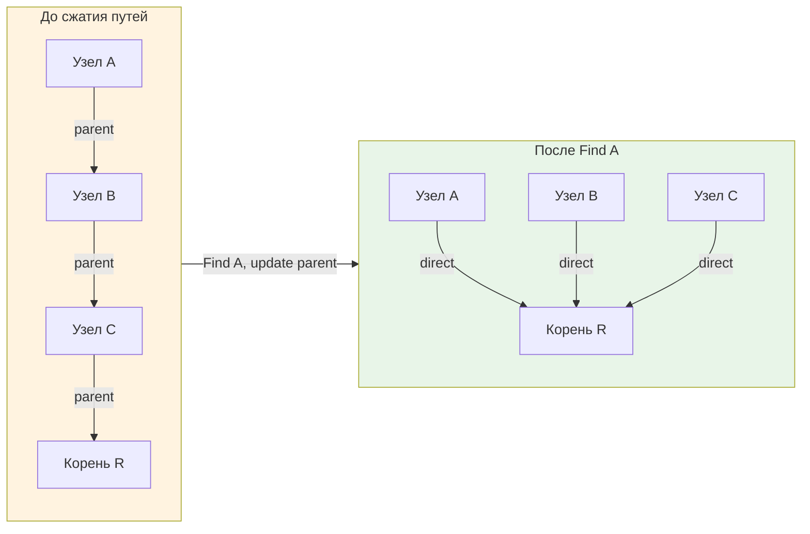
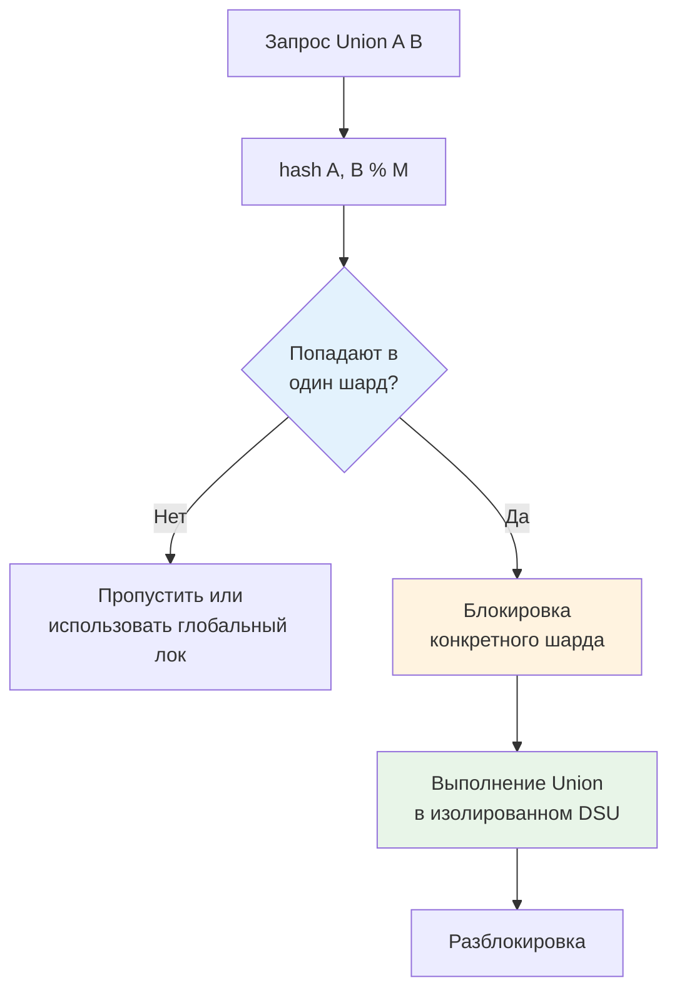

## Введение: от теории графов к динамической связности

Disjoint Set Union (DSU), или Union-Find, часто воспринимается исключительно как инструмент для олимпиадного программирования. В реальности высоконагруженного бэкенда это фундаментальная структура для управления **динамическими множествами и связностью**. Она применяется в:
*   **Распределённых системах**: отслеживание связности кластерных узлов, fallback-маршрутизация при сетевых партициях.
*   **Базах данных и транзакциях**: анализ зависимостей блокировок, обнаружение циклов в графах ожидания (deadlock detection).
*   **Аналитике и графах**: кластеризация пользователей, построение связных компонентов в социальных графах или рекомендательных движках.
*   **Инфраструктуре**: управление группами ресурсов, динамическое объединение зон доступности.

Главная инженерная ценность DSU — способность отвечать на вопрос «принадлежат ли два элемента одному множеству?» и объединять множества за **практически константное время** `O(α(n))`, где `α` — обратная функция Аккермана. Для любого мыслимого объёма данных во Вселенной `α(n) ≤ 4`. Это делает DSU одной из самых эффективных структур по асимптотике, но её реальная производительность напрямую зависит от механики работы с памятью и паттернов доступа в Go.

> [!tip] Собеседование
> **Вопрос:** «Почему DSU с оптимизациями имеет сложность O(α(n)), а не O(1)? И почему на практике мы считаем это константой?»
> **Ответ:** Обратная функция Аккермана растёт настолько медленно, что для `n = 10^100` она равна 5. Математически это не строгая O(1), так как зависит от глубины рекурсии при сжатии путей. Но для любых инженерных ограничений (до `10^18` элементов) она ведёт себя как константа. В бенчмарках и production-метриках DSU всегда показывает O(1) латентность после первой волны сжатия путей.

## 1. Алгоритмическое ядро: сжатие путей и объединение по рангу

Без оптимизаций DSU вырождается в дерево глубины `O(n)`, где `Find` работает за линейное время. Две оптимизации превращают его в амортизированный O(1) инструмент.

### Path Compression (Сжатие путей)
Во время выполнения `Find(x)` мы рекурсивно поднимаемся до корня. При возврате мы перенаправляем указатель каждого посещённого узла напрямую на корень. Дерево становится плоским. Последующие запросы к этим узлам выполняются за O(1).

### Union by Rank/Size (Объединение по рангу или размеру)
При слиянии двух деревьев мы делаем корень меньшего (по высоте или количеству узлов) дочерним к корню большего. Это ограничивает рост высоты дерева логарифмом, а в сочетании с path compression даёт итоговую амортизированную сложность.

В Go предпочтительнее использовать **Union by Size**, так как размер множества часто нужен бизнес-логике (например, для определения доминирующего кластера), а ранг требует отдельного массива без дополнительной семантики.



## 2. Production-реализация на Go 1.21+

Указательная реализация `type Node struct { Parent *Node; Size int }` в Go считается антипаттерном для DSU. Миллионы узлов в случайных участках кучи уничтожают кэш-локальность и создают катастрофическое давление на [[7. Глубокий Go (Внутреннее устройство)|сборщик мусора]]. Production-стандарт — **два компактных слайса**: `parent []int` и `size []int`. Индексы слайсов выступают идентификаторами узлов.

```go
package dsu

import "errors"

// DSU реализует структуру непересекающихся множеств.
// Оптимизирована для Go: использует плотные массивы и Union by Size.
type DSU struct {
	parent []int
	size   []int
	n      int
}

// New создаёт DSU для n элементов. Элементы пронумерованы от 0 до n-1.
func New(n int) (*DSU, error) {
	if n <= 0 {
		return nil, errors.New("dsu: size must be positive")
	}
	
	d := &DSU{
		parent: make([]int, n),
		size:   make([]int, n),
		n:      n,
	}
	
	// Инициализация: каждый элемент сам себе корень
	for i := range d.parent {
		d.parent[i] = i
		d.size[i] = 1
	}
	
	return d, nil
}

// Find возвращает идентификатор представителя множества для элемента x.
// Применяет Path Compression. Сложность O(α(n)).
func (d *DSU) Find(x int) (int, error) {
	if x < 0 || x >= d.n {
		return 0, errors.New("dsu: index out of range")
	}
	
	root := x
	// Находим корень
	for d.parent[root] != root {
		root = d.parent[root]
	}
	
	// Path Compression: поднимаем все узлы на пути к корню
	for x != root {
		next := d.parent[x]
		d.parent[x] = root
		x = next
	}
	
	return root, nil
}

// Union объединяет множества, содержащие x и y.
// Возвращает true, если объединение произошло, false если уже в одном множестве.
func (d *DSU) Union(x, y int) (bool, error) {
	rootX, err := d.Find(x)
	if err != nil {
		return false, err
	}
	rootY, err := d.Find(y)
	if err != nil {
		return false, err
	}
	
	if rootX == rootY {
		return false, nil
	}
	
	// Union by Size: меньшее дерево прикрепляем к большему
	if d.size[rootX] < d.size[rootY] {
		rootX, rootY = rootY, rootX
	}
	
	d.parent[rootY] = rootX
	d.size[rootX] += d.size[rootY]
	
	return true, nil
}
```

Итеративная реализация `Find` предпочтительнее рекурсивной: она не расходует стек, не создаёт замыканий и компилируется в эффективный машинный код без overhead на frame allocation.

## 3. Mechanical Sympathy: кэш, GC и рантайм

Поведение DSU на современном CPU и в Go-рантайме сильно отличается от теоретических схем из учебников.

### Пространственная локальность и кэш-линии
Массивы `parent` и `size` лежат в непрерывных блоках RAM. При `Find` происходит последовательный доступ `parent[x]`, `parent[parent[x]]`. После первых вызовов срабатывает **path compression**, и последующие запросы попадают в первые кэш-линии L1. Для `n=10^6` массив занимает ~4 МБ (`int32`) или ~8 МБ (`int` на amd64), что полностью помещается в L3 кэш типичного серверного процессора. CPU аппаратный префетчинг успешно предсказывает паттерн чтения, минимизируя cache miss.

### Сборка мусора и аллокации
При создании `New(n)` происходит **две крупные аллокации** в куче. Компилятор Go видит, что слайсы живут долго, и помещает их в кучу. Однако это плюс, а не минус:
* GC видит два больших непрерывных span'а. Фаза `mark` проходит по ним за счёт векторизованных инструкций, проверяя указатели (которых здесь нет, только `int`).
* Нулевое дробление памяти. Нет миллионов мелких объектов, которые фрагментируют кучу и увеличивают время `STW`.
* Если DSU создаётся в handler'е HTTP-запроса и возвращается наружу, `Escape Analysis` честно пометит её в кучу. Для hot-path сервисов используйте `sync.Pool` для переиспользования экземпляров DSU фиксированного размера.

> [!info] Под капотом
> **Почему int, а не uint?**
> На amd64 `int` и `uint` имеют одинаковый размер (8 байт). Однако операции сравнения `x < 0` для `int` компилятор транслирует в более эффективные signed-сравнения. Кроме того, использование `int` избавляет от кастов при работе с `len(slice)` и ошибками bounds check. В бэкенде экономия 1 байта на индекс не оправдывает сложность работы с unsigned.

## 4. Конкурентность в Go: шардирование против мьютексов

DSU по своей природе изменяет состояние. Прямое оборачивание `Find/Union` в `sync.Mutex` создаёт сериализацию всех операций. При `>10k RPS` мьютекс становится точкой отказа, горутины уходят в `futex`-парковку, p99 латентность взлетает.

**Архитектурные решения для многопоточного бэкенда:**
1. **Sharded DSU**: Разбиваем диапазон `[0, n)` на `M` шардов. Каждый шард имеет свой экземпляр `DSU` и свой `sync.RWMutex`. Запрос маршрутизируется по `hash(id) % M`. Снижает contention в `M` раз. Подходит, если операции `Union` происходят только внутри логических групп.
2. **Read-Only Snapshots**: Если `Union` редкие, а `Find` частые, используйте copy-on-write. При изменении создаётся новая копия структуры, старые читатели продолжают работать с предыдущей версией. В Go это реализуется через `atomic.Pointer[DSU]`. Потребляет больше памяти, но даёт lock-free чтение.
3. **Атомики для Parent?**: Теоретически можно использовать `atomic.Int32` для `parent`. Но `Find` требует чтения двух указателей и CAS-обновления, что приводит к livelock при высокой конкуренции. На практике шардирование всегда выигрывает по throughput.



> [!warning] Ловушка / Gotcha
> **Cross-Shard Union**
> Шардирование ломает глобальную связность. Если вам нужно объединять элементы из разных шардов, DSU не подходит. Для глобальных графов связности используйте распределённые алгоритмы (Gossip, Raft) или переносите вычисления в БД с рекурсивными CTE. Никогда не пытайтесь синхронизировать шарды DSU мьютексами — это deadlock-ready архитектура.

## 5. Ловушки и вопросы с собеседований

> [!tip] Собеседование
> **Вопрос 1:** «Что будет, если использовать DSU без сжатия путей и без union by rank?»
> **Ответ:** Дерево выродится в список. `Find` станет O(n), а последовательность из n `Union` превратится в O(n²). В бэкенде это проявится как постепенное падение throughput и рост latency при масштабировании данных.
> 
> **Вопрос 2:** «Почему в Go `Find` реализован итеративно, а не рекурсивно, как в большинстве учебников?»
> **Ответ:** Рекурсия тратит стек. Глубина до сжатия может быть O(n), что на Go с лимитом стека (изначально 2 КБ) вызовет stack growth или панику. Итерация работает на куче/регистрах, предсказуема по памяти и компилируется в tight loop без накладных расходов на frame allocation.
> 
> **Вопрос 3:** «Как проверить, принадлежат ли два элемента одному множеству, за O(1)?»
> **Ответ:** После вызова `Find(x)` и `Find(y)` достаточно сравнить их корни. Если `Find(x) == Find(y)`, элементы в одном множестве. Сложность определяется `Find`, то есть O(α(n)), что на практике O(1).
> 
> **Вопрос 4:** «Сравните DSU и [[11. Графы/1. Представление графов|граф смежности]] для поиска связных компонентов.»
> **Ответ:** Граф смежности требует обхода (BFS/DFS) за O(V+E) и не поддерживает динамическое добавление рёбер без пересчёта. DSU инкрементален: добавляем ребро `Union(u, v)` за O(α(n)), проверяем связность мгновенно. Для статического графа лучше BFS/DFS, для динамического потока соединений — DSU.

## Итог

* **DSU** — оптимальная структура для инкрементального управления динамическими множествами и проверки связности.
* В Go реализуйте DSU через **плотные слайсы `[]int`**, избегая указательных узлов. Это даёт предсказуемую работу с кэшем, минимальное давление на GC и отсутствие фрагментации.
* **Итеративный `Find` с path compression** и **union by size** гарантируют амортизированную сложность O(α(n)), что в production метриках равносильно O(1).
* **Конкурентность** достигается через шардирование по хешу идентификатора или read-only snapshots. Глобальные мьютексы убивают пропускную способность.
* **Ограничения**: DSU не поддерживает разделение множеств (`Split`), удаление элементов или кросс-шардовые объединения без полной перестройки.

Понимание DSU закрывает задачи на динамическую связность и группировку. Однако в бэкенде часто требуется структура, которая сочетает упорядоченность массива с быстротой вставки/удаления связного списка, поддерживая логарифмический поиск и диапазонные запросы. В следующей статье мы разберём структуру, которая отказывается от балансировки деревьев в пользу вероятностных указателей и идеально ложится на lock-free архитектуры и распределённые кэши.

[[5. Skip list]]