## Введение: Вероятностная альтернатива сбалансированным деревьям

В мире высоконагруженных систем сбалансированные деревья поиска (AVL, красно-черные, B-деревья) долгое время считались безальтернативным стандартом для индексации и поддержания упорядоченных данных. Однако их слабое место — сложность реализации балансировки (вращения, перекраска узлов) и, что критичнее для бэкенда, **сложность обеспечения конкурентности**. Каждое изменение структуры требует блокировки больших поддеревьев или использования сложных lock-free протоколов, что в многопоточных средах ведёт к contention и росту латентности p99.

Skip List (Список с пропусками) решает эту проблему через вероятностную балансировку. Вместо детерминированных правил вращения, высота каждого узла определяется случайно по геометрическому распределению. В среднем это даёт те же `O(log n)` на поиск, вставку и удаление, что и у красно-черных деревьев, но с радикально более простой логикой и нативной поддержкой распараллеливания операций.

Именно поэтому Skip List стал индустриальным стандартом там, где важна высокая пропускная способность при конкурентных записях: `Redis` (сортированные множества ZSET), `LevelDB`/`RocksDB` (memtable), `ConcurrentSkipListMap` в Java, и распределённые ключ-значение хранилища в экосистеме Go.

> [!tip] Собеседование
> **Вопрос:** «Почему в Redis для Sorted Sets используется Skip List, а не B-дерево или хеш-таблица?»
> **Ответ:** Хеш-таблица даёт O(1) по ключу, но не поддерживает диапазонные запросы и ранжирование. B-дерево оптимизировано под дисковые страницы, а Redis работает в RAM. Skip List занимает меньше памяти, чем полноценное красно-черное дерево, и критически важно: его уровни позволяют эффективно выполнять операции `ZRANGEBYSCORE` и `ZREM` без полной блокировки структуры. Кроме того, реализация Skip List проще, что уменьшает поверхность багов в ядре БД.

## 1. Архитектура экспресс-полос и геометрическое распределение

Skip List состоит из нескольких уровней связанных списков. Нижний уровень (`level 0`) содержит все элементы в отсортированном порядке. Каждый последующий уровень `i` является подмножеством уровня `i-1`, где каждый элемент переходит на следующий уровень с фиксированной вероятностью `p` (обычно `0.5`).

Поиск начинается с верхнего уровня. Алгоритм движется вправо, пока следующий элемент не окажется больше искомого. Затем спускается на уровень ниже и повторяет процесс. Это создаёт эффект «экспресс-полос»: верхние уровни быстро отсекают большие диапазоны, нижние — уточняют позицию.

```mermaid
flowchart LR
    L3["Level 3<br>head -> 15"] -->|down| L2_1["Level 2<br>head -> 15 -> 25"]
    L2_1 -->|down| L2_2["Level 1<br>head -> 10 -> 15 -> 25 -> 30"]
    L2_2 -->|down| L2_3["Level 0<br>head -> 5 -> 10 -> 15 -> 25 -> 30 -> 40"]
    
    L2_3 -->|search 25| N1["Спускаемся с Level 3"]
    N1 --> N2["Level 2: пропускаем < 25"]
    N2 --> N3["Level 1: уточняем позицию"]
    N3 --> N4["Найдено за 4 шага вместо 6"]
    
    style L3 fill:#e3f2fd
    style L2_1 fill:#e0f7fa
    style L2_2 fill:#fff3e0
    style L2_3 fill:#f3e5f5
```



Высота нового узла генерируется бросанием «монеты» до первого выпадения орла. Математически ожидаемое число уровней для узла равно `1 / (1-p)`. При `p=0.5` средний уровень равен 2, а вероятность достижения высоты 20 составляет `2^{-20} ≈ 10^{-6}`, что гарантирует отсутствие аномально высоких узлов в production-нагрузке.

## 2. Production-реализация на Go 1.21+

До появления дженериков Skip List в Go часто реализовался через `interface{}` и `type assertion`, что создавало скрытые аллокации и скрывало ошибки типов. С Go 1.21+ мы можем написать строго типизированную, zero-overhead версию.

```go
package skiplist

import (
	"math/rand"
	"sync"
)

const (
	maxLevel = 32
	p        = 0.5
)

// Node представляет узел Skip List.
type Node[T comparable] struct {
	key     T
	value   any
	forward []*Node[T] // Массив указателей на следующие узлы для каждого уровня
}

// SkipList реализует упорядоченный контейнер с O log n операциями.
type SkipList[T comparable] struct {
	header *Node[T]
	level  int
	mu     sync.RWMutex // Для thread-safety в базовом варианте
}

// New создаёт пустой Skip List.
func New[T comparable]() *SkipList[T] {
	header := &Node[T]{
		forward: make([]*Node[T], maxLevel),
	}
	return &SkipList[T]{header: header}
}

// Search ищет элемент по ключу за O log n ожидаемое время.
func (sl *SkipList[T]) Search(key T) (any, bool) {
	sl.mu.RLock()
	defer sl.mu.RUnlock()

	current := sl.header
	for i := sl.level - 1; i >= 0; i-- {
		for current.forward[i] != nil && less(current.forward[i].key, key) {
			current = current.forward[i]
		}
	}
	next := current.forward[0]
	if next != nil && next.key == key {
		return next.value, true
	}
	return nil, false
}

// Insert добавляет пару ключ-значение за O log n ожидаемое время.
func (sl *SkipList[T]) Insert(key T, value any) {
	sl.mu.Lock()
	defer sl.mu.Unlock()

	update := make([]*Node[T], maxLevel)
	current := sl.header

	for i := sl.level - 1; i >= 0; i-- {
		for current.forward[i] != nil && less(current.forward[i].key, key) {
			current = current.forward[i]
		}
		update[i] = current
	}

	if next := current.forward[0]; next != nil && next.key == key {
		next.value = value // Обновление существующего
		return
	}

	// Генерация случайной высоты
	randLevel := 1
	for rand.Float64() < p && randLevel < maxLevel {
		randLevel++
	}

	if randLevel > sl.level {
		for i := sl.level; i < randLevel; i++ {
			update[i] = sl.header
		}
		sl.level = randLevel
	}

	newNode := &Node[T]{
		key:     key,
		value:   value,
		forward: make([]*Node[T], randLevel),
	}

	for i := 0; i < randLevel; i++ {
		newNode.forward[i] = update[i].forward[i]
		update[i].forward[i] = newNode
	}
}
```

Ключевые инженерные решения:
* **`less` функция**: Для `comparable` типов в Go можно использовать `<`, но для универсальности часто передаётся замыкание. В примере используется встроенное сравнение для простоты.
* **`update` массив**: Хранит последний посещённый узел на каждом уровне. Позволяет вставить новый элемент за один проход, не перестраивая всю структуру.
* **`maxLevel = 32`**: При `p=0.5` покрывает `2^{32} ≈ 4 млрд` элементов. Фиксированный размер массива `forward` упрощает аллокацию и избегает динамического `make` внутри hot-path.

## 3. Mechanical Sympathy: память, кэш и указатели

Skip List — структура, где инженерные компромиссы становятся очевидны при взгляде на железо.

### Память и указательный оверхед
Каждый узел содержит слайс `forward []*Node[T]`. Даже при среднем уровне 2, каждый узел аллоцирует `32 * 8 = 256 байт` для указателей на amd64, плюс заголовок слайса (24 байта), плюс сама структура узла. Это **огромный** footprint. В Redis это оптимизировано через inline-массивы фиксированного размера внутри узла, минуя отдельную аллокацию слайса. В Go для production стоит заменить `[]*Node[T]` на `[maxLevel]*Node[T]` или использовать пул `sync.Pool` для переиспользования узлов.

```go
// Оптимизация для production: фиксированный массив вместо слайса
type Node[T comparable] struct {
	key     T
	value   any
	level   int
	forward [maxLevel]*Node[T] // Избегаем аллокации slice header
}
```

### Cache Locality и Pointer Chasing
В отличие от массива, Skip List прыгает по случайным адресам кучи. Каждый `current = current.forward[i]` — это разыменование указателя. CPU не может эффективно предзагружать данные, что приводит к частым cache miss. Однако благодаря последовательному проходу вправо на каждом уровне, локальность лучше, чем в AVL-дереве, где обход хаотичен. В Go-рантайме это означает:
* Больше работы для [[7. Глубокий Go (Внутреннее устройство)|сборщика мусора]]: GC должен пройти по всем `forward` указателям каждого узла.
* При высоких RPS рекомендуется использовать `sync.Pool` для узлов, чтобы они чаще попадали в «тёплые» страницы памяти и снижали fragmentation.

> [!info] Под капотом
> **Escape Analysis и аллокации**
> Создание `newNode := &Node[T]{...}` внутри `Insert` гарантированно утекает в кучу. Компилятор Go не может разместить его на стеке, так как ссылка сохраняется в глобальной структуре. При 100k RPS это 100k мелких аллокаций/сек. В Go 1.21+ с `GOEXPERIMENT=noframes` и оптимизированным аллокатором это приемлемо, но для low-latency систем лучше заранее аллоцировать узлы и использовать atomic списки.

## 4. Конкурентность: от fine-grained locks к lock-free

Главное преимущество Skip List раскрывается в многопоточной среде. В сбалансированных деревьях изменение одного узла может потребовать вращения корня или перекраски ветки, что вынуждает блокировать большие фрагменты структуры. В Skip List изменение затрагивает только локальные указатели на пути поиска.

### Fine-Grained Locking
Вместо одного `sync.RWMutex` на всю структуру, можно использовать массив мьютексов `locks[maxLevel]`. При поиске/вставке блокируется только уровень, на котором происходит модификация. Это снижает contention на порядки. Однако требует аккуратного протокола блокировки (обычно сверху вниз), чтобы избежать deadlock.

### Lock-Free реализации
Алгоритм Фразера (Fraser's Lock-Free Skip List) использует CAS (Compare-And-Swap) операции для атомарной замены указателей. В Go это реализуется через `sync/atomic` и `unsafe.Pointer`. Горутина читает текущий указатель, вычисляет новое значение и пытается атомарно заменить старое через `atomic.CompareAndSwapPointer`. Если другая горутина успела изменить указатель, операция повторяется (spin-loop).

```go
// Упрощённый концепт CAS-обновления указателя
for {
    old := atomic.LoadPointer(&node.forward[i])
    // проверяем, что old всё ещё актуален
    if !atomic.CompareAndSwapPointer(&node.forward[i], old, unsafe.Pointer(newNode)) {
        continue // Retry
    }
    break
}
```

> [!warning] Ловушка / Gotcha
> **ABA Problem в lock-free структурах**
> Если горутина А читает указатель `P`, приостанавливается, горутина Б удаляет узел `P` и выделяет новый узел по тому же адресу памяти `P`, то CAS для А успешно выполнится, хотя структура изменилась. В Go это решается использованием версионирования (tagged pointers) или `sync.Pool`, который не освобождает память сразу в ОС. Для production чаще выбирают fine-grained locks, так как lock-free Skip List в Go требует `unsafe` и ручной работы с памятью, что повышает риск багов.

## 5. Ловушки production-разработки и собеседования

| Аспект | Skip List | RB / AVL Tree | Hash Map |
|--------|-----------|---------------|----------|
| **Поиск** | O log n ожидаемый | O log n гарантированный | O 1 |
| **Диапазонные запросы** | O log n + k | O log n + k | Не поддерживаются |
| **Память** | Высокая указательный оверхед | Средняя | Низкая |
| **Конкурентность** | Отличная fine-grained или lock-free | Сложная rotations | Отличная sharding |
| **Реализация** | Простая | Сложная балансировка | Стандартная |

> [!tip] Собеседование
> **Вопрос 1:** «Может ли Skip List выродиться в O(n)? Как это предотвратить в production?»
> **Ответ:** Да, при крайне неудачных случайных высотах все узлы окажутся на уровне 0. Вероятность этого экспоненциально мала. В production используют криптографически устойчивые PRNG или deterministic hashing от ключа для вычисления высоты, что гарантирует равномерное распределение независимо от паттерна вставки.
> 
> **Вопрос 2:** «Почему Go не включает Skip List в стандартную библиотеку?»
> **Ответ:** Философия Go: `container/list` и `container/heap` предоставляют примитивы, а не фреймворки. Skip List требует выбора между thread-safety, памятью и lock-free логикой в зависимости от домена. Стандартизация одного варианта заморозила бы API, тогда как индустрия использует кастомные реализации под конкретные SLA.
> 
> **Вопрос 3:** «Как реализовать удаление элемента без остановки всех читателей?»
> **Ответ:** Использовать логическое удаление: пометить узел флагом `deleted = true` и пропускать его при поиске. Физическое удаление выполнить асинхронно в фоновой горутине или во время следующей вставки, которая обновит указатели `forward`. Это даёт eventual consistency и нулевые блокировки на чтение.

## Итог

* **Skip List** — вероятностная структура, дающая ожидаемое `O(log n)` на все операции при радикально более простой реализации, чем у сбалансированных деревьев.
* В Go предпочтительна реализация с **фиксированным массивом указателей** `[maxLevel]*Node[T]` вместо слайса, чтобы избежать дополнительных аллокаций и оверхеда GC.
* **Конкурентность** — главное преимущество: fine-grained блокировки или lock-free CAS протоколы позволяют обслуживать сотни тысяч RPS с минимальным contention.
* **Mechanical Sympathy**: указательная природа ухудшает cache locality по сравнению с массивами, но остаётся лучше, чем у BST. Используйте `sync.Pool` для узлов и контролируйте `maxLevel`.
* **Применение в бэкенде**: in-memory индексы, кэши с ранжированием, распределённые конфигурации, метрики с временными окнами. Для статических или редко меняющихся данных предпочтительнее массивные структуры.

Понимание Skip List закрывает пробел между классическими деревьями и lock-free архитектурами. Но в распределённых системах часто требуется структура, которая объединяет упорядоченность BST с вероятностной балансировкой, при этом строго гарантируя высоту дерева через математические приоритеты, а не случайные числа. В следующей статье мы разберём гибрид бинарного дерева поиска и кучи, который используется в компиляторах, планировщиках и системах версионирования для детерминированного поддержания инварианта при любой последовательности операций.

[[6. Treap - декартово дерево]]