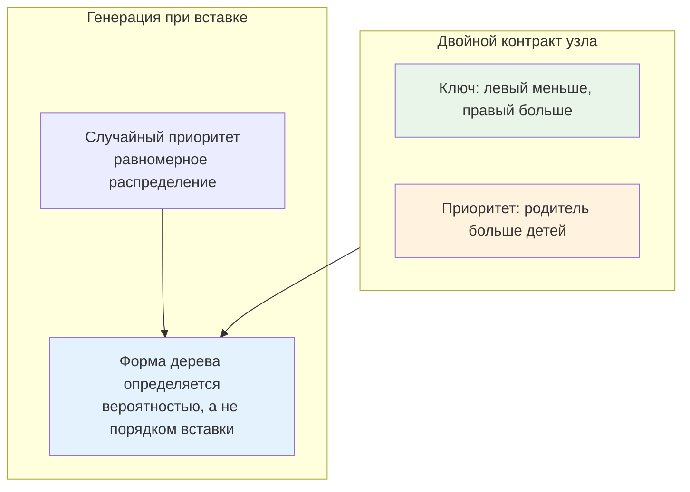

## Введение: Симбиоз BST и Heap

Treap (Tree + Heap) — это бинарное дерево поиска, в котором каждый узел обладает двумя полями: **ключом** и **случайным приоритетом**. Ключ поддерживает инвариант BST, а приоритет — инвариант кучи (обычно Max-Heap). В результате дерево остаётся сбалансированным не благодаря сложным алгоритмам вращений, как в AVL или красно-чёрных деревьях, а благодаря вероятностному распределению приоритетов.

Для бэкенд-разработчика Treap ценен двумя качествами:
1. **Простота реализации**: операции сводятся к рекурсивным `Split` и `Merge`, которые легче писать, отлаживать и поддерживать, чем `rotateLeft`/`rotateRight` с перекраской узлов.
2. **Мощь диапазонных операций**: Treap нативно поддерживает разделение и слияние подпоследовательностей за `O(log n)`, что делает его фундаментом для неявных деревьев отрезков, редакторов текста, систем версионирования и функциональных персистентных структур.

> [!tip] Собеседование
> **Вопрос:** «Почему в некоторых production-системах выбирают Treap вместо красно-чёрного дерева, если у RB-tree гарантированная O log n?»
> **Ответ:** RB-tree даёт жёсткий worst-case, но сложен в реализации и поддержке. Treap даёт ожидаемую O log n с вероятностью вырождения, экспоненциально малой на практике. Главный выигрыш Treap — простота добавления операций `Split` и `Merge`, которые критичны для функциональных структур данных, работы с диапазонами и построения lock-free copy-on-write версий без сложных блокировок поддеревьев.

### 1. Математические инварианты и вероятностная балансировка

Treap обязан соблюдать два строгих правила одновременно:
* **BST-инвариант**: для любого узла все ключи в левом поддереве меньше его ключа, все в правом — больше.
* **Heap-инвариант**: приоритет узла строго больше приоритетов его детей.

При вставке новому узлу генерируется случайный приоритет (обычно через `math/rand` или `crypto/rand`). После обычной вставки в BST структура может нарушить Heap-инвариант. В классических Treap это исправляется вращениями. Однако в современной реализации вращения полностью заменяются операциями `Split` и `Merge`, которые рекурсивно перестраивают дерево, автоматически восстанавливая оба инварианта.



Математически, если приоритеты выбираются независимо и равномерно, глубина Treap с вероятностью `1 - O(1/n)` не превышает `c * log₂ n`. Это делает его практически неотличимым от случайно сбалансированного BST, где поиск, вставка и удаление работают за ожидаемое `O(log n)`.

### 2. Операции Split и Merge: замена вращениям

Вместо явных вращений, Treap использует две примитивные рекурсивные операции. Они составляют ядро структуры и позволяют реализовывать сложную логику в несколько строк.

* **`Split(root, key)`**: разделяет дерево на два: в левом все ключи `≤ key`, в правом — `> key`. Сохраняет структуру кучи по приоритетам.
* **`Merge(left, right)`**: объединяет два дерева, где все ключи левого меньше всех ключей правого. Выбирает корнем узел с большим приоритетом, рекурсивно сливая оставшиеся части.

Сложность обеих операций — `O(h) = O(log n)`, где `h` — высота дерева.

### 3. Production-реализация на Go 1.21+

Для бэкенда критически важна типобезопасность и контроль аллокаций. Используем дженерики, явную передачу компаратора и минимальный footprint узла.

```go
package treap

import "math/rand"

// Node представляет узел Treap.
// Использование указателей неизбежно для древовидной структуры,
// но мы минимизируем оверхед и избегаем интерфейсов в узлах.
type Node[K comparable, V any] struct {
	Key      K
	Value    V
	Priority int64
	Left     *Node[K, V]
	Right    *Node[K, V]
}

// Treap обёртка для хранения корня и функции сравнения ключей.
type Treap[K comparable, V any] struct {
	root  *Node[K, V]
	less  func(a, b K) bool
	rand  *rand.Rand
}

// New создаёт пустой Treap.
func New[K comparable, V any](less func(a, b K) bool) *Treap[K, V] {
	return &Treap[K, V]{
		less: less,
		rand: rand.New(rand.NewSource(rand.Int63())),
	}
}

// Insert добавляет элемент. При совпадении ключа значение перезаписывается.
func (t *Treap[K, V]) Insert(key K, value V) {
	left, right, found := splitByKey(t.root, key, t.less)
	if found != nil {
		found.Value = value
		// Восстанавливаем дерево
		t.root = merge(merge(left, found), right)
		return
	}
	newNode := &Node[K, V]{
		Key:      key,
		Value:    value,
		Priority: t.rand.Int63(),
	}
	t.root = merge(merge(left, newNode), right)
}

// splitByKey разделяет дерево на три части: < key, == key, > key.
func splitByKey[K comparable, V any](root *Node[K, V], key K, less func(a, b K) bool) (*Node[K, V], *Node[K, V], *Node[K, V]) {
	if root == nil {
		return nil, nil, nil
	}
	if root.Key == key {
		l := root.Left
		r := root.Right
		root.Left = nil
		root.Right = nil
		return l, root, r
	}
	if less(key, root.Key) {
		l, eq, r := splitByKey(root.Left, key, less)
		root.Left = r
		return l, eq, root
	}
	l, eq, r := splitByKey(root.Right, key, less)
	root.Right = l
	return root, eq, r
}

// merge объединяет два дерева, где все ключи left меньше всех ключей right.
func merge[K comparable, V any](left, right *Node[K, V]) *Node[K, V] {
	if left == nil {
		return right
	}
	if right == nil {
		return left
	}
	if left.Priority > right.Priority {
		left.Right = merge(left.Right, right)
		return left
	}
	right.Left = merge(left, right.Left)
	return right
}
```

Инженерные решения:
* **`Priority int64`**: использование 64-битного приоритета сводит вероятность коллизий к нулю. `math/rand.Int63()` генерирует положительные числа, что упрощает сравнение.
* **Явный компаратор `less`**: позволяет использовать любые кастомные типы без привязки к `comparable` операторам, сохраняя гибкость для сложных бизнес-объектов.
* **Разделение на 3 части в `Insert`**: упрощает логику перезаписи существующего ключа без дополнительной проверки после слияния.

### 4. Mechanical Sympathy: указатели, кэш и GC

Treap — структура, где теория встречается с суровой реальностью рантайма Go. Указательная природа дерева создаёт специфические накладные расходы.

* **Cache Miss и Pointer Chasing**: Каждый переход `root = root.Left` разыменовывает указатель в случайном месте кучи. Для дерева высотой 30 это до 30 потенциальных cache miss. В contrast, массивные структуры (`slice`, `SegmentTree`) выигрывают за счёт аппаратного префетчинга. В бэкенде Treap оправдан, когда важны `Split`/`Merge` или работа с диапазоном, а не чистая скорость точечного поиска.
* **Давление на GC**: Каждый узел — отдельная аллокация. При 100k RPS на вставку это 100k объектов/сек в куче. Триколорный маркер Go будет вынужден обходить все `Left`/`Right` указатели в фазе `mark`. Это увеличивает время пауз `STW`.
* **Оптимизация через Arena и Pool**: В production можно использовать `arena` экспериментальные пакеты Go или кастомный `sync.Pool` для узлов. Выделение пула блоков памяти под узлы резко снижает fragmentation и ускоряет GC, так как сборщик видит крупные непрерывные span'ы.

> [!info] Под капотом
> **Выравнивание структуры узла**
> На `amd64` размер `Node[K,V]` зависит от типов. Указатели `Left`/`Right` занимают по 8 байт. `Priority` — 8 байт. Компилятор выравнивает поля, чтобы избежать cross-boundary доступа. Если `V` маленький (например `int`), он помещается inline. Если `V` — слайс или интерфейс, он добавит 24-48 байт оверхеда. Всегда группируйте поля от больших к маленьким для минимизации padding.

### 5. Неявный Treap: работа с последовательностями

Классический Treap хранит данные по ключу. **Неявный Treap** (Implicit Treap) использует в качестве ключа **индекс в последовательности**, который не хранится явно, а вычисляется как `size(left_subtree)`. Это превращает дерево в динамический массив с операциями вставки, удаления и реверса диапазона за `O(log n)`.

Каждый узел хранит поле `Size`. При любых изменениях вызывается `updateSize(node)`, пересчитывающее `1 + size(Left) + size(Right)`. Операция `Split` теперь принимает не ключ, а `count` — количество элементов для разделения слева.

```go
// Пример: реверс подотрезка [l, r] в неявном Treap
func Reverse(t *Treap, l, r int) {
	left, mid, right := SplitByCount(t.root, l-1)
	midL, midR := SplitByCount(mid, r-l+1)
	midL = applyReverse(midL) // Ленивая коррекция: ставим флаг reverse
	mid = merge(midL, midR)
	t.root = merge(merge(left, mid), right)
}
```

Этот паттерн широко используется в текстовых редакторах, системах логирования с буферизацией, и при реализации отложенных (lazy) диапазонных обновлений, где требуется сложная логика без полного пересчёта данных.

### 6. Конкурентность и архитектурные ограничения

Treap **не потокобезопасен**. Рекурсивная природа `Split`/`Merge` делает fine-grained блокировки крайне сложными и подверженными deadlock. В Go для многопоточного доступа применяют:

1. **Copy-on-Write (Persistent Treap)**: При изменении создаются новые узлы только на пути модификации. Старые версии остаются нетронутыми. Чтение полностью lock-free через `atomic.Pointer`. Платой является рост потребления памяти, но в бэкенде с частыми чтениями и редкими записями это оптимальный trade-off.
2. **Sharding по диапазонам ключей**: Разбиение ключей на N непересекающихся интервалов, каждый со своим Treap и `sync.RWMutex`. Подходит для шардированных кэшей или метрик.
3. **Batched Updates**: Сбор изменений в `chan` и применение их одной воркер-горутиной. Сериализует записи, но даёт lock-free чтение.

> [!warning] Ловушка / Gotcha
> **Ленивые флаги и утечка памяти в Persistent-реализациях**
> При использовании Copy-on-Wise без ленивой коррекции каждый `Insert` создаёт путь новых узлов. Если старые версии не освобождаются (например, хранятся в сессии или кэше), память растёт линейно. Обязательно настраивайте TTL на старые версии или используйте `sync.Pool` для узлов, чтобы возвращать память в рантайм предсказуемо.

### 7. Ловушки и вопросы с собеседований

> [!tip] Собеседование
> **Вопрос 1:** «Может ли Treap выродиться в список? Какова вероятность?»
> **Ответ:** Да, если все приоритеты окажутся отсортированы. Вероятность этого равна `1/n!`, что для `n=1000` меньше вероятности квантового туннелирования. На практике вырождение невозможно при честном генераторе случайных чисел.
> 
> **Вопрос 2:** «Зачем хранить размер поддерева, если это неявный Treap?»
> **Ответ:** Размер поддерева позволяет за O log n находить элемент по индексу, выполнять Split по количеству и поддерживать актуальные границы диапазонов. Без него операции становятся линейными, и Treap теряет смысл как структура для последовательностей.
> 
> **Вопрос 3:** «Сравните Treap и [[1. Segment tree - дерево отрезков]] для диапазонных запросов.»
> **Ответ:** Segment Tree лучше для статических или редко меняющихся данных, где нужны быстрые агрегации. Treap выигрывает при динамических вставках/удалениях в середину, реверсе подотрезков и необходимости функциональных (персистентных) версий. Segment Tree требует O n памяти и дополнения до степени двойки, Treap — ровно O n узлов, но с указательным оверхедом.
> 
> **Вопрос 4:** «Как реализовать Delete в Treap без явных вращений?»
> **Ответ:** Найти узел через Split, получить три дерева `left, target, right`. Удалить `target` (или просто не включать в результат). Объединить `left` и `right` через `Merge`. Восстановление Heap-инварианта произойдёт автоматически за счёт выбора корня с максимальным приоритетом при слиянии.

## Итог

* **Treap** — это BST + Heap, где случайные приоритеты обеспечивают вероятностную балансировку без сложных вращений.
* **Split и Merge** заменяют классические `rotate`, делая структуру идеальной для диапазонных операций, реверса подмассивов и функционального программирования.
* В Go реализация требует контроля аллокаций: указательная природа ухудшает cache locality и увеличивает нагрузку на [[7. Глубокий Go (Внутреннее устройство)|GC]]. Для high-load используйте `sync.Pool` или арены памяти.
* **Неявный Treap** превращает дерево в динамический массив с O log n операциями вставки, удаления и реверса по индексу, используя размер левого поддерева как виртуальный ключ.
* **Конкурентность** достигается через Copy-on-Write паттерн и атомарные указатели, либо шардирование. Глобальные мьютексы не рекомендуются из-за рекурсивной природы операций.
* **Выбор в продакшене**: Treap берёт не raw-скоростью, а гибкостью, простотой поддержки и возможностью построения персистентных структур. Для чистого поиска по ключу предпочтительнее `map` или [[5. Внутреннее устройство map в Go]], для диапазонных сумм — [[1. Segment tree - дерево отрезков]].

Разобравшись с деревьями, кучами и вероятностными структурами, мы переходим к одному из самых запрашиваемых паттернов в проектировании бэкенда: эффективному кэшированию с предсказуемым вытеснением. В следующей статье мы детально разберём, как реализовать кэш, который гарантирует доступ к недавно используемым данным за O(1), управляет памятью в условиях жёстких лимитов и интегрируется с [[16. Профилирование, отладка и производительность|sync.Pool]] для минимизации давления на GC.

[[7. LRU кэш]]