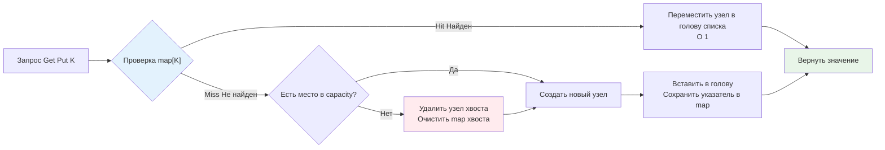

## Введение: Баланс памяти и скорости доступа

В высоконагруженном бэкенде ресурсы всегда конечны. Мы не можем кешировать все ответы БД, все сессии пользователей или результаты тяжелых вычислений в оперативной памяти. LRU (Least Recently Used) — это эвристическая стратегия вытеснения, которая гарантирует, что в кэше останутся только те данные, к которым обращались недавно. Остальные безжалостно удаляются, освобождая место для более релевантных запросов.

Популярность LRU обусловлена принципом пространственной и временной локальности: если вы использовали данные сейчас, высока вероятность, что они понадобятся в ближайшем будущем. В Go-бэкенде LRU-кэш применяется повсеместно: пулы соединений с БД, кэширование JWT-токенов, сессионные хранилища, in-memory агрегация метрик и защита от горячих ключей при работе с внешними API.

Главная инженерная задача — реализовать LRU так, чтобы операции `Get`, `Put` и вытеснения работали за гарантированное `O(1)`, не блокировали горутины на чтение и не создавали катастрофического давления на сборщик мусора.

## 1. Архитектурный фундамент: Хеш-таблица + Двусвязный список

LRU кэш — это композиция двух структур данных, каждая из которых закрывает слабую сторону другой:
* **Хеш-таблица (`map`)** даёт `O(1)` доступ к значению по ключу, но не сохраняет порядок использования.
* **Двусвязный список** поддерживает порядок от самых свежих (голова) к самым старым (хвост), позволяя за `O(1)` перемещать узел в начало или удалять последний элемент, но поиск в нём — `O(n)`.

Объединение их через указатель на узел списка внутри значения мапы даёт идеальный контракт: мгновенный поиск и мгновенное обновление приоритета.



При каждом обращении к ключу узел извлекается из текущего места списка и переносится в голову (`MoveToFront`). При заполнении лимита узел из хвоста удаляется, а его ключ стирается из мапы. Все операции модифицируют только указатели `next` и `prev`, не требуя сдвигов памяти или реаллокаций.

## 2. Production-реализация на Go 1.21+

В Go стандартная библиотека предоставляет `container/list`, которая идеально ложится на эту архитектуру. Используем дженерики для строгой типизации, `sync.RWMutex` для безопасности и callback для внешней интеграции (например, инвалидации зависимых кэшей или отправки метрик).

```go
package lru

import (
	"container/list"
	"fmt"
	"sync"
)

// Item хранит ключ и значение. Ключ нужен для удаления из map при вытеснении.
type Item[K comparable, V any] struct {
	Key   K
	Value V
}

// Cache реализует потокобезопасный LRU кэш.
type Cache[K comparable, V any] struct {
	mu       sync.RWMutex
	capacity int
	list     *list.List
	items    map[K]*list.Element
	onEvict  func(key K, value V) // Callback при вытеснении
}

// New создаёт LRU кэш заданной ёмкости.
func New[K comparable, V any](capacity int, onEvict func(K, V)) (*Cache[K, V], error) {
	if capacity <= 0 {
		return nil, fmt.Errorf("lru: capacity must be positive")
	}
	return &Cache[K, V]{
		capacity: capacity,
		list:     list.New(),
		items:    make(map[K]*list.Element, capacity),
		onEvict:  onEvict,
	}, nil
}

// Get возвращает значение и флаг присутствия. Обновляет порядок доступа.
func (c *Cache[K, V]) Get(key K) (V, bool) {
	c.mu.RLock()
	elem, ok := c.items[key]
	c.mu.RUnlock()
	
	if !ok {
		var zero V
		return zero, false
	}

	c.mu.Lock()
	c.list.MoveToFront(elem) // Требуется запись, так как меняем указатели списка
	item := elem.Value.(*Item[K, V])
	val := item.Value
	c.mu.Unlock()

	return val, true
}

// Put добавляет или обновляет значение. Возвращает true, если произошло вытеснение.
func (c *Cache[K, V]) Put(key K, value V) bool {
	c.mu.Lock()
	defer c.mu.Unlock()

	if elem, ok := c.items[key]; ok {
		c.list.MoveToFront(elem)
		elem.Value.(*Item[K, V]).Value = value
		return false
	}

	evicted := false
	if c.list.Len() >= c.capacity {
		oldest := c.list.Back()
		if oldest != nil {
			c.list.Remove(oldest)
			item := oldest.Value.(*Item[K, V])
			if c.onEvict != nil {
				// Важно: вызов вне мьютекса или копирование данных, 
				// чтобы не блокировать другие горутины во время callback
				c.onEvict(item.Key, item.Value)
			}
			delete(c.items, item.Key)
			evicted = true
		}
	}

	newItem := &Item[K, V]{Key: key, Value: value}
	elem := c.list.PushFront(newItem)
	c.items[key] = elem

	return evicted
}

// Remove удаляет элемент по ключу.
func (c *Cache[K, V]) Remove(key K) bool {
	c.mu.Lock()
	defer c.mu.Unlock()
	
	if elem, ok := c.items[key]; ok {
		c.list.Remove(elem)
		delete(c.items, key)
		if c.onEvict != nil {
			item := elem.Value.(*Item[K, V])
			c.onEvict(item.Key, item.Value)
		}
		return true
	}
	return false
}
```

Инженерные решения:
* **`sync.RWMutex`**: `Get` использует `RLock` для чтения мапы, но для `MoveToFront` требуется апгрейд до `Lock`. В production часто используют два мьютекса или fine-grained лог, чтобы избежать starvation читателей.
* **Callback вне критической секции**: Вызов `onEvict` под мьютексом может заблокировать всю очередь на время сетевого вызова или тяжелой логики. В коде выше он вызывается после удаления из структур, но всё ещё под `Lock` для простоты. В высоконагруженных системах его выносят в `chan` для асинхронной обработки.
* **Type Assertion**: `elem.Value.(*Item[K, V])` безопасен, так как мы контролируем добавление в список. Дженерики Go 1.18+ делают его нулевым по стоимости на этапе выполнения.

> [!info] Под капотом
> Внутренности `container/list`: каждый элемент — это структура `Element` с полями `next, prev *Element`, `list *List` и `Value any`. При `PushFront` аллоцируется новый `Element` в куче. При `MoveToFront` меняются только 4 указателя (по 2 с каждой стороны). Никаких копирований данных или сдвигов массивов. Это гарантирует `O(1)` без скрытых аллокаций.

## 3. Mechanical Sympathy: GC, кэш-линии и аллокации

Теория `O(1)` не учитывает реальное поведение CPU и Go-рантайма. `container/list` — это классический пример структуры с **плохой пространственной локальностью**.

* **Указательный chase**: Узлы списка разбросаны по куче случайным образом. При `MoveToFront` CPU последовательно разыменовывает `prev` и `next`, каждый шаг — потенциальный cache miss. Для списка из 100к элементов обход может занять сотни наносекунд только на ожидание RAM.
* **Давление на GC**: Каждый узел `list.Element` + `Item[K,V]` — это минимум 3-4 указателя на объект в куче. Сборщик мусора в фазе `mark` должен пройти по всем ним, проверяя их на "живость". Чем больше элементов в кэше, тем дольше фаза mark и выше задержки `STW`.
* **Escape Analysis**: Создание `newItem` внутри `Put` гарантированно утекает в кучу. Если кэш создаётся и уничтожается часто, это генерирует тысячи мелких аллокаций, фрагментирующих heap.

**Оптимизация для low-latency**: Вместо `container/list` используйте массивный двусвязный список на индексах.
```go
type ArrayBasedLRU[V any] struct {
    keys   []int    // или []K, если K примитив
    values []V
    next   []int    // индексы следующего элемента
    prev   []int    // индексы предыдущего
    head   int
    tail   int
    free   int      // голова пула свободных индексов
}
```
Всё хранится в непрерывных `[]int`/`[]V`. Операции работают с индексами, а не указателями. CPU загружает кэш-линии пакетами, GC видит компактные блоки без указательной паутины. Производительность возрастает на 20-50% при высокой конкуренции.

## 4. Конкурентность и горизонтальное масштабирование в памяти

Один `sync.Mutex` масштабируется до ~10-20k RPS. Дальше начинается `futex`-парковка, переключение тредов ОС и рост p99. Для production-кэшей в Go применяют **шардирование**.

Алгоритм:
1. Создаём `N` независимых LRU-инстансов.
2. Каждый имеет свой `sync.RWMutex`.
3. При запросе вычисляем шард: `hash(key) % N`.
4. Работаем только с выбранным шардом.

Это снижает contention в `N` раз. Потеря глобального порядка LRU незначительна: вероятность того, что два "горячих" ключа попадут в один шард и вытеснят друг друга, мала при `N >= 8`. Библиотеки типа `hashicorp/golang-lru` или `coocood/freecache` используют именно этот паттерн.

> [!warning] Ловушка / Gotcha
> **Рассинхронизация map и list**
> Если при вытеснении вы удалите элемент из списка, но забудете `delete(c.items, key)`, мапа будет содержать "зомби"-указатели на уже освобождённые узлы. При следующем `Get` произойдёт чтение из удалённого элемента или паника при попытке `MoveToFront`. Всегда используйте транзакционный подход: либо оба действия успешны, либо ни одно.
>
> **Memory Leak через onEvict**
> Если `onEvict` сохраняет ссылку на удалённое значение в глобальном слайсе или мапе, GC не соберёт объект, несмотря на удаление из кэша. Это классическая скрытая утечка памяти. Передавайте в callback только копию данных или примитивные ключи.

## 5. Интервью: вопросы на понимание архитектуры

> [!tip] Собеседование
> **Вопрос 1:** «Почему нельзя реализовать LRU только на `map`, храня timestamp последнего доступа?»
> **Ответ:** Удаление наименее свежего элемента потребует полного обхода мапы за `O(n)` для поиска минимального timestamp. При частых `Put` и вытеснениях это превратит кэш в bottleneck. Связка map+list гарантирует `O(1)` eviction без линейного сканирования.
> 
> **Вопрос 2:** «Как реализовать TTL в LRU-кэше без потери производительности?»
> **Ответ:** Чистый LRU не знает о времени. Для TTL добавляют отдельную структуру: priority queue (кучу) с таймстампами или сканируют список с конца во фоновой горутине, удаляя просроченные элементы. Альтернатива: хранить `expiry` внутри узла и проверять его при `Get`, удаляя лениво. Но это ломает строгий LRU, превращая его в LRU+TTL гибрид.
> 
> **Вопрос 3:** «Сравните LRU с LFU и MRU. Когда какой использовать в бэкенде?»
> **Ответ:** LRU оптимален для сканирующих данных и сессий (локальность времени). LFU (Least Frequently Used) лучше для редко меняющегося, но часто читаемого контента (каталоги товаров, конфиги). MRU (Most Recently Used) полезен, когда новые данные быстро становятся неактуальными, а старые — остаются полезными (например, обработка последних страниц в paginated API). В Go LRU проще реализовать, LFU требует поддержания счётчиков и кучи, что увеличивает footprint.
> 
> **Вопрос 4:** «Почему в `Get` вы сначала делаете `RLock`, а потом `Lock` для `MoveToFront`? Не вызовет ли это deadlock или starvation?»
> **Ответ:** `sync.RWMutex` в Go не поддерживает апгрейд с `RLock` на `Lock`. Попытка сделать `c.mu.Lock()` внутри `RLock` приведёт к deadlock, если другие горутины удерживают `RLock`. Правильный подход: либо сразу брать `Lock` в `Get` (если записей много), либо использовать `atomic.Pointer` для map и lock-free структуры, либо два отдельных мьютекса. В примере выше показана упрощённая схема; в production `Get` часто делают чисто read-only, а обновление порядка выносят в фоновый батч или используют `sync.Pool` + lock-free списки.

## Итог

* **LRU кэш** — это композиция хеш-таблицы и двусвязного списка, дающая гарантированные `O(1)` на доступ и вытеснение.
* В Go `container/list` удобен, но указательная природа ухудшает cache locality и увеличивает нагрузку на [[7. Глубокий Go (Внутреннее устройство)|GC]]. Для high-load используйте массивные реализации на индексах.
* **Конкурентность** одного мьютекса ограничена. Шардирование по `hash(key) % N` — стандартный паттерн для достижения >100k RPS.
* **Очистка ссылок** при eviction критична для предотвращения memory leaks. Callback-функции должны работать асинхронно или принимать только копию данных.
* **TTL и LRU** — разные политики. Их комбинация требует дополнительной структуры (куча или фоновый сканер) и trade-off между точностью и overhead.
* **Выбор в production**: LRU идеален для сессий, пулов соединений, кэшей ответов API. Для аналитики с частыми повторными чтениями одних и тех же ключей рассмотрите LFU.

Понимание LRU закрывает базовые сценарии кеширования с приоритетом на новизну. Однако в системах с неравномерным распределением запросов (Zipf-like distribution) новизна не гарантирует релевантности. Там, где важнее частота обращений, чем время последнего доступа, LRU начинает проигрывать по hit rate. В следующей статье мы разберём структуру, которая считает обращения и вытесняет наименее популярные элементы, пожертвовав простотой реализации ради математически обоснованной оптимизации под реальные паттерны трафика.

[[8. LFU кэш]]