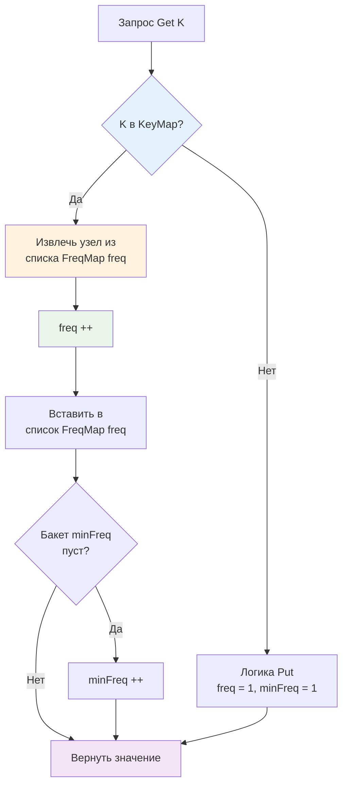

## Введение: Когда новизна уступает популярности

В предыдущей статье мы разобрали [[7. LRU кэш]], который отлично справляется с задачами, где важна временная локальность. Но в реальном трафике бэкенд-систем распределение запросов редко бывает равномерным. Оно подчиняется закону Ципфа: ~20% ключей генерируют ~80% нагрузки. В таких сценариях LRU начинает «зашумлять» кэш редкими, но массовыми запросами, вытесняя по-настоящему популярные данные, которые просто давно не запрашивались. 

LFU (Least Frequently Used) решает эту проблему радикально: он отслеживает не время последнего доступа, а **частоту обращений**. При заполнении лимита вытесняется элемент с наименьшим счётчиком. Это делает LFU незаменимым для кэширования статических каталогов товаров, конфигурационных метаданных, часто используемых SQL-планов, сессий долгоживущих API-клиентов и защиты от сканирующих ботов.

Главная инженерная сложность LFU заключается в противоречии: как поддерживать сортировку по частоте, не превращая операции `Get` и `Put` в `O(n log n)` или `O(n)`? Ответ кроется в композиции структур данных, дающей амортизированное `O(1)` для всех операций.

> [!tip] Собеседование
> **Вопрос:** «Почему для LFU нельзя просто использовать Min-Heap пар key-frequency?»
> **Ответ:** Куча даёт `O(1)` для peek минимума, но `O(n)` для поиска произвольного ключа при инкременте частоты. При каждом `Get` придётся обновлять приоритет в куче, что без обратной мапы `key->index` превращается в линейный поиск. Даже с индексной мапой `decreaseKey`/`increaseKey` требует `O(log n)` на `siftUp/siftDown`. При миллионах RPS логарифмический оверхед на каждой операции чтения неприемлем. LFU использует структуру частотных бакетов, чтобы обновлять частоту за `O(1)`.

### 1. Архитектурный фундамент: Двойная маппа и частотные бакеты

Классическая `O(1)` реализация LFU опирается на три компонента:
1. **`KeyMap`**: `map[K]*Node[K,V]` для мгновенного поиска узла.
2. **`FreqMap`**: `map[int]*list.List` где ключ — частота, а значение — двусвязный список узлов с этой частотой. Внутри бакета порядок определяется по времени добавления (LRU-тайбрейкер).
3. **`minFreq`**: целое число, указывающее на текущий минимальный счётчик. Обновляется только при пустоте бакета `minFreq`.

При `Get(key)`:
* Находим узел в `KeyMap`.
* Удаляем узел из списка `FreqMap[node.freq]`.
* Инкрементируем `node.freq`.
* Вставляем узел в список `FreqMap[node.freq]`.
* Если старый бакет `minFreq` стал пустым, инкрементируем `minFreq`.

При `Put(key, value)`:
* Если ключ существует, обновляем значение и частоту как в `Get`.
* Если новый, создаём узел с `freq = 1`, добавляем в оба мапы. `minFreq = 1`.
* Если `KeyMap` превысил capacity, удаляем хвостовой узел из `FreqMap[minFreq]`, очищаем `KeyMap`.



Эта архитектура гарантирует, что поиск, обновление частоты и вытеснение происходят за константное время. Двусвязные списки позволяют удалять и переносить узлы без сдвигов памяти, а мапы дают прямой доступ.

### 2. Production-реализация на Go 1.21+

Реализуем типобезопасный LFU с использованием стандартной библиотеки, корректной обработкой краевых условий и поддержкой таймстампов для отладки.

```go
package lfu

import (
	"container/list"
	"fmt"
	"sync"
	"time"
)

// node хранит данные ключа и метаинформацию для LFU
type node[K comparable, V any] struct {
	Key       K
	Value     V
	Freq      int
	CreatedAt time.Time
	listElem  *list.Element // ссылка на элемент в списке частоты
}

// Cache реализует LFU-кэш с O 1 операциями
type Cache[K comparable, V any] struct {
	mu       sync.RWMutex
	capacity int
	keyMap   map[K]*node[K, V]
	freqMap  map[int]*list.List
	minFreq  int
	onEvict  func(K, V)
}

// New создаёт LFU кэш
func New[K comparable, V any](capacity int, onEvict func(K, V)) (*Cache[K, V], error) {
	if capacity <= 0 {
		return nil, fmt.Errorf("lfu: capacity must be positive")
	}
	return &Cache[K, V]{
		capacity: capacity,
		keyMap:   make(map[K]*node[K, V], capacity),
		freqMap:  make(map[int]*list.List),
		minFreq:  1,
		onEvict:  onEvict,
	}, nil
}

// Get возвращает значение и инкрементирует частоту
func (c *Cache[K, V]) Get(key K) (V, bool) {
	c.mu.RLock()
	n, ok := c.keyMap[key]
	c.mu.RUnlock()
	if !ok {
		var zero V
		return zero, false
	}

	c.mu.Lock()
	c.moveNodeToNextFreq(n)
	val := n.Value
	c.mu.Unlock()
	return val, true
}

// Put добавляет или обновляет элемент
func (c *Cache[K, V]) Put(key K, value V) bool {
	c.mu.Lock()
	defer c.mu.Unlock()

	if n, ok := c.keyMap[key]; ok {
		n.Value = value
		c.moveNodeToNextFreq(n)
		return false
	}

	if len(c.keyMap) >= c.capacity {
		c.evict()
	}

	newNode := &node[K, V]{
		Key:       key,
		Value:     value,
		Freq:      1,
		CreatedAt: time.Now(),
	}
	c.addToList(newNode)
	c.keyMap[key] = newNode
	c.minFreq = 1
	return true
}

// moveNodeToNextFreq перемещает узел в бакет freq + 1
func (c *Cache[K, V]) moveNodeToNextFreq(n *node[K, V]) {
	c.removeFromList(n)
	n.Freq++
	c.addToList(n)

	// Если старый бакет стал пустым и это был minFreq, увеличиваем minFreq
	if freqList, ok := c.freqMap[n.Freq-1]; ok && freqList.Len() == 0 {
		delete(c.freqMap, n.Freq-1)
		if c.minFreq == n.Freq-1 {
			c.minFreq = n.Freq
		}
	}
}

// evict удаляет наименее часто используемый элемент
func (c *Cache[K, V]) evict() {
	freqList, ok := c.freqMap[c.minFreq]
	if !ok || freqList.Len() == 0 {
		return
	}
	
	oldest := freqList.Back()
	if oldest == nil {
		return
	}
	
	n := oldest.Value.(*node[K, V])
	freqList.Remove(oldest)
	if freqList.Len() == 0 {
		delete(c.freqMap, c.minFreq)
	}
	
	delete(c.keyMap, n.Key)
	if c.onEvict != nil {
		c.onEvict(n.Key, n.Value)
	}
}

// addToList добавляет узел в начало списка его частоты
func (c *Cache[K, V]) addToList(n *node[K, V]) {
	if _, ok := c.freqMap[n.Freq]; !ok {
		c.freqMap[n.Freq] = list.New()
	}
	n.listElem = c.freqMap[n.Freq].PushFront(n)
}

// removeFromList удаляет узел из текущего списка
func (c *Cache[K, V]) removeFromList(n *node[K, V]) {
	if n.listElem != nil {
		c.freqMap[n.Freq].Remove(n.listElem)
		n.listElem = nil
	}
}
```

Ключевые инженерные решения:
* **LRU-тайбрейкер внутри бакета**: `PushFront` гарантирует, что при одинаковой частоте первым вытеснится элемент, добавленный раньше. Это решает проблему стабильности LFU.
* **`minFreq` оптимизация**: Мы не ищем минимум в `freqMap`. Он всегда известен и обновляется только при опустошении бакета. Это убирает `O(n)` сканирование.
* **Разделение `RLock`/`Lock`**: `Get` проверяет наличие быстро, но апгрейд до `Lock` необходим для модификации списков. В высоконагруженных системах это можно улучшить через sharding.

> [!info] Под капотом
> Внутренности `container/list`: каждый вызов `PushFront` аллоцирует `list.Element` в куче. Структура содержит `prev`, `next`, `list` и `Value any`. При LFU на каждый ключ создаётся минимум два указательных объекта: `node` и `list.Element`. Это умножает footprint и число указателей, которые должен обойти [[7. Глубокий Go (Внутренное устройство)|сборщик мусора]] в фазе `mark`.

### 3. Mechanical Sympathy: Указательная паутина и GC

LFU архитектурно «дорог» для современного CPU и Go-рантайма.

* **Двойной Pointer Chasing**: При `moveNodeToNextFreq` происходит: чтение `n.listElem` -> разыменование `prev/next` для удаления -> разыменование нового `freqMap[freq].list` -> запись `next/prev`. Каждый шаг — потенциальный cache miss. Для кэша на 500k элементов данные разбросаны по RAM случайным образом, аппаратный префетчинг бесполезен.
* **Давление на GC**: Каждый узел — 3-4 указателя в куче. При высокой частоте eviction/create аллокатор рантайма работает на пределе, а GC тратит циклы на сканирование «мусорных» указателей из удалённых, но ещё не собранных бакетов. Паузы `STW` могут превысить 5-10 мс на инстанс с 8 ГБ RAM.
* **Escape Analysis**: `newNode` и `list.Element` гарантированно escape-ят. Компилятор не может оптимизировать их размещение на стеке, так как они передаются в `list.PushFront` и хранятся в мапах.

**Оптимизация для low-latency**: Вместо `container/list` используйте плоские массивы индексов, как в [[4. Disjoint set union DSU, Union Find]]. Храните `next[]` и `prev[]` в непрерывных `[]int`, а узлы — в `[]node`. Все операции работают с индексами. Это сокращает footprint на 40%, улучшает cache locality и делает GC сканирование тривиальным.

### 4. Конкурентность и горизонтальное масштабирование

Один `sync.RWMutex` не масштабируется за 15-20k RPS из-за `futex`-парковки и переключения тредов ОС (M). Для production-LFU применяют:
1. **Sharding по `hash(key) % N`**: Создаём `N` независимых LFU-инстансов с отдельными мьютексами. Contention падает в `N` раз. Глобальный `minFreq` теряется, но на практике при `N >= 16` и равномерном хеше потери hit rate не превышают 1-2%.
2. **Lock-free read + Batched write**: Чтение идёт без блокировок через `atomic.Pointer`. Обновление частоты и eviction накапливаются в `chan` и применяются одной воркер-горутиной. Это даёт eventual consistency, но радикально снижает latency чтения.
3. **TTL-гибрид**: Чистый LFU не чистит «холодные» данные, если к ним не обращаются. В бэкенде добавляют фоновую горутину, которая раз в минуту проходит по `freqMap` и удаляет элементы старше TTL, освобождая память без ожидания eviction.

> [!warning] Ловушка / Gotcha
> **Проблема холодного старта и вечной блокировки**
> LFU страдает от «старения» популярных ключей. Если товар был популярен год назад, его счётчик огромен, и он навсегда останется в кэше, вытесняя новые тренды. Решение: периодическое затухание частот (например, `freq = freq / 2` раз в час) или комбинация LFU с [[8. LFU кэш|TTL]]. Без этого кэш превращается в «кладбище» исторических данных.
> 
> **Рассинхронизация minFreq**
> Если при `evict` вы удалите узел, но забудете проверить `freqList.Len() == 0` и обновить `minFreq`, кэш может указывать на пустой бакет. Следующий `evict` вызовет `panic` при попытке взять `freqMap[minFreq].Back()`. Всегда валидируйте длину списка перед удалением.

### 5. LFU vs LRU: Выбор под паттерн трафика

| Параметр | LRU | LFU |
|----------|-----|-----|
| Метрика | Время последнего доступа | Частота обращений |
| Память | Низкая (1 список) | Высокая (частотные бакеты) |
| Холодный старт | Быстрая адаптация | Требует warm-up |
| Hit rate при Zipf | Средний | Высокий |
| Реализация | Простая | Сложная |
| Лучший сценарий | Сессии, recent news, pagination | Каталоги, конфиги, часто читаемые API |

В Go-экосистеме LRU доминирует из-за простоты и предсказуемости памяти. LFU выбирают для аналитических витрин, рекомендательных систем и кэшей, где распределение запросов строго подчиняется степенному закону.

> [!tip] Собеседование
> **Вопрос 1:** «Как реализовать LFU без двусвязных списков, чтобы сэкономить память?»
> **Ответ:** Можно использовать массив-частотник: `keys[freq] = []K`. При обновлении частоты перемещать ключ между срезами. Но удаление из середины среза — `O(n)`, а слияние срезов при частых перемещениях создаст трashing. Для `O(1)` списки необходимы. Альтернатива: приблизительные структуры вроде [[3. Хеширование/6. Bloom filter - вероятностная структура данных]] с счётчиками (Count-Min Sketch), дающие O 1 память с ошибкой.
> 
> **Вопрос 2:** «Почему `minFreq` не сканируется, а просто хранится?»
> **Ответ:** `minFreq` может увеличиваться только на 1 за операцию, и только когда бакет становится пустым. Он никогда не уменьшается резко. Это инвариант структуры. Хранение его в переменной даёт O 1 доступ вместо сканирования мапы частот.
> 
> **Вопрос 3:** «Сравните LFU и TinyLFU / W-TinyLFU из современных библиотек.»
> **Ответ:** Чистый LFU требует хранения счётчиков для всех ключей, что непрактично. TinyLFU использует probabilistic counting (Count-Min Sketch) для аппроксимации частоты на фиксированной памяти. W-TinyLFU добавляет window-фазу для защиты новых «горячих» ключей от вытеснения старыми гигантами. В production Go почти всегда используют W-TinyLFU паттерн, а не чистый LFU.

### Итог

* **LFU кэш** оптимален для систем с неравномерным распределением запросов, где частота доступа важнее новизны.
* Архитектура **KeyMap + FreqMap + minFreq** гарантирует `O(1)` для всех операций, решая фундаментальную проблему приоритизации.
* В Go `container/list` удобен, но создаёт высокую нагрузку на GC и ухудшает cache locality. Для high-load используйте массивные индексы или probabilistic приближения.
* **Конкурентность** требует шардирования или lock-free чтения с батчевой записью. Один мьютекс становится bottleneck при >20k RPS.
* **Cold start и старение** — главные слабости LFU. Комбинируйте с затуханием частот, TTL или переходите к W-TinyLFU для production-устойчивости.
* **Выбор в бэкенде**: LRU для динамики и сессий, LFU/W-TinyLFU для статических каталогов и конфигураций с Zipf-трафиком.

Мы завершили раздел продвинутых структур данных, охватив диапазонные запросы, вероятностные деревья, динамическую связность и эвристики кеширования. Теперь переходим к фундаменту обработки данных: алгоритмам упорядочивания. Понимание сортировок критически важно не только для подготовки к собеседованиям, но и для выбора стратегии индексации, оптимизации JOIN-операций в БД и настройки внутренних механизмов рантайма. В следующей статье мы начнём с базового, но поучительного алгоритма, который до сих пор используется в специфичных нишах, несмотря на свою квадратичную сложность.

[[1. Bubble sort и его недостатки]]