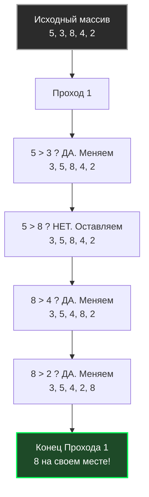

Сортировки — это классическая тема Computer Science, с которой начинается изучение алгоритмов. Для бэкенд-разработчика понимание сортировок нужно не для того, чтобы писать их с нуля (в 99% случаев вы вызовете `slices.Sort()`), а для того, чтобы понимать паттерны доступа к памяти, предсказание ветвлений (Branch Prediction) и то, как разные алгоритмы ведут себя на реальном железе.

Мы начнем с **Сортировки пузырьком (Bubble Sort)**. Это самый известный, самый простой для понимания и **самый неэффективный** алгоритм сортировки из всех существующих. Знать его нужно ровно для одной цели: понимать, как *не надо* писать код, и уметь объяснить на собеседовании, почему процессор от него "страдает".

## Концепция: Всплытие тяжелого

Идея алгоритма элементарна: мы многократно проходим по массиву слева направо. На каждом шаге мы сравниваем два соседних элемента. Если левый больше правого — мы меняем их местами (Swap). 
В результате каждого полного прохода самый большой элемент "всплывает" в самый конец массива (как пузырек воздуха в воде).

На следующем проходе нам уже не нужно проверять последний элемент (он уже на своем месте), поэтому мы идем до `N-2`, затем до `N-3` и так далее.



## Идиоматичная реализация на Go

Современный Go (начиная с 1.21) предоставляет пакет `cmp` и обобщенные типы (Generics). Идиоматичная сортировка больше не требует написания интерфейсов `sort.Interface` с методами `Len`, `Less` и `Swap` для каждого типа. Мы можем написать одну универсальную функцию.

> [!info] Под капотом
> В Go срезы (`slice`) передаются по значению, но само значение среза — это структура из трех полей: указатель на базовый массив (backing array), длина (`len`) и вместимость (`cap`). Поэтому, передавая срез в функцию и изменяя его элементы, мы мутируем оригинальный базовый массив без лишних аллокаций. Это сортировка "на месте" (In-place).

```go
package sort

import "cmp"

// BubbleSort сортирует срез любого типа, поддерживающего операторы сравнения.
func BubbleSort[T cmp.Ordered](arr []T) {
	n := len(arr)
	
	// Внешний цикл отвечает за количество проходов
	for i := 0; i < n-1; i++ {
		// Оптимизация: флаг, были ли перестановки в этом проходе
		swapped := false
		
		// Внутренний цикл: идем до конца неотсортированной части
		for j := 0; j < n-i-1; j++ {
			if arr[j] > arr[j+1] {
				// В Go swap делается элегантно в одну строку без временной переменной
				arr[j], arr[j+1] = arr[j+1], arr[j]
				swapped = true
			}
		}
		
		// Если за весь проход не было ни одной перестановки,
		// значит массив уже отсортирован. Мы можем прервать работу.
		if !swapped {
			break
		}
	}
}
```

## Асимптотическая сложность

* **Время (Худший и Средний случай):** $O(N^2)$. Для массива из 100 000 элементов потребуется около 10 миллиардов операций.
* **Время (Лучший случай):** $O(N)$. Благодаря нашей оптимизации с флагом `swapped`, если подать на вход уже отсортированный массив, алгоритм сделает ровно один проход и завершится.
* **Память:** $O(1)$. Дополнительная память не требуется, все происходит в пределах исходного массива.

> [!tip] Собеседование
> **Вопрос:** Является ли Bubble Sort стабильным (Stable)?
> **Ответ:** Да. **Стабильная сортировка** не меняет относительный порядок равных элементов. Поскольку мы делаем перестановку только если `arr[j] > arr[j+1]` (строго больше), два одинаковых элемента никогда не поменяются местами. Это полезно, если мы, например, сортируем логи по времени, а затем по severity — стабильная сортировка сохранит временной порядок внутри одинаковых уровней severity.

## Mechanical Sympathy: Почему CPU ненавидит Bubble Sort?

Алгоритмическая сложность $O(N^2)$ — это лишь половина проблемы. Если посмотреть на Bubble Sort глазами железа, мы увидим настоящую катастрофу.

### 1. Катастрофа предсказания ветвлений (Branch Misprediction)
Современные процессоры невероятно быстры благодаря конвейеризации (Pipelining). Процессор не ждет окончания одной инструкции, чтобы начать другую. Он пытается "угадать", выполнится ли условие `if` (Branch Prediction), и заранее загружает код нужной ветки в конвейер.

В строке `if arr[j] > arr[j+1]` для массива со случайными данными вероятность истинности составляет примерно 50%. 
Для предсказателя ветвлений (Branch Predictor) это наихудший возможный сценарий — это как подбрасывать монетку. Процессор будет постоянно ошибаться. При каждой ошибке (Branch Misprediction) весь конвейер длиной в 15-20 стадий сбрасывается (Pipeline Flush), и процессор простаивает, теряя драгоценные такты.

### 2. Мусорный трафик памяти (Memory Bandwidth)
Хотя элементы читаются последовательно (что отлично для L1-кэша и аппаратного префетчера), Bubble Sort делает слишком много **записей**.
Перестановка `arr[j], arr[j+1] = arr[j+1], arr[j]` — это интенсивная операция для кэша. В худшем случае (массив отсортирован в обратном порядке) алгоритм сделает $O(N^2)$ перестановок. Запись всегда обходится процессору дороже чтения, так как требует инвалидации кэш-линий и последующего сброса (eviction) "грязных" страниц в оперативную память.

> [!warning] Ловушка / Gotcha
> Из-за колоссального количества записей и сбросов конвейера CPU, Bubble Sort работает медленнее, чем другие $O(N^2)$ алгоритмы, такие как Сортировка выбором (Selection Sort) или Сортировка вставками (Insertion Sort). На практике его не используют **вообще никогда**, даже для очень коротких массивов.

## Резюме

* **Где применяется:** Нигде в Production коде. Только в академических целях.
* **Главный урок:** Алгоритм показывает, как избыточные мутации (перестановки) и непредсказуемые ветвления уничтожают производительность, даже если паттерн доступа к памяти является последовательным.

Теперь, когда мы увидели, как делать не нужно, перейдем к алгоритму, который тоже имеет сложность $O(N^2)$, но настолько хорош на уровне работы с кэшем процессора, что является частью гибридных алгоритмов `sort` во многих стандартных библиотеках (включая Go) для малых массивов. В следующей статье: [[2. Insertion sort]].