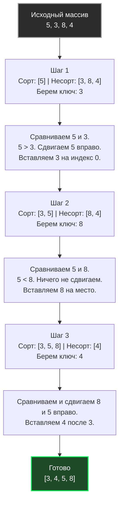

В прошлой статье [[1. Bubble sort и его недостатки]] мы рассмотрели алгоритм, который из-за обилия непредсказуемых ветвлений и хаотичных перестановок буквально заставляет процессор "страдать". 

Но значит ли это, что все алгоритмы со сложностью $O(N^2)$ одинаково плохи? Абсолютно нет. **Сортировка вставками (Insertion Sort)** — это блестящий пример того, как алгоритм с "плохой" асимптотической сложностью благодаря своей Hardware-совместимости обходит сложные алгоритмы вроде $O(N \log N)$ на коротких массивах.

## Концепция: Сортировка игральных карт

Аналогия из реальной жизни — то, как люди сортируют карты в руке. 
Вы держите карты веером. Вы берете одну неотсортированную карту, находите для нее правильное место среди уже отсортированных (слева), сдвигаете остальные карты вправо и вставляете её.

Алгоритмически это выглядит так:
1. Массив визуально делится на две части: левая (уже отсортированная) и правая (еще не отсортированная).
2. Изначально первый элемент считается отсортированным (массив из 1 элемента всегда отсортирован).
3. Мы берем первый элемент из правой части (`key`).
4. Мы идем по левой части справа налево, сравнивая элементы с `key`.
5. Если элемент больше `key`, мы **сдвигаем** его на одну позицию вправо.
6. Как только находим элемент, который меньше или равен `key` (или доходим до начала), мы **вставляем** `key` на освободившееся место.



## Идиоматичная реализация на Go

В отличие от Bubble Sort, который делает **перестановки (swaps)** на каждом шаге (чтение A, чтение B, запись B, запись A), Insertion Sort использует **сдвиг (shift)**. Мы сохраняем ключ в регистр процессора и просто копируем данные на одну ячейку вправо, а в самом конце делаем ровно одну запись ключа.

```go
package sort

import "cmp"

// InsertionSort сортирует срез на месте (in-place).
func InsertionSort[T cmp.Ordered](arr []T) {
	n := len(arr)
	// Начинаем с 1, так как элемент под индексом 0 уже образует отсортированную часть
	for i := 1; i < n; i++ {
		key := arr[i]
		j := i - 1

		// Сдвигаем элементы отсортированной части вправо, 
		// чтобы освободить место для key
		for j >= 0 && arr[j] > key {
			arr[j+1] = arr[j] // Это сдвиг (shift), а не перестановка (swap)!
			j--
		}
		
		// Вставляем ключ на найденное место
		arr[j+1] = key
	}
}
```

## Mechanical Sympathy: Почему Insertion Sort крут?

Давайте посмотрим на это глазами процессора и подсистемы памяти. 

### 1. Последовательный доступ к памяти (Cache Locality)
Внутренний цикл делает операцию `arr[j+1] = arr[j]`. Это чтение и запись в соседние ячейки памяти с предсказуемым шагом `-1`. 
Аппаратный предсказатель (Hardware Prefetcher) современного процессора мгновенно распознает этот паттерн (Backward Sequential Access) и начинает заранее загружать нужные кэш-линии L1/L2 кэша. Процессор практически никогда не простаивает в ожидании данных из RAM (Zero Cache Misses).

### 2. Цена операции: Shift vs Swap
Функция Swap (перестановка) стоит 3 операций присваивания (`tmp = a; a = b; b = tmp`). 
В Insertion Sort внутренний цикл делает ровно 1 операцию присваивания (`arr[j+1] = arr[j]`). На современных архитектурах (x86-64/ARM64) это транслируется в высокооптимизированные машинные инструкции перемещения данных. Меньше инструкций — быстрее работает конвейер CPU.

### 3. Предсказание ветвлений на почти отсортированных данных
Сложность Insertion Sort сильно зависит от входных данных:
* Худший случай (обратный порядок): $O(N^2)$.
* **Лучший случай (массив уже или почти отсортирован): $O(N)$.**

В реальном бэкенде данные часто приходят **частично отсортированными** (например, логи, где иногда проскакивают Out-of-Order записи). В таком случае внутренний цикл `arr[j] > key` почти сразу возвращает `false`. Branch Predictor процессора обучается этому паттерну, и алгоритм "пролетает" массив со скоростью линейного чтения $O(N)$.

## Практическое применение: Секретное оружие Go

> [!tip] Собеседование
> **Вопрос:** Если Quick Sort ($O(N \log N)$) всегда асимптотически быстрее, почему в стандартной библиотеке языков (Go, C++, Java) он не используется в чистом виде?
> **Ответ:** Потому что асимптотическая сложность не учитывает константы времени выполнения (Overhead).

Алгоритмы "Разделяй и властвуй" (Quick Sort, Merge Sort) имеют накладные расходы: рекурсивные вызовы функций, аллокации фреймов на стеке, вычисление пивотов (опорных элементов). 

Когда массив становится достаточно **маленьким**, эти накладные расходы начинают превышать полезную работу. И здесь на сцену выходит Сортировка вставками. У нее нулевой overhead: нет рекурсии, все переменные лежат в регистрах CPU. На малых $N$ константа $O(N^2)$ алгоритма Insertion Sort физически меньше, чем константа $O(N \log N)$ алгоритма Quick Sort.

> [!info] Под капотом
> Стандартная функция `slices.Sort()` в Go 1.21+ использует алгоритм **pdqsort (Pattern-Defeating Quicksort)**.
> В исходниках `pdqsort` (файл `zsortanyfunc.go` внутри рантайма) есть зашитый лимит — константа `insertionSortThreshold`. Обычно она равна **12** или **24** элементам.
> Как только Quick Sort, разбивая массив на части, доходит до подмассива размером меньше 12-24 элементов, он **перестает рекурсивно дробить его** и вызывает `InsertionSort` для этого куска.
> Этот гибридный подход позволяет выжать максимум из железа: $O(N \log N)$ для глобальной сортировки и Hardware-оптимизированный $O(N^2)$ для локального финиша. Детальнее мы разберем это в [[9. Внутренности пакета sort в Go]].

## Итог

* **Сложность:** $O(N^2)$ в худшем, $O(N)$ в лучшем (если почти отсортировано).
* **Память:** $O(1)$.
* **Стабильность:** Да, это стабильная сортировка (Stable Sort). Не меняет порядок равных элементов.
* **Где применяется:** Как базовый случай (Base Case) для сложных алгоритмов (Quick Sort, Merge Sort) на коротких массивах (длиной до ~12-24 элементов) во всех современных стандартных библиотеках.

Insertion Sort учит нас тому, что взаимодействие с кэшем процессора иногда важнее красивой математической сложности. Но для массивов в миллионы элементов он все равно не подходит. Чтобы победить большие объемы данных, нам нужно научиться их разделять. В следующей статье мы переходим к тяжелой артиллерии $O(N \log N)$ и алгоритмам "Разделяй и властвуй": [[3. Merge sort]].