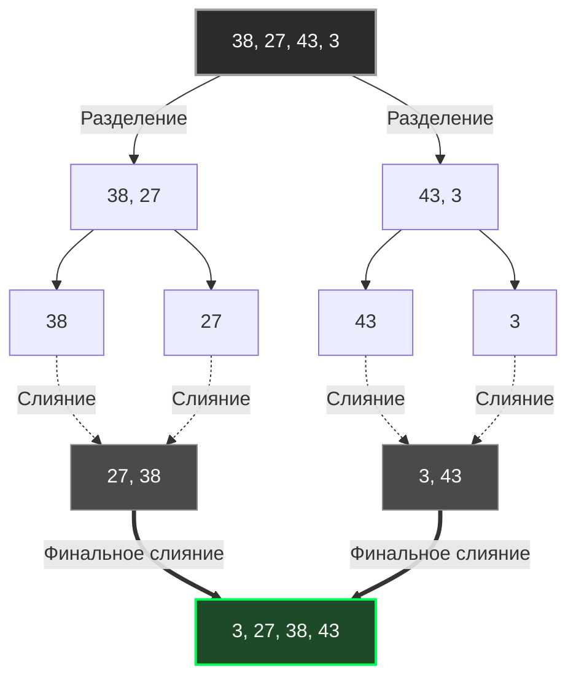

В предыдущих статьях ([[1. Bubble sort и его недостатки]] и [[2. Insertion sort]]) мы находились в мире $O(N^2)$. Эти алгоритмы хороши для крошечных массивов, но если вам нужно отсортировать миллион записей, процессор умрет от старости, прежде чем закончит работу.

Чтобы пробить потолок производительности, информатика обратилась к парадигме **Разделяй и властвуй (Divide and Conquer)**. Первым и самым фундаментальным алгоритмом в этом классе является **Сортировка слиянием (Merge Sort)**, предложенная Джоном фон Нейманом в 1945 году. 

Для бэкенд-инженера это не просто алгоритм сортировки. Это архитектурный паттерн, который лежит в основе распределенных систем (например, MapReduce) и механизмов слияния файлов на диске (Compaction) в современных базах данных.

## Концепция: Разделяй и властвуй

Алгоритм состоит из двух фаз, которые рекурсивно сменяют друг друга:

1. **Разделение (Divide):** Берем массив и делим его ровно пополам. Затем делим половинки пополам. Продолжаем делить, пока не получим массивы из 1 элемента. (Массив из 1 элемента математически считается отсортированным).
2. **Слияние (Conquer / Merge):** Берем два соседних отсортированных массива и "сливаем" их в один новый отсортированный массив. Для этого ставим два указателя на начала обоих массивов, выбираем меньший элемент, кладем его в буфер и сдвигаем указатель.



## Асимптотическая сложность

* **Время (Все случаи):** $O(N \log N)$. 
  Глубина рекурсивного дерева всегда равна $\log_2 N$. На каждом уровне рекурсии мы делаем линейный проход $O(N)$ для слияния элементов. Умножаем одно на другое — получаем стабильные $O(N \log N)$. В отличие от Quick Sort, у Merge Sort **нет деградации в худшем случае**.
* **Память:** $O(N)$. И это главная архитектурная проблема алгоритма, о которой мы поговорим ниже.
* **Стабильность:** Да. Алгоритм не меняет порядок одинаковых элементов (Stable Sort).

## Mechanical Sympathy: Битва за память

С точки зрения железа у Merge Sort есть светлая и темная стороны.

**Светлая сторона: Идеальный паттерн доступа.**
Операция слияния (`merge`) — это мечта для аппаратного префетчера процессора (Hardware Prefetcher). Мы читаем элементы из двух массивов строго последовательно слева направо и пишем их в третий массив тоже строго последовательно. Никаких хаотичных прыжков по памяти (Pointer Chasing). Кэш L1/L2 работает со 100% эффективностью.

**Темная сторона: Аллокации и Garbage Collector.**
Чтобы слить два массива вместе, нам **нужен дополнительный буфер** в оперативной памяти, равный по размеру сумме сливаемых массивов. 

> [!warning] Ловушка / Gotcha (Наивная реализация)
> В студенческих реализациях на Go часто делают `make([]T, len(left) + len(right))` прямо внутри функции `merge`. 
> Это катастрофа для бэкенда! Если вы сортируете 1 миллион элементов, алгоритм сделает десятки тысяч мелких аллокаций в куче (Heap). 
> Во-первых, вызов `malloc` заблокирует горутину. Во-вторых, GC (Garbage Collector) сойдет с ума, пытаясь собрать весь этот мусор после сортировки, вызывая микрофризы (STW).

**Правильный паттерн в Go:** Выделить буфер `O(N)` **ровно один раз** в самом начале и передавать его как `scratch space` (черновик) на все уровни рекурсии.

## Идиоматичная реализация на Go

Давайте напишем production-ready реализацию Merge Sort, которая уважает сборщик мусора и память.

```go
package sort

import "cmp"

// MergeSort сортирует срез, используя O-N- дополнительной памяти
func MergeSort[T cmp.Ordered](arr []T) {
	if len(arr) <= 1 {
		return
	}
	
	// Выделяем буфер ОДИН РАЗ на всю операцию сортировки!
	// Это избавляет GC от работы и бережет такты CPU.
	buffer := make([]T, len(arr))
	
	mergeSortRec(arr, buffer, 0, len(arr)-1)
}

// mergeSortRec - внутренняя рекурсивная функция
func mergeSortRec[T cmp.Ordered](arr, buffer []T, left, right int) {
	if left >= right {
		return
	}

	mid := left + (right-left)/2 // Защита от переполнения int

	// Разделяем
	mergeSortRec(arr, buffer, left, mid)
	mergeSortRec(arr, buffer, mid+1, right)

	// Властвуем (сливаем)
	merge(arr, buffer, left, mid, right)
}

func merge[T cmp.Ordered](arr, buffer []T, left, mid, right int) {
	i := left     // Указатель на левую половину
	j := mid + 1  // Указатель на правую половину
	k := left     // Указатель на буфер

	// 1. Сравниваем и копируем меньший элемент в буфер
	for i <= mid && j <= right {
		if arr[i] <= arr[j] { // "<=" гарантирует стабильность сортировки
			buffer[k] = arr[i]
			i++
		} else {
			buffer[k] = arr[j]
			j++
		}
		k++
	}

	// 2. Дописываем хвост левой половины (если остался)
	for i <= mid {
		buffer[k] = arr[i]
		i++
		k++
	}

	// 3. Дописываем хвост правой половины (если остался)
	for j <= right {
		buffer[k] = arr[j]
		j++
		k++
	}

	// 4. Копируем отсортированные данные из буфера обратно в оригинальный срез
	// Копируем только тот участок, который сливали: arr-left:right+1-
	copy(arr[left:right+1], buffer[left:right+1])
}
```

## Где Merge Sort абсолютно незаменим?

Если Quick Sort работает быстрее в оперативной памяти (из-за отсутствия копирования в буфер), зачем нам вообще Merge Sort? 

Ответ кроется в дисковых подсистемах и базах данных.

> [!tip] Собеседование
> **Вопрос:** У вас есть файл с логами на 100 ГБ. У вашего сервера всего 4 ГБ оперативной памяти. Как вы отсортируете этот файл? Quick Sort здесь не поможет, так как файл не влезет в RAM.
> **Ответ:** С помощью **Внешней сортировки слиянием (External Merge Sort)**.

Фаза слияния (Merge) обладает уникальным свойством: ей **не нужно видеть весь массив целиком**. Чтобы слить два отсортированных потока, ей достаточно видеть только "головы" (текущие первые элементы) этих потоков.

**Алгоритм внешней сортировки:**
1. Мы читаем из файла куски по 1 ГБ (чтобы влезли в RAM).
2. Сортируем каждый кусок в оперативной памяти быстрым алгоритмом (например, `pdqsort`) и сохраняем на диск во временные файлы (получаем 100 отсортированных файлов по 1 ГБ).
3. Затем мы открываем все 100 файлов на чтение, берем из каждого по одному первому элементу.
4. Используем очередь с приоритетом (Min-Heap, см. [[1. Куча как структура данных]]) или просто линейный поиск, чтобы найти минимальный элемент среди 100 "голов".
5. Записываем этот минимальный элемент в итоговый файл и подтягиваем следующий элемент из того файла, откуда был взят победитель.

По этому принципу работает слияние SSTables в **LSM-дереве** (вспомните статью [[4. LSM дерево]]), когда ClickHouse или Cassandra делают фоновый Compaction. Именно поэтому Merge Sort — это фундамент всех современных Big Data систем.

## Резюме

* Merge Sort — это первый серьезный алгоритм $O(N \log N)$, стабильный и предсказуемый.
* Его главная слабость — потребление $O(N)$ дополнительной памяти (убивается кэш, нагружается шина памяти при копировании данных туда-сюда).
* Его главная сила — последовательный паттерн доступа и возможность сортировать потоки данных, которые превышают размер оперативной памяти (External Sorting).

Несмотря на стабильность и красоту, для сортировки данных, которые *помещаются* в оперативную память, инженеры предпочитают алгоритм, который сортирует In-place (без доп. памяти), пусть даже ценой потери стабильности. Об этом алгоритме — в следующей статье: [[4. Quick sort]].