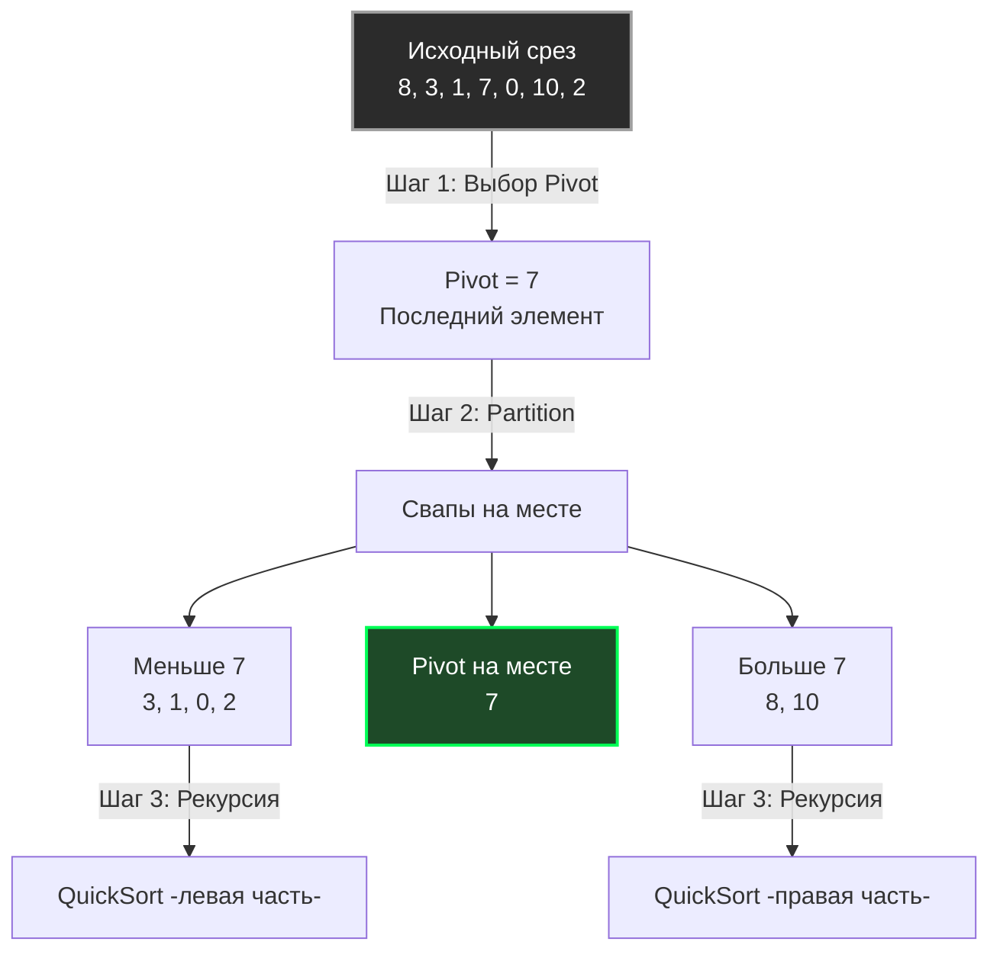

В статье [[3. Merge sort]] мы познакомились с парадигмой «Разделяй и властвуй». Сортировка слиянием гарантирует стабильные $O(N \log N)$, но имеет критический архитектурный изъян для in-memory вычислений: она требует выделения дополнительного буфера памяти размером $O(N)$. Если вы сортируете срез на 10 ГБ, вам понадобится еще 10 ГБ оперативной памяти просто для копирования данных туда-сюда.

Индустрии нужен был алгоритм, который сортирует так же быстро, но делает это **на месте (in-place)**, без аллокаций. В 1959 году Тони Хоар придумал **Быструю сортировку (Quick Sort)**. Сегодня её модификации лежат в основе стандартных библиотек почти всех современных языков программирования, включая Go.

## Концепция: Разделение вокруг опоры

В отличие от Merge Sort, который сначала «тупо» делит массив пополам, а всю умную работу делает при слиянии, Quick Sort поступает наоборот. Он делает умную работу на этапе разделения (**Partition**), а само «слияние» не требует никаких действий.

Алгоритм состоит из трех шагов:
1. **Выбор опорного элемента (Pivot):** Выбираем любой элемент из массива.
2. **Разделение (Partition):** Переставляем элементы массива так, чтобы все элементы, которые меньше `pivot`, оказались слева от него, а все элементы больше — справа. Сам `pivot` встает на свою **финальную, правильную позицию**.
3. **Рекурсия:** Рекурсивно применяем этот же алгоритм к левой и правой частям.



## Mechanical Sympathy: Почему Quick Sort действительно "Quick"?

Асимптотически Quick Sort имеет такую же сложность, как и Merge Sort — $O(N \log N)$. Но на реальном железе Quick Sort обгоняет его в 2-3 раза. Почему?

1. **Идеальный Cache Locality:** Алгоритм работает strictly in-place. Два указателя (в схеме Хоара) движутся навстречу друг другу, последовательно читая массив. Это позволяет аппаратному префетчеру (Hardware Prefetcher) загружать кэш-линии (Cache Lines) L1-кэша со 100% эффективностью. Никаких прыжков по куче.
2. **Нулевые аллокации:** Нет вызовов `make()` под буферы. Нет нагрузки на Garbage Collector.
3. **Меньше перемещений данных:** В Merge Sort данные постоянно копируются из оригинального массива в буфер и обратно. Quick Sort делает только точечные перестановки (swaps) в рамках одного непрерывного куска памяти.

## Трагедия худшего случая: $O(N^2)$

У алгоритма есть ахиллесова пята. Его скорость критически зависит от выбора Pivot.

> [!warning] Ловушка / Gotcha
> Представьте, что вы выбрали `pivot` как последний элемент массива, а сам **массив уже отсортирован** (или отсортирован в обратном порядке).
> Что произойдет при Partition? Левая часть заберет $N-1$ элементов, а правая — $0$. 
> Дерево рекурсии выродится из сбалансированного (высота $\log N$) в длинную «колбасу» (связный список высотой $N$). 
> Алгоритм деградирует до сложности $O(N^2)$, а из-за глубины рекурсии в $N$ вызовов вы можете получить переполнение стека (Stack Overflow, хотя в Go стек горутин динамически растет, это убьет производительность).

### Как индустрия решает проблему Pivot?
Никто в здравом уме не берет просто "последний" элемент в продакшене.
Используются эвристики:
1. **Случайный Pivot:** Выбор случайного элемента математически гарантирует $O(N \log N)$ в среднем, но вызов `rand` — это дорого.
2. **Медиана трех (Median of Three):** Берут первый, средний и последний элементы подмассива и выбирают среднее по значению. Это дешевая операция, которая идеально защищает от уже отсортированных (или обратно отсортированных) данных.

## Идиоматичная реализация на Go

Существует два популярных алгоритма разделения: Ломуто (проще писать) и Хоара (эффективнее на практике). Мы напишем классическую реализацию с Partition по Ломуто (с оптимизацией выбора Pivot), чтобы код оставался читаемым и лаконичным, но пригодным для серьезного разговора на собеседовании.

```go
package sort

import "cmp"

// QuickSort сортирует срез in-place.
func QuickSort[T cmp.Ordered](arr []T) {
	if len(arr) < 2 {
		return
	}
	quickSortRec(arr, 0, len(arr)-1)
}

func quickSortRec[T cmp.Ordered](arr []T, low, high int) {
	if low < high {
		// Оптимизация: Выбор Pivot с помощью "Медианы трех" 
		// защищает от O-N^2- на отсортированных данных.
		pivotIdx := medianOfThree(arr, low, high)
		
		// Прячем pivot в конец, чтобы алгоритм Ломуто сработал стандартно
		arr[pivotIdx], arr[high] = arr[high], arr[pivotIdx]

		// Выполняем разделение
		p := partition(arr, low, high)

		// Рекурсивно сортируем левую и правую части.
		// Элемент 'p' уже находится на своем финальном месте!
		quickSortRec(arr, low, p-1)
		quickSortRec(arr, p+1, high)
	}
}

// partition переставляет элементы и возвращает финальный индекс pivot
func partition[T cmp.Ordered](arr []T, low, high int) int {
	pivot := arr[high]
	i := low // i указывает на границу элементов, которые меньше pivot

	for j := low; j < high; j++ {
		if arr[j] < pivot {
			arr[i], arr[j] = arr[j], arr[i]
			i++
		}
	}
	// Ставим pivot на его законное место
	arr[i], arr[high] = arr[high], arr[i]
	return i
}

// medianOfThree находит индекс среднего по значению элемента
// среди первого, среднего и последнего.
func medianOfThree[T cmp.Ordered](arr []T, low, high int) int {
	mid := low + (high-low)/2
	
	// Сортируем три элемента между собой прямо в массиве
	if arr[low] > arr[mid] {
		arr[low], arr[mid] = arr[mid], arr[low]
	}
	if arr[low] > arr[high] {
		arr[low], arr[high] = arr[high], arr[low]
	}
	if arr[mid] > arr[high] {
		arr[mid], arr[high] = arr[high], arr[mid]
	}
	
	// Теперь arr-mid- содержит медиану
	return mid
}
```

> [!info] Под капотом
> Стандартный пакет `sort` (и новый пакет `slices`) в Go не используют "чистый" Quick Sort. Они используют гибридный алгоритм **pdqsort (Pattern-Defeating Quicksort)**.
> 1. Если массив мал (обычно < 12-24 элементов), он вызывает [[2. Insertion sort]], так как на коротких дистанциях он быстрее (без оверхеда на рекурсию).
> 2. В качестве базы используется Quick Sort с хитроумным выбором Pivot (апроксимация медианы девяти для больших срезов) и схемой Partition Хоара (она делает в 3 раза меньше свопов, чем Ломуто).
> 3. Если алгоритм замечает, что он делает плохие разбиения (то есть "проваливается" в сторону $O(N^2)$), он динамически переключается на **Heap Sort** (пирамидальную сортировку), которая гарантирует строго $O(N \log N)$ в любых условиях. 
> Эта синергия трех алгоритмов и называется IntroSort / pdqsort. Более глубоко мы разберем это в [[9. Внутренности пакета sort в Go]].

## Собеседование: Главные вопросы

> [!tip] Собеседование
> **Вопрос 1: Является ли Quick Sort стабильной сортировкой (Stable)?**
> **Ответ:** Нет. Из-за длинных прыжков при перестановке элементов (swaps) в фазе Partition, два одинаковых элемента могут поменять свой относительный порядок. Если вам важна стабильность (например, вы отсортировали пользователей по Имени, а теперь сортируете по Возрасту и хотите, чтобы внутри одного возраста имена шли по алфавиту) — вам придется использовать [[3. Merge sort]] или `slices.SortStableFunc`.
>
> **Вопрос 2: Сколько дополнительной памяти потребляет Quick Sort?**
> **Ответ:** Хотя он сортирует массив in-place, он **не работает за $O(1)$ по памяти**. 
> Рекурсивные вызовы `quickSortRec` сохраняют фреймы на стеке (Call Stack). В лучшем случае глубина дерева рекурсии равна $\log_2 N$. Значит, алгоритм требует **$O(\log N)$ стековой памяти**. В наихудшем случае (без защиты от деградации) это может быть $O(N)$ памяти на стеке.

## Итог

Quick Sort — это вершина инженерной мысли в классе сортировок на оперативной памяти. Он побеждает за счет идеальной утилизации процессорного кэша и отсутствия обращений к аллокатору памяти (Heap).

Однако мы упомянули, что у него есть фундаментальный изъян — он уязвим к определенным паттернам данных (даже с медианой трех специально подготовленные "убийственные" массивы могут уронить его в $O(N^2)$). Если нам нужна абсолютная, математическая гарантия $O(N \log N)$ без аллокаций памяти, нам нужно обратиться к структурам данных, которые мы обсуждали в предыдущих главах. 

В следующей статье мы рассмотрим элегантный алгоритм, который использует концепцию приоритетной очереди для In-Place сортировки: [[5. Heap sort]].