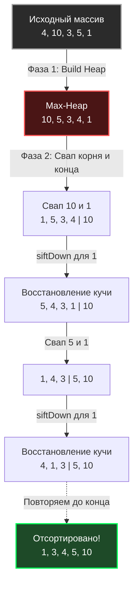

В статье [[4. Quick sort]] мы восхищались скоростью Быстрой сортировки и ее идеальной работой с кэшем процессора. Однако мы также обнаружили ее критическую уязвимость — деградацию до $O(N^2)$ при неудачном выборе опорного элемента (Pivot) и потенциальную угрозу переполнения стека рекурсии. С другой стороны, [[3. Merge sort]] гарантирует $O(N \log N)$, но требует $O(N)$ дополнительной оперативной памяти, что неприемлемо для огромных массивов.

Инженерии нужен был алгоритм, который объединяет лучшие черты: **строгую математическую гарантию $O(N \log N)$ в худшем случае и $O(1)$ по памяти (сортировка In-Place)**. 

Ответом стала **Пирамидальная сортировка (Heap Sort)**, изобретенная Джоном Уильямсом в 1964 году вместе с самой структурой данных — Бинарной кучей.

## Концепция: Сортировка через структуру данных

Heap Sort использует свойство сортирующего дерева (Max-Heap), которое мы детально разбирали в разделе очередей с приоритетом (см. [[1. Куча как структура данных]]).

Главное преимущество бинарной кучи в том, что она не требует узлов, указателей и аллокаций. Она виртуально проецируется на обычный плоский массив:
* Левый ребенок узла `i`: `2*i + 1`
* Правый ребенок узла `i`: `2*i + 2`
* Родитель узла `i`: `(i - 1) / 2`

Алгоритм Heap Sort состоит из двух элегантных фаз:

### Фаза 1: Build Max-Heap (Построение кучи)
Мы берем несортированный массив и превращаем его в корректную Max-Heap. Для этого мы идем от середины массива к началу и вызываем функцию просеивания вниз (`siftDown`). После этой фазы **самый большой элемент массива гарантированно находится в корне** (на индексе 0).

### Фаза 2: Extract Max (Сортировка)
1. Берем корень (самый большой элемент, индекс `0`) и меняем его местами с последним элементом массива (индекс `N-1`). Теперь максимум стоит на своем законном, финальном месте!
2. Уменьшаем "виртуальный" размер кучи на 1 (чтобы не трогать уже отсортированный хвост).
3. Новый элемент на индексе `0` скорее всего нарушает свойство кучи. Мы вызываем для него `siftDown`, чтобы он "провалился" на свое место, а на вершину всплыл второй по величине элемент.
4. Повторяем процесс, пока размер кучи не станет равен 1.



## Идиоматичная реализация на Go

Давайте напишем строгий и производительный код Heap Sort без использования сторонних пакетов, опираясь только на Generics.

```go
package sort

import "cmp"

// HeapSort сортирует срез на месте (in-place) со строгой гарантией O-N log N-
func HeapSort[T cmp.Ordered](arr []T) {
	n := len(arr)
	if n <= 1 {
		return
	}

	// Фаза 1: Построение Max-Heap
	// Начинаем с n/2 - 1, так как вторая половина массива - это листья,
	// а листья по определению уже являются корректными кучами из 1 элемента.
	for i := n/2 - 1; i >= 0; i-- {
		siftDown(arr, i, n)
	}

	// Фаза 2: Извлечение элементов по одному
	for i := n - 1; i > 0; i-- {
		// Перемещаем текущий корень (максимум) в конец
		arr[0], arr[i] = arr[i], arr[0]
		
		// Вызываем siftDown для уменьшенной кучи
		// i теперь выступает в роли размера кучи
		siftDown(arr, 0, i)
	}
}

// siftDown просеивает элемент вниз, чтобы восстановить свойство Max-Heap
func siftDown[T cmp.Ordered](arr []T, root, length int) {
	for {
		largest := root
		left := 2*root + 1
		right := 2*root + 2

		// Проверяем левого ребенка
		if left < length && arr[left] > arr[largest] {
			largest = left
		}

		// Проверяем правого ребенка
		if right < length && arr[right] > arr[largest] {
			largest = right
		}

		// Если корень больше обоих детей - куча в порядке
		if largest == root {
			break
		}

		// Иначе меняем корень с наибольшим ребенком
		arr[root], arr[largest] = arr[largest], arr[root]
		
		// Спускаемся ниже
		root = largest
	}
}
```

## Mechanical Sympathy: Почему CPU ненавидит Heap Sort?

Если Heap Sort так хорош математически (он не требует доп. памяти как Merge Sort и не падает в $O(N^2)$ как Quick Sort), почему он не является алгоритмом по умолчанию во всех языках?

Ответ кроется в **Аппаратном кэше (L1/L2 Cache)**.

Посмотрим на функцию `siftDown`. Чтобы спуститься по дереву, мы вычисляем индексы детей: `2*i + 1`. 
Если массив огромный, элемент на индексе `1000` сравнивается с элементом на индексе `2001`. А на следующей итерации — с элементом `4003`. 

Это **геометрическая прогрессия скачков по памяти**. Аппаратный префетчер (Hardware Prefetcher) процессора, который отлично угадывает последовательное чтение (как в Quick Sort или Merge Sort), здесь абсолютно бессилен. Каждый прыжок в куче размером несколько десятков мегабайт гарантированно вызывает **Cache Miss**. Процессор простаивает сотни тактов, ожидая данные из оперативной памяти.

Именно поэтому, несмотря на одинаковую асимптотику $O(N \log N)$, на практике (Wall-clock time) **Heap Sort работает в 2-3 раза медленнее, чем Quick Sort**.

## Роль Heap Sort в реальном Production (IntroSort)

Значит ли это, что Heap Sort никому не нужен? Наоборот, он спасает ваши серверы от DDoS-атак и зависаний.

> [!tip] Собеседование
> **Вопрос:** Если злоумышленник отправит на ваш бэкенд специально подготовленный массив, который заставит Quick Sort деградировать до $O(N^2)$, как стандартная библиотека защитит процессор?
> **Ответ:** С помощью алгоритма **IntroSort** (Introspective Sort).

**IntroSort** (в Go он реализован как часть `pdqsort`) — это гибридный алгоритм, который начинается как Quick Sort. Однако алгоритм *интроспективно* следит за глубиной своей рекурсии. Если он видит, что глубина рекурсии превысила `2 * log2(N)` (что означает, что Quick Sort начал буксовать и разбивать массив неравномерно), он немедленно прерывает Quick Sort и **вызывает Heap Sort для оставшейся части массива**.

Heap Sort здесь выступает в роли **идеального запасного парашюта**. Он медленнее работает с кэшем, но дает железную гарантию $O(N \log N)$, спасая процесс от переполнения стека и зависания процессора. 

> [!info] Под капотом
> Если вы заглянете в исходники рантайма Go (пакет `slices` или старый `sort`), вы увидите функцию `heapsort`. Она никогда не вызывается первой. Она терпеливо ждет в функции `pdqsort`, пока счетчик лимита плохих разбиений (limit) не достигнет нуля:
> ```go
> if limit == 0 {
>     heapSort(data, a, b)
>     return
> }
> ```

## Итог

* **Время:** $O(N \log N)$ во всех случаях (лучший, средний, худший).
* **Память:** $O(1)$ (In-place).
* **Стабильность:** Нет (как и Quick Sort, свапы через половину массива разрушают порядок равных элементов).
* **Слабость:** Ужасная Cache Locality из-за скачков по индексам `2*i`.
* **Роль в бэкенде:** Механизм защиты (Fallback) в гибридных алгоритмах сортировки.

Мы завершили изучение алгоритмов сортировки, основанных на сравнении элементов (Comparison-based sorts). Математически доказано, что ни один алгоритм сравнения не может работать быстрее, чем $O(N \log N)$. 
Но что, если нам нужно отсортировать массив за **$O(N)$**? Возможно ли нарушить законы математики? Да, если мы перестанем сравнивать элементы и начнем их считать. В следующей статье мы перейдем к линейным алгоритмам: [[6. Counting sort]].