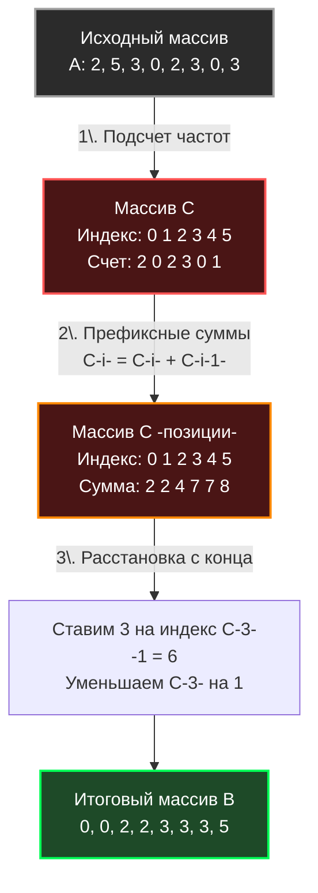

В предыдущих статьях (от [[1. Bubble sort и его недостатки]] до [[5. Heap sort]]) мы рассматривали алгоритмы, основанные на **сравнении** элементов (Comparison-based sorts). Математически доказано, что любой алгоритм, который сортирует данные, задавая вопрос «A больше B?», не может работать быстрее, чем за $O(N \log N)$ в худшем случае. Это фундаментальный предел информатики.

Но что, если мы вообще перестанем сравнивать элементы? 
Если мы заранее знаем природу наших данных (например, что это целые числа в определенном диапазоне), мы можем "взломать" математику и отсортировать массив за линейное время — **$O(N)$**. 

Первый и самый базовый алгоритм в этом семействе — **Сортировка подсчетом (Counting Sort)**.

## Концепция: Считать, а не сравнивать

Представьте, что вам нужно отсортировать миллион оценок студентов за экзамен. Оценки могут быть только от 1 до 5. Будете ли вы использовать Quick Sort для этого? Нет. Вы просто посчитаете, сколько у вас пятерок, сколько четверок, троек и так далее. А затем просто перезапишете массив: сначала все единицы, потом двойки, и в конце пятерки.

В этом и заключается суть Counting Sort. Алгоритм состоит из трех фаз:
1. **Подсчет частот:** Создаем вспомогательный массив (Count Array) и подсчитываем, сколько раз встречается каждый элемент.
2. **Префиксные суммы:** Модифицируем Count Array так, чтобы каждый элемент хранил сумму предыдущих (это даст нам точные финальные индексы для расстановки). Подробнее паттерн мы разберем в [[6. Prefix sums - префиксные суммы]].
3. **Расстановка:** Идем по исходному массиву (желательно с конца, чтобы сохранить стабильность) и ставим каждый элемент на его вычисленное место.



## Mechanical Sympathy: Время против Памяти

Асимптотическая сложность Counting Sort равна **$O(N + K)$**, где:
* $N$ — количество элементов в массиве.
* $K$ — разница между максимальным и минимальным значением (диапазон).

> [!warning] Ловушка / Gotcha (Ограничение $K$)
> Скорость $O(N)$ — это иллюзия, которая работает только если $K \le N$.
> Представьте, что вам нужно отсортировать всего 3 числа: `[1, 2, 1_000_000_000]`. 
> $N = 3$. Но диапазон $K = 1_000_000_000$. 
> Алгоритм попытается аллоцировать массив (Count Array) на 1 миллиард элементов. Это потребует **8 Гигабайт оперативной памяти** (если это `int64`) просто для того, чтобы отсортировать три числа! И процессор потратит миллионы тактов, забивая этот гигантский массив нулями.
> В этом случае сложность $O(N + K)$ деградирует, и алгоритм становится в миллионы раз медленнее, чем обычный Quick Sort, уничтожая оперативную память и L1/L2 кэши.

Для процессора Counting Sort (при адекватном $K$) — это праздник. Здесь **нет ветвлений (Branching)**, связанных с данными. Нет `if arr[i] > arr[j]`. А значит, аппаратный предсказатель ветвлений (Branch Predictor) не ошибается, и конвейер процессора работает на максимальной пропускной способности.

## Идиоматичная реализация на Go

В базовых учебниках Counting Sort часто пишут только для неотрицательных чисел. Но в реальном бэкенде нам нужно уметь сортировать любые диапазоны. 

Идиоматичный паттерн — использование **смещения (Offset)**. Мы находим минимальный элемент и вычитаем его из всех значений при индексации в Count Array. Это позволяет сортировать массивы с отрицательными числами (например, `[-5, 2, -1]`).

Кроме того, мы напишем именно **стабильную (Stable)** версию алгоритма, что критически важно для следующей темы.

```go
package sort

// CountingSort сортирует целые числа за O(N + K) времени и O(N + K) памяти.
func CountingSort(arr []int) {
	if len(arr) <= 1 {
		return
	}

	// 1. Находим минимальное и максимальное значения для определения диапазона K
	minVal, maxVal := arr[0], arr[0]
	for _, v := range arr {
		if v < minVal {
			minVal = v
		}
		if v > maxVal {
			maxVal = v
		}
	}

	// Диапазон значений K
	k := maxVal - minVal + 1

	// Оптимизация памяти: если K слишком велико по сравнению с N,
	// в реальном коде здесь стоит откатиться на QuickSort/pdqsort.
	// Для учебного примера мы продолжаем.

	count := make([]int, k) // O(K) памяти
	output := make([]int, len(arr)) // O(N) памяти

	// 2. Подсчитываем частоты (используем minVal как смещение)
	for _, v := range arr {
		count[v-minVal]++
	}

	// 3. Вычисляем префиксные суммы
	// Теперь count[i] содержит позицию (индекс + 1) последнего элемента
	// со значением (i + minVal) в итоговом массиве.
	for i := 1; i < len(count); i++ {
		count[i] += count[i-1]
	}

	// 4. Расстановка элементов (идем С КОНЦА для стабильности сортировки!)
	for i := len(arr) - 1; i >= 0; i-- {
		val := arr[i]
		// Ищем финальную позицию
		pos := count[val-minVal] - 1
		
		output[pos] = val
		
		// Уменьшаем счетчик, чтобы следующий такой же элемент встал левее
		count[val-minVal]--
	}

	// 5. Копируем результат обратно в исходный массив
	copy(arr, output)
}
```

> [!tip] Собеседование
> **Вопрос:** Почему на шаге 4 мы идем по исходному массиву **с конца (справа налево)**, а не с начала?
> **Ответ:** Чтобы сделать сортировку **Стабильной (Stable)**. 
> Если у нас есть два одинаковых элемента (например, две тройки: `3_a` и `3_b`, где `3_a` стояла левее в оригинале), они обе претендуют на одни и те же индексы в финальном массиве. Префиксная сумма указывает на **самый правый** свободный индекс для этого значения.
> Идя с конца, мы берем `3_b` (она правее в оригинале) и ставим её на самый правый свободный индекс. Затем берем `3_a` и ставим её левее. Относительный порядок `3_a` и `3_b` сохраняется!

## Зачем нам стабильность в Counting Sort?

Казалось бы, зачем сохранять порядок одинаковых чисел — они же и так одинаковые? `3` есть `3`.
Ответ: в чистом виде Counting Sort применяется редко. В реальном мире мы сортируем не голые числа, а **объекты/структуры по ключу**. 

Например, у вас есть миллион логов `struct { Level int; Message string }`. Вы хотите отсортировать их по `Level` (от 1 до 5). Если сортировка не стабильна, порядок сообщений внутри одного уровня `Level` перемешается в хаотичную кашу, уничтожив хронологию. Стабильный Counting Sort гарантирует, что логи уровня `ERROR` соберутся вместе, но сохранят свой изначальный порядок по времени появления.

## Итог

* **Сложность:** $O(N + K)$ по времени.
* **Память:** $O(N + K)$ (требует аллокаций под Count Array и Output Array).
* **Специфика:** Не работает с числами с плавающей точкой (float64) и строками напрямую.
* **Слабое место:** Чудовищная деградация по памяти и времени при большом разбросе данных (огромное $K$).

Но что, если нам нужно отсортировать миллиарды UUID или 64-битные хеши за $O(N)$? Мы не можем выделить массив размером $2^{64}$. 
Для обхода этого физического ограничения инженеры придумали гениальный трюк: применять Counting Sort многократно, но сортировать числа "по кусочкам" (по байтам или разрядам). Эта магия называется **Поразрядная сортировка**, и мы разберем её в следующей статье: [[7. Radix sort]].