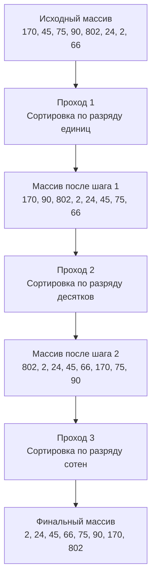

В предыдущей статье [[6. Counting sort]] мы разобрали, как сортировать данные за $O(N)$, полностью отказавшись от сравнения элементов. Однако мы столкнулись с фундаментальным ограничением: Сортировка подсчетом требует массива частот размером $K$, где $K$ — максимальное значение в исходном массиве. Если мы хотим отсортировать массив `[1, 2, 1_000_000_000]`, алгоритм попытается выделить гигабайт памяти под массив счетчиков.

Чтобы решить эту проблему и получить линейную сортировку $O(N)$ без катастрофического перерасхода памяти, был изобретен **Поразрядная сортировка (Radix Sort)**. 

## Архитектура Radix Sort

Идея Radix Sort заключается в том, чтобы сортировать числа не целиком, а по частям — **по разрядам (цифрам или байтам)**. 

Алгоритм использует Сортировку подсчетом (Counting Sort) как подпрограмму. Существует два основных подхода:
1. **LSD (Least Significant Digit):** Сортировка начинается с младшего разряда (единицы) и идет к старшему. Это самый популярный метод для сортировки массивов целых чисел.
2. **MSD (Most Significant Digit):** Сортировка начинается со старшего разряда. Часто используется для сортировки строк (например, лексикографический порядок) и применяется рекурсивно.

### Как работает LSD Radix Sort

Представьте массив: `[170, 45, 75, 90, 802, 24, 2, 66]`
Мы сортируем его в 3 прохода (так как максимальное число имеет 3 десятичных разряда).



> [!warning] Ловушка / Gotcha: Условие стабильности
> Для того чтобы Radix Sort работал корректно, подпрограмма сортировки (внутренний Counting Sort) **обязана быть стабильной (Stable)**. То есть, если два числа имеют одинаковую цифру в текущем разряде (например, `45` и `75` на шаге сортировки по десяткам, если бы они стояли так до этого), их относительный порядок в массиве не должен измениться. Иначе результаты предыдущих проходов по младшим разрядам будут уничтожены.

## Mechanical Sympathy: Битовая магия вместо математики

В классических учебниках Radix Sort часто объясняют на примере системы счисления с основанием 10 (Base-10). Чтобы получить разряд, используют деление и остаток: `(num / 10) % 10`.

**Для системного программиста это алгоритмическое преступление.** Операции деления (`/`) и взятия остатка (`%`) выполняются в ALU процессора чудовищно долго (от 15 до 40 тактов). Использование их в сортировке сотен миллионов чисел полностью убьет производительность, сделав Radix Sort медленнее обычного Quick Sort.

### Переход к Base-256 (Байтовая сортировка)
Настоящий Production-Ready Radix Sort использует в качестве "разрядов" байты (или группы байтов). Основание системы счисления становится равным $2^8 = 256$.

Почему это гениально для процессора:
1. Выделение разряда превращается в битовый сдвиг `>>` и побитовое И `&`. `(num >> 8) & 0xFF`. Эти операции занимают **ровно 1 такт CPU**.
2. В Go `uint64` занимает 8 байт. Это означает, что для сортировки *любого* числа типа `uint64` нам гарантированно понадобится ровно **8 проходов**. Не больше и не меньше.
3. Размер массива счетчиков (Buckets) для Counting Sort всегда равен 256. Массив `[256]int` идеально, без остатка, ложится в L1 кэш процессора, исключая Cache Misses на этапе подсчета частот.

## Реализация на Go (Highload Ready)

Ниже представлена профессиональная реализация LSD Radix Sort для `uint64` массивов. Мы аллоцируем вспомогательный буфер только один раз, чтобы не мучить Garbage Collector в циклах.

```go
package main

// RadixSortUint64 сортирует срез беззнаковых 64-битных целых чисел.
func RadixSortUint64(arr []uint64) {
	n := len(arr)
	if n < 2 {
		return
	}

	// Аллоцируем буфер один раз на всю сортировку O(N) по памяти
	buffer := make([]uint64, n)

	// uint64 занимает 8 байт. Делаем ровно 8 проходов (по 8 бит).
	// shift увеличивается на 8 каждую итерацию: 0, 8, 16, 24, 32, 40, 48, 56
	for shift := uint(0); shift < 64; shift += 8 {
		
		// buckets для хранения частот значений байта (от 0 до 255)
		var counts [256]int

		// 1. Подсчет частот (Counting)
		for i := 0; i < n; i++ {
			// Извлекаем нужный байт за 1 такт
			digit := (arr[i] >> shift) & 0xFF 
			counts[digit]++
		}

		// 2. Префиксные суммы для вычисления позиций
		// Это делает нашу сортировку стабильной (Stable)
		for i := 1; i < 256; i++ {
			counts[i] += counts[i-1]
		}

		// 3. Распределение элементов в буфер (идем с конца для стабильности)
		for i := n - 1; i >= 0; i-- {
			digit := (arr[i] >> shift) & 0xFF
			counts[digit]--
			pos := counts[digit]
			buffer[pos] = arr[i]
		}

		// 4. Копируем обратно (или меняем ссылки, если позволяет логика)
		// Для максимальной кэш-локальности copy() использует memmove под капотом
		copy(arr, buffer)
	}
}
```

> [!info] Под капотом: Оптимизация указателей
> Вместо `copy(arr, buffer)` на каждой итерации, ультра-оптимизированные версии меняют местами указатели на слайсы (pointer swap): `arr, buffer = buffer, arr`. Но так как нам нужно вернуть отсортированный массив в исходную переменную (а слайсы передаются как структуры `SliceHeader` по значению), нам нужно следить за четностью количества проходов. Так как 8 проходов — число четное, после `swap` оригинальный массив снова станет активным.

## Временная и пространственная сложность

* **Время:** $O(W \cdot N)$, где $W$ — количество байт (в нашем случае константа 8), $N$ — количество элементов. Асимптотически это чистое $O(N)$.
* **Память:** $O(N + 2^b)$, где $N$ — размер буфера, а $2^b$ — размер массива `counts` (256 ячеек). В итоге сложность по памяти $O(N)$.

## Типичные ловушки и вопросы с собеседований

> [!tip] Собеседование
> **Вопрос:** Если Radix Sort имеет сложность $O(N)$, почему стандартная библиотека Go (`slices.Sort` или `sort.Slice`) использует алгоритмы на базе Quick Sort с $O(N \log N)$?
> **Ответ:** > 1. **Универсальность:** Radix Sort требует прямого доступа к битам и работает только для целых чисел или строк фиксированной длины. Он не умеет сортировать кастомные структуры (например, сортировать юзеров по возрасту, а затем по ID), для которых мы можем легко написать функцию `less(i, j)`.
> 2. **Память:** Radix Sort требует дополнительную память $O(N)$ для буфера (Out-of-place). Quick Sort сортирует на месте (In-place) и требует лишь $O(\log N)$ памяти на стек вызовов.
> 3. **Константа под O-большим:** Хоть асимптотика и линейная, $O(W \cdot N)$ означает, что мы прогоняем массив из памяти в память ровно 8 раз (для 64 бит). Для маленьких массивов (сотни элементов) Quick Sort банально быстрее в реальных наносекундах из-за меньшего количества операций копирования и идеальной работы кэша.

### Как сортировать отрицательные числа?
Алгоритм выше сломается на числах типа `int64`, если в массиве есть отрицательные значения. Из-за формата **Two's Complement (Дополнительный код)** старший бит отрицательного числа равен `1`, что сделает его "больше" положительного в глазах побитовых операций.
**Решение:**
Перед сортировкой "сдвинуть" все числа в положительный диапазон, прибавив математический минимум: `val := val ^ (1 << 63)`. Это инвертирует знаковый бит, делая самое маленькое отрицательное число нулем, а остальные значения будут корректно отсортированы как беззнаковые целые. После сортировки нужно сделать обратную инверсию.

### Как сортировать строки?
Для строк используется алгоритм MSD Radix Sort. Строки сортируются по первому символу, затем массив разбивается на подмассивы (корзины), и каждый подмассив сортируется по второму символу рекурсивно. Это база для таких структур, как суффиксные массивы (`[[6. Suffix array]]`).

## Итог

1. **Radix Sort** — это линейный алгоритм $O(N)$, применяемый для сортировки чисел или строк.
2. В его основе лежит многократное применение стабильной сортировки (Counting Sort) для каждого разряда.
3. В серьезных бэкендах вместо десятичных цифр используют байты (Base-256 или Base-65536) и побитовые операции, чтобы не блокировать процессор дорогостоящими операциями деления.
4. Radix Sort не является "серебряной пулей" из-за требований к дополнительной памяти $O(N)$ и узкой специализации типов данных.

На этом мы завершаем разбор быстрых, но узконаправленных сортировок. В следующей статье мы вернемся к универсальным алгоритмам на основе сравнения и разберем шедевр инженерной мысли, который объединил в себе силу Insertion Sort и Merge Sort, став стандартом по умолчанию в языках Python, Java и Rust: [[8. Tim sort концепция]].