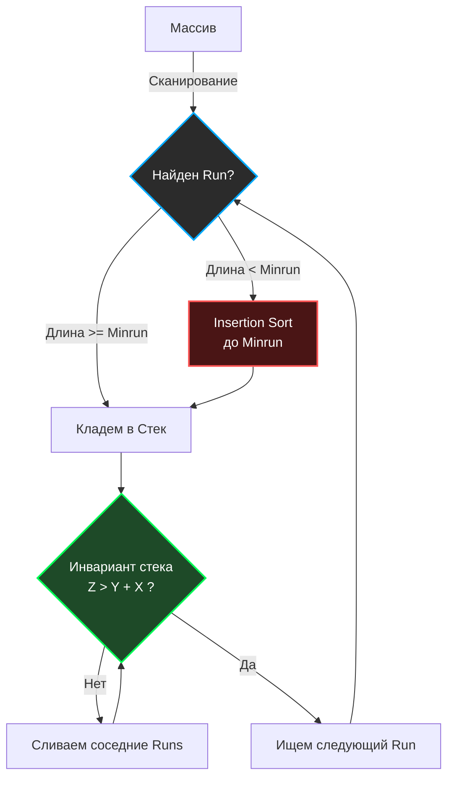

В предыдущих статьях мы разобрали классические алгоритмы: от hardware-оптимизированного на малых данных [[2. Insertion sort]] до тяжеловесных "Разделяй и властвуй" ([[3. Merge sort]], [[4. Quick sort]]). 

Каждый из этих алгоритмов исследовался академиками на идеально случайных (randomized) массивах. Но в 2002 году инженер Тим Петерс (Tim Peters), создавая сортировку для Python, задал фундаментальный вопрос: **А как выглядят данные в реальном мире?**

Оказалось, что в production-системах массивы редко бывают идеально случайными. В логах, выборках из БД и пользовательских списках почти всегда присутствуют **частично отсортированные подмассивы** (например, данные уже отсортированы по времени, но мы добавляем новые элементы в конец).

Так родился **Timsort** — гибридный, стабильный алгоритм сортировки, который использует симбиоз Сортировки слиянием и Сортировки вставками. Он настолько хорош на реальных данных, что стал стандартом по умолчанию в Python, Java, Android и V8 (JavaScript).

## Концепция 1: Охота на Серии (Runs)

Вместо того чтобы слепо разбивать массив пополам (как это делает классический Merge Sort), Timsort сканирует массив слева направо в поисках **Серий (Runs)** — непрерывных подмассивов, которые *уже отсортированы*.

Серия может быть:
1. **Строго возрастающей:** `a[0] <= a[1] <= a[2] ...`
2. **Строго убывающей:** `a[0] > a[1] > a[2] ...`

Если алгоритм находит убывающую серию, он за $O(N)$ меняет порядок её элементов на обратный (Reverse), превращая в возрастающую. Это гениальная оптимизация: мы бесплатно получаем отсортированные блоки просто за счет чтения данных.

### Minrun и спасительный Insertion Sort
Если найденная серия слишком короткая, алгоритм "добивает" её до минимального размера — **Minrun** (обычно от 32 до 64 элементов). 

Чтобы увеличить серию до `Minrun`, алгоритм захватывает следующие неотсортированные элементы массива и сортирует их с помощью **Сортировки вставками**. 

> [!info] Под капотом
> Почему `Minrun` равен 32-64? И почему используется Insertion Sort?
> Во-первых, 32-64 элемента идеально помещаются в L1-кэш процессора. 
> Во-вторых, как мы выяснили в статье [[2. Insertion sort]], на таких коротких дистанциях Сортировка вставками не имеет конкурентов из-за идеального Cache Locality и отсутствия накладных расходов на рекурсию.

## Концепция 2: Слияние и Инварианты Стека

Когда массив разбит на серии (Runs), их нужно слить (Merge), как в классической сортировке слиянием. Но мы не можем просто слить всё подряд — длины серий могут сильно отличаться, и слияние маленькой серии с огромной (несбалансированное слияние) убьет производительность.

Timsort использует **Стек серий**. Как только серия найдена, она помещается в стек. Алгоритм проверяет три верхние серии в стеке `[X, Y, Z]` на соблюдение двух инвариантов:
1. $Z > Y + X$
2. $Y > X$

Если инвариант нарушается, Timsort сливает `Y` с меньшей из серий `X` или `Z`. Это гарантирует, что мы всегда сливаем массивы примерно одинакового размера, сохраняя баланс дерева слияний и асимптотику $O(N \log N)$.

## Концепция 3: Режим Галопа (Galloping Mode)

Это главная "киллер-фича" Timsort при слиянии двух массивов.

В классическом Merge Sort при слиянии двух массивов `A` и `B` мы по одному сравниваем их элементы. Но представьте ситуацию, когда все элементы массива `A` значительно меньше первых 100 элементов массива `B`. Мы сделаем 100 бесполезных сравнений подряд! 

Для предсказателя ветвлений процессора (Branch Predictor) это тоже проблема: если один массив "побеждает" много раз подряд, предсказатель настраивается на это, но когда побеждает другой массив — происходит Branch Misprediction и сброс конвейера.

**Timsort вводит Галопирование:**
1. Если при слиянии элементы из одного массива выигрывают `N` раз подряд (обычно 7 раз), Timsort переключается в **режим галопа**.
2. Вместо линейного сравнения, алгоритм начинает экспоненциальный поиск ($1, 2, 4, 8, 16...$) места вставки первого элемента проигравшего массива в массив-победитель.
3. Найдя нужный диапазон, он делает бинарный поиск (Binary Search).
4. Затем он берет весь этот огромный кусок массива-победителя и копирует его **целиком** (блочное копирование памяти) в итоговый буфер.

## Mechanical Sympathy: Почему Timsort побеждает на практике?

1. **Эксплуатация порядка:** Если вы дадите Timsort уже отсортированный массив, он отработает за $O(N)$ (один проход, найдет одну серию, стек пуст). Bubble Sort и Insertion Sort тоже так умеют, но они падают до $O(N^2)$ в худшем случае. Timsort же всегда держит гарантию $O(N \log N)$.
2. **Блочное копирование:** Галопирование позволяет заменять тысячи поштучных копирований и сравнений в цикле на быстрые машинные инструкции перемещения блоков памяти (аналог `memmove` в C или `copy()` в Go).
3. **Стабильность:** Timsort стабилен (Stable). Он не меняет относительный порядок равных элементов.

> [!warning] Ловушка / Gotcha (Память)
> Как и любой алгоритм на базе Merge Sort, Timsort требует **дополнительной памяти**. В худшем случае ему нужен буфер размером $\frac{N}{2}$ для слияния. Поэтому он не является сортировкой In-place (в отличие от Quick Sort или Heap Sort).

## Timsort в экосистеме Go

> [!tip] Собеседование
> **Вопрос:** Используется ли Timsort в стандартной библиотеке Go (пакеты `sort` или `slices`)?
> **Ответ:** **Нет**. 

Философия Go и разработчиков рантайма заключается в минимизации скрытых аллокаций. Timsort требует выделения памяти под буфер слияния и стек серий. 

Вместо Timsort:
1. Для нестабильной сортировки (`slices.Sort`) Go использует гибридный **pdqsort (Pattern-Defeating Quicksort)**. Он сортирует In-Place (без доп. памяти), но тоже использует многие "трюки" из реального мира (поиск уже отсортированных паттернов, переключение на Insertion Sort для малых блоков).
2. Для стабильной сортировки (`slices.SortStableFunc`) Go использует алгоритм **SymMerge** (или его вариации). Это адаптивная сортировка слиянием In-Place (с использованием ротаций памяти), которая тоже ищет готовые серии (Runs) и использует Insertion Sort для фрагментов длиной до 20 элементов. 

Концептуально стабильная сортировка в Go очень близка к идеям Timsort (поиск серий + Сортировка вставками + Слияние), но реализована с упором на жесткую экономию памяти (Zero Allocation там, где это возможно).

Мы разобрали эволюцию сортировок от Bubble Sort до промышленных шедевров вроде Timsort. Теперь пришло время заглянуть под капот самого языка Go. Как именно Роб Пайк и команда реализовали `slices.Sort`? Какие гибридные мутации алгоритмов скрываются в рантайме? Мы разберем это на атомы в финальной статье раздела сортировок: [[9. Внутренности пакета sort в Go]].