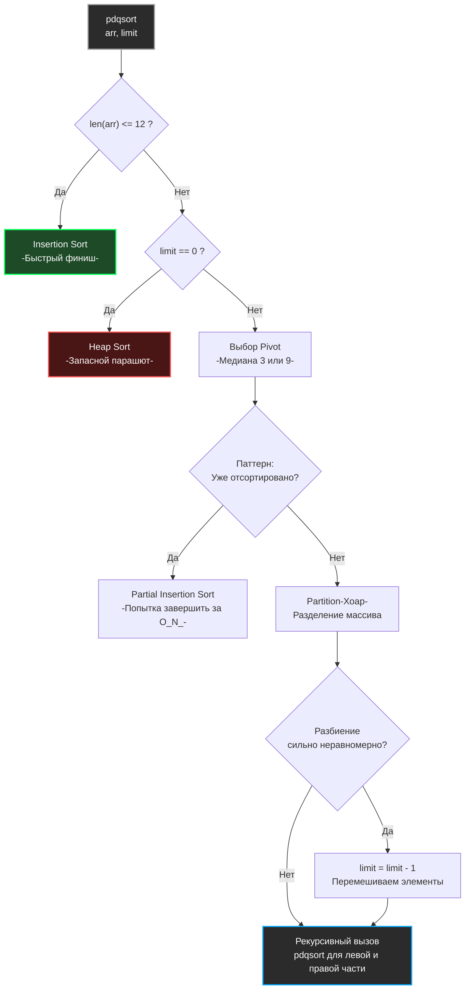

В предыдущих статьях мы разбирали алгоритмы сортировки в вакууме: изучали их математическую сложность, паттерны работы с кэшем процессора и слабости. Но когда вы вызываете `slices.Sort(arr)` в вашем production-коде, вы не запускаете чистый Quick Sort или Merge Sort. Вы запускаете промышленный шедевр, который вобрал в себя десятилетия исследований.

Пакет `sort` (и его современный дженерик-аналог `slices`) в Go пережил две фундаментальные революции: алгоритмическую (переход на `pdqsort` в Go 1.19) и архитектурную (переход на Generics в Go 1.21).

Для Senior-бэкендера понимание этих внутренностей — это не просто эрудиция, это ключ к написанию Zero-Allocation кода и пониманию того, как компилятор оптимизирует работу с памятью.

## Архитектурная революция: Интерфейсы vs Дженерики

До появления Go 1.21, если вы хотели отсортировать массив кастомных структур, вы обязаны были реализовать `sort.Interface`:

```go
// Как это было до Go 1.21 (Пакет sort)
type Users []User

func (a Users) Len() int           { return len(a) }
func (a Users) Swap(i, j int)      { a[i], a[j] = a[j], a[i] }
func (a Users) Less(i, j int) bool { return a[i].Age < a[j].Age }

// Вызов:
sort.Sort(Users(myUsers))
```

### Mechanical Sympathy: Налог на интерфейсы

С точки зрения математики алгоритм был быстрым ($O(N \log N)$). Но с точки зрения железа (Hardware) этот код страдал от огромных накладных расходов.

Алгоритм внутри пакета `sort` не знал, с какими данными он работает. Он общался с вашим срезом через `interface`.

Каждое сравнение (`Less`) и каждая перестановка (`Swap`) требовали **Динамической диспетчеризации (Dynamic Dispatch)**. Процессор не мог просто выполнить инструкцию сравнения двух чисел. Он должен был пойти в таблицу виртуальных методов (itab), найти адрес вашей функции `Less`, выполнить прыжок (Jump) по указателю, создать фрейм на стеке, выполнить сравнение, вернуть результат и очистить стек.

В Quick Sort для массива из миллиона элементов совершаются миллионы таких сравнений и свапов. Вызовы функций через интерфейс полностью убивали возможность компилятора сделать **Inlining** (встраивание кода) и ломали предсказание ветвлений (Branch Prediction).

### Эра Generics и Мономорфизация (`slices.Sort`)

С появлением пакета `slices` всё изменилось:

```go
// Как это работает сейчас (Go 1.21+)
slices.SortFunc(myUsers, func(a, b User) int {
	return cmp.Compare(a.Age, b.Age)
})
```

Вместо динамического интерфейса компилятор Go делает **Мономорфизацию (Monomorphization)**. Во время компиляции он берет обобщенный код алгоритма и генерирует его точную, типизированную копию специально для вашего `[]User`.

Нет никаких интерфейсов. Нет `itab`. Функция сравнения `cmp.Compare` инлайнится прямо в тело алгоритма сортировки. Инструкции превращаются в прямые машинные коды сравнения регистров (`CMP`).

> [!info] Под капотом
> 
> Переход от `sort` к `slices` ускорил сортировку базовых типов (int, string) в Go на **20-40%**, а сортировку сложных структур — **в 2 раза**, просто за счет устранения накладных расходов на вызовы методов интерфейса. Всегда используйте пакет `slices` в новом коде.

---

## Алгоритмическая революция: Pattern-Defeating Quicksort (pdqsort)

До версии 1.19 Go использовал алгоритм **IntroSort** (гибрид Quick Sort, Heap Sort и Insertion Sort). Но у него была слабость: он не умел адаптироваться к "реальным" данным (например, к массивам, где много одинаковых элементов или массивам, которые уже частично отсортированы).

В Go 1.19 разработчики внедрили алгоритм **pdqsort (Pattern-Defeating Quicksort)**, созданный Орсоном Петерсом.

Это алгоритм, который "побеждает паттерны". Он берет лучшее от Timsort (см. [[8. Tim sort концепция]]), но при этом остается In-Place алгоритмом, не требующим выделения памяти (O(1) дополнительной памяти).

### Три столпа `pdqsort` в Go

1. **База: Quick Sort (Схема Хоара).** В отличие от схемы Ломуто (которую мы писали в [[4. Quick sort]]), схема Хоара использует два указателя, идущих навстречу друг другу. Она делает в 3 раза меньше операций записи (swaps), что критически важно для экономии Memory Bandwidth.
2. **Финиш: Insertion Sort.** Если подмассив становится короче 12 элементов, `pdqsort` переключается на [[2. Insertion sort]]. Мы уже знаем, что на микро-дистанциях он обгоняет всех.
3. **Запасной парашют: Heap Sort.** Алгоритм ведет счетчик "плохих разбиений" (`limit = log2(N)`). Если `limit` падает до нуля, значит, Quick Sort буксует и деградирует в $O(N^2)$. В этот момент `pdqsort` безжалостно обрывает рекурсию и вызывает [[5. Heap sort]], жестко гарантируя $O(N \log N)$.

### Как `pdqsort` побеждает паттерны?

Алгоритм делает несколько гениальных эвристических проверок на каждом шаге рекурсии:

- **Паттерн: "Уже отсортировано".** При выборе Pivot (опорного элемента) `pdqsort` заодно проверяет, не отсортированы ли элементы вокруг него. Если алгоритм замечает, что массив "слишком правильный", он делает оптимистичный проход вставками (Partial Insertion Sort). Если массив действительно уже отсортирован, сортировка завершается за $O(N)$!
- **Паттерн: "Отсортировано в обратном порядке".** Если `pdqsort` видит строгое убывание, он просто переворачивает массив (Reverse) за $O(N)$ машинных тактов, вместо того чтобы мучительно сортировать его.
- **Паттерн: "Много дубликатов".** В классическом Quick Sort массив из миллиона нулей приведет к квадратичной сложности $O(N^2)$. `pdqsort` отслеживает ситуацию, когда после разбиения множество элементов оказываются равны Pivot. Он изолирует эти дубликаты в центре и не включает их в следующие рекурсивные вызовы, отбрасывая целые блоки за одну операцию.

## Анатомия рантайма: Дерево принятия решений

Давайте визуализируем, как работает функция `sort` внутри пакета `slices` для каждого переданного ей подмассива.



> [!warning] Ловушка / Gotcha (Стабильность)
> 
> Стандартный `slices.Sort` (или `sort.Slice`) использует `pdqsort`, который **НЕ ЯВЛЯЕТСЯ стабильной сортировкой**. Порядок одинаковых элементов может перемешаться.
> 
> Если вам нужна стабильность (сохранение изначального порядка равных элементов), вы обязаны использовать `slices.SortStableFunc`.
> 
> Внутри `SortStableFunc` Go использует совершенно другой алгоритм — вариацию **Сортировки слиянием (SymMerge)** с оптимизациями In-Place ротаций. Он работает медленнее `pdqsort` и выделяет дополнительную память, но гарантирует стабильность.

## Вопросы с собеседований уровня Senior

> [!tip] Собеседование
> 
> **Вопрос 1:** В пакете `sort` есть функция `sort.Search` (которую заменил `slices.BinarySearch`). Как `sort.Search` работает под капотом, если мы передаем ей функцию `func(i int) bool`, а не значение?
> 
> **Ответ:** Это паттерн для обобщенного бинарного поиска (см. следующую главу). `sort.Search` ничего не знает о данных, она просто генерирует индексы от `0` до `N` и вызывает вашу функцию-предикат. Функция должна вернуть `true`, если условие выполнено, и алгоритм сдвигает правую границу. Это позволяет использовать бинарный поиск не только для массивов, но и для математических вычислений (например, найти минимальное время выполнения процесса).
> 
> **Вопрос 2:** Если `pdqsort` такой умный и работает In-Place, зачем Python и Java продолжают использовать Timsort?
> 
> **Ответ:** Timsort изначально проектировался как **строго стабильная** сортировка. Для Python и Java стабильность сортировки объектов — это стандарт языка, заложенный в спецификацию. Go же сделал прагматичный выбор: по умолчанию предоставить максимально быструю нестабильную сортировку In-Place, а стабильную вынести в отдельную функцию для тех редких случаев, когда она действительно нужна, не заставляя всех платить налог на память Timsort-а.

## Итог раздела Сортировок

Мы завершили огромный путь по алгоритмам упорядочивания данных:

1. Мы поняли, что алгоритмы $O(N^2)$ (Insertion Sort) не мусор, а важнейший винтик оптимизации L1-кэша.
2. Мы изучили мощь и слабость In-Place сортировок (Quick Sort) и прожорливость к памяти стабильных сортировок (Merge Sort).
3. Мы взломали $O(N \log N)$ лимит с помощью линейных алгоритмов (Counting Sort).
4. Мы посмотрели на промышленный код `pdqsort` в Go, который побеждает предсказатель ветвлений и объединяет лучшее из трех миров.

Но данные сортируются не просто так. Они сортируются для того, чтобы в них можно было **мгновенно искать информацию**.

Мы переходим к следующему фундаментальному разделу бэкенд-инженерии. Мы начнем с самого базового, но крайне важного для понимания кэш-промахов алгоритма. В следующей статье: [[1. Линейный поиск]].