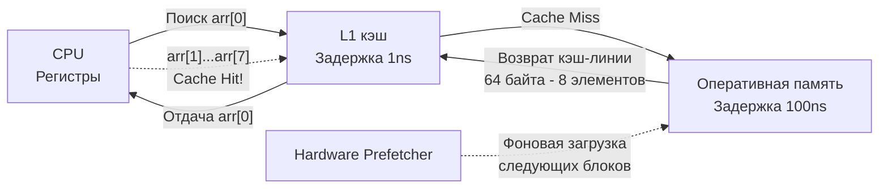

Линейный поиск (Linear Search) — это самый примитивный, интуитивно понятный и, на первый взгляд, алгоритмически "скучный" метод поиска данных. Мы просто берем массив и проверяем каждый элемент по очереди с начала до конца, пока не найдем искомое.

Однако для бэкенд-разработчика уровня Senior линейный поиск таит в себе глубокие инженерные секреты. В реальных высоконагруженных системах линейный скан часто побеждает алгоритмически более эффективные структуры (такие как сбалансированные деревья или даже бинарный поиск) на малых и средних наборах данных.

## Mechanical Sympathy: Почему O(N) может быть быстрее O(log N)?

С точки зрения сухой математики Big O, линейный поиск работает за $O(N)$, а бинарный поиск (или поиск по дереву) — за $O(\log N)$. Кажется, что логарифм всегда лучше. Но процессоры не исполняют математические формулы, они работают с кремнием и физической памятью.

Как мы разбирали в статье [[4. Пространственная сложность и cache locality]], узкое место современного железа — это доступ к оперативной памяти (RAM). Задержка доступа к RAM составляет около 100 наносекунд, в то время как доступ к L1-кэшу — около 1 наносекунды.

Когда вы выполняете линейный поиск по непрерывному массиву (слайсу) в Go, происходит магия аппаратного ускорения:
1. **Кэш-линии (Cache Lines):** Процессор читает данные блоками по 64 байта. Если вы ищете число `int64` (8 байт), одно обращение к RAM автоматически подтягивает в L1-кэш сразу 8 элементов. Следующие 7 проверок в вашем цикле `for` выполнятся за 1 такт каждая.
2. **Аппаратный предсказатель (Hardware Prefetcher):** Кристалл CPU видит, что вы читаете память линейно (индексы $0, 1, 2, 3\dots$). Prefetcher начинает асинхронно, в фоновом режиме загружать следующие кэш-линии из RAM в L2 и L1 кэши еще **до того**, как ваш код их запросит.



**Следствие:** На небольших массивах (на современных архитектурах это примерно до 100-200 элементов) линейный скан непрерывного куска памяти выполняется **значительно быстрее**, чем прыжки по узлам бинарного дерева (где каждый прыжок — это промах кэша, Pointer Chasing и сброс Prefetcher-а) или даже бинарный поиск по массиву (из-за branch misprediction — непредсказуемых ветвлений).

> [!tip] Собеседование
> **Вопрос:** Если есть массив из 50 элементов, что лучше использовать для поиска: бинарный поиск, `map` (хеш-таблицу) или линейный поиск?
> **Ответ:** Линейный поиск. На таких объемах оверхед на вычисление хеша в `map` или непредсказуемые ветвления (Branching) в бинарном поиске обойдутся процессору дороже, чем простое последовательное чтение 50 элементов (всего одна кэш-линия на 64 байта вмещает 8 интов, весь массив поместится в L1-кэш почти мгновенно).

## Реализация на Go (Idiomatic & Generic)

С выходом Go 1.18 мы можем написать универсальную функцию линейного поиска с помощью дженериков (Generics), используя ограничение `comparable` (типы, которые можно сравнивать оператором `==`).

```go
package main

// LinearSearch возвращает индекс найденного элемента или -1, если элемента нет.
// T comparable разрешает использовать любые типы: int, string, структуры (без слайсов внутри).
func LinearSearch[T comparable](arr []T, target T) int {
	for i, val := range arr {
		if val == target {
			return i
		}
	}
	return -1
}
```

### Стандартная библиотека (Go 1.21+)

Начиная с версии 1.21, в Go появился пакет `slices`, который реализует все базовые операции из коробки. Больше не нужно писать `LinearSearch` вручную.

```go
import "slices"

func main() {
    data := []string{"apple", "banana", "cherry"}
    
    // Линейный поиск, возвращает индекс
    idx := slices.Index(data, "banana") // Вернет 1
    
    // Линейный поиск, возвращает bool
    found := slices.Contains(data, "cherry") // Вернет true
}
```

> [!info] Под капотом: Bounds Check Elimination (BCE)
> Go — безопасный язык, поэтому при каждом доступе к элементу слайса по индексу `arr[i]` рантайм должен убедиться, что `i` не выходит за границы длины слайса (`len(arr)`). Если выходит — происходит `panic`. 
> Эти проверки границ добавляют лишние инструкции в скомпилированный машинный код.
> Однако компилятор Go использует механизм **Bounds Check Elimination (BCE)**. Когда вы пишете идиоматичный цикл `for i, val := range arr`, компилятор *математически доказывает*, что `i` никогда не выйдет за границы `arr`. В результате он **вырезает** проверки границ из финального ассемблерного кода, делая линейный поиск в Go таким же быстрым, как в сыром C или C++.
> Проверить это можно, скомпилировав код с флагом: `go build -gcflags="-d=ssa/check_bce"`.

## Временная и пространственная сложность

* **Время:** * В лучшем случае: $O(1)$ (искомый элемент — первый).
  * В худшем случае: $O(N)$ (элемент последний или его нет).
  * В среднем: $O(N/2)$, что асимптотически равно $O(N)$.
* **Память:** $O(1)$ — мы не аллоцируем никакой дополнительной памяти, поиск работает *in-place*.

## Итог

1. **Линейный поиск** — это базовая операция со сложностью $O(N)$, которая проверяет элементы последовательно.
2. Благодаря **Hardware Prefetcher** и **Spatial Locality** (кэш-линиям CPU), линейный поиск является абсолютным чемпионом по скорости на малых структурах данных (до 100-200 элементов), обходя более сложные алгоритмы.
3. В Go для линейного поиска всегда используйте `for ... range` (чтобы триггерить BCE и убрать проверки границ) или готовые функции `slices.Index` и `slices.Contains`.
4. Главный минус линейного поиска: он катастрофически не масштабируется. Если в массиве 1 миллиард записей, линейный скан убьет latency вашего сервиса.

Когда данные отсортированы, а их объем становится слишком большим для эффективного использования кэша процессора (миллионы строк), мы должны радикально изменить подход и отбрасывать половину вариантов на каждом шаге. Переходим к золотому стандарту поиска: [[2. Бинарный поиск]].