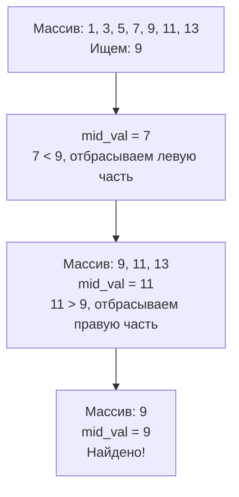

В статье [[1. Линейный поиск]] мы выяснили, что на небольших объемах данных железо (кэш-линии процессора и Hardware Prefetcher) способно вытянуть $O(N)$ и сделать его быстрее более сложных алгоритмов. 

Но когда размер непрерывного массива (слайса) переваливает за несколько тысяч элементов, физика перестает спасать. Для поиска среди миллионов записей мы обязаны снизить асимптотическую сложность. И если данные **отсортированы**, мы можем применить абсолютную классику алгоритмики — **Бинарный поиск (Binary Search)**, который работает за логарифмическое время $O(\log N)$.

## Механика алгоритма

Бинарный поиск использует парадигму «Разделяй и властвуй» (Divide and Conquer). 
Вместо того чтобы проверять элементы по одному, мы смотрим точно в середину массива:
1. Если элемент в середине равен искомому — мы победили.
2. Если искомое значение *меньше* среднего, значит оно (если вообще есть) находится в левой половине массива. Правую половину можно отбросить целиком.
3. Если искомое значение *больше* среднего, отбрасываем левую половину и ищем в правой.

На каждом шаге мы сокращаем пространство поиска ровно в 2 раза. Для массива из 1 миллиарда элементов нам потребуется максимум $30$ проверок ($\log_2 10^9 \approx 30$).



## Mechanical Sympathy: Проблемы бинарного поиска на уровне CPU

Для Senior-разработчика важно понимать, что бинарный поиск — это **враг современного процессора**. Несмотря на идеальную $O(\log N)$ математику, на уровне исполнения инструкций он страдает от двух тяжелых архитектурных проблем:

### 1. Branch Misprediction (Ошибка предсказания ветвлений)
Процессоры используют конвейеры (Pipelines). Чтобы конвейер не простаивал во время выполнения условия `if arr[mid] < target`, блок **Branch Predictor** пытается угадать, куда пойдет выполнение, и заранее выполняет инструкции этой ветви (Спекулятивное выполнение).
В линейном поиске условие `if arr[i] == target` почти всегда ложно (пока мы не найдем элемент). Предсказатель легко угадывает это "False, False, False...".
В бинарном поиске вероятность того, что мы пойдем влево или вправо, равна **почти 50/50**. Предсказатель ветвлений постоянно ошибается. Каждая ошибка приводит к сбросу конвейера (Pipeline Flush), что стоит процессору 15-20 потерянных тактов.

### 2. Cache Misses (Промахи кэша)
На первых итерациях алгоритма мы прыгаем по памяти гигантскими шагами (на $N/2$, затем на $N/4$). Аппаратный Prefetcher не видит в этом паттерне никакой линейности. Он не подтягивает нужные кэш-линии заранее. 
Поэтому каждый шаг в начале бинарного поиска большого массива — это гарантированный **Cache Miss** и обращение к медленной оперативной памяти (DRAM, ~100 наносекунд).

> [!info] Под капотом: Гибридные подходы
> Именно поэтому в экстремально высоконагруженных системах (например, в движках СУБД) используют гибридный подход. Бинарный поиск сужает диапазон до размера одной-двух кэш-линий (64-128 байт, это около 8-16 элементов `int64`), после чего алгоритм переключается на обычный **линейный поиск** или использует SIMD (векторные инструкции процессора), чтобы обработать остаток без ветвлений и промахов кэша.

## Реализация на Go (Idiomatic)

Напишем классическую реализацию бинарного поиска с использованием дженериков для любых сравниваемых типов `cmp.Ordered`.

```go
package main

import "cmp"

// BinarySearch возвращает индекс элемента или -1, если он не найден.
func BinarySearch[T cmp.Ordered](arr []T, target T) int {
	left := 0
	right := len(arr) - 1

	for left <= right {
		// Классическая ловушка вычисления середины
		mid := left + (right - left) / 2
		
		if arr[mid] == target {
			return mid // Нашли
		} else if arr[mid] < target {
			left = mid + 1 // Ищем в правой половине
		} else {
			right = mid - 1 // Ищем в левой половине
		}
	}

	return -1 // Не нашли
}
```

> [!warning] Ловушка / Gotcha: Переполнение при вычислении mid
> Исторически (даже в первых версиях Java) середину считали как `mid := (left + right) / 2`. Если `left` и `right` очень большие (близки к `math.MaxInt`), их сложение вызовет целочисленное переполнение (Integer Overflow), `mid` станет отрицательным, и программа упадет с `panic: index out of range`.
> 
> Безопасный метод: `mid := left + (right - left) / 2`. 
> 
> **Go-специфика:** В Go тип `int` на 64-битных системах вмещает $9 \times 10^{18}$. Создать слайс такого размера физически невозможно (не хватит RAM во всем мире). Поэтому в Go `(left + right) / 2` переполнится крайне маловероятно. 
> Рантайм Go в пакете `sort` делает еще хитрее, используя беззнаковый сдвиг: `mid := int(uint(left+right) >> 1)`. Это решает проблему переполнения (так как `uint` сбрасывает знаковый бит) и заменяет деление на сверхбыструю побитовую операцию за 1 такт CPU.

## Стандартная библиотека Go (Эволюция)

До версии Go 1.21 стандартным способом бинарного поиска был пакет `sort` и функция `sort.Search`.

```go
// СТАРЫЙ ПОДХОД (Go < 1.21)
arr := []int{1, 3, 5, 7, 9}
target := 5

// sort.Search принимает длину и функцию-предикат (Closure)
idx := sort.Search(len(arr), func(i int) bool {
    return arr[i] >= target
})

if idx < len(arr) && arr[idx] == target {
    // Нашли
}
```
**Архитектурный минус `sort.Search`:** Передача функции-замыкания (Closure) `func(i int) bool` на каждую итерацию алгоритма добавляет накладные расходы на вызов функции (Function Call Overhead) и мешает компилятору инлайнить код (Inlining).

### Новый подход: slices.BinarySearch (Go 1.21+)

С появлением дженериков стандартная библиотека пополнилась пакетом `slices`, который реализует бинарный поиск без замыканий, напрямую сравнивая элементы. Это работает значительно быстрее.

```go
// НОВЫЙ ПОДХОД (Go 1.21+)
import "slices"

arr := []int{1, 3, 5, 7, 9}
target := 5

// Возвращает индекс и флаг успешного поиска
idx, found := slices.BinarySearch(arr, target)
if found {
    fmt.Printf("Найдено на индексе: %d\n", idx)
}
```

> [!tip] Собеседование
> **Вопрос:** Что вернет `slices.BinarySearch(arr, 4)` для массива `[1, 3, 5, 7]`, если числа `4` в нем нет?
> **Ответ:** Она вернет `idx = 2, found = false`. 
> Индекс `2` — это позиция, на которой стоит `5`. Это **точка вставки (Insertion Point)**. То есть место, куда мы должны вставить число `4`, чтобы массив остался отсортированным. Эта механика критически важна для поддержания отсортированных массивов в актуальном состоянии без полных пересортировок.

## Итог

1. **Бинарный поиск** — фундаментальный алгоритм с логарифмической $O(\log N)$ сложностью, работающий только на отсортированных коллекциях.
2. Требует знания подводных камней железа: он страдает от **Cache Misses** на начальных итерациях и сбрасывает конвейер процессора из-за **Branch Misprediction**.
3. Правильное вычисление середины: `left + (right - left) / 2` или `int(uint(left+right) >> 1)`, чтобы избежать потенциального переполнения.
4. В современном Go (1.21+) всегда используйте `slices.BinarySearch`. Избегайте старого `sort.Search` с коллбеком в узких и высоконагруженных местах.

Возврат "точки вставки" при неудачном поиске — это не просто удобство. Это основа для решения огромного класса задач, связанных с диапазонами данных. Как найти первое вхождение повторяющегося элемента? Как найти количество чисел на отрезке? Для этого бинарный поиск модифицируется, и в следующей статье мы разберем эти хардкорные вариации: [[3. Lower bound, upper bound]].