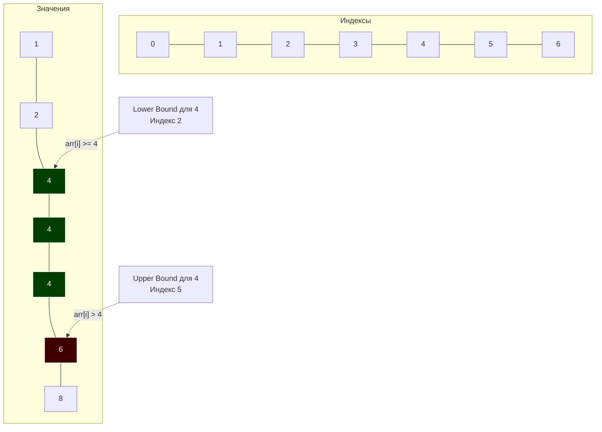

В статье [[2. Бинарный поиск]] мы разобрали классический алгоритм поиска за $O(\log N)$. У него есть одна особенность: если в массиве есть несколько одинаковых элементов, классический бинарный поиск (с условием `arr[mid] == target`) вернет индекс *любого* из них (того, в который мы случайно попали при делении пополам).

Для бизнес-логики этого часто недостаточно. Что если нам нужно найти **первое** вхождение элемента? Или узнать **количество** таких элементов в массиве? А если элемента нет, где именно его законное место?

В системном программировании (особенно при разработке движков баз данных) эти задачи решаются модификациями бинарного поиска: алгоритмами **Lower Bound** и **Upper Bound** (Нижняя и Верхняя границы).

## Анатомия границ

Представим отсортированный массив с дубликатами: `[1, 2, 4, 4, 4, 6, 8]`
Мы ищем число `4`.

1. **Lower Bound (Нижняя граница):** Находит индекс **первого элемента, который больше или равен** ( $\ge$ ) искомому.
   * Для `4` это будет индекс `2` (первая четверка).
   * Если мы ищем `5` (которого нет), Lower Bound вернет индекс `5` (число `6`). Это **Точка вставки (Insertion Point)**.
2. **Upper Bound (Верхняя граница):** Находит индекс **первого элемента, который строго больше** ( $>$ ) искомого.
   * Для `4` это будет индекс `5` (число `6`).



> [!info] Под капотом: Базы данных и B+ деревья
> Зачем это бэкендеру? Вспомните SQL-запрос: `SELECT * FROM users WHERE age >= 18 AND age <= 30`. 
> Индекс БД (обычно это B+ дерево, см. [[3. B дерево и B+ дерево]]) использует именно **Lower Bound**, чтобы за $O(\log N)$ найти первый лист, где `age == 18`. После этого он просто читает элементы линейно (по связному списку в листьях дерева), пока не встретит **Upper Bound** для `30`. Эти два алгоритма — фундамент работы любых Range-запросов.

## Mechanical Sympathy: Безветвистая магия

Давайте посмотрим на классический бинарный поиск:
```go
if arr[mid] == target { return mid }
else if arr[mid] < target { left = mid + 1 }
else { right = mid - 1 }
```
Здесь у нас три ветви логики. Как мы говорили ранее, Branch Predictor процессора ненавидит бинарный поиск, потому что переходы случайны.

Алгоритмы Lower/Upper Bound элегантнее. Они избавляются от проверки на равенство (`==`). Мы **никогда не возвращаем результат досрочно**. Мы сужаем границы `left` и `right`, пока они не схлопнутся в одну точку. Это уменьшает количество ветвлений (условий `if`) в цикле до одного. Процессору проще переваривать такой код (меньше инструкций условного перехода, лучше pipeline), даже несмотря на то, что мы всегда делаем строго $\log_2 N$ итераций, не имея шанса "повезти" на первой итерации.

## Реализация на Go (Idiomatic)

### 1. Lower Bound

```go
package main

import "cmp"

// LowerBound возвращает индекс первого элемента >= target.
// Если все элементы меньше target, вернет len(arr).
func LowerBound[T cmp.Ordered](arr []T, target T) int {
	left := 0
	right := len(arr) // Внимание: right указывает ЗА пределы массива

	for left < right {
		mid := left + (right - left) / 2
		
		if arr[mid] >= target {
			// Если элемент больше или равен, он МОЖЕТ быть нижней границей.
			// Сужаем правую границу, включая сам элемент.
			right = mid
		} else {
			// Элемент строго меньше, он точно не подходит.
			// Начинаем поиск со следующего.
			left = mid + 1
		}
	}

	return left // В этот момент left == right
}
```

### 2. Upper Bound

```go
// UpperBound возвращает индекс первого элемента строго > target.
func UpperBound[T cmp.Ordered](arr []T, target T) int {
	left := 0
	right := len(arr)

	for left < right {
		mid := left + (right - left) / 2
		
		if arr[mid] > target { // ЕДИНСТВЕННОЕ ОТЛИЧИЕ: строго больше (>)
			right = mid
		} else {
			left = mid + 1
		}
	}

	return left
}
```

> [!warning] Ловушка / Gotcha: Бесконечный цикл
> Обратите внимание на инициализацию `right := len(arr)` и условие `left < right` (без знака равенства). В классическом бинарном поиске мы писали `right := len(arr) - 1` и `left <= right`. 
> Если вы попытаетесь смешать эти два подхода (например, напишете `right = mid` в цикле с `left <= right`), вы получите **бесконечный цикл** (infinite loop), когда `left` и `right` будут указывать на один и тот же индекс.

## Стандартная библиотека Go (slices.BinarySearch)

В Go 1.21+ функция `slices.BinarySearch` под капотом использует не классический бинарный поиск, а именно логику **Lower Bound**.

Если вы заглянете в исходники рантайма (`src/slices/sort.go`), вы увидите там практически ту же реализацию, что написана выше.

```go
import (
	"fmt"
	"slices"
)

func main() {
	arr := []int{1, 2, 4, 4, 4, 6, 8}
	
	// Возвращает (индекс, bool)
	idx, found := slices.BinarySearch(arr, 4)
	fmt.Printf("Index: %d, Found: %v\n", idx, found) // Index: 2, Found: true
	
	// Ищем элемент, которого нет
	idx, found = slices.BinarySearch(arr, 5)
	fmt.Printf("Index: %d, Found: %v\n", idx, found) // Index: 5, Found: false
}
```
**Важно:** Возвращаемый `idx` — это всегда Lower Bound. Если `found == false`, этот индекс указывает, куда безопасно сделать `insert`, чтобы массив остался отсортированным, не нарушая работу кэша и $O(\log N)$ свойств структуры.

## Паттерны задач (Собеседования)

Если на собеседовании (Middle/Senior) звучит формулировка "отсортированный массив" — это 100% сигнал к применению бинарного поиска или его границ.

### Паттерн 1: Подсчет дубликатов (Count Occurrences)
**Задача:** Дан отсортированный массив `arr` и число `X`. Узнать, сколько раз `X` встречается в массиве за $O(\log N)$.
**Решение:** Линейный скан (см. [[1. Линейный поиск]]) после нахождения элемента займет $O(N)$, что провалит тайминг на огромных массивах с миллионами дубликатов.
Используем границы: `count := UpperBound(arr, X) - LowerBound(arr, X)`. Всё! Ровно $2 \times \log_2 N$ операций.

### Паттерн 2: Поиск последнего вхождения
**Задача:** Найти индекс *последнего* вхождения числа `X`.
**Решение:** `idx := UpperBound(arr, X) - 1`. Если `idx >= 0 && arr[idx] == X`, вы нашли последний элемент.

> [!tip] Собеседование: Историческая справка `sort.Search`
> Вас могут спросить, как работал `sort.Search` до появления пакета `slices` и дженериков.
> Функция `sort.Search(n int, f func(int) bool)` принимала длину `n` и функцию `f`. Алгоритм искал **наименьший индекс**, для которого функция `f` возвращала `true`. То есть `sort.Search` — это буквально дженерик-реализация Lower Bound через замыкание.
> Чтобы найти `target = 4`, вы писали: `f := func(i int) bool { return arr[i] >= 4 }`.

## Итог

1. **Lower Bound** и **Upper Bound** — это модификации бинарного поиска, которые никогда не останавливаются досрочно, а сужают окно до одной точки.
2. Алгоритмы избавляют от лишних ветвлений (Branching) в цикле, делая код более предсказуемым для конвейера процессора.
3. Разница между Lower и Upper Bound (в индексах) дает точное **количество** искомых элементов в массиве.
4. В современном Go встроенная функция `slices.BinarySearch` реализует поведение **Lower Bound**, возвращая точку вставки (Insertion Point), если элемент не найден.

Бинарный поиск и его границы прекрасно работают, когда у нас есть одна цель (одно число или диапазон) и статический массив. Но что делать, если нужно найти пару чисел в отсортированном массиве (например, которые в сумме дают X), или обработать подмассив (слайс) определенной длины? Здесь на помощь приходит совершенно другой класс оптимизаций. В следующей статье мы разберем: [[4. Два указателя - техника two pointers]].