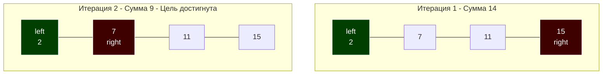

В предыдущих статьях ([[1. Линейный поиск]] и [[2. Бинарный поиск]]) мы рассматривали алгоритмы, использующие **один** активный индекс (или указатель) для сканирования данных. Линейный поиск идет подряд, а бинарный прыгает по вычисленным средним точкам.

Однако существует целый класс задач, где использование одного индекса приводит к катастрофической асимптотической сложности $O(N^2)$ (вложенные циклы). Чтобы свести сложность к элегантному $O(N)$ без затрат дополнительной памяти ($O(1)$), алгоритмика использует технику **Двух указателей (Two Pointers)**.

## Что такое техника двух указателей?

Это не конкретный алгоритм, а **архитектурный паттерн** обхода линейных структур (массивов, слайсов, связных списков). Суть заключается в использовании двух целочисленных переменных (индексов), которые движутся по коллекции по определенным правилам, пока не выполнят задачу или не пересекутся.

## Mechanical Sympathy: Идеальный код для железа

Почему техника двух указателей так любима разработчиками высоконагруженных систем?

1. **Zero Allocations (Ноль аллокаций):** Паттерн работает *in-place*. Мы меняем элементы местами внутри существующего слайса. Это значит, что метрика GC Churn равна нулю. Сборщик мусора в Go даже не проснется.
2. **Кэш-френдли (Cache-friendly):** В отличие от бинарного дерева поиска, где узлы разбросаны по куче, два указателя бегают по непрерывному массиву. 
   Современные процессоры (Intel, AMD, Apple Silicon) имеют продвинутые аппаратные предсказатели (Hardware Prefetchers). Они способны отслеживать **несколько независимых потоков чтения** (Data Streams) одновременно. Если один указатель читает массив слева направо, а другой справа налево, Prefetcher мгновенно это поймет и начнет подтягивать нужные кэш-линии с обоих концов массива прямо в L1-кэш.

## Паттерн 1: Встречное движение (Opposite Ends)

Самый популярный вариант. Один указатель (`left`) ставится в начало массива, второй (`right`) — в конец. Они движутся навстречу друг другу, пока не встретятся (`left >= right`).

**Где применяется:** Разворот массива, поиск пары в отсортированном массиве (Two Sum II), проверка на палиндром, задачи на площади (Container With Most Water).

### Пример с собеседования: Two Sum II (Отсортированный массив)
**Задача:** Дан отсортированный по возрастанию массив чисел и целевая сумма `target`. Найти индексы двух чисел, которые в сумме дают `target`. Использовать $O(1)$ памяти.

Если использовать вложенные циклы — это $O(N^2)$. Если использовать хеш-таблицу — это $O(N)$ по времени, но $O(N)$ по памяти. Два указателя дают **$O(N)$ по времени и $O(1)$ по памяти**.

```go
package main

// TwoSum возвращает значения (не индексы, для простоты), дающие target
func TwoSum(arr []int, target int) (int, int, bool) {
	left := 0
	right := len(arr) - 1 // Указатель на конец

	for left < right {
		sum := arr[left] + arr[right]

		if sum == target {
			return arr[left], arr[right], true // Нашли пару
		}
		
		// Магия отсортированного массива:
		if sum < target {
			// Сумма слишком маленькая. Левый указатель "слабый", 
			// нужно взять число побольше -> двигаем левый вправо.
			left++
		} else {
			// Сумма слишком большая. Правый указатель "перебрал",
			// нужно взять число поменьше -> двигаем правый влево.
			right--
		}
	}

	return 0, 0, false
}
```



## Паттерн 2: Быстрый и медленный указатель (Fast & Slow / Runner)

Оба указателя начинают с начала массива и движутся в одном направлении, но с разной скоростью или по разным условиям. 

* `fast` (быстрый) — скаут, бежит вперед и исследует элементы.
* `slow` (медленный) — хранитель состояния, указывает на позицию, куда нужно записать "правильный" результат.

**Где применяется:** Удаление дубликатов in-place, перенос нулей в конец (Move Zeroes), поиск цикла в связном списке (Алгоритм Флойда, см. [[3. Связные списки]]).

### Пример с собеседования: Удаление дубликатов (Remove Duplicates)
**Задача (LeetCode 26):** Дан отсортированный массив. Удалите дубликаты in-place так, чтобы каждый элемент встречался только один раз, и верните новую длину массива.

```go
// RemoveDuplicates модифицирует слайс на месте и возвращает новую "виртуальную" длину
func RemoveDuplicates(arr []int) int {
	if len(arr) <= 1 {
		return len(arr)
	}

	// slow указывает на последний уникальный элемент, который мы нашли
	slow := 0 

	// fast бежит вперед и ищет новые уникальные элементы
	for fast := 1; fast < len(arr); fast++ {
		// Если fast нашел что-то новое (отличается от того, где стоит slow)
		if arr[fast] != arr[slow] {
			slow++                  // Сдвигаем slow на новую позицию
			arr[slow] = arr[fast]   // Записываем туда новое уникальное значение
		}
	}

	// slow - это индекс. Длина - это индекс + 1.
	// Остаток массива (мусор) нас не волнует.
	return slow + 1
}
```

> [!warning] Ловушка / Gotcha: Утечки памяти при In-place удалении
> В задаче выше мы возвращаем `slow + 1`. Массив логически обрезан, но физически (backing array слайса) элементы остались в памяти. 
> Если это массив примитивов (`int`), всё отлично. Но если это слайс указателей (например, `[]*User`), то "мусорные" элементы в хвосте массива будут держать ссылки на объекты, не давая Garbage Collector-у освободить память. 
> В таких случаях **обязательно** нужно зачищать хвост нулями (`nil`):
> ```go
> for i := slow + 1; i < len(arr); i++ {
>     arr[i] = nil 
> }
> ```

## Под капотом Go: Bounds Check Elimination (BCE)

Мы знаем, что Go вставляет проверки границ (bounds checks) при каждом доступе к слайсу `arr[i]`, чтобы избежать уязвимостей памяти и выдать `panic`. 

Когда вы используете классический цикл `for _, v := range arr`, компилятор доказывает безопасность и вырезает проверки (BCE). 
Но в технике двух указателей компилятору гораздо сложнее математически доказать, что `left` и `right` не выйдут за пределы.

В коде `TwoSum`:
```go
sum := arr[left] + arr[right]
```
Компилятор с большой вероятностью **оставит** проверку `if left >= len(arr) { panic }` и `if right >= len(arr) { panic }` прямо внутри вашего горячего цикла $O(N)$. Это добавит несколько лишних ассемблерных инструкций ветвления на каждую итерацию.

> [!tip] Хардкорная оптимизация (Только для Highload!)
> Если этот цикл лежит на критическом пути выполнения и съедает CPU, вы можете помочь компилятору (хинт для BCE), добавив ручную "пустышку"-проверку перед циклом или в начале:
> ```go
> _ = arr[len(arr)-1] // Хинт: массив точно имеет эту длину
> ```
> Использовать это нужно исключительно после профилирования (pprof) и анализа ассемблерного кода `go build -gcflags="-d=ssa/check_bce"`.

## Итог

1. **Два указателя** — это не структура данных, а механизм эффективного сканирования коллекций, снижающий сложность алгоритмов с $O(N^2)$ до $O(N)$.
2. Он идеален для **Mechanical Sympathy**, так как работает in-place (без нагрузки на GC) и позволяет аппаратному Prefetcher-у эффективно подгружать кэш-линии.
3. Различают два основных паттерна: встречное движение (`left` и `right`) и однонаправленное движение быстрым и медленным скаутом (`fast` и `slow`).
4. При работе с указателями (референсными типами) не забывайте явно затирать "мусорные" остатки слайса `nil`-значениями, чтобы избежать утечек памяти (Memory Leaks).

Техника двух указателей прекрасна, когда нас интересуют отдельные элементы или их комбинации. Но что если бизнес-логика требует от нас анализировать *непрерывные подмассивы*? Например, найти максимальную сумму транзакций за 3 подряд идущих дня. Для этого два указателя модифицируются в концепцию окна, которую мы разберем в следующей статье: [[5. Sliding window - скользящее окно]].