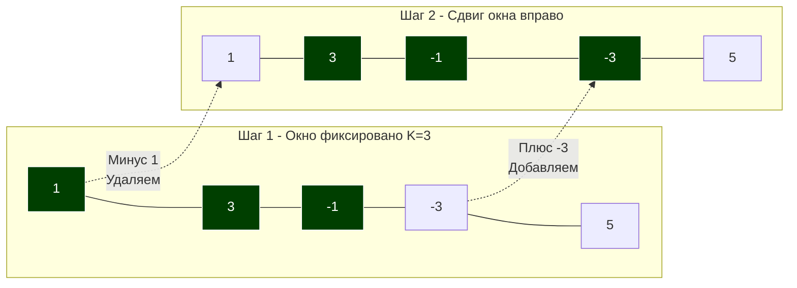

В статье [[4. Два указателя - техника two pointers]] мы научились элегантно и без дополнительных аллокаций памяти сканировать коллекции с помощью двух независимых индексов. Но что делать, если бизнес-логика требует от нас анализировать не отдельные элементы, а **непрерывные последовательности** (подмассивы, подстроки)? 

Например: найти максимальную сумму транзакций за 3 подряд идущих дня, реализовать Rate Limiter для API (ограничение запросов в секунду) или найти самую длинную подстроку без повторяющихся символов.

Для решения этих задач применяется специализированный подвид двух указателей — паттерн **Скользящее окно (Sliding Window)**.

## Анатомия скользящего окна

Представьте себе массив как длинную ленту, на которую вы смотрите через небольшую рамку (окно). Эта рамка может двигаться только слева направо. 
Окно формируется двумя указателями: `left` и `right`. Всё, что находится между ними (включительно), является текущим состоянием окна.

Существует два типа скользящего окна:
1. **Окно фиксированного размера (Fixed Window):** Размер окна задан константой $K$. Мы один раз "надуваем" окно до размера $K$, а затем синхронно двигаем `left` и `right` вправо.
2. **Окно динамического размера (Dynamic Window):** Правый указатель `right` расширяет окно, добавляя новые элементы, пока выполняется некое условие. Как только условие нарушается, левый указатель `left` начинает сужать окно, пока условие не восстановится.



## Mechanical Sympathy: Оптимизация на уровне ALU

Представим наивный подход (вложенные циклы) для поиска максимальной суммы подмассива длиной $K$. Для каждого индекса `i` мы запускаем внутренний цикл `for j := 0; j < K`, чтобы посчитать сумму.
Сложность этого ужаса — $O(N \cdot K)$. 
С точки зрения процессора, мы заставляем Арифметико-логическое устройство (ALU) складывать одни и те же числа снова и снова. Мы перечитываем одни и те же кэш-линии L1/L2 впустую.

**Магия скользящего окна:** При сдвиге окна на 1 шаг вправо 99% данных внутри окна остаются неизменными! 
Вместо пересчета с нуля, мы берем предыдущую сумму, **вычитаем** элемент, который выпал из окна (слева), и **прибавляем** элемент, который в него вошел (справа). 
Сложность падает до строгого $O(N)$. ALU делает всего 2 простейшие операции на каждый шаг массива вместо $K$ операций.

## Паттерн 1: Окно фиксированного размера

Классическая задача: Найти максимальную среднюю (или просто сумму) подмассива фиксированной длины $K$ (LeetCode 643).

```go
package main

import "math"

// MaxSumSubarrayK возвращает максимальную сумму подмассива длины K.
func MaxSumSubarrayK(arr []int, k int) int {
	if len(arr) < k || k <= 0 {
		return 0
	}

	// 1. Инициализация окна (считаем сумму первых K элементов)
	windowSum := 0
	for i := 0; i < k; i++ {
		windowSum += arr[i]
	}

	maxSum := windowSum

	// 2. Движение окна
	// i - это правая граница окна, (i - k) - это левая граница (выпадающий элемент)
	for i := k; i < len(arr); i++ {
		// Обновляем состояние за O(1)
		windowSum += arr[i] - arr[i-k]
		
		if windowSum > maxSum {
			maxSum = windowSum
		}
	}

	return maxSum
}
```

## Паттерн 2: Окно динамического размера (Гусеница)

Динамическое окно движется подобно гусенице: сначала вытягивается голова (`right`), поглощая данные, а затем подтягивается хвост (`left`), чтобы сбросить излишки.

**Суперхит алгоритмических секций (LeetCode 3):** Longest Substring Without Repeating Characters (Самая длинная подстрока без повторяющихся символов).

> [!info] Под капотом: Карта частот против Плоского массива
> Во многих решениях на Python или Java вы увидите использование хеш-таблицы (`map[byte]int` в Go) для хранения индексов последних встреченных символов. 
> **Для Highload-инженера это ошибка.** Вызов хеш-функции, аллокации бакетов мапы в куче и сборка мусора — это гигантский overhead для простого ASCII-текста. 
> Поскольку символов в расширенной ASCII-таблице всего 256, мы используем плоский статический массив `[256]int`. Он мгновенно ложится в L1-кэш процессора, доступ к `arr[char]` занимает 1 такт, а Garbage Collector даже не узнает о его существовании (компилятор разместит его на стеке горутины).

```go
func LengthOfLongestSubstring(s string) int {
	// Массив для хранения индекса последнего появления каждого ASCII символа.
	// Инициализируем нулями, но в логике будем считать, 
	// что если значение 0, значит символа еще не было (или он на индексе 0, что мы учтем).
	// Лучше явно использовать массив и хранить индексы + 1 (чтобы 0 означал отсутствие).
	var lastSeen [256]int 
	
	maxLength := 0
	left := 0

	for right := 0; right < len(s); right++ {
		char := s[right] // Берем текущий байт

		// Если символ уже встречался И его позиция находится ВНУТРИ нашего текущего окна
		if prevIdxPlusOne := lastSeen[char]; prevIdxPlusOne > left {
			// Мгновенно сужаем окно (прыгаем хвостом), оставляя дубликат за бортом
			left = prevIdxPlusOne 
		}

		// Запоминаем новую позицию символа (сохраняем индекс + 1)
		lastSeen[char] = right + 1

		// Обновляем максимум
		currentLength := right - left + 1
		if currentLength > maxLength {
			maxLength = currentLength
		}
	}

	return maxLength
}
```

> [!warning] Ловушка / Gotcha: Строки, Руны и UTF-8
> В Go строки — это массивы байт, а не символов. Итерация `s[right]` возвращает один байт (`uint8`). 
> Если на вход подадут строку `"привет"` (кириллица, UTF-8, где каждый символ занимает 2 байта), логика с массивом на 256 ячеек сломается, выдав кракозябры или `panic` при выходе за пределы массива. 
> На собеседовании всегда уточняйте: *"Гарантируется ли, что строка состоит только из ASCII-символов?"*. Если нет, строку нужно предварительно конвертировать в `[]rune` (что стоит $O(N)$ памяти и времени аллокации), либо использовать хеш-таблицу `map[rune]int`, пожертвовав процессорным кэшем ради поддержки всего Unicode.

## Типичные задачи и признаки

Как на интервью понять, что от вас ждут именно Sliding Window?
Маркеры в условии задачи:
1. Ключевые слова: **"непрерывный подмассив" (contiguous subarray)**, **"подстрока" (substring)**. (Слово *подпоследовательность / subsequence* обычно указывает на Динамическое программирование!).
2. Вопросы на экстремумы: **"максимальная сумма"**, **"минимальная длина"**, **"самая длинная"**.
3. Ограничения: Требуется $O(N)$ время, так как размер данных $N \ge 10^5$.

## Итог

1. **Скользящее окно** — это паттерн для работы с непрерывными последовательностями данных без их дублирования и без полного пересчета на каждом шаге.
2. Использование окна снижает алгоритмическую сложность вычислений в подмассивах с $O(N^2)$ до $O(N)$, кардинально разгружая ALU процессора.
3. Окно может быть **фиксированным** (сдвиг синхронно) или **динамическим** (расширение по условию, схлопывание при нарушении).
4. Для подсчета частот в окне (строки) всегда предпочитайте статические массивы (например, `[256]int`) хеш-таблицам, чтобы добиться максимальной производительности за счет кэша CPU и обхода GC.

Скользящее окно позволяет нам считать суммы и находить оптимумы "на лету". Но что, если нам нужно будет мгновенно отвечать на вопросы: *"А какая сумма транзакций была между 14-м и 89-м днем?"*, причем отвечать за $O(1)$ для тысяч таких запросов подряд? Здесь ни два указателя, ни окно не помогут. Нам потребуется предвычисление данных, которое мы разберем в следующей статье: [[6. Prefix sums - префиксные суммы]].