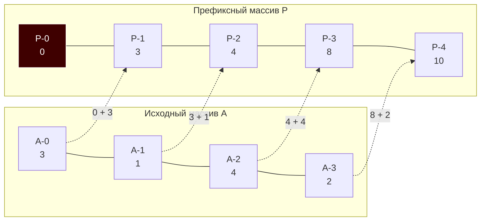

В конце статьи [[5. Sliding window - скользящее окно]] мы столкнулись с архитектурным вопросом: скользящее окно отлично подходит для однократного сканирования массива в поисках экстремума. Но что, если наш бэкенд загружает исторический массив котировок за год, а затем получает миллионы пользовательских запросов вида: *"Какая суммарная прибыль была получена с 14-го по 89-й день?"*.

Если отвечать на каждый запрос циклом или сдвигом окна, мы получим алгоритмическую сложность $O(Q \cdot K)$, где $Q$ — количество запросов, а $K$ — размер диапазона. На миллионах запросов это убьет CPU.

Для мгновенного ответа на математические запросы по диапазонам (Range Queries) используется паттерн предвычислений — **Префиксные суммы (Prefix Sums)**.

## Архитектура и математика

Идея префиксных сумм до гениального проста: мы создаем дополнительный массив `P`, где каждый элемент `P[i]` хранит сумму всех элементов исходного массива `A` от нулевого индекса до `i-1`.

Формула построения:
$$P[i] = P[i-1] + A[i-1]$$

Как это помогает? Теперь сумма любого подмассива от индекса `L` до индекса `R` (включительно) вычисляется за **одно математическое действие** (вычитание):
$$Sum(L, R) = P[R+1] - P[L]$$

Мы вычитаем из "всей суммы до правого края" ту часть, которая "была до левого края". Остается ровно то, что лежит между ними.



> [!info] Под капотом: Трюк с размером N+1
> Обратите внимание, что массив `P` имеет размер $N + 1$, а его нулевой элемент всегда равен `0`. 
> Это классический паттерн **Branchless Programming (Программирование без ветвлений)**. Если бы массивы были одинакового размера, для запроса суммы с самого начала массива (`L = 0`) нам пришлось бы писать проверку: `if L == 0 { return P[R] } else { return P[R] - P[L-1] }`. 
> Ветвления (if/else) мешают конвейеру процессора. Добавив фиктивный ноль в начало, мы делаем формулу $P[R+1] - P[L]$ универсальной. Никаких ветвлений, чистая арифметика, идеальная утилизация CPU Pipeline.

## Mechanical Sympathy: Нагрузка на железо

Префиксные суммы — это классический пример трейдоффа **Space-Time (Память против Времени)**.
1. **Построение:** Выполняется за $O(N)$ один раз. Это чистый линейный проход по массиву. Аппаратный Prefetcher отрабатывает безупречно, загоняя массивы `A` и `P` в кэш-линии L1-кэша.
2. **Запросы:** Выполняются за $O(1)$.
3. **Память:** Требуется $O(N)$ дополнительной памяти для хранения массива `P`. 

Если данные неизменны (Immutable), префиксные суммы — абсолютный чемпион. 
Если данные часто обновляются, этот паттерн проигрывает: при изменении `A[0]`, вам придется пересчитать **весь** массив `P` за $O(N)$. *(Для изменяемых данных применяются более сложные структуры, такие как Дерево отрезков — Segment Tree, которые мы разберем в будущих разделах).*

## Production-Ready реализация на Go

Реализуем типобезопасный объект для работы с префиксными суммами.

```go
package main

import "errors"

var ErrInvalidRange = errors.New("invalid range for prefix sum")

// PrefixSum инкапсулирует логику предвычислений.
type PrefixSum struct {
	p []int64 // Используем int64 для защиты от переполнения (Integer Overflow)
}

// NewPrefixSum создает и предвычисляет префиксный массив за O(N).
func NewPrefixSum(arr []int) *PrefixSum {
	n := len(arr)
	// Аллоцируем N+1 элементов, инициализированных нулями
	p := make([]int64, n+1)

	for i := 0; i < n; i++ {
		p[i+1] = p[i] + int64(arr[i])
	}

	return &PrefixSum{p: p}
}

// QuerySum возвращает сумму на отрезке [left, right] включительно за O(1).
// Индексы соответствуют исходному массиву arr (от 0 до len-1).
func (ps *PrefixSum) QuerySum(left, right int) (int64, error) {
	if left < 0 || right >= len(ps.p)-1 || left > right {
		return 0, ErrInvalidRange
	}
	
	// Обращение к кэшированным данным без циклов
	return ps.p[right+1] - ps.p[left], nil
}
```

> [!warning] Ловушка / Gotcha: Integer Overflow
> Если исходный массив состоит из миллиона значений `int32` (например, финансовые транзакции), их сумма легко превысит максимальное значение типа `int32` (около 2 миллиардов). Это вызовет тихое переполнение: число уйдет в отрицательный диапазон. 
> При проектировании префиксных массивов тип аккумулятора (`int64` или даже `math/big`) должен подбираться с расчетом на сумму **всех** максимально возможных элементов.

## Хардкорные паттерны (Уровень Senior)

На собеседованиях в бигтех (FAANG-уровня) префиксные суммы редко встречаются в чистом виде. Их комбинируют с хеш-таблицами для решения задач за линейное время $O(N)$, где наивный подход дает $O(N^2)$.

### Паттерн: Subarray Sum Equals K
**Задача (LeetCode 560):** Дан массив чисел (могут быть отрицательные) и число `K`. Найти количество непрерывных подмассивов, сумма которых равна `K`. 

Почему здесь не работает Скользящее окно? Потому что есть отрицательные числа. Окно не знает, нужно ли ему сужаться или расширяться при встрече с `-5`.
Здесь на помощь приходит алгебра префиксных сумм:
Если сумма на отрезке $[L, R]$ равна $K$, то $P[R+1] - P[L] = K$.
Следовательно: $P[L] = P[R+1] - K$.

**Гениальная идея:** Мы идем по массиву, на лету вычисляем текущую префиксную сумму (`currentSum = P[R+1]`) и ищем в хеш-таблице — а не встречали ли мы ранее сумму, равную `currentSum - K`? Если встречали, значит между тем моментом и текущим как раз набралась сумма `K`!

```go
// SubarraySum вычисляет количество подмассивов с суммой K за O(N)
func SubarraySum(nums []int, k int) int {
	count := 0
	currentSum := 0
	
	// map хранит частоту появления каждой префиксной суммы
	// Ключ: префиксная сумма. Значение: сколько раз она встречалась.
	prefixCounts := make(map[int]int)
	
	// Базовый случай: префиксная сумма 0 встретилась 1 раз (до начала массива)
	prefixCounts[0] = 1 

	for _, num := range nums {
		currentSum += num // На лету считаем P[i]

		// Если (currentSum - k) уже была в истории, мы нашли подмассивы!
		target := currentSum - k
		if occurrences, exists := prefixCounts[target]; exists {
			count += occurrences
		}

		// Добавляем текущую сумму в историю
		prefixCounts[currentSum]++
	}

	return count
}
```
*Примечание: о том, как аллоцируется память под мапу в подобных задачах, мы поговорим позже в [[5. Внутреннее устройство map в Go]].*

### Расширения паттерна
Подобный трюк с префиксными суммами и частотными словарями применяется для решения массы задач:
* Найти подмассив с нулевой суммой (ищем `currentSum == 0` или дубликат `currentSum` в мапе).
* Найти самый длинный подмассив с равным количеством нулей и единиц (заменяем нули на `-1` и ищем подмассив с нулевой суммой).
* **2D Prefix Sums:** Обобщение на двумерные матрицы, где $P[i][j]$ хранит сумму элементов в прямоугольнике от $(0,0)$ до $(i, j)$. Используется в GameDev для рендеринга и фильтрации изображений.

## Итог

1. **Префиксные суммы** — это паттерн предвычислений (Space-Time tradeoff). Тратим $O(N)$ памяти и $O(N)$ времени при инициализации, чтобы отвечать на запросы суммы любого диапазона за $O(1)$.
2. Для защиты от ветвлений (Branching) и ускорения работы процессора, префиксный массив всегда создается размером $N+1$, начинаясь с нуля.
3. Обязательно используйте типы большей размерности (например, `int64` для массива `int32`), чтобы избежать целочисленного переполнения.
4. Комбинация *Префиксной суммы* и *Хеш-таблицы (Map)* — это индустриальный стандарт для поиска подмассивов с заданными свойствами в массивах с отрицательными числами.

На этом мы закрываем огромный раздел базовых алгоритмов поиска и сканирования, где мы шаг за шагом улучшали подходы от линейных проходов к бинарным скачкам и умным окнам. 

Теперь мы переходим на новый уровень абстракции. Мы начинаем изучать **Алгоритмические парадигмы** — глобальные стратегии решения проблем, которые применимы к любым структурам данных. И первой парадигмой, фундаментом всего распределенного бэкенда, станет: [[1. Divide and conquer - разделяй и властвуй]].