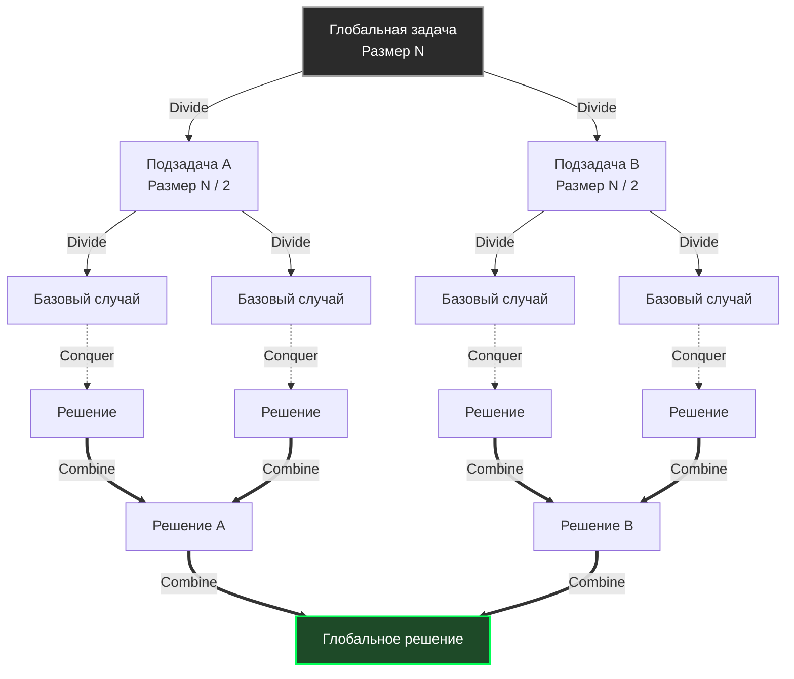

До сих пор мы изучали конкретные структуры данных (деревья, хеш-таблицы) и узкоспециализированные алгоритмы (сортировки). Начиная с этого раздела, мы поднимаемся на уровень выше — к **алгоритмическим парадигмам**. 

Парадигма — это не готовый код, это архитектурный шаблон мышления. Это мета-алгоритм, который говорит вам *как подходить к решению задачи*, а не *как именно её кодить*.

Первая и, пожалуй, самая фундаментальная парадигма в Computer Science — **«Разделяй и властвуй» (Divide and Conquer, D&C)**. Для бэкенд-инженера это не просто способ отсортировать массив, это фундаментальный паттерн проектирования высоконагруженных распределенных систем (от шардирования баз данных до MapReduce).

## Три кита парадигмы

Суть парадигмы заключается в рекурсивном разбиении сложной задачи на подзадачи того же типа, пока они не станут настолько простыми, что их можно будет решить в лоб.

Алгоритм D&C всегда состоит из трех строгих фаз:
1. **Divide (Разделяй):** Разбить исходную задачу на несколько независимых подзадач меньшего размера.
2. **Conquer (Властвуй):** Решить эти подзадачи (обычно рекурсивно). Если подзадача достаточно мала — решить её базовым способом (Base Case).
3. **Combine (Комбинируй / Сливай):** Объединить решения подзадач в решение исходной глобальной задачи.



## Классические примеры (Оглядываясь назад)

Мы уже детально разбирали алгоритмы, построенные на этой парадигме:
* [[3. Merge sort]]: Идеальный пример. Divide — делим массив ровно пополам. Conquer — сортируем половинки. Combine — сливаем два отсортированных массива в один (через буфер).
* [[4. Quick sort]]: Акцент смещен. Divide — выбираем Pivot и перекидываем элементы (тяжелая работа). Conquer — сортируем части. Combine — не требуется (массив сортируется In-Place).
* [[2. Бинарный поиск]]: Вырожденный случай D&C (Decrease and Conquer). Мы делим задачу пополам, но "властвуем" только над одной половиной, отбрасывая вторую. Фаза Combine отсутствует.

## Mechanical Sympathy: Тайная сила D&C

С математической точки зрения D&C позволяет пробить барьер сложности $O(N^2)$ и выйти на $O(N \log N)$. Но почему алгоритмы вроде Quick Sort и Merge Sort так феноменально быстры на реальном железе?

Ответ кроется в концепции **Cache-Oblivious Algorithms (Алгоритмы, не знающие о кэше)**.

Вам не нужно знать точный размер L1/L2 кэша процессора (32 КБ, 256 КБ и т.д.), чтобы оптимизировать под него код. 
Когда алгоритм "Разделяй и властвуй" рекурсивно делит огромный массив (например, 1 ГБ) пополам, рано или поздно размер подмассива станет меньше 32 КБ. 

В этот момент **весь подмассив целиком помещается в сверхбыстрый L1 кэш процессора**. Вся фаза *Conquer* для этого куска отработает на скорости света, без единого промаха в оперативную память (RAM). Подобное рекурсивное деление естественным образом подстраивается под любую многоуровневую архитектуру памяти процессора без ручного тюнинга констант.

### Темная сторона: Цена рекурсии в Go

Парадигма D&C почти всегда реализуется через рекурсию. Для бэкенд-инженера на Go рекурсия — это палка о двух концах.

> [!info] Под капотом
> При создании горутины рантайм Go выделяет для неё крошечный стек — всего **2 КБ** (в отличие от 2-8 МБ потока ОС в Java или C++). 
> Если ваш рекурсивный алгоритм уйдет слишком глубоко, стек переполнится. В Go нет `Stack Overflow` в классическом понимании — рантайм перехватит нехватку памяти и вызовет внутреннюю функцию `runtime.morestack`.
> Аллокатор выделит новый, в два раза больший стек, и скопирует **все** старые фреймы на новое место. Это дорогая операция. А оптимизации хвостовой рекурсии (Tail Call Optimization - TCO) в компиляторе Go **не существует**.

> [!warning] Ловушка / Gotcha
> Классический Quick Sort в худшем случае дает глубину рекурсии $O(N)$. Если $N$ — миллион, это миллион фреймов на стеке. Go начнет постоянно реаллоцировать и копировать стек горутины, что убьет производительность в десятки раз.
> **Решение из реального мира (Гибридизация):** Все промышленные реализации (например, `pdqsort` в пакете `slices`) останавливают рекурсию, когда размер подзадачи становится мал (например, 12-24 элемента). В этот момент (Base Case) вызывается нерекурсивный [[2. Insertion sort]], который идеально работает в L1 кэше без нагрузки на стек.

## Разделяй и властвуй в Архитектуре Бэкенда

Парадигма D&C выходит далеко за рамки массивов в оперативной памяти. В распределенных системах на Go этот паттерн превращается в **Scatter-Gather (Разброс и Сбор)** или **MapReduce**.

Представьте, что вам нужно агрегировать аналитический отчет по миллиону пользователей. Делать это в один поток — слишком долго. Вы **разделяете** (Divide) список ID на батчи по 1000 штук. Вы отправляете каждый батч в отдельную горутину (или на отдельный микросервис) для вычисления (Conquer). Затем вы ждете завершения всех и **сливаете** (Combine) частичные суммы в итоговый JSON-ответ.

### Идиоматичный Scatter-Gather на Go (через `errgroup`)

Вот как парадигма D&C реализуется на уровне конкурентности Go:

```go
package main

import (
	"context"
	"fmt"
	"sync"
	"golang.org/x/sync/errgroup"
)

// Имитация тяжелой задачи для батча
func processBatch(batch []int) int {
	sum := 0
	for _, v := range batch {
		sum += v
	}
	return sum
}

func main() {
	// Глобальная задача
	data := make([]int, 100_000)
	for i := range data {
		data[i] = 1
	}

	batchSize := 10_000
	var totalSum int
	var mu sync.Mutex // Мьютекс для безопасного Combine

	// Используем errgroup для оркестрации
	g, _ := errgroup.WithContext(context.Background())

	// 1. DIVIDE (Разделение на батчи)
	for i := 0; i < len(data); i += batchSize {
		end := i + batchSize
		if end > len(data) {
			end = len(data)
		}
		
		// Копируем срез для безопасной передачи в горутину
		batch := data[i:end] 

		// 2. CONQUER (Властвуй - конкурентное выполнение)
		g.Go(func() error {
			// Вычисляем частичный результат
			partialSum := processBatch(batch)
			
			// 3. COMBINE (Слияние результатов)
			mu.Lock()
			totalSum += partialSum
			mu.Unlock()
			
			return nil
		})
	}

	// Ждем завершения всех горутин
	if err := g.Wait(); err != nil {
		fmt.Println("Ошибка обработки:", err)
		return
	}

	fmt.Printf("Глобальный результат: %d\n", totalSum)
}
```

> [!tip] Собеседование
> **Вопрос:** Если мы разбиваем задачу на горутины, как это делает паттерн Scatter-Gather, не упремся ли мы в накладные расходы на переключение контекста планировщика (Context Switch)?
> **Ответ:** Зависит от гранулярности (размера батча). Если вы запустите 100 000 горутин, каждая из которых складывает 1 число, планировщик (G-M-P) сойдет с ума от оверхеда. Именно поэтому фаза "Divide" не должна делить задачу до абсолютного минимума в 1 элемент (как в классическом Merge Sort). Мы должны остановиться на **разумном Base Case** (например, батч из 10 000 элементов), который окупает создание горутины.

## Итог

1. **Суть:** Разбиваем задачу на независимые подзадачи, решаем их рекурсивно/конкурентно, объединяем результат.
2. **Плюсы:** Автоматическая адаптация под кэши процессора (Cache-Oblivious), идеальная параллелизуемость (как на ядра CPU, так и на кластер серверов).
3. **Минусы:** Нагрузка на стек вызовов (опасность роста стека в Go), сложность в написании нерекурсивных версий.
4. **Применение в Go:** Алгоритмы сортировки под капотом, паттерн Scatter-Gather, MapReduce фреймворки, параллельный I/O.

D&C — это мощный инструмент, когда подзадачи **независимы** (сортировка левой половины массива не влияет на правую). Но что, если мы находимся в ситуации, где нужно принимать серию решений на ходу, и каждое решение кажется очевидным в моменте? Всегда ли нужно делить задачу, или иногда можно просто жадно брать лучшее, что лежит перед глазами? Об этом — в нашей следующей статье: [[2. Greedy алгоритмы]].