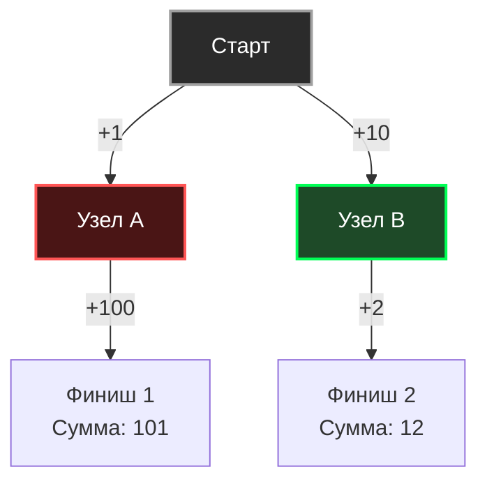

В прошлой статье [[1. Divide and conquer - разделяй и властвуй]] мы разбирали подход, при котором задача рекурсивно дробится на части, пока не станет элементарной. Но D&C — это парадигма для поиска _любого_ или _всех_ решений. Когда же перед нами стоит задача **оптимизации** (найти кратчайший путь, сжать данные до минимума, впихнуть максимум задач в один сервер), в игру вступает другая философия.

**Жадные алгоритмы (Greedy Algorithms)** — это парадигма, суть которой заключается в принятии **локально оптимального решения на каждом шаге** в надежде, что эта последовательность локальных побед приведет к глобальному оптимуму.

Девиз жадного алгоритма: _«Бери самое выгодное прямо сейчас и никогда не оглядывайся назад»_.

## Анатомия жадности

В отличие от Динамического программирования, которое методично просчитывает все возможные варианты развития событий, жадный алгоритм принимает решение один раз и жестко фиксирует его. Он не сохраняет контекст предыдущих выборов и не пересматривает свои решения.

Чтобы жадный алгоритм дал математически верный результат, задача обязана обладать двумя свойствами:

1. **Свойство жадного выбора (Greedy Choice Property):** Глобальный оптимум может быть достигнут путем выбора локального оптимума. Выбор, сделанный сейчас, не лишает нас возможности принять оптимальное решение в будущем.
    
2. **Оптимальная подструктура (Optimal Substructure):** Оптимальное решение всей задачи содержит в себе оптимальные решения её подзадач.
    



> [!warning] Ловушка / Gotcha (Ограниченность обзора)
> 
> Посмотрите на граф выше. Если задача — найти путь с минимальной суммой, Жадный алгоритм, стоя в узле `Старт`, посмотрит на ребра `+1` и `+10`. Как истинный "жадина", он выберет `+1` (Узел A), потому что локально это выгоднее. В итоге он попадет в ловушку и получит сумму `101`. Глобальный оптимум (`12`) будет утерян навсегда, потому что жадный алгоритм не заглядывает на два шага вперед.

## Mechanical Sympathy: Почему процессоры обожают жадность?

Если задача позволяет использовать жадный подход, вы обязаны использовать именно его. В бэкенде жадные алгоритмы являются королями производительности.

> [!info] Под капотом
> 
> С точки зрения архитектуры CPU, жадный алгоритм обычно состоит из двух фаз:
> 
> 1. **Сортировка данных** (например, по профиту, весу или времени завершения). Мы уже знаем из статьи [[4. Quick sort]], что сортировка (особенно `pdqsort` в Go) — это невероятно оптимизированный процесс $O(N \log N)$ с идеальным Cache Locality.
>     
> 2. **Линейный проход ($O(N)$)**. Алгоритм просто идет по массиву слева направо в цикле `for` и принимает решения.
>     
> 
> Здесь нет глубоких стеков рекурсии (как в Разделяй и властвуй). Здесь нет огромных таблиц мемоизации (как в Динамическом программировании), которые вымывают полезные данные из L2/L3 кэша. Аппаратный Prefetcher процессора видит линейный паттерн и загружает данные в L1-кэш со 100% точностью. Память алгоритма чаще всего равна $O(1)$.

## Практика в бэкенде: Задача планирования процессов (Interval Scheduling)

Классическая задача для бэкенд-разработчика: у вас есть один сервер (или переговорка, или один worker в пуле), и есть список задач (Jobs). Каждая задача имеет время начала и время завершения. Задачи не могут выполняться параллельно (пересекаться).

**Цель:** Выполнить максимальное количество задач.

Интуитивно мы можем предложить несколько жадных стратегий:

1. Выбирать самые короткие задачи? _Неверно. Две короткие задачи могут перекрыть одну длинную, но заблокировать три средние._
2. Выбирать задачи, которые начинаются раньше всех? _Неверно. Задача, начавшаяся в 00:00, может длиться 24 часа, убив все остальные._

**Математически доказанный жадный выбор:** Всегда выбирайте задачу, которая **заканчивается раньше всех**, и не пересекается с уже выбранными. Оставляя максимальное количество свободного времени в будущем, мы максимизируем шансы впихнуть туда еще задачи.

### Идиоматичный Go код

```go
package greedy

import (
	"cmp"
	"slices"
)

// Job представляет задачу с временем старта и окончания
type Job struct {
	ID    string
	Start int
	End   int
}

// MaxJobs планирует максимальное количество непересекающихся задач
func MaxJobs(jobs []Job) []Job {
	if len(jobs) == 0 {
		return nil
	}

	// 1. Сортируем задачи по времени ЗАВЕРШЕНИЯ по возрастанию.
	// Это ядро нашего жадного выбора. O-N log N-
	slices.SortFunc(jobs, func(a, b Job) int {
		return cmp.Compare(a.End, b.End)
	})

	var scheduled []Job
	
	// Берем первую задачу (она заканчивается раньше всех)
	scheduled = append(scheduled, jobs[0])
	lastEndTime := jobs[0].End

	// 2. Линейный проход O-N-
	for i := 1; i < len(jobs); i++ {
		// Если задача начинается после или в момент завершения последней выбранной,
		// смело берем её. Жадный выбор гарантирует оптимальность.
		if jobs[i].Start >= lastEndTime {
			scheduled = append(scheduled, jobs[i])
			lastEndTime = jobs[i].End
		}
	}

	return scheduled
}
```

**Сложность:** $O(N \log N)$ на сортировку + $O(N)$ на проход = Итого $O(N \log N)$.

## Собеседование: Когда жадность ломается

Самый популярный вопрос на System Design секциях и алгоритмических интервью, связанный с этой парадигмой — это **Задача о размене монет (Coin Change)**.

Представьте, что вы пишете биллинг, и вам нужно выдать сдачу клиенту минимальным количеством монет.

**Жадная стратегия:** бери самую крупную монету, которая помещается в остаток.

_Сценарий 1: Монеты 1, 5, 10 рублей. Нужно выдать 16 рублей._

Жадный алгоритм берет 10. Остаток 6. Берет 5. Остаток 1. Берет 1.

Итог: 3 монеты. **Это идеальный и правильный ответ.** (Потому что эти номиналы образуют каноническую систему монет).

_Сценарий 2: Монеты 1, 3, 4 рубля. Нужно выдать 6 рублей._

Жадный алгоритм берет 4. Остаток 2. Берет 1. Остаток 1. Берет 1.

Итог: 3 монеты (4, 1, 1).

**Но оптимальный ответ — это 2 монеты!** (3 и 3).

> [!tip] Собеседование
> 
> **Вопрос:** Как понять, что для данной задачи нельзя применять жадный алгоритм, даже если он кажется очевидным?
> 
> **Ответ:** Попробуйте привести контрпример (Exchange argument). Подумайте, может ли локально худший выбор (например, взять монету 3 вместо 4) открыть доступ к глобально более выгодной комбинации. Если вы находите хотя бы один такой контрпример, жадная стратегия математически несостоятельна.

## Где жадные алгоритмы работают в реальных системах?

1. **Сжатие данных (Алгоритм Хаффмана):** Используется внутри форматов GZIP, HTTP/2 HPACK (сжатие заголовков). Жадное построение дерева кодирования от самых частых символов к самым редким.
2. **Маршрутизация сетей (Алгоритм Дейкстры):** Поиск кратчайшего пути в графе маршрутизатора (OSPF) работает жадно — на каждом шаге мы идем в самый близкий из непосещенных узлов. Мы разберем его детальнее в [[5. Кратчайшие пути. Алгоритм Дейкстры]].
3. **Аллокация ресурсов в Kubernetes:** Некоторые фазы планировщика K8s используют жадные эвристики для размещения подов на нодах (Best Fit / First Fit), жертвуя глобальным математическим оптимумом ради скорости принятия решений.

## Итог

Жадные алгоритмы — это мощнейшее оружие бэкендера, потому что они обеспечивают максимальную производительность (кэш-дружелюбный линейный поиск после сортировки). Но это оружие крайне опасно: применив его к задаче без "свойства жадного выбора", вы получите баг уровня архитектуры, который не отловит ни один компилятор, так как код отработает без ошибок, но выдаст неоптимальный результат.

Что делать, если задача требует оптимизации, но жадный алгоритм ломается (как в примере с монетами 1, 3, 4)? Когда нам нужно рассмотреть все варианты, но мы не хотим делать это за экспоненциальное время $O(2^N)$?

Для решения таких задач существует самая элегантная и сложная парадигма Computer Science, которая обменивает оперативную память на время процессора. В следующей статье мы познакомимся с ней: [[3. Dynamic programming - динамическое программирование]].