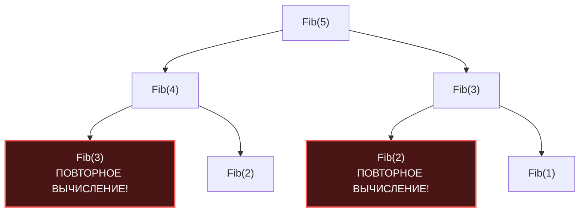

В прошлой статье [[2. Greedy алгоритмы]] мы выяснили, что жадный подход — это сверхбыстрый способ найти оптимальное решение. Однако мы также столкнулись с его главной уязвимостью: если задача не обладает «свойством жадного выбора», локально оптимальный шаг (взять монету покрупнее) может отрезать нас от глобально оптимального результата.

Когда жадность ломается, а полный перебор всех вариантов занимает экспоненциальное время $O(2^N)$, на сцену выходит самая элегантная концепция Computer Science — **Динамическое программирование (Dynamic Programming, DP)**.

Девиз DP: *«Те, кто не помнят прошлого, обречены повторять его»*.
Суть парадигмы — обменять оперативную память на время процессора. Мы разбиваем задачу на подзадачи, решаем каждую из них **ровно один раз** и запоминаем результат.

## Анатомия Динамического программирования

DP применимо только тогда, когда задача обладает двумя математическими свойствами:

1. **Оптимальная подструктура (Optimal Substructure):** Глобальное оптимальное решение состоит из оптимальных решений подзадач. Этим свойством обладает и парадигма [[1. Divide and conquer - разделяй и властвуй]].
2. **Перекрывающиеся подзадачи (Overlapping Subproblems):** Это ключевое отличие DP от Разделяй и Властвуй. В Merge Sort мы делим левую и правую части массива — они полностью независимы. В DP подзадачи постоянно пересекаются, и классическая рекурсия будет вычислять одно и то же миллионы раз.

Посмотрим на граф вызовов при наивном вычислении чисел Фибоначчи:



Вместо $O(N)$ операций мы получаем $O(2^N)$. DP решает эту проблему путем сохранения результатов.

## Два пути DP: Top-Down vs Bottom-Up

В инженерии существует два принципиально разных подхода к реализации DP. Выбор между ними кардинально влияет на производительность железа (Mechanical Sympathy).

### 1. Нисходящее DP (Top-Down / Memoization)
Мы пишем классическую рекурсию (от глобальной задачи к базовым случаям), но перед вызовом функции проверяем: "А не вычисляли ли мы это ранее?". Для хранения результатов обычно используют `map` или слайс.

* **Плюс:** Код пишется интуитивно, вычисляются только те состояния, которые реально нужны.
* **Минус (Hardware):** Накладные расходы на вызов функций (рост стека в Go), постоянные прыжки по памяти при обращении к хеш-таблице (Cache Misses).

### 2. Восходящее DP (Bottom-Up / Tabulation)
Мы отказываемся от рекурсии. Мы создаем массив (таблицу) и начинаем заполнять его от базовых случаев (индекс 0) до искомого значения (индекс N) в цикле `for`. Каждое следующее значение опирается на уже вычисленные предыдущие ячейки массива.

* **Плюс (Hardware):** Идеальный Cache Locality. Мы читаем и пишем в плоский слайс строго последовательно. Аппаратный Prefetcher процессора работает на 100%. Нет аллокаций стека.
* **Минус:** Приходится вычислять абсолютно все состояния от `0` до `N`, даже если некоторые из них алгоритму не понадобятся.

> [!info] Под капотом
> В 95% случаев в высокопроизводительном бэкенде на Go (или C++) выбирают **Bottom-Up (Tabulation)** подход с использованием одномерных или двумерных `slice`. Линейный проход по слайсу в кэше L1 настолько быстрее обращений к мапе и вызовов функций, что он с лихвой окупает вычисление "лишних" подзадач.

## Практика: Решение "нерешаемой" задачи размена монет

В статье о жадных алгоритмах мы показали, что если у вас есть монеты номиналом `[1, 3, 4]`, и нужно выдать сдачу `6`, жадный алгоритм выдаст неверный ответ: 3 монеты (4 + 1 + 1), хотя оптимум — 2 монеты (3 + 3).

Давайте решим её правильно с помощью Восходящего DP.

**Идея:** Чтобы собрать сумму `S`, мы должны посмотреть на все доступные номиналы монет `C`. Оптимальный ответ для суммы `S` — это `1` (сама монета) плюс оптимальный ответ для суммы `S - C`. 
Мы заполним массив `dp`, где `dp[i]` — это минимальное количество монет для суммы `i`.

```go
package dp

import "math"

// CoinChange возвращает минимальное количество монет для сбора суммы amount.
// Если сумму собрать невозможно, возвращает -1.
func CoinChange(coins []int, amount int) int {
	// Создаем таблицу DP размером amount + 1.
	// Инициализируем её заведомо недостижимо большим значением (amount + 1),
	// так как максимальное количество монет не может превышать саму сумму (если все монеты по 1).
	dp := make([]int, amount+1)
	for i := range dp {
		dp[i] = amount + 1
	}
	
	// Базовый случай: для сбора суммы 0 нужно 0 монет
	dp[0] = 0

	// Bottom-Up заполнение таблицы. Идеальный кэш-паттерн.
	for i := 1; i <= amount; i++ {
		// Проверяем каждую монету
		for _, coin := range coins {
			// Если монета помещается в текущую подсумму
			if i-coin >= 0 {
				// Выбираем минимум: либо то, что уже было вычислено для этой суммы,
				// либо 1 -мы взяли эту монету- + оптимальное решение для остатка -i - coin-
				if dp[i-coin]+1 < dp[i] {
					dp[i] = dp[i-coin] + 1
				}
			}
		}
	}

	// Если значение в ячейке не изменилось, значит сумму собрать невозможно
	if dp[amount] > amount {
		return -1
	}

	return dp[amount]
}
```

> [!tip] Собеседование
> **Паттерн распознавания:** Как на собеседовании понять, что перед вами задача на DP? Ищите ключевые слова:
> 1. "Найти **максимум / минимум**" (минимальное число монет, максимальный профит).
> 2. "Найти **количество способов**" (сколькими способами можно дойти до конца матрицы).
> 3. Данные зависят от своих предыдущих состояний.
> Если задача требует вернуть *все возможные комбинации* (вывести сами списки монет, а не их количество) — это уже не DP, а Backtracking.

## Оптимизация памяти (State Space Reduction)

Самый частый фоллоу-ап вопрос на Senior-собеседовании после того, как вы написали DP: *"Можем ли мы оптимизировать память?"*.

Во многих классических 2D-задачах (например, Рюкзак / Knapsack Problem, поиск длины наибольшей общей подпоследовательности LCS) таблица `dp[i][j]` строится так, что текущая строка `i` зависит **только от предыдущей строки** `i-1`. Остальные строки `i-2`, `i-3` алгоритму больше никогда не понадобятся.

**Mechanical Sympathy оптимизация:**
Вместо того чтобы аллоцировать двумерную матрицу `N x M` (что в Go означает слайс слайсов, разбросанный по куче и убивающий GC), мы аллоцируем **всего два одномерных слайса** длиной `M`: `prev` и `curr`. 
После вычисления строки `curr`, мы просто делаем своп указателей: `prev, curr = curr, prev`. 

Это снижает пространственную сложность с $O(N \cdot M)$ до $O(M)$ и превращает алгоритм в сверхбыстрый процесс, который полностью крутится в L1-кэше процессора.

> [!warning] Ловушка / Gotcha (Многомерные слайсы в Go)
> Создание 2D-слайса через `make([][]int, N)` и цикл `make([]int, M)` внутри — это антипаттерн в Go для плотных математических вычислений. Это создает $N$ независимых аллокаций в куче.
> **Идиоматичный подход для DP:** Если вам всё же нужна полная матрица (например, для восстановления пути), выделяйте один плоский 1D-слайс `make([]int, N*M)` и обращайтесь к нему по формуле `dp[i*M + j]`. Это единая аллокация, которая гарантированно обеспечит Sequential Access для железа.

## Резюме

1. **Динамическое программирование** — это исчерпывающий перебор с запоминанием (Memoization) или табличным вычислением снизу вверх (Tabulation).
2. **Гарантия:** В отличие от жадного алгоритма, DP всегда находит математически безупречный глобальный оптимум.
3. **Цена:** Требует дополнительной оперативной памяти для хранения таблицы состояний $O(N)$ или $O(N \cdot M)$.
4. **Реализация:** В Go всегда отдавайте предпочтение Bottom-Up подходу с использованием плоских 1D-слайсов, чтобы максимизировать утилизацию процессорного кэша.

DP идеально отвечает на вопросы "Сколько?" и "Каков оптимум?". Но как только продукт-менеджер (или интервьюер) просит: *"А теперь выведи мне все валидные пути, которыми можно пройти лабиринт, или сгенерируй все валидные расписания дежурств"* — магия DP рассеивается. Для задач генерации и полного перебора с отсечением тупиковых ветвей мы используем парадигму поиска с возвратом. Переходим к ней в следующей статье: [[4. Backtracking]].