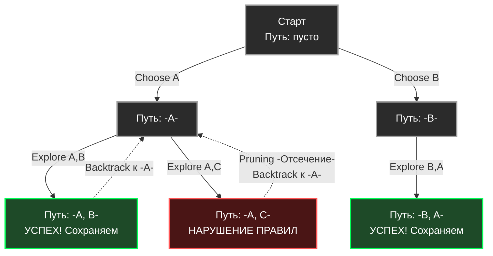

В предыдущих статьях мы разобрали [[2. Greedy алгоритмы]], которые стремительно бегут к цели, забирая локально лучший вариант, и [[3. Dynamic programming - динамическое программирование]], которое скрупулезно запоминает каждое состояние, чтобы за $O(N^2)$ или $O(N \cdot M)$ найти глобальный оптимум.

Обе эти парадигмы отвечают на вопросы оптимизации: *«Какова максимальная прибыль?»*, *«Какое минимальное количество монет?»*. 

Но что, если продакт-менеджер ставит другую задачу: *«Сгенерируй все возможные валидные расписания дежурств»*, *«Найди все пути выхода из лабиринта»* или *«Выведи все комбинации прав доступа»*? Здесь DP бессильно, так как нам нужны сами пути, а не просто их количество. 

Когда нам нужен **полный перебор**, но мы хотим делать это умно (отбрасывая заведомо тупиковые ветви), мы используем парадигму **Backtracking (Поиск с возвратом)**.

## Концепция: Брутфорс с мозгами

Backtracking — это систематический обход **Дерева пространств состояний (State Space Tree)** с использованием поиска в глубину (DFS). 

Алгоритм строится на трех шагах, которые выполняются рекурсивно:
1. **Choose (Выбор):** Сделать один шаг (добавить элемент в текущий путь/комбинацию).
2. **Explore (Исследование):** Рекурсивно вызвать функцию для дальнейшего построения пути.
3. **Unchoose / Backtrack (Отмена выбора):** Удалить добавленный элемент, откатиться на шаг назад, чтобы попробовать другой вариант.

Главная сила парадигмы — **Отсечение (Pruning)**. Если на каком-то этапе алгоритм понимает, что текущий префикс пути нарушает правила задачи, он немедленно обрывает рекурсию для этой ветви, экономя миллионы тактов процессора.



## Идиоматичный Go: Каркас алгоритма и ловушка слайсов

Давайте напишем классическую задачу: генерация всех подмножеств (Subsets / Powerset) из уникальных чисел.

В Go реализация Backtracking таит в себе одну из самых коварных ловушек для миддл-разработчиков, связанную с внутренним устройством `slice`.

> [!warning] Ловушка / Gotcha (Утечка Backing Array)
> Слайс в Go — это структура из трех полей: указатель на базовый массив (Backing Array), длина (`len`) и вместимость (`cap`).
> Когда вы передаете слайс `path` в рекурсию и делаете `path = append(path, val)`, вы мутируете **один и тот же базовый массив** в памяти. 
> Если в момент успеха вы сделаете `result = append(result, path)`, вы добавите в `result` не копию данных, а указатель на этот изменяющийся массив. К концу работы алгоритма все ваши ответы в `result` будут одинаковыми (будут указывать на финальное состояние массива, обычно заполненное последними значениями).

### Правильная реализация (Zero-Allocation Blueprint)

Чтобы избежать аллокаций на каждом шаге рекурсии, мы передаем один слайс `path` как "черновик" (scratch space) и копируем его данные **только в момент нахождения финального ответа**.

```go
package backtracking

// Subsets возвращает все возможные подмножества массива.
func Subsets(nums []int) [][]int {
	var result [][]int
	
	// Предварительно выделяем память под черновик, чтобы избежать
	// реаллокаций внутри рекурсии. cap = len(nums), так как 
	// максимальная длина пути не превысит длину исходного массива.
	path := make([]int, 0, len(nums))

	// Запускаем рекурсию
	backtrack(&result, path, nums, 0)

	return result
}

func backtrack(result *[][]int, path []int, nums []int, start int) {
	// БАЗОВЫЙ СЛУЧАЙ (Goal)
	// В задаче о подмножествах каждый промежуточный путь является валидным ответом.
	
	// КРИТИЧЕСКИ ВАЖНО: Создаем глубокую копию текущего пути!
	temp := make([]int, len(path))
	copy(temp, path)
	*result = append(*result, temp)

	// ИССЛЕДОВАНИЕ (Explore)
	for i := start; i < len(nums); i++ {
		// 1. CHOOSE (Выбор)
		// Добавляем элемент в наш черновик
		path = append(path, nums[i])

		// 2. EXPLORE (Рекурсия)
		// Уходим вглубь, передавая обновленный путь и следующий стартовый индекс
		backtrack(result, path, nums, i+1)

		// 3. BACKTRACK (Отмена выбора)
		// "Срезаем" последний добавленный элемент.
		// Базовый массив остается тем же, мы просто уменьшаем len.
		path = path[:len(path)-1]
	}
}
```

## Mechanical Sympathy: Нагрузка на стек и GC

Backtracking алгоритмы имеют экспоненциальную или факториальную сложность: $O(2^N)$ для подмножеств, $O(N!)$ для перестановок (Permutations). Для железа это означает две вещи:

1. **Глубина стека:** Максимальная глубина рекурсии всегда равна длине искомого пути (в нашем случае $N$). Для $N=100$ глубина вызовов будет 100. Это безопасно для стека горутин (который стартует с 2 КБ и расширяется). Однако, если задача требует глубины $100\,000$, вы получите гигантский оверхед на реаллокацию стеков (Stack Copying) внутри рантайма Go.
2. **Давление на Garbage Collector (GC Pressure):** Даже при правильной реализации (копирование только валидных результатов), алгоритм генерирует огромное количество объектов (слайсов `temp`). Если $N=20$, алгоритм создаст $1\,048\,576$ слайсов. Это вызовет мощный спайк активности сборщика мусора. В хардкорных бэкенд-системах результаты часто пишут потоково (streaming) прямо в `io.Writer` (например, в файл или HTTP-ответ), не накапливая массив `result` в оперативной памяти.

## Реальный Бэкенд: Катастрофический Backtracking (ReDoS)

Зачем бэкендеру понимать Backtracking, если он не пишет генераторы перестановок в проде? 

Потому что Backtracking — это механизм, лежащий в основе **Регулярных выражений (Regular Expressions)**. И незнание того, как он работает, приводит к падению серверов.

> [!info] Под капотом
> Классические движки регулярных выражений (PCRE, используемые в PHP, Python, Java) используют алгоритм **NFA (Nondeterministic Finite Automaton)**, который под капотом работает через Backtracking.
> 
> Представьте регулярку `(a+)+$` (найти строку из букв `a`, разделенную на группы, и дойти до конца строки).
> Если вы натравите её на строку `aaaaaaaaaaaaaaaaaaaaX`, движок жадно захватит все буквы `a`. Затем он упрется в `X`. Он не совпадает с концом строки `$`.
> Что сделает движок? Он начнет **Backtracking**. Он отменит захват одной `a`, перегруппирует её, попытается снова. Опять фейл. Он отменит еще одну. 
> Количество вариантов группировки для `N` букв `a` равно $2^N$. Процессор уходит в экспоненциальный цикл перебора, потребляя 100% CPU на один запрос. Это называется **Catastrophic Backtracking** (или атака ReDoS - Regular Expression Denial of Service).

> [!tip] Собеседование
> **Вопрос:** Уязвим ли стандартный пакет `regexp` в Go к атакам ReDoS?
> **Ответ:** **Нет.** Создатель языка Go, Роб Пайк, целенаправленно использовал в стандартной библиотеке движок на основе **DFA (Deterministic Finite Automaton)** и Томпсоновского NFA. Этот алгоритм **не использует Backtracking**. Он обрабатывает строку строго за $O(N)$ времени (линейно), независимо от сложности регулярки. Расплатой за это является то, что пакет `regexp` в Go не поддерживает фичи, требующие бэктрекинга: *Lookahead* и *Lookbehind* assertion-ы (опережающие и ретроспективные проверки), а также обратные ссылки (Backreferences `\1`).

## Итог

1. **Суть:** Систематический перебор всех вариантов с отсечением тупиков.
2. **Шаблон:** `Choose -> Explore -> Unchoose`.
3. **Go Специфика:** Обязательное глубокое копирование (Deep Copy) слайса-пути при добавлении в результирующий массив, так как базовый массив (Backing array) постоянно мутирует.
4. **Опасности:** Экспоненциальный рост времени работы ($O(2^N)$, $O(N!)$) и потенциальное исчерпание памяти (OOM) при накоплении результатов.

Backtracking слепо перебирает варианты, отсекая только явные нарушения правил (например, «ферзь бьет ферзя»). Но что, если мы добавим в этот процесс **эвристику оценки стоимости**? Что если мы будем отсекать ветки не потому, что они нарушают правила, а потому, что мы математически доказали, что они *точно не дадут результат лучше*, чем тот, что мы уже нашли? 

Эта эволюция бэктрекинга переводит нас от простого перебора к профессиональным методам дискретной оптимизации. В следующей статье: [[5. Branch and bound]].