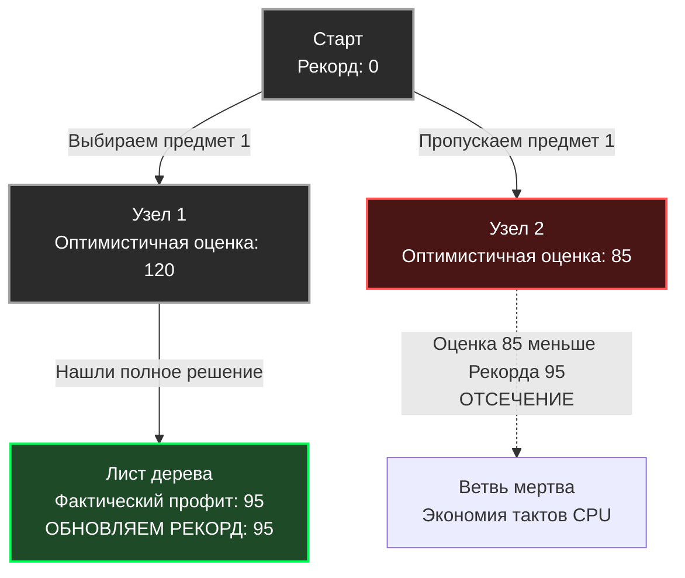

В прошлой статье [[4. Backtracking]] мы разбирали, как систематически перебирать все возможные варианты, отсекая тупиковые ветви, нарушающие правила (constraints). Backtracking идеально подходит для генерации комбинаций, поиска всех путей или решения судоку. 

Но что, если наша задача — не просто найти *любое* валидное решение, а найти **самое лучшее** (оптимальное) решение? 
Мы могли бы использовать Динамическое программирование (DP), но как мы помним из статьи [[3. Dynamic programming - динамическое программирование]], DP требует памяти. Если ограничения задачи слишком велики (например, размер рюкзака $W = 10^9$), DP просто "взорвет" оперативную память, попытавшись аллоцировать гигантскую матрицу.

Когда DP неприменимо из-за памяти, а Backtracking слишком медленный из-за перебора всех валидных (но неоптимальных) комбинаций, на сцену выходит элита дискретной оптимизации — **Метод ветвей и границ (Branch and Bound, B&B)**.

## Концепция: Умный поиск с предсказанием

Метод ветвей и границ — это эволюция бэктрекинга. Вместо того чтобы слепо идти по дереву решений и отсекать только то, что нарушает правила, B&B использует математику, чтобы **предсказывать будущее**.

Алгоритм постоянно держит в памяти **Рекорд (Incumbent)** — самое лучшее валидное решение, найденное на данный момент.
Для каждой новой ветви дерева алгоритм вычисляет **Границу (Bound)** — оптимистичную оценку того, насколько хороший результат мы можем получить, если пойдем по этой ветви.

**Золотое правило B&B:**
> Если оптимистичная оценка (Bound) текущей ветви **хуже**, чем наш текущий Рекорд, мы немедленно отсекаем всю эту ветвь (Pruning). Нам незачем её исследовать, математически доказано, что там нет ничего лучше того, что у нас уже есть.



## Механика: Ветвление, Оценка, Отсечение

Рассмотрим классическую **Задачу о рюкзаке (0/1 Knapsack Problem)**. У нас есть предметы с Весом и Ценностью. Рюкзак имеет лимит веса. Нужно максимизировать ценность. DP решит её за $O(N \cdot W)$, где $W$ — вместимость. Если $W$ огромно, DP нам не поможет.

Как работает B&B для этой задачи:

1. **Ветвление (Branching):** На каждом шаге мы принимаем бинарное решение: «Берем предмет» или «Не берем предмет». Дерево уходит в глубину.
2. **Оценка (Bounding):** Это самое важное. Как получить "оптимистичную оценку"? Мы должны "ослабить" правила задачи (Relaxation). В задаче 0/1 рюкзака правило гласит: предмет можно брать только целиком. Ослабим его: *представим, что предметы можно резать на куски*. 
   Тогда мы можем использовать сверхбыстрый Жадный алгоритм (из [[2. Greedy алгоритмы]]): мы берем предметы с максимальным отношением `Ценность / Вес`, а последний, не влезающий предмет, "отрезаем" по размеру остатка. Это даст нам **Идеальный максимум (Upper Bound)**. В реальности мы не можем резать предметы, поэтому реальный профит будет меньше или равен этому Bound.
3. **Отсечение (Pruning):** Если Upper Bound $\le$ `maxProfit`, ветвь уничтожается.

## Mechanical Sympathy: Память vs Процессор

В отличие от Динамического программирования, которое потребляет оперативную память кубометрами ($O(N \cdot W)$), B&B, реализованный через поиск в глубину (DFS), работает **In-Place**. 

Память ограничивается только глубиной стека рекурсии, которая равна количеству предметов ($O(N)$). Весь процесс крутится в L1-кэше процессора, вычисляя Bound с помощью простой арифметики. B&B обменивает экспоненциальный рост оперативной памяти на циклы процессора.

> [!info] Под капотом
> Классический, академический B&B часто реализуется не через DFS (поиск в глубину), а через **Best-First Search (Поиск по наилучшему совпадению)**.
> В этом случае используется Очередь с приоритетом (Max-Heap, см. [[1. Куча как структура данных]]). Алгоритм генерирует ветви, кладет их в кучу и всегда достает ту ветвь, у которой Bound самый большой. 
> Это позволяет найти глобальный оптимум быстрее (так как мы сначала идем по самым перспективным ветвям). Но это требует выделения памяти на кучу ($O(2^N)$ в худшем случае), что возвращает нас к проблемам с Garbage Collector. В высоконагруженном бэкенде чаще используют DFS-реализацию B&B (Depth-First Branch and Bound), так как она не делает аллокаций.

## Идиоматичная реализация на Go (DFS B&B)

Напишем production-ready каркас для решения задачи о рюкзаке с помощью DFS Branch and Bound.

```go
package branchandbound

import (
	"cmp"
	"slices"
)

// Item представляет предмет для рюкзака
type Item struct {
	Weight int
	Value  int
	Ratio  float64 // Value / Weight
}

// KnapsackBB решает задачу о рюкзаке методом Ветвей и Границ
func KnapsackBB(capacity int, weights, values []int) int {
	n := len(weights)
	items := make([]Item, n)
	for i := 0; i < n; i++ {
		items[i] = Item{
			Weight: weights[i],
			Value:  values[i],
			Ratio:  float64(values[i]) / float64(weights[i]),
		}
	}

	// 1. ЖАДНЫЙ ВЫБОР для Оценки. Сортируем предметы по убыванию удельной ценности.
	// Это критически важно для эффективного отсечения.
	slices.SortFunc(items, func(a, b Item) int {
		return cmp.Compare(b.Ratio, a.Ratio) // По убыванию
	})

	maxProfit := 0

	// 2. Вспомогательная функция для вычисления оптимистичной оценки (Bound)
	bound := func(level, currentWeight, currentValue int) float64 {
		if currentWeight >= capacity {
			return 0
		}

		profitBound := float64(currentValue)
		totalWeight := currentWeight
		j := level

		// Жадный набор целых предметов
		for j < n && totalWeight+items[j].Weight <= capacity {
			totalWeight += items[j].Weight
			profitBound += float64(items[j].Value)
			j++
		}

		// Добираем "кусочек" последнего предмета (дробный рюкзак)
		if j < n {
			remainingCapacity := capacity - totalWeight
			profitBound += float64(remainingCapacity) * items[j].Ratio
		}

		return profitBound
	}

	// 3. DFS функция (Бэктрекинг с отсечением)
	var dfs func(level, currentWeight, currentValue int)
	dfs = func(level, currentWeight, currentValue int) {
		// Обновляем рекорд
		if currentWeight <= capacity && currentValue > maxProfit {
			maxProfit = currentValue
		}

		// Базовый случай: дошли до конца
		if level == n {
			return
		}

		// Вычисляем Bound для случая "БЕРЕМ предмет"
		if currentWeight+items[level].Weight <= capacity {
			// Мы даже не заходим в ветку, если оценка хуже текущего рекорда
			if bound(level+1, currentWeight+items[level].Weight, currentValue+items[level].Value) > float64(maxProfit) {
				dfs(level+1, currentWeight+items[level].Weight, currentValue+items[level].Value)
			}
		}

		// Вычисляем Bound для случая "НЕ БЕРЕМ предмет"
		// Если даже мы пропустим этот предмет, сможем ли мы побить рекорд?
		if bound(level+1, currentWeight, currentValue) > float64(maxProfit) {
			dfs(level+1, currentWeight, currentValue)
		}
	}

	// Запускаем DFS с нулевого уровня
	dfs(0, 0, 0)

	return maxProfit
}
```

> [!tip] Собеседование
> **Вопрос:** Если Branch and Bound такой умный, означает ли это, что его сложность лучше, чем $O(2^N)$?
> **Ответ:** **В худшем случае — нет.** Математика жестока. Задача о рюкзаке — это NP-трудная задача. Если злоумышленник подберет веса и ценности так, что `bound` будет постоянно давать высокие оценки, отсечений не произойдет, и B&B деградирует до полного перебора $O(2^N)$. 
> Однако, **в среднем случае (на реальных данных)** B&B отсекает до 99.9% дерева, находя оптимум в тысячи раз быстрее, чем Backtracking, и не требуя памяти, как DP.

## Где применяется Branch and Bound в Бэкенде?

Эта парадигма лежит в основе серьезных систем оптимизации (Solvers):
1. **Маршрутизация (VRP - Vehicle Routing Problem):** Построение оптимальных маршрутов для курьеров (Яндекс.Еда, логистика). Задача коммивояжера (TSP) решается именно через B&B.
2. **Планировщики (Schedulers):** Распределение подов в кластере Kubernetes с учетом Resource Quotas и Node Affinities, когда нужно найти оптимальное бин-упаковывание (Bin Packing).
3. **Торговые движки (Matching Engines):** В HFT (High-Frequency Trading) для оптимизации портфеля или сведения сложных многосоставных ордеров.

## Итог раздела Детерминированных Алгоритмов

Мы завершили путь по классическим парадигмам точного решения задач:
* **Divide and Conquer** — делим и сливаем независимые части.
* **Greedy** — берем локальный максимум, игнорируя всё остальное.
* **Dynamic Programming** — запоминаем перекрывающиеся подзадачи.
* **Backtracking** — слепо перебираем всё, отсекая явные нарушения правил.
* **Branch and Bound** — умно перебираем всё, отсекая неоптимальные пути на основе предсказаний.

Все эти алгоритмы объединяет одно: они **Детерминированы**. При одних и тех же входных данных они всегда проходят один и тот же путь и выдают 100% точный ответ. 

Но что, если задача настолько колоссальна, что даже B&B будет считать её тысячу лет? Что, если нам не нужен 100% точный ответ, а нас устроит ответ с точностью 99.9%, но вычисленный за 2 миллисекунды? 
Здесь мы отбрасываем детерминизм и впускаем в наши алгоритмы Хаос. Мы переходим к парадигме, которая управляет криптографией, балансировщиками и ИИ. В следующей статье: [[6. Randomized алгоритмы]].