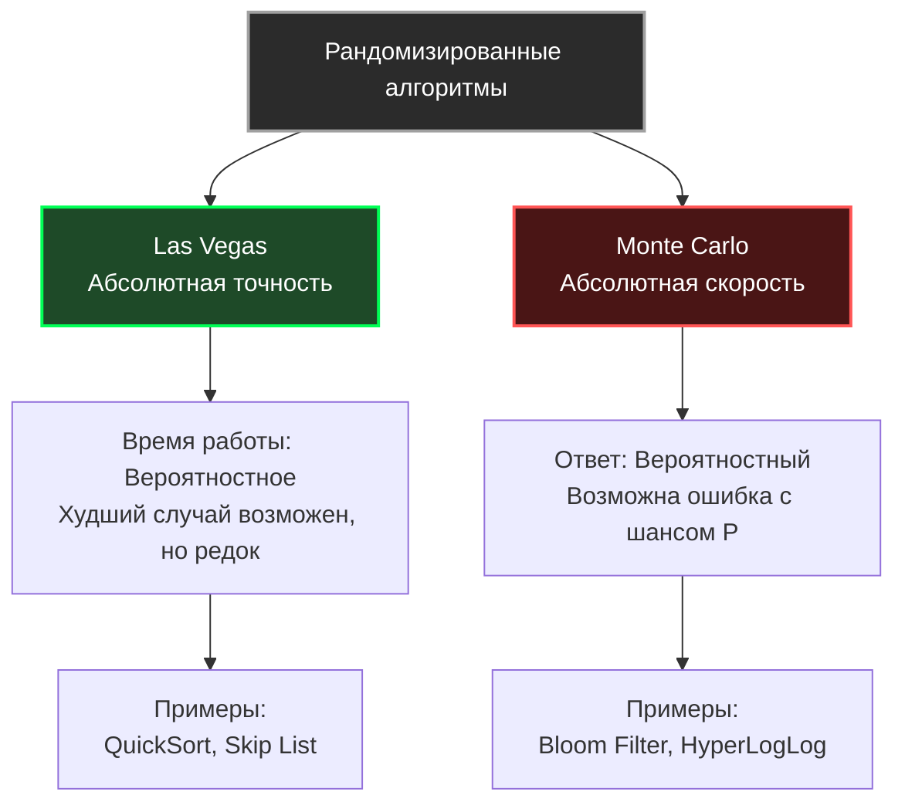

До сих пор мы рассматривали детерминированные парадигмы. Будь то [[1. Divide and conquer - разделяй и властвуй]] или [[5. Branch and bound]], алгоритм всегда шел по одному и тому же пути при одинаковых входных данных и всегда возвращал 100% точный ответ.

Но в мире распределенных систем, Big Data и криптографии детерминизм часто становится нашим врагом. 
1. **Детерминизм предсказуем.** Злоумышленник может специально подобрать входные данные, чтобы алгоритм деградировал (вспомните Hash DoS или худший случай для [[4. Quick sort]]). 
2. **Детерминизм медленен.** Чтобы получить 100% точный ответ, иногда нужно перебрать экспоненциальное количество вариантов.

В этот момент мы впускаем в наши программы управляемый хаос. **Рандомизированные алгоритмы (Randomized Algorithms)** используют генератор случайных чисел для принятия решений в процессе работы. Это позволяет срезать углы, избегать худших сценариев и получать ответы с вероятностью $99.99\%$ в тысячи раз быстрее.

## Две философские школы рандома

В Computer Science рандомизированные алгоритмы строго делятся на два класса, названных в честь мировых столиц азартных игр. Разница между ними — это компромисс между временем и точностью.

### 1. Алгоритмы Лас-Вегаса (Las Vegas)
**Суть:** Алгоритм **всегда** выдает 100% правильный ответ, но время его работы зависит от случая.
**Пример:** Рандомизированный Quick Sort. Мы случайно выбираем опорный элемент (Pivot). Алгоритм в любом случае отсортирует массив правильно. Но если нам фатально не повезет (рандом будет выбирать худшие элементы), сортировка займет $O(N^2)$. Если повезет — $O(N \log N)$. В среднем мы математически гарантируем $O(N \log N)$.
**Когда использовать:** Когда ошибка в результате недопустима, но мы хотим защититься от деградации на специфических паттернах данных.

### 2. Алгоритмы Монте-Карло (Monte Carlo)
**Суть:** Алгоритм имеет **строго фиксированное время работы** (например, всегда $O(N)$), но его ответ может быть неправильным с некоторой математически обоснованной вероятностью.
**Пример:** [[6. Bloom filter - вероятностная структура данных]]. Он проверяет наличие элемента за мгновенное время $O(1)$, но иногда может соврать (False Positive), сказав, что элемент есть, хотя его нет.
**Когда использовать:** В высоконагруженном бэкенде, когда скорость критичнее абсолютной точности (например, отсечение мусорного трафика, вероятностные счетчики уникальных IP-адресов типа HyperLogLog).



## Mechanical Sympathy: Источники хаоса в Go

Алгоритму нужна случайность. Но процессоры — это детерминированные куски кремния, они не умеют "бросать кубики". Для разработчика на Go критически важно понимать разницу между двумя источниками энтропии.

### 1. TRNG (True Random) — Пакет `crypto/rand`
Этот пакет берет случайность из хардварных прерываний, шума кулеров и драйверов ОС (в Linux это системный вызов к `/dev/urandom` или инструкция процессора `RDRAND`).
* **Цена:** Чудовищно дорого. Каждый вызов — это смена контекста (Syscall), блокировки ОС и потенциальное исчерпание пула энтропии. 
* **Где применять:** Только генерация токенов, паролей, ключей шифрования (JWT, OAuth). **Никогда** не используйте его для логики алгоритмов.

### 2. PRNG (Pseudo-Random) — Пакет `math/rand/v2`
Это математическая формула. Вы даете ей начальное число (**Seed**), и она с бешеной скоростью выплевывает последовательность чисел, которая *кажется* случайной, но на самом деле предопределена сидом.

> [!warning] Ловушка / Gotcha (Эволюция рандома в Go)
> **В старых версиях Go (до 1.20)** разработчики часто использовали глобальную функцию `math/rand.Intn()`. Под капотом она прятала глобальный `sync.Mutex`. Если тысяча горутин одновременно просила случайное число (например, для балансировки нагрузки), они выстраивались в гигантскую очередь на этом мьютексе (Lock Contention), что убивало производительность бэкенда в десятки раз. Приходилось создавать локальные генераторы с `rand.New(rand.NewSource(...))`.
> 
> **В Go 1.22+** появился пакет `math/rand/v2`. Глобальный рандом больше не использует мьютексы (он использует per-M или thread-local состояния). В качестве алгоритма используется невероятно быстрый **PCG** (Permuted Congruential Generator) или **ChaCha8**, что делает его генерацию практически бесплатной для CPU без ущерба для конкурентности.

## Практика в Бэкенде: Reservoir Sampling (Выборка из резервуара)

Рассмотрим классическую архитектурную задачу с хардовых собеседований. 

**Условие:** Вы пишете систему аналитики. К вам летит бесконечный стрим событий (или строк из огромного CSV-файла в 100 ГБ, который не влезает в RAM). Мы не знаем, сколько всего будет событий ($N$ неизвестно).
Нам нужно случайным образом выбрать ровно $K$ событий для анализа, при этом **каждое событие должно иметь строго равную вероятность быть выбранным**.

**Почему стандартный подход не работает?**
Вы не можете использовать `rand.Intn(N)`, потому что вы не знаете $N$ (стрим бесконечен). Вы не можете сохранить всё в массив и потом выбрать $K$ штук, потому что у вас закончится оперативная память (OOM).

Здесь нас спасает алгоритм **Reservoir Sampling** (алгоритм Монте-Карло).

### Логика работы
1. Мы создаем "резервуар" (массив) размером $K$. 
2. Первые $K$ элементов стрима мы безусловно кладем в резервуар.
3. Для каждого следующего $i$-го элемента стрима мы генерируем случайное число `R` от `0` до `i`.
4. Если `R < K`, мы берем этот новый элемент и **заменяем** им элемент в нашем резервуаре под индексом `R`. Иначе — отбрасываем новый элемент.

Математическая магия (индукция) гарантирует, что в любой момент времени каждый обработанный элемент имеет шанс ровно $K/N$ находиться в резервуаре.

### Идиоматичная реализация на Go 1.22+

```go
package randomalgo

import (
	"math/rand/v2" // Используем современный, lock-free рандом
)

// StreamEvent имитирует структуру входящего события
type StreamEvent struct {
	ID      int
	Payload string
}

// ReservoirSampling выбирает k случайных элементов из потока неизвестной длины
func ReservoirSampling(stream <-chan StreamEvent, k int) []StreamEvent {
	// Резервуар занимает строго O(K) памяти.
	reservoir := make([]StreamEvent, 0, k)
	
	i := 0 // Счетчик обработанных элементов

	for event := range stream {
		if i < k {
			// Безусловно заполняем начальный резервуар
			reservoir = append(reservoir, event)
		} else {
			// Генерируем случайное число от 0 до i включительно
			r := rand.IntN(i + 1)
			
			// С вероятностью K / (i+1) мы решаем сохранить этот элемент
			if r < k {
				// Вытесняем старый элемент
				reservoir[r] = event
			}
		}
		i++
	}

	return reservoir
}
```

* **Память:** Строго $O(K)$. Даже если стрим содержит 10 миллиардов записей, мы тратим память только на $K$ структур.
* **Скорость:** $O(N)$ (Один проход по стриму, один вызов быстрого PRNG на каждый элемент).

## Рандомизация в распределенных системах: Power of Two Random Choices

В современном бэкенде рандомизированные алгоритмы используются не только внутри структур данных, но и в системной архитектуре.

Представьте API Gateway (балансировщик нагрузки), за которым стоят 100 бэкенд-серверов. Как направить запрос на наименее загруженный сервер?
1. **Round Robin (По кругу):** Слепо, не учитывает, что один сервер может зависнуть.
2. **Least Connections (Меньше всего соединений):** Балансировщик должен постоянно опрашивать 100 серверов об их состоянии или держать это в глобальной памяти (Lock Contention). Если балансировщиков несколько, они все увидят один "пустой" сервер и отправят туда миллион запросов, уронив его (Herd Behavior - стадное поведение).
3. **Pure Random (Случайный):** Быстро, блокировок нет, но по теории вероятности один сервер рано или поздно получит шквал запросов, а другой будет простаивать.

**Математическое решение:** Рандомизированный алгоритм *"Сила двух случайных выборов" (Power of Two Random Choices)*.
Вместо того чтобы искать лучший сервер среди 100, балансировщик выбирает **ровно 2 случайных сервера**. Затем он сравнивает их загрузку между собой и отправляет запрос на тот из двух, который менее нагружен.

> [!tip] Собеседование
> **Вопрос:** Действительно ли выбор из 2-х случайных вариантов дает сильное преимущество по сравнению с 1 случайным выбором? Не лучше ли выбрать 3 или 4?
> **Ответ:** Доказано математически, что переход от 1 выбора к 2-м **экспоненциально** сокращает максимальную нагрузку на сервер в кластере. В то время как переход от 2 к 3 дает лишь незначительное, маргинальное улучшение, но увеличивает сетевой трафик балансировщика на $50\%$. Алгоритм "Power of 2 Choices" используется в production балансировщиках NGINX, HAProxy и внутри движка планирования заданий в Apache Spark.

## Итог раздела Алгоритмических парадигм

Мы прошли путь от жесткого детерминизма к управляемому хаосу. Каждая парадигма — это инструмент для своего класса задач:

1. **Divide and Conquer:** для независимых подзадач и кэш-оптимизированной работы.
2. **Greedy:** для максимальной скорости, когда локальный выбор гарантирует глобальный оптимум.
3. **Dynamic Programming:** для задач оптимизации с перекрывающимися состояниями.
4. **Backtracking / Branch and Bound:** для умного полного перебора.
5. **Randomized:** для обхода математических пределов детерминизма, защиты от целенаправленных атак и работы с бесконечными стримами в условиях ограниченной памяти.

Вооружившись этим мышлением, мы переходим к структурам, которые пронизывают весь современный мир: от маршрутов в GPS-навигаторе и алгоритма PageRank в Google до анализа социальных связей и графов зависимостей микросервисов. Мы начинаем сложнейший и важнейший раздел: [[1. Представление графов]].