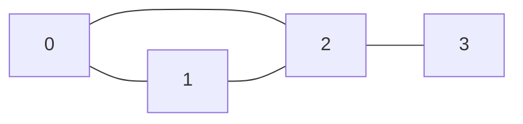

Мы начинаем один из самых масштабных и важных разделов в информатике — **Графы**. 

Если деревья (см. раздел 04) помогают нам строить строгие иерархии, то графы описывают реальный мир, где связи могут быть хаотичными, циклическими и многонаправленными. Компьютерные сети, маршрутизация микросервисов, графы зависимостей модулей (Go modules), социальные сети и рекомендательные системы — всё это работает на графовых алгоритмах.

Прежде чем писать алгоритмы обхода или поиска кратчайшего пути, мы должны решить фундаментальную инженерную задачу: **как хранить граф в оперативной памяти?** Выбор структуры данных для графа определит, будет ли ваш алгоритм работать миллисекунды или часы.

## Анатомия графа

Любой граф $G = (V, E)$ состоит из двух множеств:
* **$V$ (Vertices / Узлы / Вершины):** Объекты (серверы, пользователи, перекрестки).
* **$E$ (Edges / Ребра / Дуги):** Связи между узлами.

Ребра могут быть **направленными** (Directed) или **неориентированными** (Undirected), а также иметь **вес** (Weighted) — например, задержку в миллисекундах между двумя серверами.

Рассмотрим три основных способа представления графа в памяти на языке Go. У каждого из них своя ниша и свои отношения с кэшем процессора.

---

## 1. Матрица смежности (Adjacency Matrix)

Матрица смежности — это двумерный массив размером $V \times V$, где ячейка `[i][j]` содержит информацию о наличии ребра (или его весе) между вершиной $i$ и вершиной $j$.



Для графа выше матрица будет выглядеть так:
|   | 0 | 1 | 2 | 3 |
|---|---|---|---|---|
|**0**| 0 | 1 | 1 | 0 |
|**1**| 1 | 0 | 1 | 0 |
|**2**| 1 | 1 | 0 | 1 |
|**3**| 0 | 0 | 1 | 0 |

### Наивная реализация на Go

Большинство новичков пишут матрицу как слайс слайсов: `[][]int`.
```go
matrix := make([][]int, V)
for i := range matrix {
    matrix[i] = make([]int, V)
}
// Проверка наличия ребра за O(1)
hasEdge := matrix[u][v] == 1 
```

> [!warning] Ловушка / Gotcha: Слайс слайсов — убийца производительности
> В Go `[][]int` — это не единый блок памяти (как в C или C# при `int[,]`). Это слайс, который хранит *заголовки слайсов* (`SliceHeader`, 24 байта), каждый из которых указывает на свой отдельный базовый массив в куче.
> **Итог:** Для графа на 10 000 вершин вы сделаете 10 001 аллокацию памяти. Строки матрицы будут разбросаны по RAM. При чтении процессору придется делать двойное разыменование указателей (Pointer Chasing), что вызовет жесткие промахи кэша (Cache Misses).

### Idiomatic & Mechanical Sympathy реализация (Плоский массив)

Опытные инженеры "расплющивают" (flatten) 2D-матрицу в одномерный слайс размером $V \times V$.

```go
package main

// DenseGraph представляет граф в виде плоской матрицы смежности.
type DenseGraph struct {
	vertices int
	matrix   []bool // Используем bool для экономии памяти (или int для веса)
}

func NewDenseGraph(v int) *DenseGraph {
	return &DenseGraph{
		vertices: v,
		// ОДНА аллокация памяти. Идеальная пространственная локальность.
		matrix:   make([]bool, v*v), 
	}
}

// AddEdge добавляет неориентированное ребро
func (g *DenseGraph) AddEdge(u, v int) {
	// Формула вычисления индекса: строка * ширина + столбец
	g.matrix[u*g.vertices+v] = true
	g.matrix[v*g.vertices+u] = true
}

// HasEdge проверяет связь за константное O(1) время
func (g *DenseGraph) HasEdge(u, v int) bool {
	return g.matrix[u*g.vertices+v]
}
```

**Плюсы:** Мгновенная $O(1)$ проверка наличия ребра. Добавление/удаление за $O(1)$. Идеально для **плотных графов (Dense Graphs)**, где количество ребер $E \approx V^2$.
**Минусы:** Потребление памяти строго $O(V^2)$. Если у вас 1 миллион пользователей социальной сети, матрица потребует 1 терабайт RAM, даже если у каждого пользователя всего по 2 друга. Итерация по соседям узла занимает $O(V)$, что очень медленно.

---

## 2. Список смежности (Adjacency List)

Для решения проблемы перерасхода памяти мы переходим к списку смежности. Здесь каждая вершина хранит только список своих реальных соседей (исходящих ребер). Это стандарт индустрии для **разреженных графов (Sparse Graphs)**, где $E \ll V^2$.

### Реализация через Map (Хеш-таблицу)

Часто в бизнес-логике вершины — это не числа от 0 до $V-1$, а UUID, строки или объекты. В таких случаях используют `map`.

```go
type StringGraph struct {
	adj map[string][]string
}

func (g *StringGraph) AddEdge(u, v string) {
	g.adj[u] = append(g.adj[u], v)
}
```

> [!info] Под капотом: Overhead встроенной map
> Использование `map` делает код чистым, но скрывает огромный системный оверхед. Внутри рантайма Go структура `hmap` использует массивы бакетов (buckets). 
> Поиск соседей `g.adj["user-123"]` требует:
> 1. Вычисления хеш-функции от строки (AES-NI инструкции процессора).
> 2. Поиска нужного бакета.
> 3. Обхода связного списка бакетов в случае коллизий (Pointer Chasing).
> В высоконагруженных алгоритмах (например, при BFS/DFS обходе графа на миллионы узлов) хеширование убьет весь CPU.

### Production-Ready реализация (Трансляция ID в Слайсы)

Правильный архитектурный паттерн: на границе системы мы переводим (map) бизнес-идентификаторы (UUID/String) во внутренние непрерывные целочисленные ID (от $0$ до $V-1$). А сам граф реализуем на **слайсе слайсов**, где индекс слайса — это внутренний ID вершины.

```go
package main

// SparseGraph реализует список смежности на слайсах.
// Индекс во внешнем слайсе - это ID вершины (от 0 до V-1).
type SparseGraph struct {
	adj [][]int
}

func NewSparseGraph(vertices int) *SparseGraph {
	return &SparseGraph{
		// Предварительная аллокация для внешнего слайса
		adj: make([][]int, vertices), 
	}
}

// AddEdge добавляет направленное ребро
func (g *SparseGraph) AddEdge(u, v int) {
	// append может вызвать реаллокацию внутреннего слайса,
	// но доступ к списку соседей по индексу g.adj[u] - это мгновенное O(1).
	g.adj[u] = append(g.adj[u], v)
}

// GetNeighbors возвращает всех соседей узла u
func (g *SparseGraph) GetNeighbors(u int) []int {
	return g.adj[u]
}
```

**Плюсы:** Расход памяти $O(V + E)$. Итерация по всем соседям конкретного узла работает невероятно быстро, так как внутренний `[]int` читается последовательно, попадая в L1-кэш (Spatial Locality).
**Минусы:** Проверка существования конкретного ребра занимает $O(K)$, где $K$ — степень вершины (количество соседей), так как нужно сделать линейный поиск (см. [[1. Линейный поиск]]) по внутреннему слайсу.

> [!tip] Собеседование
> **Вопрос:** Как хранить веса ребер в списке смежности на слайсах?
> **Ответ:** Вместо внутреннего `[]int` использовать слайс пользовательской структуры: `[]Edge`, где `type Edge struct { To int; Weight float64 }`. Структуры в слайсе лежат непрерывно, поэтому на кэш процессора это не повлияет, добавится лишь шаг (stride) при чтении.

---

## 3. Список ребер (Edge List)

Самое простое, но крайне специфичное представление. Мы вообще не храним вершины как отдельные сущности, а храним только "массив соединений".

```go
type Edge struct {
	U      int
	V      int
	Weight int
}

type EdgeListGraph struct {
	Edges []Edge
}
```

**Плюсы:** Структура представляет собой один плоский непрерывный массив в памяти. Идеально для сортировки ребер.
**Минусы:** Невозможно быстро найти соседей вершины (нужен полный скан $O(E)$). 
**Применение:** Это представление практически никогда не используется для навигации или поиска путей. Его единственная ниша — алгоритмы, которые оперируют ребрами глобально, например, алгоритм Крускала для нахождения минимального остовного дерева (Minimum Spanning Tree) или алгоритм Беллмана-Форда (см. [[6. Алгоритм Беллмана Форда]]).

---

## Итог: Что выбрать бэкенд-разработчику?

1. **Матрица смежности (одномерный плоский массив):** Выбираем, если граф плотный ($E \approx V^2$), $V$ невелико (до нескольких тысяч) и нам критически важны частые проверки $O(1)$ на существование конкретного ребра.
2. **Список смежности (слайс слайсов):** **Стандарт по умолчанию (Default Choice)**. Идеален для разреженных графов. Дает быстрый перебор соседей, что необходимо для 99% графовых алгоритмов.
3. **Список смежности (`map`):** Выбираем только для быстрой прототипизации или если граф настолько динамичен и разрежен, что мы даже не знаем примерного количества вершин заранее. Остерегайтесь оверхеда `hmap` и работы Garbage Collector-а.
4. **Список ребер:** Только для специфических алгоритмов (Крускал, Беллман-Форд).

Теперь, когда наш граф надежно и оптимально размещен в оперативной памяти, мы можем начать по нему передвигаться. В следующей статье мы разберем самый важный алгоритм обхода, который лежит в основе поиска кратчайших путей в невзвешенных сетях (например, поиск друзей через одно рукопожатие): [[2. Поиск в ширину BFS]].