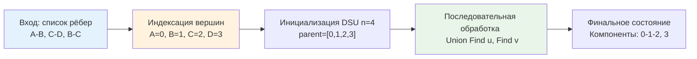

## Введение: Почему DSU вместо обходов графов

В предыдущих статьях раздела мы детально разобрали классические обходы графов: [[2. Поиск в ширину BFS]] и [[3. Поиск в глубину DFS]]. Они идеальны для статических структур, поиска кратчайших путей или проверки достижимости. Однако в реальных бэкенд-системах графы редко бывают статичными. Новые связи появляются непрерывно: микросервисы добавляют зависимости, пользователи формируют социальные графы, кластерные узлы объединяются в подсети.

Запуск BFS/DFS при каждом изменении рёбра даёт `O(V + E)` на операцию, что неприемлемо при высокой динамике. Здесь на сцену выходит [[4. Disjoint set union DSU, Union Find]], адаптированный под графовые задачи. Он заменяет тяжёлые обходы инкрементальным слиянием компонент связности, снижая сложность до практически константного `O(α(V))` на добавление ребра.

> [!tip] Собеседование
> **Вопрос:** «Когда вы выберете DSU для работы с графом, а когда оставите BFS/DFS?»
> **Ответ:** DSU оптимален для **неориентированных** графов, когда нужно отслеживать динамическую связность, находить циклы при добавлении рёбер или строить минимальное остовное дерево (как в [[8. Минимальное остовное дерево. Алгоритм Крускала]]). BFS/DFS незаменимы для направленных графов, поиска кратчайших путей в невзвешенных графах, топологической сортировки или когда требуется обход соседей конкретного узла. DSU не хранит структуру смежности, он знает только «кто в какой компоненте».

## 1. Ключевые графовые сценарии в бэкенде

DSU на графах решает специфический класс задач, где важна не геометрия связей, а топология объединений:
* **Динамическая связность**: Ответ на вопрос «связаны ли узлы A и B?» при потоковом добавлении рёбер.
* **Обнаружение циклов в неориентированных графах**: Если `Find(u) == Find(v)` перед добавлением ребра `(u, v)`, цикл гарантирован.
* **Оффлайн-обработка запросов**: Запросы на связность сортируются и обрабатываются после применения всех необходимых рёбер, экономя вычислительные ресурсы.
* **Кластеризация и сегментация**: Объединение узлов по пороговым значениям (например, в графах транзакций или рекомендательных системах).

## 2. Архитектура: маппинг вершин и список рёбер

В продакшене идентификаторы узлов графа редко являются плотными целыми числами `0..N-1`. Обычно это `UUID`, email-адреса, IP-хэши или ID сервисов. DSU работает с индексами, поэтому первым шагом становится нормализация.

Вместо создания `map[string]int` на лету (что даёт оверхед аллокаций и рандомные hash collisions в [[5. Внутреннее устройство map в Go]]), эффективнее преобразовать граф в **список рёбер** с предварительной индексацией.



Последовательная обработка списка рёбер архитектурно дружелюбна к CPU: данные читаются линейно, предсказатель ветвлений угадывает паттерн, а кэш-линии загружаются пакетами. В отличие от обхода по матрице смежности или списку соседей, где доступ хаотичен.

## 3. Production-реализация на Go 1.21+

Реализуем обёртку, которая принимает сырые строковые рёбра, строит маппинг и возвращает компоненты связности или флаг наличия цикла. Используем дженерики и избегем рекурсии в `Find` для безопасности стека.

```go
package graphdsu

import (
	"errors"
	"fmt"
)

// Edge представляет неориентированное ребро
type Edge struct {
	U, V string
}

// Component описывает найденную компоненту связности
type Component struct {
	Root string
	Members []string
	Size   int
}

// FindComponents анализирует список рёбер и возвращает компоненты связности.
// При обнаружении цикла возвращает ошибку.
func FindComponents(edges []Edge) ([]Component, error) {
	if len(edges) == 0 {
		return nil, nil
	}

	// 1. Индексация вершин
	ids := make(map[string]int)
	nextID := 0
	
	for _, e := range edges {
		if _, ok := ids[e.U]; !ok {
			ids[e.U] = nextID
			nextID++
		}
		if _, ok := ids[e.V]; !ok {
			ids[e.V] = nextID
			nextID++
		}
	}

	// Обратный маппинг для восстановления строк
	revIDs := make([]string, nextID)
	for v, id := range ids {
		revIDs[id] = v
	}

	// 2. Инициализация DSU
	parent := make([]int, nextID)
	size := make([]int, nextID)
	for i := range parent {
		parent[i] = i
		size[i] = 1
	}

	// 3. Обработка рёбер
	for _, e := range edges {
		uID := ids[e.U]
		vID := ids[e.V]

		rootU := find(parent, uID)
		rootV := find(parent, vID)

		if rootU == rootV {
			return nil, fmt.Errorf("cycle detected between %s and %s", e.U, e.V)
		}

		// Union by Size
		if size[rootU] < size[rootV] {
			rootU, rootV = rootV, rootU
		}
		parent[rootV] = rootU
		size[rootU] += size[rootV]
	}

	// 4. Сбор результатов
	compMap := make(map[int]*Component)
	for i := 0; i < nextID; i++ {
		root := find(parent, i)
		comp, ok := compMap[root]
		if !ok {
			comp = &Component{Root: revIDs[root]}
			compMap[root] = comp
		}
		comp.Members = append(comp.Members, revIDs[i])
		comp.Size++
	}

	result := make([]Component, 0, len(compMap))
	for _, c := range compMap {
		result = append(result, *c)
	}
	return result, nil
}

// find с Path Compression (итеративный)
func find(parent []int, x int) int {
	root := x
	for parent[root] != root {
		root = parent[root]
	}
	// Сжатие путей
	for x != root {
		next := parent[x]
		parent[x] = root
		x = next
	}
	return root
}
```

Инженерные решения:
* **Итеративный `find`**: Исключает риск переполнения стека при глубоких деревьях до компрессии.
* **Предварительная индексация**: Два прохода по рёбрам (`O(E)`) заменяют дорогие операции с мапами внутри цикла слияния.
* **Возврат ошибки при цикле**: В бэкенде часто важно не просто игнорировать дубликаты, а детектировать аномалии (например, циклические зависимости в DI-графах или транзакционных блокировках).

## 4. Mechanical Sympathy: кэш, память и рантайм

Поведение DSU на графах в Go имеет характерные особенности при масштабировании.

### Линейность списка рёбер vs Разряженность матрицы
Список рёбер `[]Edge` лежит в непрерывном блоке памяти. Обход `for _, e := range edges` вызывает последовательные чтения. CPU аппаратный префетчинг загружает следующие пары `U, V` в L1-кэш заранее. В contrast, обход графа через `map[string][]string` (списки смежности) заставляет процессор прыгать по случайным адресам кучи, генерируя `cache miss` на каждом шаге.

### Давление на GC и аллокации
В функции выше мапы `ids` и `compMap` аллоцируются в куче. При обработке миллионов рёбер это создаёт временное давление. Оптимизация: если идентификаторы уже целочисленные или можно использовать хеширование без маппинга (например, `crc32` с разрешением коллизий через открытую адресацию), можно убрать `map[string]int]` полностью. Для высоконагруженных потоков применяют `sync.Pool` для временных структур или переходят к аренам памяти.

### Escape Analysis
Слайсы `parent` и `size` передаются в `find` по ссылке. Компилятор Go видит, что они не выходят за пределы функции `FindComponents`, и может разместить их на стеке, если размер известен на этапе компиляции или невелик. Для `>64KB` рантайм честно аллоцирует в куче, но это **одна** крупная аллокация, которая сканируется GC быстро благодаря отсутствию указателей внутри массивов (только `int`).

> [!info] Под капотом
> **Почему `int`, а не `int32`?**
> На `amd64` и `arm64` `int` равен 64 битам. Использование `int32` сэкономило бы 50% памяти, но компилятор Go оптимизирует выравнивание: слайс `[]int32` всё равно будет занимать шаги по 8 байт в аллокаторе, а арифметика `int` на 64-битной архитектуре выполняется быстрее (нет операций усечения/расширения регистров). Экономия памяти не стоит потери производительности ALU.

## 5. Ограничения: направленные графы и сильные компоненты

DSU **применим только к неориентированным графам** или задачам, где направление связи не влияет на транзитивность достижимости. 

Если граф направленный (например, `Service A -> Service B`), DSU ложно объединит компоненты, игнорируя направление ребра. Для направленных графов требуются:
* **Алгоритм Тарьяна или Косарайю**: Поиск сильно связных компонент (SCC) за `O(V + E)` через DFS.
* **Матрица достижимости / Warshall**: Для маленьких плотных графов.
* **Топологическая сортировка**: Для проверки ацикличности (DAG).

В бэкенде микросервисов зависимости почти всегда направленные. DSU используется только для кластеризации по метрикам схожести, а не для анализа маршрутов вызовов.

> [!warning] Ловушка / Gotcha
> **Удаление рёбер (Delete Edge)**
> DSU поддерживает только **объединение** множеств. Операция разрыва связи (`Split` или `Delete`) в общем случае невозможна за `O(α(n))` без полной перестройки структуры. Если вам нужна динамическая связность с удалениями, используйте:
> 1. **Offline processing**: обрабатывайте запросы в обратном порядке, превращая удаления в добавления.
> 2. **Link-Cut Trees**: сложная структура `O(log n)` на все операции, редко применяется из-за высокого оверхеда.
> 3. **Периодический пересчёт**: если удаления редки, проще перезапустить BFS на актуальном срезе графа.

## 6. Интервью и хардкор-вопросы

> [!tip] Собеседование
> **Вопрос 1:** «Как DSU используется в алгоритме Крускала?»
> **Ответ:** Крускал сортирует все рёбра по весу `O(E log E)`, затем последовательно пытается добавить их в остов. Если концы ребра лежат в разных компонентах (`Find(u) != Find(v)`), ребро добавляется, а компоненты сливаются (`Union`). DSU гарантирует, что в остове не возникнет циклов, и алгоритм завершится за `O(E log E + E α(V))`.
> 
> **Вопрос 2:** «Можно ли использовать DSU для поиска кратчайшего пути в невзвешенном графе?»
> **Ответ:** Нет. DSU знает только «связаны ли узлы», но не хранит расстояния или структуру путей. Для кратчайшего пути в невзвешенном графе необходим BFS, который обходит граф по слоям, гарантируя первое посещение узла за минимальное число рёбер.
> 
> **Вопрос 3:** «Почему Path Compression и Union by Rank дают O α n, а не O log n?»
> **Ответ:** Без сжатия путей высота дерева ограничена `O(log n)`. Path Compression радикально уплощает дерево: каждый `Find` делает почти все узлы на пути прямыми детьми корня. Комбинация с объединением по рангу гарантирует, что амортизированная стоимость операции растёт медленнее логарифма, стремясь к обратной функции Аккермана `α(n) ≤ 4`.
> 
> **Вопрос 4:** «Как детектировать цикл в потоке рёбер без хранения всего графа в памяти?»
> **Ответ:** Использовать DSU с онлайн-обработкой. Храним только массивы `parent` и `size`. При поступлении ребра `(u, v)` выполняем `Find`. Если корни совпадают — цикл обнаружен. Память: `O(V)`, время на ребро: `O(α(V))`. Это единственный способ детектирования без полного сохранения списка смежности.

## Итог

* **DSU на графах** — инкрементальный инструмент для отслеживания связности и детекции циклов в **неориентированных** графах.
* Заменяет тяжёлые обходы BFS/DFS при динамическом добавлении рёбер, снижая сложность до `O(E α(V))`.
* В Go оптимален через **список рёбер + предварительную индексацию**, что даёт линейный доступ к памяти и отличную кэш-локальность.
* **Не поддерживает удаление рёбер** без перестройки. Для оффлайн-задач применяется техника «обратного времени».
* **Неприменим к направленным графам** для поиска путей или SCC. В таких случаях используйте алгоритмы Тарьяна, Косарайю или BFS.
* **Production-паттерн**: онлайн-валидация DAG-зависимостей, кластеризация пользователей, построение MST для сетевых топологий.

Мы завершили раздел по графам, охватив от базовых представлений до продвинутых алгоритмов связности и поиска путей. Теперь переходим к обработке текстовых данных — одной из самых ресурсоёмких операций в бэкенде: парсинг логов, поиск подстрок в запросах, валидация токенов и анализ пользовательского ввода. В следующей статье мы начнём с фундамента строковых алгоритмов, разберём наивные подходы, их ограничения и перейдём к оптимизациям на уровне кэшей CPU и SIMD-инструкций.

[[1. Поиск подстроки]]