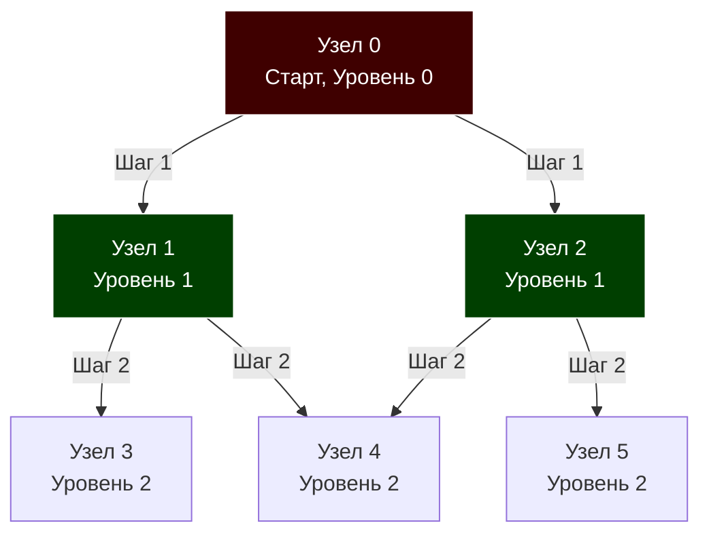

В статье [[1. Представление графов]] мы определились, что для подавляющего большинства бизнес-задач оптимальным выбором хранения графа в Go является список смежности (слайс слайсов). Теперь, когда данные лежат в оперативной памяти, нам нужны алгоритмы для их анализа. 

Первый и самый важный из них — **Поиск в ширину (Breadth-First Search, BFS)**.

## Механика алгоритма: Круги на воде

Представьте, что вы бросили камень в гладкое озеро. От места падения (стартовой вершины) во все стороны начинают расходиться волны. Первая волна накрывает ближайших соседей. Вторая волна — соседей соседей, и так далее. 

Именно так работает BFS. Он исследует граф **послойно (по уровням)**. Алгоритм не пойдет вглубь к вершинам третьего уровня, пока полностью не обойдет все вершины первого и второго уровней.



Для реализации этой механики нам критически необходима структура данных **Очередь (FIFO)**. Узлы, найденные первыми, должны быть обработаны первыми.

## Mechanical Sympathy: Битва за кэш и память

Прежде чем писать код, давайте оценим алгоритм с позиции системного инженера. 

BFS требует двух вспомогательных структур:
1. **Очередь (Queue):** Для хранения узлов, ожидающих обработки.
2. **Множество посещенных (Visited Set):** Чтобы не зациклиться, если в графе есть циклы.

### Проблема 1: Выбор структуры для Visited
Новички часто используют встроенную мапу: `visited := make(map[int]bool)`.
**Почему это убьет производительность?** Поиск и вставка в хеш-таблицу в Go требует вычисления хеша, поиска бакета и разрешения коллизий. В графе на 10 миллионов вершин мапа разорвет кэш процессора в клочья из-за хаотичного выделения памяти (Escape Analysis гарантированно отправит бакеты в кучу) и создаст гигантскую нагрузку на Garbage Collector.

**Решение архитектора:** Если вершины имеют непрерывные целочисленные ID (от 0 до $V-1$), мы **обязаны** использовать плоский срез `visited := make([]bool, V)`. 
Срез `[]bool` на 10 миллионов элементов весит всего около 10 МБ. Обращение по индексу `visited[node]` — это мгновенное $O(1)$ вычисление смещения указателя (1 такт процессора). 

### Проблема 2: Аллокации в Очереди
Если мы будем использовать классический слайс как очередь `queue = queue[1:]` (как обсуждалось в [[5. Очередь]]), базовый массив будет бесконечно переаллоцироваться или "ползти" по памяти, оставляя мусор для GC. 
Для идеального BFS мы можем использовать заранее выделенный срез размером $V$ (так как каждый узел попадет в очередь ровно один раз) и управлять им через два указателя `head` и `tail`, имитируя [[7. Кольцевой буфер]] без реального кольца (так как размер достаточен).

## Production-Ready реализация на Go

Ниже представлена высокопроизводительная реализация BFS без единой лишней аллокации в цикле (Zero-Allocation Loop).

```go
package main

import "fmt"

// SparseGraph - список смежности из предыдущей статьи
type SparseGraph struct {
	adj [][]int
}

// BFS выполняет обход графа в ширину, вызывая action для каждой вершины
func BFS(graph *SparseGraph, startNode int, action func(node int)) {
	V := len(graph.adj)
	if V == 0 || startNode < 0 || startNode >= V {
		return
	}

	// 1. Плоский массив для отслеживания посещенных узлов
	visited := make([]bool, V)

	// 2. Оптимизированная очередь на базе массива
	// Выделяем память один раз. Емкость V гарантирует, что append не вызовет реаллокацию.
	queue := make([]int, 0, V)
	head := 0 // Указатель на начало очереди

	// Инициализация
	queue = append(queue, startNode)
	visited[startNode] = true

	// Пока очередь не пуста (пока указатель чтения не догнал указатель записи)
	for head < len(queue) {
		// Извлекаем элемент (Dequeue)
		current := queue[head]
		head++

		// Выполняем бизнес-логику
		action(current)

		// Обходим соседей
		for _, neighbor := range graph.adj[current] {
			if !visited[neighbor] {
				visited[neighbor] = true     // Помечаем КАК ПОСЕЩЕННЫЙ СРАЗУ ЖЕ
				queue = append(queue, neighbor) // Добавляем в конец (Enqueue)
			}
		}
	}
}
```

> [!warning] Ловушка / Gotcha: Экспоненциальный взрыв очереди
> Обратите внимание на строку `visited[neighbor] = true`. Мы помечаем узел как посещенный **до** того, как кладем его в очередь. 
> Если вы сделаете это **после** извлечения из очереди (внутри внешнего цикла `for`), то один и тот же узел может быть добавлен в очередь многократно разными своими соседями, прежде чем до него дойдет ход. Очередь раздуется, и сложность алгоритма внезапно деградирует до экспоненциальной. Это самая частая ошибка джуниоров на собеседованиях.

## Паттерны задач с собеседований (Middle+/Senior)

BFS — это не просто алгоритм обхода. Это математически доказанный способ найти **Кратчайший путь в невзвешенном графе**. Если стоимость перехода по любому ребру равна $1$, то первый раз, когда BFS достигнет целевой вершины, пройденный путь гарантированно будет минимальным.

### Паттерн 1: Сохранение кратчайшего пути
Чтобы не просто найти длину пути, а восстановить сам маршрут, мы заменяем массив `visited []bool` на массив `parent []int`.

```go
// Инициализируем массив родителей значением -1 (не посещен)
parent := make([]int, V)
for i := range parent { parent[i] = -1 }

// При обходе:
if parent[neighbor] == -1 {
    parent[neighbor] = current // current становится "отцом" для neighbor
    queue = append(queue, neighbor)
}

// Восстановление пути от финиша к старту:
path := []int{}
curr := targetNode
for curr != -1 {
    path = append(path, curr)
    curr = parent[curr]
}
// Не забудьте развернуть слайс path!
```

### Паттерн 2: Мульти-стартовый BFS (Multi-source BFS)
**Задача (LeetCode 994 - Rotting Oranges):** Дана матрица, где есть гнилые и свежие апельсины. Каждую минуту гниль перекидывается на соседние свежие апельсины. За сколько минут сгниют все?

**Решение:** Нам не нужно запускать BFS от каждого гнилого апельсина отдельно. Мы просто помещаем **все** изначальные гнилые апельсины в очередь на самом старте (Нулевой уровень). Затем запускаем стандартный BFS. Волна гнили пойдет синхронно из множества точек.

> [!tip] Собеседование: Двунаправленный BFS (Bidirectional BFS)
> **Вопрос:** Как найти кратчайший путь между двумя людьми в социальной сети на миллионы узлов (задача 6 рукопожатий)? Обычный BFS займет слишком много памяти.
> **Ответ:** Использовать Двунаправленный BFS. Мы запускаем две волны одновременно: одну от стартового пользователя, другую от целевого. Если дерево поиска имеет ветвление $B$ (количество друзей), то обычный BFS на глубину $D$ проверит $O(B^D)$ узлов. Двунаправленный встретится посередине, проверив $O(B^{D/2} + B^{D/2})$ узлов. Это колоссальная разница. Например, $100^6 = 1$ триллион проверок против $100^3 + 100^3 = 2$ миллиона проверок.

## Сложность алгоритма

* **Временная сложность:** $O(V + E)$, где $V$ — количество вершин, $E$ — количество ребер. В худшем случае мы посетим каждую вершину ровно 1 раз и пройдем по каждому ребру 1 раз.
* **Пространственная сложность:** $O(V)$. В худшем случае (например, граф-звезда, где корень связан со всеми остальными вершинами) очередь и массив `visited` будут содержать все вершины.

## Итог

1. **BFS (Поиск в ширину)** — исследует граф по уровням. Основан на структуре Очередь (FIFO).
2. Является эталонным решением для поиска **кратчайшего пути в невзвешенных графах**.
3. **Механическая симпатия (Mechanical Sympathy):** Для высокопроизводительного кода используйте предварительно аллоцированный срез для очереди (с указателем чтения) и `[]bool` для трекинга посещений вместо медленных `map[int]bool`.
4. Строго помечайте узлы как посещенные **до** добавления в очередь, чтобы избежать дубликатов и экспоненциального взрыва памяти.

BFS отлично справляется с поиском кратчайших расстояний, но он потребляет много памяти для хранения "фронта" волны. Если наша задача — не найти кратчайший путь, а просто проверить наличие пути, найти цикл, или отсортировать зависимости в проекте (Topological Sort), мы применяем радикально иной подход. О нем — в следующей статье: [[3. Поиск в глубину DFS]].