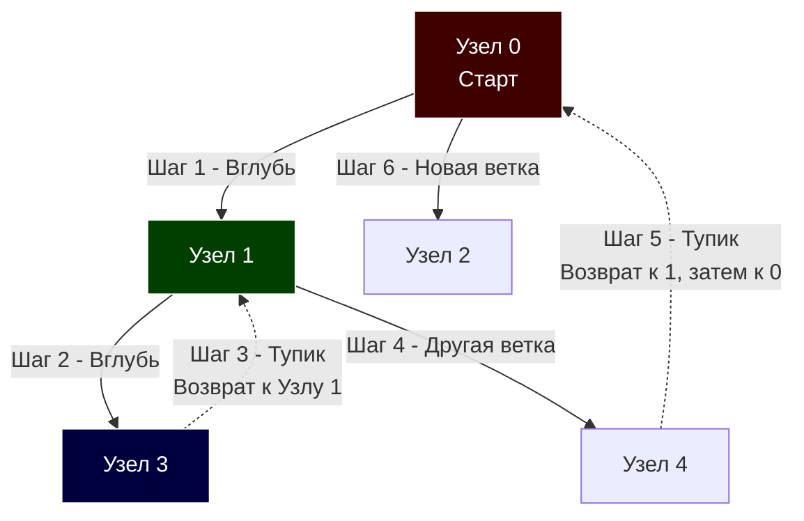

В статье [[2. Поиск в ширину BFS]] мы разобрали алгоритм, который исследует граф "вширь", подобно кругам на воде. Он идеален для поиска кратчайших путей. Но что, если наша цель — не найти самый короткий маршрут, а исследовать всю структуру графа, найти циклы, проверить связность или выстроить строгую последовательность зависимостей (например, для сборки пакетов в Go)?

Для этих задач применяется **Поиск в глубину (Depth-First Search, DFS)**.

## Механика алгоритма: Исследователь лабиринта

Если BFS использует Очередь (FIFO), то DFS опирается на **Стек (LIFO)**.

Механика DFS полностью повторяет прохождение лабиринта:

1. Вы идете вперед по первому попавшемуся пути так глубоко, как только возможно.
2. Когда вы упираетесь в тупик (или в узел, где вы уже были), вы возвращаетесь на один шаг назад (Backtracking) и пробуете другой путь.



## Mechanical Sympathy: Стек вызовов против Кучи

Реализовать DFS можно двумя способами: рекурсивно и итеративно. Для бэкенд-разработчика выбор между ними — это выбор архитектурного компромисса.

### 1. Рекурсивный подход (Call Stack)

Самый элегантный и простой способ. Мы используем стек вызовов самой программы (Call Stack) для отслеживания пути назад.

> [!info] Под капотом: Рекурсия в Go
> 
> Как мы знаем из прошлых статей, горутина стартует с крошечным стеком в 2 КБ.
> 
> Если ваш граф представляет собой вырожденную линию из 1 миллиона узлов, рекурсивный DFS создаст 1 миллион вложенных фреймов вызовов. В C++ или Java это мгновенно убьет процесс ошибкой `StackOverflow`.
> 
> В Go рантайм вызовет инструкцию `runtime.morestack`, выделит новый кусок памяти в 2 раза больше и скопирует туда весь текущий стек, корректируя указатели. Это спасет приложение от падения, но **постоянное копирование стека сожрет гигантское количество тактов CPU**. Поэтому для графов неизвестной или потенциально огромной глубины рекурсия в Go — это скрытая бомба замедленного действия.

### 2. Итеративный подход (Heap Stack)

Мы создаем свой собственный стек (на базе слайса) в куче (Heap), как мы делали в статье [[4. Стек]]. Слайс выделяется одним куском непрерывной памяти, работает с идеальной кэш-локальностью (Spatial Locality) и не заставляет рантайм двигать системные стеки горутины.

---

## Реализация на Go (Idiomatic & Production-Ready)

Для примеров используем `SparseGraph` (Список смежности на слайсах) из статьи [[1. Представление графов]].

### Классический Рекурсивный DFS

```go
package main

type SparseGraph struct {
	adj [][]int
}

// DFSRecursive запускает обход в глубину.
// Используем плоский массив visited для O(1) доступа и Cache Locality.
func DFSRecursive(graph *SparseGraph, start int, action func(int)) {
	V := len(graph.adj)
	if V == 0 || start < 0 || start >= V {
		return
	}

	visited := make([]bool, V)

	// Объявляем анонимную функцию для рекурсии (Closure)
	var dfs func(node int)
	dfs = func(node int) {
		visited[node] = true
		action(node) // Выполняем бизнес-логику

		// Идем вглубь по каждому соседу
		for _, neighbor := range graph.adj[node] {
			if !visited[neighbor] {
				dfs(neighbor)
			}
		}
	}

	dfs(start)
}
```

### Итеративный DFS (Highload)

Этот вариант не упадет и не вызовет перерасход CPU даже на графах с глубиной в миллион узлов.

```go
func DFSIterative(graph *SparseGraph, start int, action func(int)) {
	V := len(graph.adj)
	if V == 0 || start < 0 || start >= V {
		return
	}

	visited := make([]bool, V)
	
	// Преаллоцируем стек (например, на 1024 элемента, 
	// слайс сам вырастет при необходимости через runtime.growslice)
	stack := make([]int, 0, 1024)
	stack = append(stack, start)

	for len(stack) > 0 {
		// Pop из стека (берем последний элемент)
		lastIdx := len(stack) - 1
		current := stack[lastIdx]
		stack = stack[:lastIdx]

		// В итеративном DFS узел может попасть в стек несколько раз, 
		// поэтому мы ПРОВЕРЯЕМ visited после извлечения.
		if visited[current] {
			continue
		}
		
		visited[current] = true
		action(current)

		// Добавляем соседей в стек.
		// ВНИМАНИЕ: Чтобы обход полностью совпадал с рекурсивным (слева направо),
		// соседей нужно добавлять в стек в ОБРАТНОМ порядке.
		neighbors := graph.adj[current]
		for i := len(neighbors) - 1; i >= 0; i-- {
			neighbor := neighbors[i]
			if !visited[neighbor] {
				stack = append(stack, neighbor)
			}
		}
	}
}
```

---

## Паттерны с собеседований (Алгоритмические задачи)

DFS — это абсолютный чемпион секций на LeetCode. Большинство задач на графы сводится к модификации DFS.

### Паттерн 1: Подсчет компонент связности (Connected Components)

**Задача (LeetCode 200 - Number of Islands):** Граф может быть разорван на несколько независимых частей. Нужно узнать их количество.

**Решение:** Запускаем цикл `for i := 0; i < V; i++`. Если вершина `i` еще не в `visited`, инкрементируем счетчик компонент и запускаем от нее DFS. DFS закрасит весь этот кусок (остров) в `visited`. Цикл пойдет дальше и найдет следующий нетронутый остров.

### Паттерн 2: Поиск цикла в ориентированном графе

**Задача:** Как понять, что модули в вашем Go-коде (или микросервисы) имеют циклическую зависимость (Import Cycle)?

Для этого обычного `bool` массива `visited` недостаточно. Нам нужно **три цвета (состояния)** для каждой вершины:

- **0 (Белый):** Узел еще не обнаружен.
- **1 (Серый):** Мы зашли в узел, он сейчас находится в стеке вызовов (мы исследуем его потомков).
- **2 (Черный):** Мы полностью закончили с узлом и его потомками, он удален из стека.

Если в процессе спуска (DFS) мы пытаемся зайти в узел, который уже **Серый** — Бинго! Мы нашли так называемое **Обратное ребро (Back edge)**, которое указывает на нашего же предка в текущем пути. Это означает 100% наличие цикла.

```go
func HasCycle(graph *SparseGraph) bool {
	V := len(graph.adj)
	colors := make([]uint8, V) // 0 - White, 1 - Gray, 2 - Black

	var dfs func(node int) bool
	dfs = func(node int) bool {
		colors[node] = 1 // Помечаем как "в процессе" (Gray)

		for _, neighbor := range graph.adj[node] {
			if colors[neighbor] == 1 {
				// Встретили Gray узел - нашли цикл!
				return true
			}
			if colors[neighbor] == 0 {
				if dfs(neighbor) {
					return true
				}
			}
		}

		colors[node] = 2 // Полностью обработали (Black)
		return false
	}

	// Проходим по всем узлам (на случай, если граф не связный)
	for i := 0; i < V; i++ {
		if colors[i] == 0 {
			if dfs(i) {
				return true
			}
		}
	}
	return false
}
```

> [!warning] Ловушка / Gotcha: Неориентированные графы
> 
> Алгоритм с тремя цветами работает только для **Ориентированных графов** (где связи имеют направление). В неориентированном графе вы сразу же пойдете назад к своему родителю по тому же самому ребру. Для проверки циклов в неориентированном графе в функцию `dfs` нужно дополнительно передавать `parentID`, чтобы игнорировать шаг назад: `if neighbor == parentID { continue }`.

## Временная и пространственная сложность

- **Время:** $O(V + E)$ — алгоритм посетит каждую вершину один раз и рассмотрит каждое исходящее ребро один раз.
- **Память:** $O(V)$ — массив посещенных узлов и Стек вызовов (или явный слайс). В худшем случае (вырожденный граф-список) глубина стека достигнет $V$.

## Итог

1. **DFS (Поиск в глубину)** — идеален для исследования топологии графа: поиска всех путей, циклов и компонент связности.
2. В основе DFS лежит **Стек (LIFO)**.
3. В Go рекурсивный DFS прост в написании, но опасен для CPU при огромной глубине из-за механизма динамического расширения стека горутин (`runtime.morestack`).
4. Метод "Трех цветов" (White/Gray/Black) — индустриальный стандарт для обнаружения циклических зависимостей (Import Cycles) в направленных графах.

Если DFS позволяет нам находить циклы, то что делать с графом, в котором циклов гарантированно нет (DAG - Directed Acyclic Graph)? Такие графы используются для описания пайплайнов (CI/CD), систем сборки (Make/Task) и зависимостей модулей. И чтобы выполнить все задачи в правильном порядке, нам понадобится алгоритм, который базируется на самом DFS. В следующей статье мы разберем: [[4. Топологическая сортировка]].