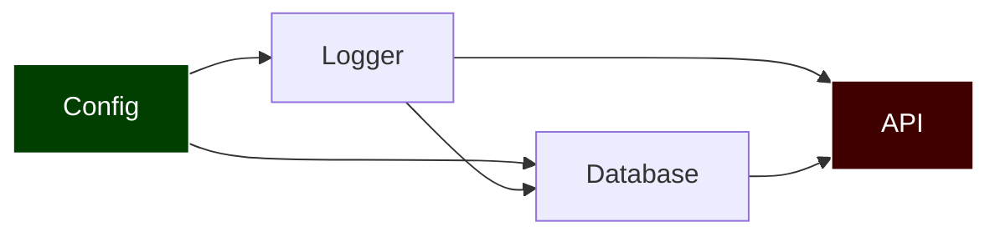

В предыдущих статьях мы научились обходить графы "вширь" ([[2. Поиск в ширину BFS]]) и "вглубь" ([[3. Поиск в глубину DFS]]). Эти алгоритмы универсальны, но в инженерной практике часто встречается специфический класс графов, который требует особого подхода — **Направленные ациклические графы (DAG - Directed Acyclic Graph)**.

Представьте, что вы пишете свой аналог утилиты `make`, инструмент CI/CD пайплайнов или пакетный менеджер (как `go mod`). У вас есть сотни задач (или пакетов), которые зависят друг от друга. Вы не можете скомпилировать пакет `A`, пока не скомпилированы `B` и `C`. 

Как выстроить эти задачи в плоскую очередь на выполнение так, чтобы ни одна зависимость не была нарушена? Для этого используется **Топологическая сортировка**.

## Что такое топологическая сортировка?

Топологическая сортировка — это линейное упорядочивание вершин ориентированного графа, при котором для каждого направленного ребра от узла $U$ к узлу $V$, узел $U$ всегда находится **перед** узлом $V$ в итоговом массиве.

**Критическое правило:** Топологическая сортировка возможна **только** для графов без циклов (DAG). Если пакет `A` зависит от `B`, а `B` от `A` — выстроить очередь физически невозможно, это тупик (Deadlock).



Для графа выше правильный (и единственный) порядок сборки: `Config -> Logger -> Database -> API`.

---

В Computer Science существует два эталонных способа выполнить топологическую сортировку. Бэкенд-разработчик должен знать оба, так как они имеют разный профиль нагрузки на железо.

## Способ 1: Алгоритм Кана (Kahn's Algorithm) — Выбор Архитектора

Алгоритм Кана базируется на идее **Входящей степени (In-degree)**. Входящая степень узла — это количество ребер, которые в него входят (то есть количество неразрешенных зависимостей). 

Если In-degree равен `0`, значит задача ни от кого не зависит, и ее можно брать в работу (или отправлять в пул воркеров).

### Механика (Пошагово):
1. Вычисляем массив `inDegree` для всех вершин.
2. Ищем все вершины с `inDegree == 0` и кладем их в Очередь (Queue).
3. Пока очередь не пуста:
   - Достаем узел $U$, добавляем его в итоговый отсортированный массив.
   - Для каждого соседа $V$ этого узла "удаляем" ребро $U \to V$, то есть уменьшаем `inDegree[V]` на 1.
   - Если `inDegree[V]` стал равен `0`, кладем $V$ в очередь.
4. Если в конце размер итогового массива меньше количества вершин — **в графе есть цикл!**

### Mechanical Sympathy: Идеальный код
Алгоритм Кана великолепен для современных процессоров. Мы используем один плоский `[]int` для хранения степеней и один срез для очереди. Никакой рекурсии, идеальная кэш-локальность, никаких аллокаций внутри цикла.

```go
package main

import (
	"errors"
)

var ErrCycleDetected = errors.New("граф содержит цикл топологическая сортировка невозможна")

// Вспоминаем нашу структуру из статьи про представление графов
type SparseGraph struct {
	adj [][]int
}

// KahnTopologicalSort выполняет сортировку за O(V + E)
func KahnTopologicalSort(graph *SparseGraph) ([]int, error) {
	V := len(graph.adj)
	inDegree := make([]int, V) // Плоский массив степеней

	// 1. Подсчитываем входящие степени для всех узлов. O(V + E)
	for u := 0; u < V; u++ {
		for _, v := range graph.adj[u] {
			inDegree[v]++
		}
	}

	// 2. Инициализируем очередь узлами без зависимостей
	queue := make([]int, 0, V) // Преаллокация, чтобы избежать сдвигов
	for i := 0; i < V; i++ {
		if inDegree[i] == 0 {
			queue = append(queue, i)
		}
	}

	result := make([]int, 0, V)
	head := 0 // Указатель для чтения из очереди (Zero-allocation Queue)

	// 3. Основной цикл (подобно BFS)
	for head < len(queue) {
		current := queue[head]
		head++
		
		result = append(result, current)

		// Уменьшаем степень соседей
		for _, neighbor := range graph.adj[current] {
			inDegree[neighbor]--
			
			// Зависимостей не осталось — в очередь!
			if inDegree[neighbor] == 0 {
				queue = append(queue, neighbor)
			}
		}
	}

	// 4. Валидация на наличие циклов
	if len(result) != V {
		return nil, ErrCycleDetected
	}

	return result, nil
}
```

> [!tip] Собеседование: Параллельное исполнение задач
> **Вопрос:** Если вы пишете движок CI/CD пайплайнов, как алгоритм Кана поможет вам выполнять сборку пакетов **параллельно** в нескольких горутинах?
> **Ответ:** В классическом DFS вы получаете просто линейный массив. А вот в алгоритме Кана все узлы, которые **одновременно** находятся в очереди на одной итерации, могут быть безопасно выполнены параллельно! Они не зависят друг от друга. Вы можете вычитывать всю очередь в Worker Pool горутин, ждать их завершения через `sync.WaitGroup`, а затем переходить к добавлению следующих разблокированных узлов.

---

## Способ 2: На базе DFS (Глубинный обход)

Второй способ основан на модификации Поиска в глубину. Мы спускаемся по дереву зависимостей до самого "дна" (узла, который больше ни от кого не зависит). Как только мы полностью обработали узел и всех его потомков (Post-order обход), мы кладем его в стек.

Так как узлы на "дне" (не имеющие исходящих зависимостей) будут добавлены первыми, итоговый результат нужно будет **перевернуть (reverse)**.

### Механика и обнаружение циклов
Для защиты от циклов мы используем концепцию **трех цветов** из статьи [[3. Поиск в глубину DFS]]:
* `0` (White) — не посещен.
* `1` (Gray) — в процессе обхода (находится в Call Stack-е).
* `2` (Black) — полностью обработан.
Если при спуске мы встречаем узел с цветом `1` — это обратное ребро (Back edge), значит, есть цикл.

```go
func DFSTopologicalSort(graph *SparseGraph) ([]int, error) {
	V := len(graph.adj)
	colors := make([]uint8, V) // 0: White, 1: Gray, 2: Black
	result := make([]int, 0, V)

	var dfs func(node int) error
	dfs = func(node int) error {
		colors[node] = 1 // Отмечаем как "в работе"

		for _, neighbor := range graph.adj[node] {
			if colors[neighbor] == 1 {
				return ErrCycleDetected // Цикл найден
			}
			if colors[neighbor] == 0 {
				if err := dfs(neighbor); err != nil {
					return err
				}
			}
		}

		colors[node] = 2 // Отмечаем как "завершенный"
		
		// ДОБАВЛЯЕМ В РЕЗУЛЬТАТ ТОЛЬКО НА ВЫХОДЕ ИЗ РЕКУРСИИ
		result = append(result, node)
		return nil
	}

	for i := 0; i < V; i++ {
		if colors[i] == 0 {
			if err := dfs(i); err != nil {
				return nil, err
			}
		}
	}

	// Переворачиваем массив (Reverse), так как зависимости 
	// добавлялись с конца (снизу вверх)
	for i, j := 0, len(result)-1; i < j; i, j = i+1, j-1 {
		result[i], result[j] = result[j], result[i]
	}

	return result, nil
}
```

> [!warning] Ловушка / Gotcha: Производительность рекурсии
> Хотя подход через DFS выглядит лаконично, в Highload-системах на Go (например, графы вычислений с миллионами нод) глубокая рекурсия вызовет аллокации для расширения стека горутины (`runtime.morestack`). Кроме того, алгоритм требует пост-обработки (переворота массива). Алгоритм Кана (через In-degree) в реальных бенчмарках работает стабильнее и безопаснее для кэша.

## Временная и пространственная сложность

Оба алгоритма (Кана и DFS) работают абсолютно идентично с точки зрения асимптотики:
* **Время:** $O(V + E)$ — мы должны проинициализировать массив `inDegree` (или `colors`) и пройти по каждому ребру ровно один раз.
* **Память:** $O(V)$ — для хранения массивов состояний (`inDegree`, `queue`, `colors`, `result`).

## Итог

1. **Топологическая сортировка** выстраивает узлы направленного ациклического графа (DAG) в строгую линию, не нарушая зависимостей "родитель -> ребенок".
2. **Алгоритм Кана (BFS-based):** Считает входящие ребра (In-degree) и обрабатывает "свободные" узлы через очередь. Идеален для распараллеливания пулов задач. Работает in-place на плоских массивах.
3. **DFS-based:** Спускается на "дно" зависимостей и собирает стек с конца. Требует защиты от циклов методом "Трех цветов" и переворота итогового массива.
4. Если алгоритм не может выдать массив длиной $V$ (или встречает "серый" узел), значит в графе **Deadlock (Цикл)**.

До сих пор мы рассматривали графы, где все ребра равнозначны (расстояние или вес ребра равны единице). Но в реальном мире сетевой пакет до Нью-Йорка идет 100 мс, а до соседнего стойки в дата-центре — 0.1 мс. Чтобы находить оптимальные маршруты в графах с разными весами ребер, мы переходим к тяжелой артиллерии. Следующая статья: [[5. Кратчайшие пути. Алгоритм Дейкстры]].