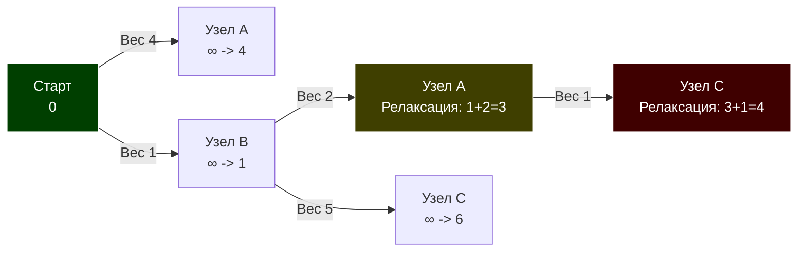

В статье [[2. Поиск в ширину BFS]] мы научились находить кратчайший путь, считая, что каждое ребро графа равнозначно (расстояние равно $1$).

Но в реальном бэкенде так не бывает. Сетевой пакет до соседнего сервера в дата-центре идет $0.1$ мс, а до сервера в другой стране — $150$ мс. Если мы запустим BFS, он выберет путь из одного ребра длиной $150$ мс, проигнорировав путь из трех ребер по $0.1$ мс (в сумме $0.3$ мс).

Для поиска оптимального маршрута в графах, где ребра имеют **вес (стоимость, задержку, дистанцию)**, применяется самый известный алгоритм навигации — **Алгоритм Дейкстры (Dijkstra's Algorithm)**.

## Механика алгоритма: Жадная стратегия и Релаксация

Алгоритм Дейкстры относится к классу **жадных алгоритмов (Greedy)**. На каждом шаге он делает локально оптимальный выбор: берет ближайшую к старту вершину из тех, что еще не обработаны окончательно, и пытается через нее улучшить расстояния до её соседей.

Процесс "улучшения" расстояния называется **Релаксацией (Relaxation)**.

### Как это работает:

1. Создаем массив расстояний `dist` от стартовой вершины до всех остальных. Изначально `dist[start] = 0`, а для всех остальных — бесконечность `+∞`.
2. Помещаем стартовую вершину в **Очередь с приоритетом (Min-Heap)**.
3. Пока очередь не пуста:
    - Извлекаем вершину $U$ с минимальным текущим расстоянием.
    - Если мы уже нашли для нее путь короче (устаревшая запись в очереди), пропускаем.
    - Проходим по всем соседям $V$ вершины $U$.
    - **Релаксация:** Если расстояние до $U$ плюс вес ребра $(U \to V)$ меньше, чем известное расстояние до $V$, то мы обновляем `dist[V]` и кладем $V$ в очередь.



_На диаграмме: Жадный выбор сначала идет в B (вес 1). Оттуда он находит путь в A (вес 3), что лучше старого (вес 4). Происходит релаксация._

## Mechanical Sympathy: Очередь с приоритетом

Почему мы не используем обычную Очередь, как в BFS?

Если мы будем использовать FIFO-очередь или обычный массив, нам придется на каждой итерации сканировать все необработанные вершины за $O(V)$, чтобы найти минимальную. Общая сложность станет $O(V^2)$, что неприемлемо для графов с миллионами узлов.

Нам нужна структура, которая умеет отдавать минимальный элемент за $O(\log V)$. Это **Бинарная куча (Min-Heap)**, которую мы детально разбираем в статье [[3. Очередь с приоритетом]].

> [!info] Под капотом: Fibonacci Heap vs Binary Heap
> 
> В академических учебниках пишут, что Дейкстру нужно реализовывать на Фибоначчиевой куче, что дает теоретическую сложность $O(E + V \log V)$.
> 
> **В реальном Highload это миф.** Фибоначчиева куча — это сложная структура на указателях. Она страдает от промахов кэша (Cache Misses) и аллокаций.
> 
> На практике обычная Бинарная куча (реализованная поверх плоского слайса) работает в разы быстрее благодаря идеальной **пространственной локальности (Spatial Locality)**. Аппаратный Prefetcher процессора легко "проглатывает" слайс, обеспечивая сложность $O(E \log V)$ при минимальных реальных наносекундах.

## Реализация на Go (Production-Ready)

В Go есть встроенный пакет `container/heap`. Чтобы его использовать, нужно реализовать интерфейс `heap.Interface`.

```go
package main

import (
	"container/heap"
	"math"
)

// Edge представляет направленное взвешенное ребро
type Edge struct {
	To     int
	Weight int // Для реальных задач лучше int64 или float64
}

// Graph - список смежности
type Graph struct {
	Adj [][]Edge
}

// Item - элемент для очереди с приоритетом
type Item struct {
	Node int
	Dist int
}

// Обертка для реализации container/heap
type MinHeap []Item

func (h MinHeap) Len() int           { return len(h) }
func (h MinHeap) Less(i, j int) bool { return h[i].Dist < h[j].Dist } // Min-Heap
func (h MinHeap) Swap(i, j int)      { h[i], h[j] = h[j], h[i] }

// Push и Pop используют пустой интерфейс (any), что вызывает Boxing.
func (h *MinHeap) Push(x any) {
	*h = append(*h, x.(Item))
}

func (h *MinHeap) Pop() any {
	old := *h
	n := len(old)
	item := old[n-1]
	*h = old[0 : n-1]
	return item
}

// Dijkstra возвращает массив кратчайших расстояний от start до всех узлов
func Dijkstra(g *Graph, start int) []int {
	V := len(g.Adj)
	dist := make([]int, V)
	
	// Инициализируем расстояния "бесконечностью"
	for i := range dist {
		dist[i] = math.MaxInt32 
	}
	dist[start] = 0

	pq := &MinHeap{}
	heap.Init(pq)
	heap.Push(pq, Item{Node: start, Dist: 0})

	for pq.Len() > 0 {
		// Извлекаем ближайшую вершину
		current := heap.Pop(pq).(Item)
		u := current.Node

		// Важнейшая оптимизация: ленивое удаление (Lazy Deletion).
		// Поскольку мы можем добавить одну вершину в очередь несколько раз
		// (с улучшенным расстоянием), мы игнорируем "устаревшие" записи.
		if current.Dist > dist[u] {
			continue
		}

		// Релаксация соседей
		for _, edge := range g.Adj[u] {
			v := edge.To
			weight := edge.Weight

			if dist[u]+weight < dist[v] {
				dist[v] = dist[u] + weight
				// Добавляем обновленный путь в очередь
				heap.Push(pq, Item{Node: v, Dist: dist[v]})
			}
		}
	}

	return dist
}
```

> [!warning] Ловушка / Gotcha: Интерфейсы и Boxing в Go
> 
> Стандартный `container/heap` в Go принимает `any` (`interface{}`). При каждом вызове `Push/Pop` наша структура `Item` оборачивается в интерфейс (**Boxing**) и аллоцируется в куче (Escape Analysis). Для графов с миллионами ребер это создаст гигантский GC Churn.
> 
> **Решение уровня Senior:** В Go 1.18+ для хардкорных оптимизаций пишут свою кастомную дженерик-кучу (Generic Heap), которая работает строго со слайсом структур `[]Item`, минуя интерфейсы и полностью избавляясь от аллокаций в цикле.

## Паттерны с собеседований

### Восстановление пути

Как и в BFS, чтобы не просто узнать расстояние $150$ мс, но и понять, через какие роутеры идет пакет, нам нужен массив родителей `parent []int`. При успешной релаксации (`dist[u] + weight < dist[v]`) мы записываем: `parent[v] = u`.

### Несколько конечных точек (Multiple Targets)

Дейкстра вычисляет кратчайшие пути **от одного узла ко всем остальным (Single-Source Shortest Path)**. Если вам нужно найти путь только до конкретного узла `target`, вы можете безопасно завершить алгоритм (сделать `return dist[target]`) ровно в тот момент, когда `target` был **извлечен** из очереди (`heap.Pop`).

_(Извлечение гарантирует, что короче пути уже не будет. Добавление в очередь этого не гарантирует!)._

## Ахиллесова пята Дейкстры: Отрицательные веса

Алгоритм Дейкстры математически опирается на аксиому: **добавление нового ребра к пути может только увеличить (или не изменить) общую длину пути**. Это логично для физического мира (длина дороги не может быть меньше нуля).

Но в абстрактных системах (например, финансовые транзакции, арбитраж валют, где вес ребра — это комиссия или бонус) веса могут быть отрицательными.

Если в графе есть **отрицательное ребро**, Жадная стратегия Дейкстры ломается. Вершина, извлеченная из кучи (и помеченная как "окончательно вычисленная"), может внезапно получить еще более короткий путь "из прошлого", если мы пройдем по отрицательному ребру. Алгоритм либо выдаст неверный результат, либо (при отсутствии проверки `current.Dist > dist[u]`) уйдет в бесконечный цикл на отрицательном цикле.

## Итог

1. **Алгоритм Дейкстры** — стандарт для поиска кратчайших путей во взвешенных графах без отрицательных ребер.
2. Основан на принципе **жадного выбора** и постоянной **релаксации** соседей.
3. **Механическая симпатия (Mechanical Sympathy):** Использование плоской бинарной кучи (слайса) дает лучшую производительность благодаря попаданию в кэш процессора.
4. В Go стандартный `container/heap` вызывает аллокации из-за интерфейсов. В Highload-проектах используйте дженерики для кастомной кучи.

Что делать, если в нашей системе могут возникать "отрицательные стоимости" (например, скидки на маршрут или энергетически выгодные переходы)? Нам нужен алгоритм, который откажется от жадности и проверит все возможные варианты. Об этом — в следующей статье: [[6. Алгоритм Беллмана Форда]].