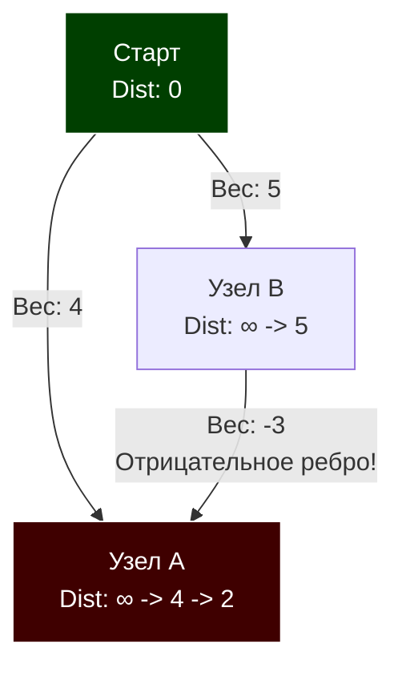

В статье [[5. Кратчайшие пути. Алгоритм Дейкстры]] мы разобрали эталонный способ навигации по взвешенным графах. Алгоритм Дейкстры быстр, элегантен и отлично ложится в кэш процессора благодаря бинарной куче. 

Но у Дейкстры есть "Ахиллесова пята": он математически опирается на жадную стратегию и **ломается при наличии отрицательных весов ребер**. В реальной бэкенд-разработке (особенно в финтехе, логистике и сложных игровых движках) отрицательные веса — это не ошибка, а фича. Это могут быть кэшбеки за транзакции, генерация энергии при спуске с горы, или арбитражные окна в валютных парах.

Чтобы найти кратчайший путь в таких условиях, мы отказываемся от жадности и переходим к парадигме динамического программирования. Встречайте **Алгоритм Беллмана-Форда (Bellman-Ford Algorithm)**.

## Механика алгоритма: Тотальная Релаксация

Если Дейкстра аккуратно выбирает ближайшую вершину и обновляет только ее соседей, то Беллман-Форд действует прямолинейно и грубо (Brute-Force подход). Он берет **все** ребра графа и пытается сделать релаксацию (улучшение пути) для каждого из них. 

И он делает это не один раз. Он повторяет проход по всем ребрам ровно **$V - 1$ раз**, где $V$ — количество вершин.

### Почему именно $V - 1$?
Это фундаментальное свойство графов. Кратчайший путь между любыми двумя вершинами в графе без циклов не может содержать более $V - 1$ ребер. Если мы прогоним релаксацию по всем ребрам $V - 1$ раз, мы гарантированно "распространим" минимальное расстояние от старта до любой достижимой точки, даже если оптимальный путь петляет по всему графу.


*В Дейкстре узел A был бы извлечен с весом 4 и "закрыт". Беллман-Форд пройдется по ребрам снова, увидит путь `Старт -> B -> A` (вес 5 - 3 = 2) и корректно обновит узел A.*

## Отрицательные циклы (Negative Cycles)

Самая большая угроза в графах с отрицательными весами — это **отрицательный цикл**. Это замкнутый маршрут, сумма весов которого меньше нуля. 
Если такой цикл существует, понятие "кратчайшего пути" теряет смысл: вы можете бесконечно крутиться в этом цикле, уменьшая итоговую стоимость до $-\infty$.

Беллман-Форд — единственный из базовых алгоритмов, который способен **найти и сообщить об отрицательном цикле**. 
Для этого после $V - 1$ проходов делается еще один, контрольный проход. Если на $V$-м проходе хоть одно расстояние всё ещё можно улучшить — значит, в графе есть отрицательная бесконечная петля.

## Mechanical Sympathy: Триумф Списка Ребер

В статье [[1. Представление графов]] мы говорили, что Список ребер (Edge List) почти никогда не используется. Алгоритм Беллмана-Форда — это то самое исключение.

Нам не нужно знать соседей конкретной вершины. Нам нужно на каждой итерации перебрать **абсолютно все ребра**. 
Если мы будем использовать классический список смежности (слайс слайсов), процессору придется прыгать по памяти.
Если мы используем плоский `[]Edge` — это восторг для аппаратного Prefetcher-а процессора. Это линейный скан непрерывного блока памяти.

**Парадокс производительности:** Теоретическая сложность Беллмана-Форда $O(V \times E)$. Для графа в 10 000 вершин и 50 000 ребер это 500 миллионов операций. Звучит страшно. Но на практике, из-за того что внутренний цикл — это $O(N)$ проход по единому слайсу `[]Edge` с попаданием в L1-кэш на каждой итерации, алгоритм на Go отработает за миллисекунды.

## Production-Ready реализация на Go

```go
package main

import (
	"errors"
	"math"
)

// ErrNegativeCycle возвращается, если граф не имеет решения
var ErrNegativeCycle = errors.New("граф содержит цикл с отрицательным весом")

// Edge представляет направленное взвешенное ребро для плоского списка
type Edge struct {
	From   int
	To     int
	Weight int64 // Используем int64 для избежания переполнений сумм
}

// BellmanFord возвращает массив кратчайших расстояний от startNode
func BellmanFord(edges []Edge, V int, startNode int) ([]int64, error) {
	if V == 0 || startNode < 0 || startNode >= V {
		return nil, nil // Или другая обработка ошибок
	}

	dist := make([]int64, V)
	for i := range dist {
		// Используем MaxInt64, но оставляем запас, 
		// чтобы сложение с весом не вызвало переполнение (overflow).
		// Надежнее использовать флаг/bool, но для скорости берут константу.
		dist[i] = math.MaxInt64 / 2 
	}
	dist[startNode] = 0

	// 1. Основная фаза: V-1 итераций релаксации
	for i := 0; i < V-1; i++ {
		updated := false // Оптимизация: если за проход ничего не обновилось, мы закончили!
		
		// Идеальный линейный скан памяти (Cache Friendly)
		for _, edge := range edges {
			u, v, w := edge.From, edge.To, edge.Weight
			
			// Если до узла u мы еще не дошли, не пытаемся от него релаксировать
			if dist[u] != math.MaxInt64/2 && dist[u]+w < dist[v] {
				dist[v] = dist[u] + w
				updated = true
			}
		}
		
		// Если массив стабилизировался досрочно, экономим такты CPU
		if !updated {
			break
		}
	}

	// 2. Фаза детекции: контрольный V-ый проход
	for _, edge := range edges {
		u, v, w := edge.From, edge.To, edge.Weight
		if dist[u] != math.MaxInt64/2 && dist[u]+w < dist[v] {
			return nil, ErrNegativeCycle
		}
	}

	return dist, nil
}
```

> [!warning] Ловушка / Gotcha: Арифметика с бесконечностью
> Если вы инициализируете массив расстояний значением `math.MaxInt64`, а затем прибавите к нему отрицательный вес `w`, произойдет Integer Overflow, и `dist[v]` внезапно станет гигантским отрицательным числом (например, `-9223372036854775800`). Алгоритм решит, что нашел невероятно короткий путь! 
> Именно поэтому мы:
> 1. Инициализируем `dist` константой с запасом (`math.MaxInt64 / 2`).
> 2. Строго проверяем, была ли вообще достигнута вершина `From`: `if dist[u] != math.MaxInt64/2`.

## Паттерны с собеседований: Арбитраж валют (FAANG)

Если вы проходите собеседование в финтех или FAANG, вам почти гарантированно дадут задачу на **Поиск валютного арбитража**.
**Суть:** Дана таблица курсов обмена (например, USD -> EUR -> JPY -> USD). Можно ли обменять 100 долларов так, чтобы, пройдя цепочку обменов, получить 102 доллара?

**Как это решается через Беллмана-Форда:**
1. Цепочка обменов — это умножение: $V_1 \times V_2 \times V_3 > 1$.
2. Графовые алгоритмы умеют только складывать пути, а не умножать.
3. Вспоминаем математику 10-го класса: Логарифм произведения равен сумме логарифмов! $\log(a \times b) = \log(a) + \log(b)$.
4. Чтобы искать *максимальную* прибыль (то есть арбитраж), мы инвертируем знак логарифма: $-\log(a)$.
5. **Итог:** Арбитраж существует тогда и только тогда, когда в графе, где веса ребер равны $-\log(exchange\_rate)$, существует **отрицательный цикл**. Мы сводим задачу к банальному запуску `BellmanFord` и проверке возвращаемой ошибки `ErrNegativeCycle`.

## Итог

1. **Алгоритм Беллмана-Форда** — это динамическое программирование для поиска кратчайших путей (Single-Source Shortest Path) в графах с **отрицательными весами**.
2. Его архитектурная суперсила — способность находить **Отрицательные циклы**.
3. Сложность составляет $O(V \times E)$, что хуже Дейкстры. Но благодаря использованию плоского массива ребер (Edge List), алгоритм имеет превосходную кэш-локальность и на средних графах работает молниеносно.
4. Оптимизация с флагом `updated` позволяет алгоритму досрочно завершиться за $O(E)$, если граф оказался простым.

И Дейкстра, и Беллман-Форд решают задачу поиска путей **от одной точки** до всех остальных. Но что, если вы пишете распределенный роутер, и вам нужно заранее рассчитать матрицу расстояний **от каждого узла до каждого**? Запускать Беллмана-Форда $V$ раз — это $O(V^2 E)$, слишком долго. 

Для этой задачи существует шедевр динамического программирования, состоящий всего из пяти строк кода, но заставляющий процессоры потеть на $100\%$. Разберем его в следующей статье: [[7. Алгоритм Флойда Уоршелла]].